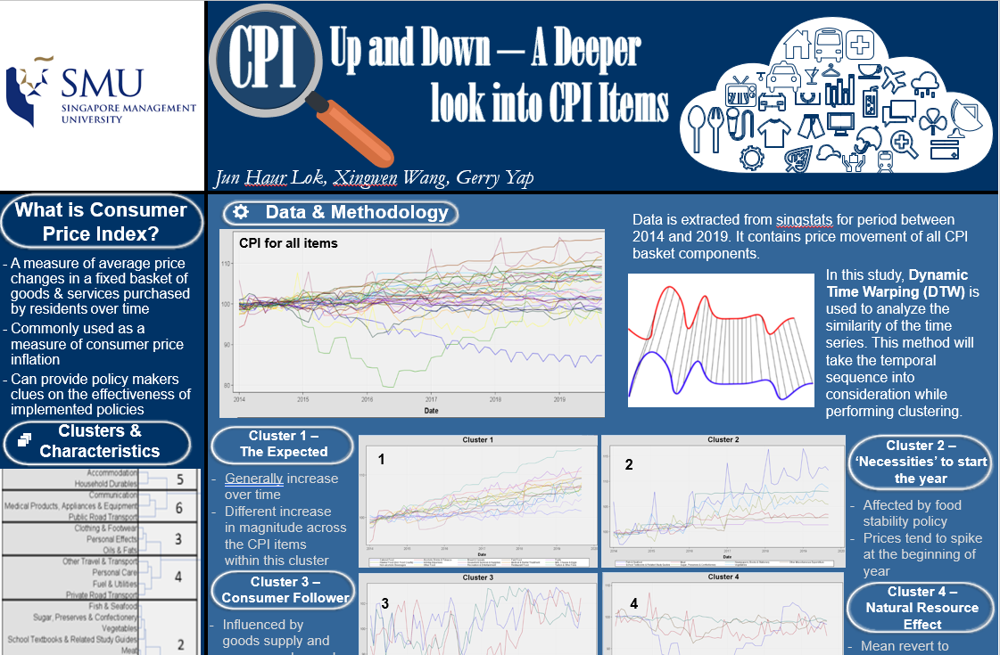

```{r, echo = FALSE}


```

*Photo by Timo Volz from Pexels*


## Abstract

Consumer price index (CPI) is designed to measure the average price changes in a fixed basket of goods and services commonly purchased by resident households over time. It is commonly used as a measure of consumer price inflation. While the CPI is an overall representation of inflation in the economy, different households are affected differently, depending on the nucleus structure of the family. In this paper, we examine Singapore's CPI between January 2014 and September 2019 to discover the relationships among the CPI components using the Dynamic Time Warping (DTW) method, to aggregate them into clusters with similar price movements. Our findings reveal that various components have increased significantly or even decreased over the period whereas the overall CPI index has increased moderately between 2014 and 2019, reflecting economic growth and successful public policies.


## Poster

The poster of this project can be found this [link](poster\Poster.JPG).


```{r, echo = FALSE}


```

*Screen shot of project poster*

