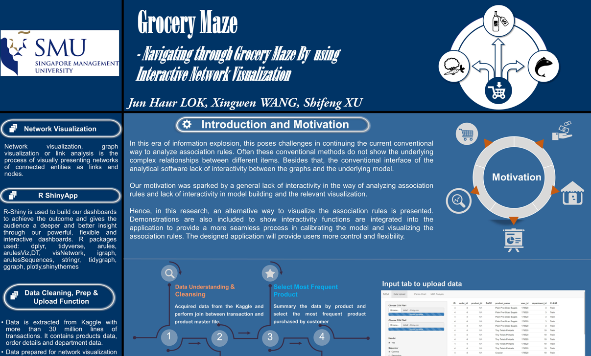

```{r, echo = FALSE, out.width = "80%"}
knitr::include_graphics("image/food maze.jpg")

```

*Photo by <a href="https://unsplash.com/@jadlimcaco?utm_source=unsplash&utm_medium=referral&utm_content=creditCopyText">Jad Limcaco</a> on <a href="https://unsplash.com/s/photos/maze?utm_source=unsplash&utm_medium=referral&utm_content=creditCopyText">Unsplash</a>*


## Abstract

In this era of information explosion, this poses challenges in continuing the current conventional way to analyze association rules. Often these conventional methods do not show the underlying complex relationships between different items. Besides that, the conventional interface of the analytical software lack of interactivity between the graphs and the underlying model. Hence, in this research paper, an alternative way to visualize the association rules is presented. Demonstrations are also included to show interactivity functions are integrated into the application to provide a more seamless process in calibrating the model and visualizing the association rules. The designed application will provide users more control and flexibility.


## Poster

The poster of this project can be found this [link](poster\poster.jpg).


```{r, echo = FALSE}


```

*Screen shot of project poster*

