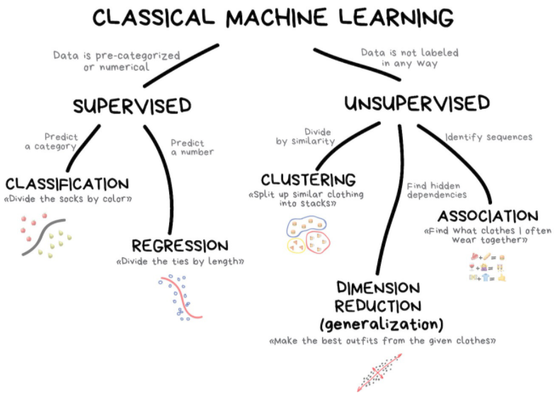

```{r setup, include=FALSE}
options(htmltools.dir.version = FALSE)

packages <- c("tidyverse", "skimr", "tidymodels", "DT", "emo", "pagedown", "vip", "pdp", "usemodels", "glmnet", "lubridate", "tidytext", "ggwordcloud", "knitr")

for (p in packages){
  if(!require (p, character.only = T)){
    install.packages(p)
  }
  library(p, character.only = T)
}

knitr::opts_chunk$set(fig.retina = 3,                       
                      echo = TRUE,                       
                      eval = TRUE,                       
                      message = FALSE,                       
                      warning = FALSE,
                      out.width="70%")

```

```{r, include = FALSE}
# read in the results from modeling
setwd("C:/Users/Jasper Lok/Documents/1_MITB/Term 99_Capstone/4_Sandbox/R_workspace/")

load(file = "data/MITBCapstone_Jasper_actLoss.RData")
load(file = "data/MITBCapstone_machinelearn_actLoss_Jasper_v3.RData")

```


# Speakers' Bio

```{r, echo = FALSE, out.width="80%", fig.retina = 10}


```


---

class: center, middle
```{r, echo = FALSE, out.width="40%"}


```

---

# Are data scientists taking over actuaries?

```{r, echo = FALSE}


```

*Source: [Contingencies Volume 32 No 1](https://contingencies.org/data-science/)*

---

# Should actuaries start looking for other jobs in other industries?

--

**Relax!** Most articles agree that data scientists are not likely to take over actuaries due to the complexity of actuarial science.

--

In general, these articles also pointed out there are much more actuaries could learn from data scientists to assist us in our actuarial analysis.


---

# List of benefits data science could bring to actuarial task

```{r, echo = FALSE}
ben_act_df <- data.frame(list = c("Improved data quality", 
                                  "New data sources",
                                  "Speed of analysis",
                                  "New modeling techniques",
                                  "New Approaches to Problems",
                                  "Improved Data Visualisations"),
                         desc = c("Machine learning is a key driver for companies to improve data capture and storage",
                                  "Machine learning potentially opens up opportunities for actuaries to explore alternative data sources",
                                  "Machine learning models can generally be fitted and validated in a short space of time",
                                  "Utilising alternative modeling approaches allows different perspectives to be gained on data",
                                  "Produce a wider variety of models quickly - better ability to select the appropriate modeling approach for a given problem",
                                  "Increasing power to produce stunning visualisations of data which can itself provide new perspectives on a task"))

kable(ben_act_df, col.names = c("Benefits", "Descriptions"))


```


---

# Additional Skillset for Actuaries to acquire

```{r, echo = FALSE,  out.width="70%"}


```

*Modified the graph by [Quantee](https://quantee.ai/actuarial-data-science/)*

--

It is not just about learning the programming language, but also what are the best practice of performing machine learning tasks (eg. what is the suitable package to use to perform the necessary analysis).


---

# Typical Data Science Project

```{r, echo = FALSE, out.width = "80%"}


```


--


The packages shown above are designed to work together, instead of some loosely designed packages.


---

# Typical Modeling Process

```{r, echo = FALSE, out.width = "85%"}


```

*Source: [Chapter 3.3 of Tidy Modeling with R](https://www.tmwr.org/base-r.html#formula)*


---

# Issue with open-source software

```{r, echo=FALSE}


```

*Source: [Chapter 3.3 of Tidy Modeling with R](https://www.tmwr.org/base-r.html#formula)*


This can be a stumbling block for users to use R to perform machine learning analysis.


---

# Sometimes the issues can happen within the same package as well `r ji("vomit")`


Over here, we will take a look at this **glmnet** example shared by Max Kuhn during his [**tidymodels** sharing at Cleveland R User Group](https://www.youtube.com/watch?v=kAZe9UpMx_s).

--

**glmnet** is a package that allows one to fit a regularized generalized linear models. The prediction output from this package can come in various forms.

---

```{r glmnet-mod, include = FALSE}
# Copy from Max Kuhn example
sim_n <- 300

set.seed(1244)
dat <- data.frame(
  two_class = rep(letters[1:2], each = sim_n / 2),
  three_class = rep(letters[1:3], each = sim_n / 3),
  numeric = rnorm(sim_n) + 10,
  x1 = rnorm(sim_n),
  x2 = rnorm(sim_n),
  x3 = rnorm(sim_n),
  x4 = rnorm(sim_n)
)

x <- as.matrix(dat[,-(1:3)])
new_x <- head(x, 2)
rownames(new_x) <- paste0("sample_", 1:2)

reg_mod <-
  glmnet(x, y = dat$numeric, lambda = c(0.01, 0.1, 1))

two_class_mod <-
  glmnet(
    x,
    y = dat$two_class,
    nlambda = 3,
    family = "binomial", 
    lambda = c(0.01, 0.1, 1)
  )

three_class_mod <-
  glmnet(
    x,
    y = dat$three_class,
    nlambda = 3,
    family = "multinomial", 
    lambda = c(0.01, 0.1, 1)
  )

three_pred <- predict(three_class_mod, newx = new_x, type = "response")
three_pred <- apply(three_pred, 3, function(x) data.frame(x)) 
three_pred <- dplyr::bind_rows(three_pred)
three_pred <- dplyr::mutate(three_pred, lambda = rep(three_class_mod$lambda, each = 2))
three_pred <- tibble::as_tibble(three_pred)
```


## **glmnet** Class Predictions

```{r glmnet-2class}
predict(two_class_mod, newx = new_x, type = "class")
```


---

## **glmnet** Class Probabilities (Two Classes)

```{r glmnet-2class-prob}
predict(two_class_mod, newx = new_x, type = "response")
```

Now, the **predict** function returns a matrix of probability for the second level of outcome factor.


---

## **glmnet** Class Probabilities (Three Classes)

.pull-left[
```{r glmnet-3class-prob}
predict(three_class_mod, newx = new_x, 
        type = "response")
```
]

.pull-right[
The output is no longer in matrix format. It is a 3D array format. Fainted. Often, the users would spend quite a fair bit of time in transforming the output into the required format of the next function.

Perhaps illustrating the output in such format would be better?
```{r, echo = FALSE}
three_pred
```
]


---

# Tidymodels to the rescue!

The author of **caret** package (ie. Max Kuhn) felt that there should be a better approach to perform machine learning tasks.

--

```{r, echo = FALSE, out.width="20%"}


```

--

**Tidymodels** is a collection of various machine learning packages, from data pre-processing to model building & model comparison. The package provides an unified interface to perform machine learning tasks.


Instead of reinventing the "wheels", the package functions as a wrapper to wrap around existing package.


---


```{r, echo = FALSE, out.width="80%"}
knitr::include_graphics("figs/Modeling Process_package.png")

```

*Source: [A Gentle Introduction to tidymodels](https://rviews.rstudio.com/2019/06/19/a-gentle-intro-to-tidymodels/)*


Above are the various key packages that assist us in our various machine learning activities.


These packages are recent project by RStudio to look into how the packages could better support users in the machine learning analysis.


The cool thing about these packages are following *tidy data* concepts.


---

# What do you mean by tidy data?

A concept introduced by Hadley Wickham, Chief Scientist at R Studio.

Below are the definition of tidy data:

- Each variable must have its column

- Each observation must have its row

- Each value must have its cell

```{r, echo = FALSE}


```

*Source: [Chapter 12.2 of R for Data Science](https://r4ds.had.co.nz/tidy-data.html)*

---

# Hmmm, but why is this important?

```{r, echo = FALSE, out.width="65%"}
knitr::include_graphics("figs/tidydata_workbench.jpg")

```

*Source: [stats-illustrations](https://github.com/allisonhorst/stats-illustrations) by Allison Horst*


---

# Setting Context for the Actuarial Use Case

For the demonstration, I will be using the worker compensation insurance claim dataset from Kaggle [https://www.kaggle.com/c/actuarial-loss-estimation/](https://www.kaggle.com/c/actuarial-loss-estimation/).


Below is the snapshot of the dataset:

```{r, include = FALSE}
df <- read_csv("data/actuarial_loss_train.csv") %>%
  drop_na() %>%
  head(100) # the dataset is too huge to show in HTML slide file. So, use choose top 100 data points

```


```{r, echo = FALSE}
font.size <- "10pt"

datatable(
  df,
  options=list(pageLength = 3,
               autoWidth = TRUE,scrollX=TRUE,
               initComplete = htmlwidgets::JS(
                "function(settings, json) {",
                paste0("$(this.api().table().container()).css({'font-size': '", font.size, "'});"),
                "}"))
)

```

---

# Data Splitting

One of the initial steps for any machine learning analysis is to split the dataset into training & testing dataset.

First, read in the clean dataset.

```{r, warning = FALSE, error = FALSE, message = FALSE}
df <- read_csv("data/data_eda_actLoss_3.csv") %>%
  drop_na()

```

--
Next, use **initial_split** function to create a binary split of the data into training and testing set. 

```{r, warning = FALSE, error = FALSE, message = FALSE}
df_split <- initial_split(df,
                            prop = 0.6,
                            strata = init_ult_diff)

```

--

**training** function & **testing** function are used to extract the relevant data.

```{r, warning = FALSE, error = FALSE, message = FALSE}
df_train <- training(df_split)
df_test <- testing(df_split)

```

---

# Data Pre-processing

```{r, echo = FALSE, out.width="65%"}
knitr::include_graphics("figs/recipes.png")

```

*Source: [stats-illustrations](https://github.com/allisonhorst/stats-illustrations) by Allison Horst*

---

Following is the example of how the **recipe** looks like in **tidymodels**:

.pull-left[]

.pull-right[
In line 1, I have specified the formula & dataset.

```{r, eval = FALSE}
gen_recipe <- recipe(init_ult_diff ~ ., #<<
                     data = df_train) #<<


```
]

---
Following is the example of how the **recipe** looks like in **tidymodels**:

.pull-left[]

**Step_date** function allows users to extract year, month and day of the week from the date variable.

```{r, eval = FALSE}
gen_recipe <- recipe(init_ult_diff ~ ., 
                     data = df_train) %>%
  step_date(c(DateTimeOfAccident, #<<
              DateReported)) #<<

```

--


One also could perform data wrangling by using **step_mutate** function as shown under line 3 & line 4

```{r, eval = FALSE}
gen_recipe <- recipe(init_ult_diff ~ ., 
                     data = df_train) %>%
  step_date(c(DateTimeOfAccident, 
              DateReported)) %>%
  step_mutate(DateTimeOfAccident_hr =  #<<
                hour(DateTimeOfAccident), #<<
              DateTimeOfAccident_hr =  #<<
                factor(DateTimeOfAccident_hr, #<< 
                       order = TRUE)) #<<

```


---
Following is the example of how the **recipe** looks like in **tidymodels**:

.pull-left[]

Indicating the correct data type is also very important as incorrect data type would affect the model performance.

```{r, eval = FALSE}
gen_recipe <- recipe(init_ult_diff ~ ., 
                     data = df_train) %>%
  step_date(c(DateTimeOfAccident, 
              DateReported)) %>%
  step_mutate(DateTimeOfAccident_hr = 
                hour(DateTimeOfAccident),
              DateTimeOfAccident_hr = 
                factor(DateTimeOfAccident_hr, 
                       order = TRUE)) %>%
  update_role(c(DateTimeOfAccident, #<<
                DateReported), #<<
              new_role = "id") %>% #<<
  prep() #<<

```


--
This modeling approach has effectively allowed to modularize the different functions and chain them together. 


---
# A Peek into the Created Recipe

The code will show us the different steps we have specified under recipe step by calling the recipe object we have created.

```{r, eval = FALSE}
gen_recipe

```

```{r, echo = FALSE, out.width = "90%"}


```


---

Checking the data type is also a very crucial step before the modeling as inappropriate variable types might affect the performance of the models.

```{r}
gen_recipe %>% 
  summary()

```

The **summary** function provides the users a quick overview of the data type.


---

The modularise structure allows us to effectively reuse the model components. For example, GLM model is unable to use categorical variables to fit the model.


So, to resolve this, we can add on additional data preprocessing step.

```{r, eval = FALSE}
glmnet_recipe <- gen_recipe %>%
  step_dummy(all_nominal())

```

The code above indicates that one-hot ecoding method to be applied on all the categorical variables .


---

# Wait! Don't throw away the text fields

Remember there is a claim description field within the data?

This is where **tidytext** package and **textrecipe** comes very handy. 


---

## **tidytext**

To extract the text, I will first split the words into tokens by using **unnest_token**.

```{r, eval = FALSE}
tidy_clm_unigram <- data_1 %>%
  unnest_tokens(word, ClaimDescription, 
                token = "ngrams", 
                n = 1)

```

--

I will also remove the stopwords (eg. above, onto, and) from the tokens since they are not meaningful in the analysis.

```{r}
tidy_clm_unigram <- data_1 %>%
  unnest_tokens(word, ClaimDescription, 
                token = "ngrams", 
                n = 1) %>%
  anti_join(get_stopwords())

```


---

Once the words are tokenized, we can perform frequency count on the words to understand which are the words tend to appear more frequent than the rest.

```{r}
tidy_clm_unigram %>%
  count(word, sort = TRUE)

```

After that, we can create indicators for the more frequently appeared words to see whether the model performance would improve by including these features.


---

Once they are extracted, we can visualize the extracted texts by using word cloud.


```{r, eval = FALSE}
cleaned_clm_unigram %>%
  filter(n > 2000) %>%
  ggplot(aes(label = word, 
             size = n, 
             color = n)) +
  geom_text_wordcloud() +
  scale_size_area(max_size = 20) +
  theme_minimal()

```

--

```{r, echo = FALSE, out.width = "60%"}


```


---

## **textrecipe**

Alternatively, we can perform text mining through specifying the steps in the recipe.

--

Same as the previous recipe created, after specifying the 'recipe' for the machine learning model, we will specify what are the pre-processing steps the model should perform.

.pull-left[
```{r, eval=FALSE}
ranger_recipe_clmdesc <- 
  recipe(formula = init_ult_diff ~ ., 
         data = df_wClmDesc_train) %>%
  step_tokenize(ClaimDescription) %>%
  step_stopwords(ClaimDescription) %>% 
  step_tokenfilter(ClaimDescription, 
                   max_tokens = 20) %>%
  step_tfidf(ClaimDescription)

```
]

--
.pull-right[
- This approach is consistent with recipe to "prepare" the text data for modeling


- It is easier to understand and clear at first glance what are we "preparing"
]

--

More explanation on the different text mining techniques and how they work, do check this [website](https://www.tidytextmining.com/).


---

# Model Selection - Model X, I choose you!

```{r, echo = FALSE}
knitr::include_graphics("figs/parsnip.png")

```

*Source: [stats-illustrations](https://github.com/allisonhorst/stats-illustrations) by Allison Horst*

---

# Back to Actuaries' Most Beloved Model - GLM


.pull-left[
**Convention Approach**
```{r, eval = FALSE}
x <- df_train %>% 
  dplyr::select(-init_ult_diff) %>% 
  data.matrix()

y <- df_train$init_ult_diff


glmnet(x, 
       y, 
       family = "gaussian",
       nlambda = 10,
       alpha = 0.5)

```
]

--

.pull-right[
**Tidymodels Approach**
```{r}
glmnet_spec <- 
  linear_reg(penalty = tune(), 
             mixture = tune()) %>% 
  set_mode("regression") %>% 
  set_engine("glmnet", family = "gaussian") 

```
]


--
**parsnip** package provides users a more unified model interface without sacrificing the flexibility.


---

**parsnip** package do support a wide range of machine learning models.

.pull-left[
Random Forest
```{r}
ranger_spec <- 
  rand_forest(mtry = tune(), 
              min_n = tune(), 
              trees = 50) %>% 
  set_mode("regression") %>% 
  set_engine("ranger", 
             importance = "impurity")

```


XGBoost
```{r}
xgboost_spec <- 
  boost_tree(trees = tune(), 
             min_n = tune(), 
             tree_depth = tune(), 
             learn_rate = tune(), 
             loss_reduction = tune(),
             sample_size = tune()) %>% 
  set_mode("regression") %>% 
  set_engine("xgboost") 

```


]


.pull-right[
Linear Regression
```{r}
lm_spec <- linear_reg() %>%
  set_mode("regression") %>%
  set_engine("lm")

```


MARS
```{r}
earth_spec <- 
  mars(num_terms = tune(), 
       prod_degree = tune(), 
       prune_method = "none") %>% 
  set_mode("regression") %>% 
  set_engine("earth") 

```


KNN
```{r}
kknn_spec <- 
  nearest_neighbor(neighbors = tune(), 
                   weight_func = tune()) %>%
  set_mode("regression") %>% 
  set_engine("kknn") 

```

]


---

# Model Tuning

.pull-left[
Cross validation is commonly used to:
- Find the best set of parameters that would give us best model performance
- Prevent models from overfitting
]

--
.pull-left[
Over here, I will be using k-fold validation to perform model tuning.
]

.pull-right[
```{r, echo = FALSE, out.width= "100%"}
knitr::include_graphics("figs/kfoldcv.png")

```

*Source: [Section 3.1 of Scikit-learn](https://scikit-learn.org/stable/modules/cross_validation.html)*
]

---


To do so, we will create the dataset for k-fold cross validation by using **vfold_cv** function as shown below.

```{r, eval=FALSE}
df_folds <- vfold_cv(df_train, strata = init_ult_diff)
df_folds 

```

--

And yes we are almost there!


--

Over here, **grid search** is used to find the best parameters fit a given model.


```{r, eval=FALSE}
ranger_tune <-
  tune_grid(ranger_workflow, 
            resamples = df_folds, 
            grid = 5)

```


---

```{r, eval=FALSE}
ranger_fit <- ranger_workflow %>%
  finalize_workflow(select_best(ranger_tune)) %>%
  last_fit(df_split)


```

Once the model is tuned, **select_best** function is used to select the best parameters. Then, finalise the workflow & run the fitted model on testing data by using **last_fit** function.


--

If we were to visualize the flow, the modeling steps mentioned above would look something as following....


```{r, echo = FALSE, out.width= "50%"}
knitr::include_graphics("figs/grid_search_workflow.png")

```

*Source: [Section 3.1 of Scikit-learn](https://scikit-learn.org/stable/modules/cross_validation.html)*


---

# Now, we can "chain" the different components as a workflow


Once the necessary parameters are setup, we will join the different steps together to form a workflow.

.pull-left[
**Conventional Approach**
```{r, eval = FALSE}
x <- df_train %>% 
  dplyr::select(-init_ult_diff) %>% 
  data.matrix()

y <- df_train$init_ult_diff


glmnet(x, 
       y, 
       family = "gaussian",
       nlambda = 10,
       alpha = 0.5)

```
]


--
.pull-right[
**tidymodels Approach**
```{r, eval = FALSE}
glmnet_workflow <- 
  workflow() %>% 
  add_recipe(glmnet_recipe) %>%
  add_model(glmnet_spec) 

```
]


---

# Need another workflow? Not an issue, sir


```{r, eval = FALSE}
glmnet_workflow_ult <- 
  glmnet_workflow %>%
  update_formula(UltimateIncurredClaimCost ~ .)

```


---

The created workflow can only be visualised by calling the workflow item.

```{r}
glmnet_workflow

```

Such modularized modeling method allows us to reuse the different machine learning parts through the analysis.


---

# Confused?? Worry not

**usemodels** package can be used to generate all the necessary modeling templates for the users.

```{r, eval = FALSE}
use_ranger(formula, data)

```

```{r, echo = FALSE, out.width = "130%"}


```


---

# Model Comparison


To facilitate the model comparison, **yardstick** is being used to compare the different models.


```{r, echo = FALSE, out.width = "25%"}


```


Same as other packages under **tidymodels**, various model performance metrics under **yardstick** also have same interface, which allows us to loop through the various syntax to calculate the model performance.


---

First, I have defined the different measurements I need.


I will be using *root mean square error*, *R squared* and *mean absolute scaled error*.


--
```{r, echo = FALSE}


```


As shown above, the metric interfaces look very similar. This allows to calculate the model performance by looping through the different metrics.

---

```{r, eval=FALSE}
model_metrics <- metric_set(rmse, rsq, mase)

```


```{r, eval=FALSE}
ranger_pred <- ranger_fit %>%
  collect_predictions()

ranger_metric <- model_metrics(ranger_pred, 
                               truth = init_ult_diff, 
                               estimate = .pred) %>%
  mutate(model = "ranger") %>%
  pivot_wider(names_from = .metric,
              values_from = .estimate)

```


Next, I will join these model results into a tibble table so that I can compare how does the different models perform under different scenarios.

---

# Showdown by Different Models

Following are the performance metrics of ddifferent models:

```{r, echo = FALSE}
model_metric_result %>%
  arrange(rmse)

```

In general, the different model performance results are quite consistent with one another.


Out of all the models, random forest has the highest accuracy.


---

# Is Performing Data Cleaning Waste Time?

First, let's look at what if we build two models, one *without* data cleaning (ie. ranger_org_metric) & the other *with* data cleaning (ie. ranger_ult_metric).

```{r, echo = FALSE}
tibble() %>%
  bind_rows(ranger_org_metric) %>%
  bind_rows(ranger_ult_metric)

```


Overall, it seems to indicate that the model performance improves after data cleaning is performed


--

There are unreasonable values & outliers within the dataset. Below is one example of the unreasonable value:

```{r, echo = FALSE}


paste0("One week only has max ",24*7," hours.")
```


---

# Different Way of Looking at The Problem

In this dataset, we are interested in finding out what is the ultimate claim cost to us.


--
Another way to look at this problem is how far off is the initial estimate from the actual claim amount.


--
So, with that, I have built two models over here. 


- *ranger_ult* is the model directly predicting on ultimate claim cost


- *ranger* is predicting how far off is the initial estimate from the actual claim amount.

```{r, echo = FALSE}
tibble() %>%
  bind_rows(ranger_ult_metric) %>%
  bind_rows(ranger_metric)

```


The model performance actually improves when I have modeled on the claim difference.

--

**Important Note:** This does not imply that we should always modeled on the claim differences. Just use different methods to predict the claim costs and see which methods give the best results.


---

# Is simpler model better?

```{r, echo = FALSE}
tibble() %>%
  bind_rows(ranger_metric) %>%
  bind_rows(ranger_vip_metric)

```


The simpler model can perform almost on par as the full model although the simpler model is only using 10 variables (based on variable importance) to fit the model (where the full model is using 19 variables).


In other words, the simpler model requires less inputs to have similar level of model accuracy.


---

# Model Performance under Different Text Mining Approach

```{r, echo = FALSE}
tibble() %>%
  bind_rows(ranger_metric) %>%
  bind_rows(ranger_clmdesc_metric)

```


The model that use **textrecipe** has a better model performance than the one uses **tidytext**. This is probably due to the penalty function that I used (ie. tf-idf) under **textrecipe**.

--

```{r, eval=FALSE}
ranger_recipe_clmdesc <- 
  recipe(formula = init_ult_diff ~ ., 
         data = df_wClmDesc_train) %>%
  step_tokenize(ClaimDescription) %>%
  step_stopwords(ClaimDescription) %>% 
  step_tokenfilter(ClaimDescription, 
                   max_tokens = 20) %>%
  step_tfidf(ClaimDescription) #<<

```


---

# Model Explainability - The Journey Uncover the Black Box

There is an increasing recognition on model explainability.


--

Without understanding why the model predicts the way it did, it can be dangerous.

--

Below is one of the famous case that the machine learning "went wrong":

```{r, echo = FALSE, out.width= "30%"}
knitr::include_graphics("figs/Apple card discreminate.png")

```

*Source: [The New York Times](https://www.nytimes.com/2019/11/10/business/Apple-credit-card-investigation.html)*

---

# Variable Importance

```{r, eval = FALSE}
ranger_vip_clmdesc <- pull_workflow_fit(ranger_fit_clmdesc$.workflow[[1]]) %>%
  vi()

ranger_vip_graph_clmdesc <- ranger_vip_clmdesc %>%
  slice_max(abs(Importance), n = 10) %>%
  ungroup() %>%
  mutate(
    Importance = abs(Importance),
    Variable = fct_reorder(Variable, Importance),
  ) %>%
  ggplot(aes(Importance, Variable)) +
  geom_col(show.legend = FALSE) +
  labs(y = NULL, title = "Random Forest Model with TidyText")

```


--
First, pull the info and pass to variable importance function


--
Next, plot out the variable importance by using **ggplot** function.


--
The benefit of using such approach is it still provides the users some flexibility on the visualization of the results.


---

```{r, echo = FALSE, out.width="50%"}
ranger_vip_graph_clmdesc

```


It is easier to illustrate in graph format so that its clear on how the "importance" of each variable differs by one another. 


---

# Partial Regression Plot

```{r, eval = FALSE}
ranger_fit_pdp <- fit(ranger_final_wf, df_train)

ranger_pdp <- 
  recipe(init_ult_diff ~ ., data = df_train) %>%
  step_profile(all_predictors(), -num_week_paid_init, profile = vars(num_week_paid_init)) %>%
  prep() %>%
  juice()

```


```{r, include = FALSE}
ranger_pdp <- 
  recipe(init_ult_diff ~ ., data = df_train) %>%
  step_profile(all_predictors(), -num_week_paid_init, profile = vars(num_week_paid_init)) %>%
  prep() %>%
  juice()

```


- Use **step_profile** function from **recipe** package to create the dataset with permutation over number of weeks paid initially estimated (ie. num_week_paid_init)


- **juice** function allows us to extract the dataset from the recipe


---

Dataset we have created for the partial regression plot:


```{r, echo = FALSE}
font.size <- "10pt"

datatable(
  head(ranger_pdp,10),
  options=list(pageLength = 3,
               autoWidth = TRUE,scrollX=TRUE,
               initComplete = htmlwidgets::JS(
                "function(settings, json) {",
                paste0("$(this.api().table().container()).css({'font-size': '", font.size, "'});"),
                "}"))
)

```


---


Once the dataset is created, we will pass the information into the **predict** function to perform the prediction and visulize the partial regression plot.


```{r, eval = FALSE}
predict(ranger_fit_pdp, ranger_pdp) %>%
  bind_cols(ranger_pdp) %>%
  ggplot(aes(x = num_week_paid_init, y = .pred)) +
    xlab(sym(i)) +
    labs(title = "Partial Regression Plot on Number of Weeks Paid Inititally Estimated") +
  geom_path()

```

---

```{r, echo = FALSE,  out.width="50%"}
predict(ranger_fit_pdp, ranger_pdp) %>%
  bind_cols(ranger_pdp) %>%
  ggplot(aes(x = num_week_paid_init, y = .pred)) +
    xlab("Number of Weeks Paid Initially Estimated") +
    labs(title = "Partial Regression Plot on Number of Weeks Paid Inititally Estimated") +
  geom_path()

```


Overall, the initial estimated claim seems to be overstated if the number of weeks paid initially estimated is longer than 15 weeks


---

# Partial Dependent Plot

```{r, eval = FALSE}
pdp_pred_fun <- function(object, newdata) {
  predict(object, newdata, type = "numeric")$.pred
}

workflow_partial_num_week_paid_init <- 
  pdp::partial(ranger_fit_pdp,
        pred.var = "num_week_paid_init",
        ice = TRUE,
        center = TRUE,
        plot.engine = "ggplot2",
        pred.fun = pdp_pred_fun,
        train = df_train %>% dplyr::select(-init_ult_diff))

plotPartial(workflow_partial_num_week_paid_init)

```

The key idea of partial dependent plot is similar to partial regression plot. 


The main difference is the partial dependent plot permutates over many combinations, the result from this function is less bias.


---
.pull-left[
The red line represents the average effect of the selected variables.


On average, we would expect the total claim amount to be overestimated when the number of weeks paid initially estimated increases.
]

.pull-right[

```{r, echo = FALSE, out.width= "100%"}
graph_partial_num_week_paid_init

```
]


---

# This is just a very small subset of the entire research


.pull-left[]

.pull-right[
The full research paper and R code will be posted on SAS website [https://www.actuaries.org.sg/](https://www.actuaries.org.sg/).

This deck of interactive slides will be shared on my data science blog, [When Actuarial Science Collides with Data Science](https://jasperlok.netlify.app/).


```{r, echo = FALSE, out.width= "90%"}


```


]
---

class: center, middle
# FAQ

---

class: left

# Thank you!


```{r, echo = FALSE, out.width = "45%"}


```


Speaker details:


**Jasper LOK**

Email: [junhaur.lok.2019@mitb.smu.edu.sg](mailto:junhaur.lok.2019@mitb.smu.edu.sg) <br  />
Profile: [linkedin.com/in/jasper-l-13426232/](https://www.linkedin.com/in/jasper-l-13426232/) <br  />
Blog: [https://jasperlok.netlify.app/](https://jasperlok.netlify.app/) <br  />


**Professor KAM Tin Seong**

Email: [tskam@smu.edu.sg](mailto:tskam@smu.edu.sg) <br  />
Profile: [www.smu.edu.sg/faculty/profile/9618/KAM-Tin-Seong](https://www.smu.edu.sg/faculty/profile/9618/KAM-Tin-Seong)


---

class: center, middle
# Appendix

---

# Link to the relevant R packages


Tidyverse
https://www.tidyverse.org/


Tidymodels
https://www.tidymodels.org/


Variable Importance Plot
https://koalaverse.github.io/vip/index.html


Partial Depedence Plot
https://bgreenwell.github.io/pdp/index.html


---
# Overview of Machine Learning

```{r, echo = FALSE, out.width = "32%"}


```

*Source: [xkcd blog](https://xkcd.com/1838/)*

---
# Overview of Classical Machine Learning

```{r, echo = FALSE, out.width = "60%"}


```

*Source: [xkcd blog](https://xkcd.com/1838/)*

---

# Further reading


R for Data Science


https://r4ds.had.co.nz/


Tidymodeling with R


https://www.tmwr.org/


Text Mining


https://www.tidytextmining.com/


Interpretable Machine Learning


https://christophm.github.io/interpretable-ml-book/


