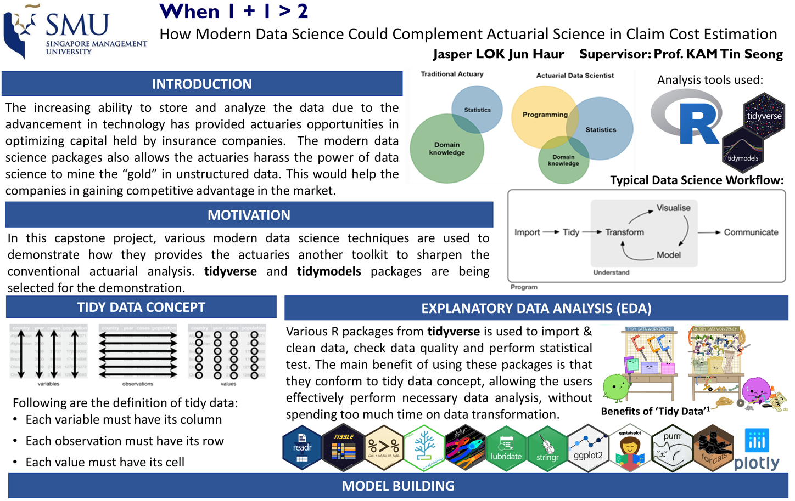

```{r, echo = FALSE}


```

*Screen shot of [capstone poster](https://github.com/jasperlok/SMU_Capstone/blob/main/Capstone%20Poster_Jasper%20Lok/MITB%20Capstone_Lok%20Jun%20Haur_Poster.JPG)*


## Abstract

The increasing ability to store and analyze the data due to the advancement in technology has provided actuaries opportunities in optimizing capital held by insurance companies. Often, the ability to optimize the capital would lower the cost of capital for companies. This could translate into an increase in profit from the lower cost incurred or an increase in competitiveness through lowering the premiums companies charge for their insurance plans.


In this analysis, `tidyverse` and `tidymodels` packages are used to demonstrate how the modern data science R packages could assist the actuaries in predicting the ultimate claim cost once the claims are reported. The conformity with tidy data concepts by these R packages has flattened the learning curve to use different machine learning techniques to complement the conventional actuarial analysis. This has effectively allowed actuaries in building various machine learning models in a more tidy and efficient manner. The packages also enable users to harass on the power of data science to mine the “gold” in unstructured data, such as claim descriptions, item descriptions, and so on. Nevertheless, these would enable the companies to hold less reserve through a more accurate claim estimation while not compromising the solvency of the companies, allowing the capital to be re-deployed for other purposes.


## Report

The report of this capstone can be found this [link](https://github.com/jasperlok/SMU_Capstone/blob/main/Report/MITB_Capstone_Lok%20Jun%20Haur_Final%20Report_20210430.pdf).


