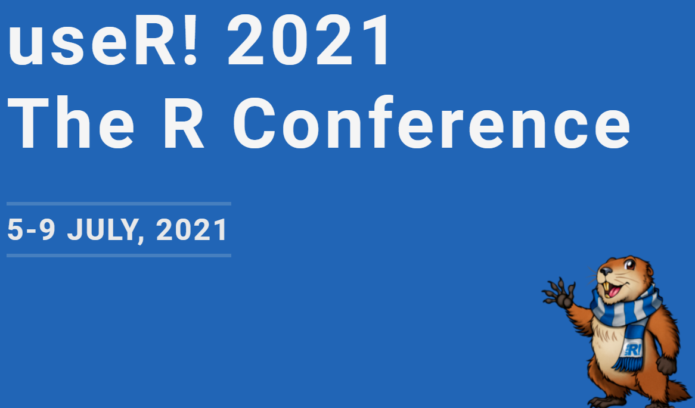

```{r, echo = FALSE}


```

*Screen shot of useR! Conference 2021*


## Brief Description of the Sharing

I was honored to be selected to do a short sharing together with my professor at the useR! Conference 2021 on how `tidymodels` can used to complement conventional actuarial analysis.


## Technical Note

The submitted technical note can be found this [link](technical note\technical_note.html).


