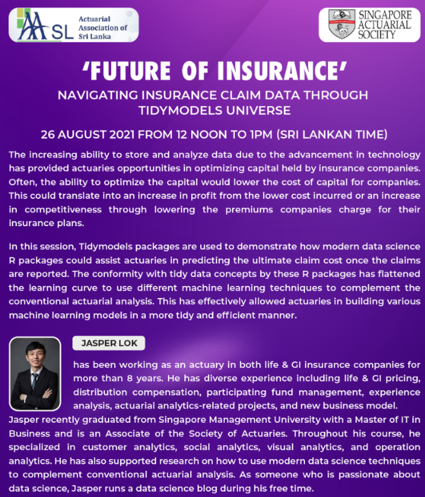

```{r, echo = FALSE, out.width = "120%"}


```

*Screen shot of SAS-AASL Webinar*


## Brief Description of the Sharing

I was honored to be invited to do a sharing together at a joint webinar organized by Singapore Actuarial Society and Actuarial Association of Sri Lanka to share how data science can be used to analyze insurance claims data.


## Presentation Slides

The presentation slides can be found this [link](presentation\AASL-Sharing.html).


