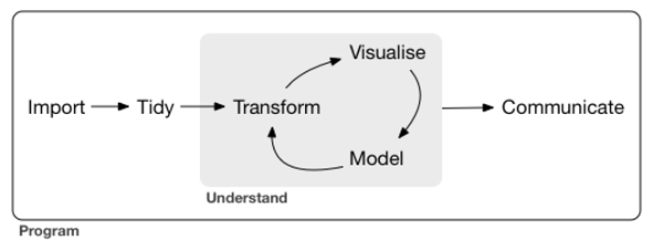
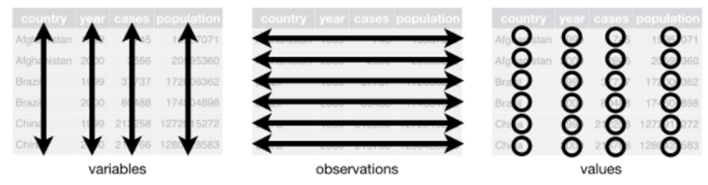

```{r, echo = FALSE}
knitr::include_graphics("image/data_cowboy.png")

```
*Artwork on Data Wrangling by Allison Horst*

As mentioned in my last post, it has been a long journey to learn data science pretty much from scratch. I intend to share some of my learning to help others to start their data science journey as well. 


Therefore, for my second post, I will share about data wrangling, which is often the essential task before building any machine learning models. Hence this post will serve as a building block of my future machine learning posts. 


Also, I intend to share some of the modern data science R package and how these packages could benefit some of the analysis tasks.


##   Background

In [R for Data Science](https://r4ds.had.co.nz/explore-intro.html) book, Wickham & Grolemund mentioned that a typical data science project would look as following:

```{r, echo = FALSE, out.width = "120%"}


```
*Extracted from R for Data Science*


After importing the data, the very first step usually involves some levels of data wrangling. This is probably one of the most important steps as without a good dataset, the analysis is unlikely to be meaningful. 


*Golden rule  -->  Garbage in, garbage out*


A good data exploratory will help to answer the following questions (not limited to): <br   />
- Does this dataset answer the business questions (eg. does the dataset have the necessary info to predict which customers are likely to purchase in the next promotion?)? <br   />
- Are there any issues that exist in the dataset (eg. missing value, excessive categories, value range vary widely)? <br   /> 
- Any data transformation required? As some of the machine learning models can accept certain data types. <br  />


Through understanding the data, it will also give us some insights on whether there is any more "gold" we can squeeze out from data through feature engineering. 


It will also provide us some clues whether the variable is a good predictor even without needing one to fit the model.


The conventional method of data wrangling is to perform data cleaning and transformation in Excel. 


```{r, echo = FALSE}
knitr::include_graphics("image/excel.jpg")

```
*Photo by Mika Baumeister on Unsplash*


However, this method is not very sustainable/ideal due to the following reasons: <br   />
- Excel has memory limitation and the software would keep on crashing as the data size increases <br   />
- Become a hurdle when we want to join different tables together or perform a transformation on the data <br   /> 
- More challenging to extract insights from the unstructured data (eg. perform text mining) <br   />


## Introduction to Tidyverse

When my professor first introduced this R package to me, I was amazed by what we could perform by using this package. And in fact, the more I use it, the more I love it. 

**tidyverse** is a collection of R packages designed by RStudio.

```{r, echo = FALSE, out.width = "120%"}
knitr::include_graphics("image/tidyverse.png")

```

The very awesome thing about **tidyverse** is all of the packages are following the tidy data concept.

### So what the heck is tidy data?

Tidy data is a concept on how to store/structure the data/results introduced by Hadley Wickham. 

```{r, echo = FALSE}
knitr::include_graphics("image/tidydata_dataset.JPG")

```
*Artwork on Tidy Data by Allison Horst*


Below are the definition of tidy data: <br   />
-	Each variable must have its column <br   />
-	Each observation must have its row <br   />
-	Each value must have its cell <br   />


```{r, echo = FALSE, out.width = "120%"}


```
*Extraction from [R for Data Science](https://r4ds.had.co.nz/explore-intro.html) book*


### Why is tidy data awesome?

This is as simple as the time spent transforming the dataset/output is now lesser.


Why less time is required?


The functions are aligned on the input data formats they require.


Often this allows us to 'join' the function together (also often known as "pipe" in **tidyverse** context. Don't worry about the meaning of "pipe" for now, will be covering what I mean by "pipe" later in this post).


Therefore, as a user, I find that the learning curve of using tidyverse to perform data wrangling is less steep than other programming languages. This has effectively allowed me to spend more time on the analysis itself.

```{r, echo = FALSE}
knitr::include_graphics("image/tidydata_workbench.JPG")

```
*Artwork by Allison Horst*

Enough talking, let's get our hands dirty.


## Illustration

I will be using the motor insurance dataset taken from **[CASdataset](http://cas.uqam.ca/pub/web/CASdatasets-manual.pdf)** as a demonstration. In this illustration, I am interested to find out how the different profiles of the insured affected the total premium.


### Preparation of the "equipment"


Over here, I call the necessary R packages by using a for-loop function.

```{r, message = FALSE, error = FALSE}
package <- c('CASdatasets', 'tidyverse', 'skimr', 'funModeling', 'ggplot2', 'plotly', 'ggstatsplot')

for (p in package){
  if(!require (p, character.only = TRUE)){
    install(p)
  }
  library(p, character.only = TRUE)
}

```


The code chunk will first check whether the relevant packages are installed in the machine.


If it is not installed, it will first install the required package.


After that, the relevant packages will be attached to the environment.


### Calling the "beast"


After loading the relevant packages, I will indicate to R the dataset I want through **data** function as there are many datasets within **CASdatasets** package. I have renamed the dataset to *df* to shorten the name after attaching the dataset into the environment.

```{r}
data(fremotor1prem0304a)
df <- fremotor1prem0304a

```


### Now, tame the "beast"


Conventionally, **summary** function is used to check the quality of the data. 


```{r}
summary(df)

```


However, the data quality result shown under **summary** function is often not sufficient. Instead of just looking at the quantile, it's also important to check other information, such as there is any missing value, what is the distribution of the variable look like, what is coefficient variation, and so on.

Below are three examples of modern R functions to check the data quality:


**skim**
```{r}
skim(df)

```


**profiling_num**
```{r}
profiling_num(df)

```


**status**
```{r}
status(df)

```


These functions show more info than just quantile. They also show info such as: <br  /> 
- Number of unique categories under categorical variables <br  />
- The proportion of missing values in the data <br  />
- Standard deviation of the numeric variables <br  />


Below are some insights we could draw from the functions above: <br   />

- Excessive missing value (i.e. more than half of the values are missing) in MaritalStatus & JobCode. More than 65% of the data from these two columns have missing values. So, it doesn't like the variables will yield meaningful results if they are used to build machine learning models <br   />


```{r}
df %>% dplyr::select(MaritalStatus, JobCode) %>% skim()

```


- About 15 unique categories under VehPower. Might not ideal to keep so many unique categories within the variables as it might create noise when fitting machine learning models <br   />


```{r}
df %>% group_by(VehPower) %>% tally()

```


Also, note that the count of some categories is relatively low. Perhaps it is better to group these 'low count categories' since they are unlikely to have a significant impact on the predicted results.


- Maximum BonusMalus can go up to 156. According to the data dictionary, <100 means bonus, >100 means malus. Hence, this is okay. <br   />


```{r}
df %>% dplyr::select(BonusMalus) %>% skim()

```


- Interestingly, the premium for different benefits can range very widely. This is probably due to the difference in the respective burning cost under each benefit. <br   />


```{r}
df %>% dplyr::select(starts_with("Prem")) %>% skim()

```


I prefer **skim** function as its output is in a nice & neat format. It also provides most of the crucial info one is looking for in checking the data quality. 


If I am only interested in checking the data quality for the numeric variables, this can be found by piping the variables together.


First, I have specified the dataset. Next, I use **select_if** function to select all the numeric columns before using **skim** function to skim through the dataset.


```{r}
df %>% 
  select_if(is.numeric) %>%
  skim()

```


The piping method is made possible because the functions are following the tidy data concept, which makes it easier to "play" with the data.


Often, visualizing data might provide us unexpected insights. The data can "tell" us underlying/hidden stories by leveraging on the power of data visualization.


For example, I would like to find out the scatterplot between PremTot against the selected numeric variables.


```{r}
num_list <- c("Year", "DrivAge", "BonusMalus", "LicenceNb", "VehAge")


for (i in num_list){
  print(ggplot(df, aes(x = get(i), y = log(PremTot))) +
      geom_point() +
        xlab(i)
      )
}

```


The graphs show that the data type for Year and LicenceNb is incorrect. They are supposed to read as factors, instead of numeric variables.


To fix this, I will use **mutate** and **factor** function to transform the data into the correct data type.


```{r}
df_1 <- df %>%
  mutate(Year = factor(Year),
         LicenceNb = factor(LicenceNb))

```


Alternatively, sometimes we just want to find out the graphs of a list of variables, instead of a small subset of variables. By typing down all the variables names can be a hassle and prone to human error.


This is where the different R functions come to the "rescue".


For example, I am interested to find out the boxplot of all the factor variables against PremTot. The code chunk below has shown how we could pipe the different functions together to select all the factor columns and extract out the column names as a list.


```{r}
cat_list <- df_1 %>%
  select_if(is.factor) %>%
  names()

```


Subsequently, I will use for loop to plot the necessary graphs. I will explain the awesome-ness of **ggplot** function in my future post. 


```{r}
for (i in cat_list){
  print(ggplot(df_1, aes(x = get(i), y = log(PremTot))) +
      geom_boxplot() +
        xlab(i)
      )
}

```


Below are some of the insights drawn from the graphs above (not limited to): <br  />
- Average PremTot for Retailer is higher than the rest <br  />
- Average PremTot also varies significantly across different VehPower <br  />
- Somehow the premium for a diesel car is higher than a regular car <br  />
- PremTot for professional & professional run is higher than private+trip to office <br  />


## Conclusion

Okay, that's all the sharing for this post!


I have shown the awesome-ness of **tidyverse** through this post. There are many more functions within **[tidyverse](https://www.tidyverse.org/)** universe, which are not covered in this post. Do check out their [website]((https://www.tidyverse.org/)) for many more awesome functions!


Feel free to contact me through [email](mailto:jasper.jh.lok@gmail.com) or [LinkedIn](https://www.linkedin.com/in/jasper-l-13426232/) if you have any suggestions on future topics to share.

Refer to this link for the [blog disclaimer](https://jasperlok.netlify.app/blog_disclaimer.html).

