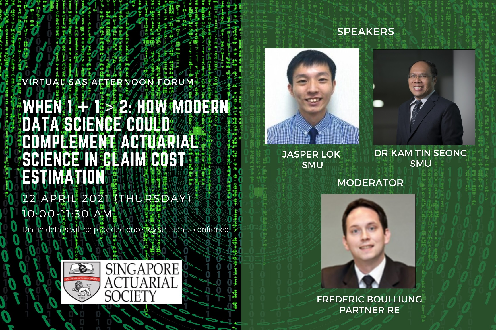

```{r, echo = FALSE}


```


And finally after months preparations, I will be sharing at [Singapore Actuarial Society](https://www.actuaries.org.sg/) on how actuaries could leverage on modern data science packages in R to perform necessary actuarial analysis.


Below are the details of the event:


- **Event Organizer:** Singapore Actuarial Society


- **Date:** 22 April 2021


- **Time:** 10 - 11am


- **Event Link:** [Link](https://www.actuaries.org.sg/events/how-modern-data-science-could-complement-actuarial-science-claim-cost-estimation)


While this research project focus on the end to end of data science project process (ie. from data wrangling, pre-processing, modeling and communication), this sharing will only be focusing on the modeling part due to the time constraint.


Neverthless, do check out this post as I will post the paper, code & poster once they are completed if you would like to find out more on this project!


