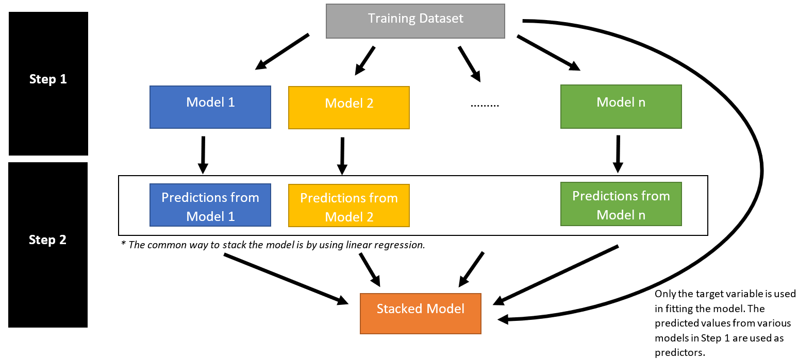

```{r setup, include=FALSE}
options(htmltools.dir.version = FALSE)

packages <- c("captioner", "knitr", "tidyverse", "tidymodels", "stacks")

for (p in packages){
  if(!require (p, character.only = T)){
    install.packages(p)
  }
  library(p, character.only = T)
}

knitr::opts_chunk$set(fig.retina = 3,                       
                      echo = TRUE,                       
                      eval = TRUE,                       
                      message = FALSE,                       
                      warning = FALSE,
                      out.width="70%")

library(captioner)

```


```{r, echo = FALSE, out.width = "80%"}


```
*Photo by <a href="https://unsplash.com/@crissyjarvis?utm_source=unsplash&utm_medium=referral&utm_content=creditCopyText">Crissy Jarvis</a> on <a href="https://unsplash.com/s/photos/stack?utm_source=unsplash&utm_medium=referral&utm_content=creditCopyText">Unsplash</a>*

In this series of modeling, I will be exploring model stacking.


It has gained popularity especially in data science competition as such method could further improve the accuracy of the machine learning models.


Before jumping straight into model stacking, let's understand what is ensemble method.


## What is Ensemble method?


```{r, echo = FALSE, out.width = "80%"}
knitr::include_graphics("image/Graph on Different Machine Learning.png")

```

*Extracted from vas3k blog* [@vas3k]


Ensemble method is one of the machine learning method.


[@Geron2019] described that ensemble method is similar to aggregate the answer of a complex question from thousands of random people. This anchored on the idea of wisdom of the crowd. Often this approach would produce a better answer than an answer from an expert.


Such method can be either applied on the same machine learning algorithms or aggregate across different machine learning algorithms.


As the graph shown above, following are the three common ensemble methods:


- **Bagging:** Different models are trained by using different dataset randomly drawn with replacement from the training dataset. The final prediction is the average of predictions from all the fitted models. Random forest is one of the algorithm that leverages on bagging to improve the model accuracy.


- **Boosting:** The idea is to a combination of weak learners could form a strong learner. XGBoost is one commonly used model algorithm that uses boosting method.


- **Stacking:** As the name suggested, we "stack" the models on one another and create a new model.


In this post, I will be exploring model stacking and mainly covering the following topics:


- How does model stacking work?


- How to implement model stacking in R?


## So, how does stacking work?


If we were to visualize the steps for model stacking, this would be how it would look like:


```{r, echo = FALSE, out.width = "135%"}


```


Following are the steps to perform model stacking:


- First, fit different individual machine learning models


- Next, use target variable from the training dataset and the predictions from the different machine learning models as input to fit a model


The conventional way to stack the model is to use linear model. Although in theory we could use other machine learning algorithm to stack the models, this would increase the complexity of the final model, making it even harder to interpret.


## Why is this method popular?

[@Gunes2017] discussed in their paper that ensemble method enables the users to average out the noise from the diverse models and thereby enhance the generalizable signal. 


Therefore, such method has proven to increase model accuracy in Kaggle competitions. Often, even a slight uplift in improvement could affect our model performance rankings in the Kaggle competitions.


While this method does not guarantee an improvement in the accuracy, it is worthwhile to fit such models to attempt to improve the accuracy of the predictions.


However, by stacking the different models together, this has increased the complexity of the models, making it even harder to understand on how the model reaches the decisions.


The time required for model fitting would be longer as well since we would need to fit the base model before perform model stacking.


## Stacks R Package

Okay, let's perform some model stacking!

```{r, echo = FALSE, out.width = "70%"}
knitr::include_graphics("image/bricks stack.jpg")

```
*Photo by <a href="https://unsplash.com/@lastnameeaster?utm_source=unsplash&utm_medium=referral&utm_content=creditCopyText">La-Rel Easter</a> on <a href="https://unsplash.com/s/photos/stack?utm_source=unsplash&utm_medium=referral&utm_content=creditCopyText">Unsplash</a>*


In this demonstration, I will be using a package from **tidymodels** that allows the users to perform model stacks with just a few lines of codes. This package is called **stacks**.


```{r, echo = FALSE, out.width = "40%"}


```
[**stacks** *package*](https://stacks.tidymodels.org/)


And yes, this package is it conforms to the tidy data concept. It is also designed to work together with the various packages under **tidymodels**. 


**WHAT A BIG RELIEF!**


```{r, echo = FALSE, out.width = "70%"}
knitr::include_graphics("image/hooray.jpg")

```
*Photo by Andrea Piacquadio from Pexels*


This would make it easier for one to use perform model stacking.


## Demonstration

### Setup the environment

Before I start the demonstration, I will setup the environment by calling the necessary packages.


```{r}
packages <- c("tidyverse", "tidymodels", "stacks")

for (p in packages){
  if(!require (p, character.only = T)){
    install.packages(p)
  }
  library(p, character.only = T)
}

```


I will also define the common parameters that will be used in the analysis below.


```{r}
# Define the random seeds for reproducibility
set.seed(1234)

# Proportion between training and testing dataset
prop_train_test <- 0.6

# Define the model performance metrics we would like to output later
model_metrics <- metric_set(rmse, rsq)

# The number of grid to be used in the analysis later
grid_num <- 5

```


To stack model, we need to include following as well. According to the documentation page, this is to ensure the predictions and necessary info are output in the necessary format required by **stacks** package later.

```{r}
ctrl_grid <- control_stack_grid()
ctrl_res <- control_stack_resamples()

```


```{r, echo = FALSE}
library('doParallel')
registerDoParallel() #as many physical cores as available.

```

### Import Data

For this demonstration, I will be using a dataset from [Actuarial Loss Prediction Kaggle Competition](https://www.kaggle.com/c/actuarial-loss-estimation/overview).


Also, this sharing will be focusing on the model stacking, instead of end to end process. Hence, I will import the data I have previously cleaned.


Refer to my [EDA code file](https://github.com/jasperlok/SAS-Sharing_20210422/blob/main/Analysis/MITB_Capstone_Lok%20Jun%20Haur_EDA.Rmd) on my Github page for the steps taken to clean the data.


```{r}
df <- read_csv("data/data_eda_actLoss_3.csv") %>%
  dplyr::select(-c(ClaimNumber,
                   num_week_paid_ult,
                   InitialIncurredClaimCost,
                   UltimateIncurredClaimCost)) %>%
  dplyr::select(-starts_with(c("acc", "report"))) %>%
  filter(Gender != "U") %>%
  drop_na() %>%
  sample_frac(0.3)

```


While importing the data, I have also:


- Drop 'ClaimNumber', 'num_week_paid_ult' & column headers that starts with 'acc' & 'report' since I am not using them later


- Filter out gender 'U' as according to data dictionary, indicator 'U' means missing values


- Drop the data with missing values


- Sample 30% of the data to use for the analysis, otherwise it would take forever to run on my laptop `r emo::ji("cry")`


### Data Splitting

Next, I will split the dataset into training and testing dataset.

```{r}
# Split dataset
df_split <- initial_split(df,
                            prop = prop_train_test,
                            strata = init_ult_diff)

df_train <- training(df_split)
df_test <- testing(df_split)

```


Then, I will prepare the dataset for the k-fold validation later.

```{r}
# Cross validation
df_folds <- vfold_cv(df_train, strata = init_ult_diff)

```


### Define Recipe


In this section, I will define the general recipe for the different machine learning models.

```{r}
gen_recipe <- recipe(init_ult_diff ~ ., data = df_train) %>%
  update_role(c(DateTimeOfAccident, DateReported, ClaimDescription), new_role = "id") %>% # update the roles of original date variables to "id"
  prep()

```


Basically, I try to perform the following in the code chunk above:


- Extract the date information from date variable by using **step_date** & **step_mutate** functions


- Convert the extracted date features into ordinal variables by using **factor** function


- Update the roles for 'DateTimeOfAccident' & 'Date Reported' to 'id' so that they will not be used in fitting the model


### Fitting Individual Machine Learning Models

Before fitting a stack model, let's fit individual models first.


Random Forest


```{r}
ranger_spec <- 
  rand_forest() %>%
  set_mode("regression") %>% 
  set_engine("ranger", importance = "impurity")

ranger_workflow <- 
  workflow() %>% 
  add_recipe(gen_recipe) %>% 
  add_model(ranger_spec) 

set.seed(51107)
ranger_tune <-
  tune_grid(ranger_workflow, 
            resamples = df_folds, 
            grid = grid_num,
            control = ctrl_grid)

```


XGBoost


```{r}
xgboost_recipe <- gen_recipe %>%
  step_dummy(all_nominal())

xgboost_spec <- 
  boost_tree() %>%
  set_mode("regression") %>% 
  set_engine("xgboost") 

xgboost_workflow <- 
  workflow() %>% 
  
  add_recipe(xgboost_recipe) %>% 
  add_model(xgboost_spec) 

set.seed(12071)
xgboost_tune <-
  tune_grid(xgboost_workflow, 
            resamples = df_folds, 
            grid = grid_num,
            control = ctrl_grid)

```


MARS


```{r}
earth_recipe <- gen_recipe %>% 
  step_novel(all_nominal(), -all_outcomes()) %>% 
  step_dummy(all_nominal(), -all_outcomes()) %>% 
  step_zv(all_predictors()) 

earth_spec <- 
  mars() %>%
  set_mode("regression") %>% 
  set_engine("earth") 

earth_workflow <- 
  workflow() %>% 
  add_recipe(earth_recipe) %>% 
  add_model(earth_spec) 

earth_grid <- tidyr::crossing(num_terms = 2 * (1:6), prod_degree = 1:2) 

earth_tune <- 
  tune_grid(earth_workflow, 
            resamples = df_folds, 
            grid = grid_num,
            control = ctrl_grid)

```


### Stack the Models!

Okay, we have fitted all the individual models. I will move on and fit a stack model.


To do so, I will use **stack** function to create an empty stack model and add on the individual fitted models earlier on.


```{r}
stack_model <-
  stacks() %>%
  add_candidates(ranger_tune) %>%
  add_candidates(xgboost_tune) %>%
  add_candidates(earth_tune)

```


Next, I will use blend_predictions function to find the coefficient of individual models.


```{r}
stack_model_pred <-
  stack_model %>%
  blend_predictions()

```


To see the weights of the models, we can call the object we have created in the previous step.


```{r}
stack_model_pred

```

As the results shown above, random forest, xgboost and mars are used to create the stacked model.


We can also use the **autoplot** function to visualize the weight for different models.

```{r}
autoplot(stack_model_pred, type = "weights")

```


Once the weights of the different models are determined, I will prepare the fitted stack model by using **fit_members** function.

```{r}
stack_model_fit <- stack_model_pred %>%
  fit_members()

```


### Compare the Model Performance


#### Performance Metric of Individual Models

To compare the model performance from different models, I will do the following:


- First, finalize the workflow by selecting the best parameters & perform last_fit on the model


- Then, collect the model predictions by using collect_predictions


- Lastly, calculate the model performance, create a column named 'model' and pivot the columns


Ranger metrics


```{r}
# Finalize the workflow by selecting the best parameters
ranger_fit <- ranger_workflow %>%
  finalize_workflow(select_best(ranger_tune)) %>%
  last_fit(df_split)

# Extract the predictions from the fitted model
ranger_pred <- ranger_fit %>%
  collect_predictions()

# Calculate the model performance metric
ranger_metric <- model_metrics(ranger_pred, 
                               truth = init_ult_diff, 
                               estimate = .pred) %>%
  mutate(model = "ranger") %>%
  pivot_wider(names_from = .metric,
              values_from = .estimate)

```


XGBoost


```{r}
# Finalize the workflow by selecting the best parameters
xgboost_fit <- xgboost_workflow %>%
  finalize_workflow(select_best(xgboost_tune)) %>%
  last_fit(df_split)

# Extract the predictions from the fitted model
xgboost_pred <- xgboost_fit %>%
  collect_predictions()

# Calculate the model performance metric
xgboost_metric <- model_metrics(xgboost_pred, 
                               truth = init_ult_diff, 
                               estimate = .pred) %>%
  mutate(model = "xgboost") %>%
  pivot_wider(names_from = .metric,
              values_from = .estimate)

```


MARS


```{r}
# Finalize the workflow by selecting the best parameters
earth_fit <- earth_workflow %>%
  finalize_workflow(select_best(earth_tune)) %>%
  last_fit(df_split)

# Extract the predictions from the fitted model
earth_pred <- earth_fit %>%
  collect_predictions()

# Calculate the model performance metric
earth_metric <- model_metrics(earth_pred, 
                               truth = init_ult_diff, 
                               estimate = .pred) %>%
  mutate(model = "earth") %>%
  pivot_wider(names_from = .metric,
              values_from = .estimate)

```


#### Performance Metric of Stack Model


Next, I will calculate the model performance for the stack model.

```{r}
stack_metric <- predict(stack_model_fit, df_test) %>%
  bind_cols(init_ult_diff = df_test$init_ult_diff) %>%
  model_metrics(truth = init_ult_diff, estimate = .pred) %>%
  mutate(model = "stack") %>%
  pivot_wider(names_from = .metric,
              values_from = .estimate)

```


#### Summary

Now I will combine all the results in a tibble table so that its easier to compare the performance metrics from different models.

```{r}
tibble() %>%
  bind_rows(stack_metric) %>%
  bind_rows(ranger_metric) %>%
  bind_rows(xgboost_metric) %>%
  bind_rows(earth_metric)

```

As shown above, both model performance metrics improved after we stacked the models. 


## Conclusion

That's all for the day! 


Thanks for reading the post until the end. 


Do check out on the [documentation page](https://stacks.tidymodels.org/) if you want to find out more on model stacking.


Feel free to contact me through [email](mailto:junhaur.lok.2019@mitb.smu.edu.sg) or [LinkedIn](https://www.linkedin.com/in/jasper-l-13426232/) if you have any suggestions on future topics to share.


