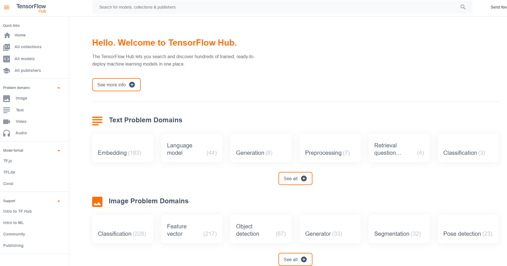

```{r setup, include=FALSE}
options(htmltools.dir.version = FALSE)

packages <- c("captioner", "knitr")

for (p in packages){
  if(!require (p, character.only = T)){
    install.packages(p)
  }
  library(p, character.only = T)
}

knitr::opts_chunk$set(fig.retina = 3,                       
                      echo = TRUE,                       
                      eval = TRUE,                       
                      message = FALSE,                       
                      warning = FALSE,
                      out.width="80%")

library(captioner)

```


Recently I happened to come across this post by [@chollet2017image] on RStudio AI Blog and inspired me to give it a try to build a convolution neural network (CNN) model to solve an image classification problem. 


Before jumping into the discussion, let's take a look at how image recognition can be used in the insurance context.


## How is image recognition relevant for insurance?


Papers are suggesting how the image recognition technology can be used in the insurance context. 


In the ‘Applying Image Recognition to Insurance’ report, [@Shang2018] explored a few examples of how insurers could leverage image recognition.


### Shorten operation process


Image recognition can be utilized at different stages of the insurance stage (eg. policy inception, update policy information, policy claim), where such use cases in this area can be observed in some countries.


For example, instead of manually inputting necessary info into the different documents at the point of policy inception, insurers could build an algorithm that would capture the details in the images uploaded. This could potentially shorten the turnaround time, resulting in an improvement in customer satisfaction. 


### Additional Pricing Parameters


[@Shang2018] also discussed how these techniques can be used for insurance pricing. For example, in property insurance, pictures can be used to understand the riskiness of the property, providing additional parameters for pricing and underwriting purpose. 


Nevertheless, this could allow the insurers in implementing dynamic pricing on the relevant business lines, improving the profitability of the business.


### Additional Parameters in Claim Estimation


[@Shang2018] also provided an example of how image recognition could be applied in real-time risk monitoring and risk management. Insurers can use the information extracted from the image to predict claim count and claim amount.


Nevertheless, in this exercise, instead of building the model from scratch, I will use what is known as “transfer learning” to speed up the model-building problem.


```{r, echo = FALSE}
knitr::include_graphics("image/image_on_wall.jpg")

```

*Photo by cottonbro from Pexels*


## What is ‘Transfer Learning’?


[@Brownlee2019] explained that transfer learning is a machine learning method where a model developed for a task is reused as the starting point for a model on a second task. 


[@Google2021] also explained that the intuition behind transfer learning for image classification is that if a model is trained on a large and general enough dataset, this model will effectively serve as a generic model of the visual world. You can then take advantage of these learned feature maps without having to start from scratch by training a large model on a large dataset. 


## Pre-trained Models


There are different types of pre-trained models that are trained to solve different types of problems. Some are trained to classify images, some are trained to handle text-related problems, and so on. 


```{r, echo = FALSE}


```


Do check out this [link](https://tfhub.dev/) to know about the different pre-trained models in TensorFlow. 


For this analysis, I will focus the pre-trained models on the image classification problem. I will use [VGG16 model](https://keras.rstudio.com/reference/application_vgg.html) to build a multi-class classification for the dataset. The relevant paper of this paper can be found in this [link](https://arxiv.org/abs/1409.1556).


## Considerations when using Pre-trained Models


The considerations of using pre-trained models can be summarized as the following diagram:


```{r, echo = FALSE, out.width = "70%"}
knitr::include_graphics("image/fine_tune.png")

```


*Diagram on Model Tuning Considerations [@Gupta2017]*


### Data similarity: Is the current dataset similar to the dataset used to train pre-trained model?


These pre-trained models are usually commonly trained by using image data from [ImageNet](https://www.image-net.org/index.php), where ImageNet is an image database with more than 14 million images. As such, this makes the pre-trained models generalized models. 


So, before using the pre-trained models, we should ask ourselves how similar is between our dataset and the dataset used in pre-trained model. If our images are very different from the image data used in training the pre-trained models, the accuracy of our model is likely to be low.


### Size of the data set: How big is our dataset?


Another important consideration is how big is our dataset. The model is unlikely to perform well if the dataset is not large enough to train the models. Therefore, pre-trained models can be used as an alternative if our dataset is not large enough.


### How are we training the model?


These pre-trained models typically come with the model weights that are derived by fitting the models with images from ImageNet. Hence, when we are using pre-trained models, one of the key questions we should answer is whether we should be using the model weights in the pre-trained models.


The usual approach is to freeze all the layers in the pre-trained model, except the few top layers. The few top unfreeze layers will be fine-tuned together with the classifier layer.


```{r, echo = FALSE, out.width = "100%"}


```

*CNN structure [@Sumit2018]*


Do note that the more layers we unfreeze, the longer it would take to fit the model.


## Model Building Steps


In general, the model building steps can be summarized as follows:


-	Split the dataset into train and validation dataset


-	Import pre-trained model into the environment and exclude the classifier layer from the pre-trained model


-	Add on classifier layer on top of the pre-trained model 


-	Freeze the weights of the pre-trained model, except for a few top layers to be tuned together with the classifier layer


-	Train the unfreeze top layers and classifier layer to make the model more relevant for the specific task


## Demonstration


I will be using [this image dataset](https://www.kaggle.com/alessiocorrado99/animals10) from Kaggle. There are about 28k medium-quality images in this data. These photos are from 10 different categories of animals, which consist of dog, cat, horse, spider, butterfly, chicken, sheep, cow, squirrel, and elephant.


Below are some of the extracted images from the dataset:


```{r, fig.show='hold',fig.align='center', echo = FALSE}
knitr::include_graphics(c("image/cat.jpeg","image/dog.jpeg", "image/squirrel.jpeg"))

```


*I have chosen these as the examples as I thought they looks funny.*


### Setup the environment

As usual, I will start by calling all the relevant packages I would need in the analysis later on.


```{r}
packages <- c('tidyverse', 'readr', 'skimr', 'keras')

for(p in packages){
  if(!require (p, character.only = T)){
    install.packages(p)
  }
  library(p, character.only = T)
}


```


### Import data


Next, I will import the dataset into the environment.


```{r, echo = FALSE}
train_dir <- "C:/Users/Jasper Lok/Documents/2_Data Science/99_Blogdown/Sandbox/data/archive/raw-img" #it would take much too much space on my Github, so save the image under another location, instead of my Distill workspace

```


As mentioned in the post earlier, there are 10 different categories in the dataset. Hence this is a multi-class classification problem. Since the photos are saved under the respective categories, I will use `dir` function to extract out the list of categories, where `train_dir` is the link to the folder I stored the image dataset.


```{r}
label_list <- dir(train_dir)

```


Next, `length` function is used to perform a count on the number of categories.


```{r}
output_n <- length(label_list)

```


Next, I will define the input size to be passed into the CNN model later. I have also defined the channel to be 3 as the photos are colored photos.


```{r}
width <- 224
height<- 224
rgb <- 3 

target_size <- c(width, height)

```


### Import the Pre-trained model


As discussed earlier, I would use the pre-trained model to classify the image. Over here, I will be using VGG16 as shown in the code chunk below. As I won't be re-trained the entire network, I will indicate the model weights should follow the derived weights when the model is trained by using ImageNet dataset.


Also, to include our classifier layer, I will indicate the `include_top` argument to be false so that the pre-trained model is imported without the classifier layer.


```{r}
conv_base <- application_vgg16(
  weights = "imagenet",
  include_top = FALSE,
  input_shape = c(width, height, rgb)
)

```


For other pre-trained models, do refer to the 'Applications' section under either [Keras documentation page](https://keras.rstudio.com/reference/index.html#section-applications) or [TensorFlow documentation page](https://tensorflow.rstudio.com/reference/keras/) for more information.


Next, `summary` function can be used to visualize how the pre-trained model looks like.


```{r}
summary(conv_base)

```


### Add on Classifier Layer


Next, I will add on the classifier layer as discussed in the earlier post. As this is a multi-class classification problem, hence `softmax` is selected to be the last activation function.


```{r}
model <- keras_model_sequential() %>% 
  conv_base %>% 
  layer_flatten() %>% 
  layer_dense(units = 256, activation = "relu") %>% 
  layer_dense(units = output_n, activation = "softmax")

```


I will call the `summary` function to check on the model before fitting the model.


```{r}
summary(model)

```


### Image Augmentation


Image augmentation is a commonly used technique to ensure the model is not overfit. 


[@BrownleeKeras2019] explained this technique allows one to artificially created new training data from existing data. The author further explained that the reason for using such a method is this method will aid the modern deep learning algorithms to learn the different features that are similar, but not entirely the same as the training photo. 


For example, it would be a problem if the objects always appear on the same side of the photo in our dataset. The algorithm may not be able to identify the objects if the objects do not appear on the same side as what is observed under the training dataset in the new photo.


So, the code chunk below will perform image augmentation on the training data.


```{r}
train_datagen = image_data_generator(
  rescale = 1/255,
  rotation_range = 40,
  width_shift_range = 0.2,
  height_shift_range = 0.2,
  shear_range = 0.2,
  zoom_range = 0.2,
  horizontal_flip = TRUE,
  fill_mode = "nearest",
  validation_split = 0.2
)

```


Apart from that, 20% of the training dataset is being held back as the validation dataset.


Also, one important note to take note of while performing image augmentation is the validation & test dataset should not be augmented.


```{r}
validation_datagen <- image_data_generator(rescale = 1/255)  

```


### Model Preparation


To leverage on transfer learning, typically we will freeze the base model and only unfreeze the connecting layers so that we can fine-tune the layers together with the classifier layer. 


```{r}
freeze_weights(conv_base)

unfreeze_weights(conv_base, from = "block5_conv1")

```


Next, I will generate batches of data in the code chunk below.


```{r}
train_generator <- flow_images_from_directory(
  train_dir,                  # Target directory  
  train_datagen,              # Data generator
  target_size = target_size,  # Resizes all images to 150 × 150
  class_mode = "categorical"       # binary_crossentropy loss for binary labels
)

validation_generator <- flow_images_from_directory(
  train_dir,
  validation_datagen,
  target_size = target_size,
  class_mode = "categorical"
)

```


Lastly, I will define all the different model components before fitting the model. 


I will be using `optimizer_sgd` (ie. stochastic gradient descent optimizer) to fit the model. Do check out the documentation page on the different optimizers.


As this is a multi-class classification problem, hence I will be using `categorical_accuracy` as the performance metric.


```{r}
model %>% compile(
  loss = "binary_crossentropy",
  optimizer = optimizer_sgd(),
  metrics = c("categorical_accuracy")
)

```


#### Model Fitting


Once the different model components are being defined, I will start the model fitting as shown below.


```{r}
history <- model %>% fit_generator(
  train_generator,
  steps_per_epoch = 100,
  epochs = 10,
  validation_data = validation_generator,
  validation_steps = 50
)

```


#### Visualizing the Model Results


Once the model is fit, the history from the model fitting is passed into `plot` function to visualize how the results change when the epochs increase.


```{r}
plot(history)

```


Yay! Based on the accuracy shown above, it shows that the built model does have some levels of predictability, ie. the model will perform better than a random guess on the image category. Indeed, as the epoch increases, the model accuracy increases as well.


Also, as we can see in the graph above, the accuracy increases when the epoch increases. This suggests the accuracy could increase further if we increase the number of epoch.


## Conclusion


That's all for today! 


Thanks for reading the post until the end. 


Do check out on the [Keras documentation page](https://keras.rstudio.com/index.html) or [TensorFlow documentation page](https://tensorflow.rstudio.com/) if you want to find out more on deep learning.


Feel free to contact me through [email](mailto:jasper.jh.lok@gmail.com) or [LinkedIn](https://www.linkedin.com/in/jasper-l-13426232/) if you have any suggestions on future topics to share.


```{r, echo = FALSE}


```

*Photo by Александар Цветановић from Pexels*


