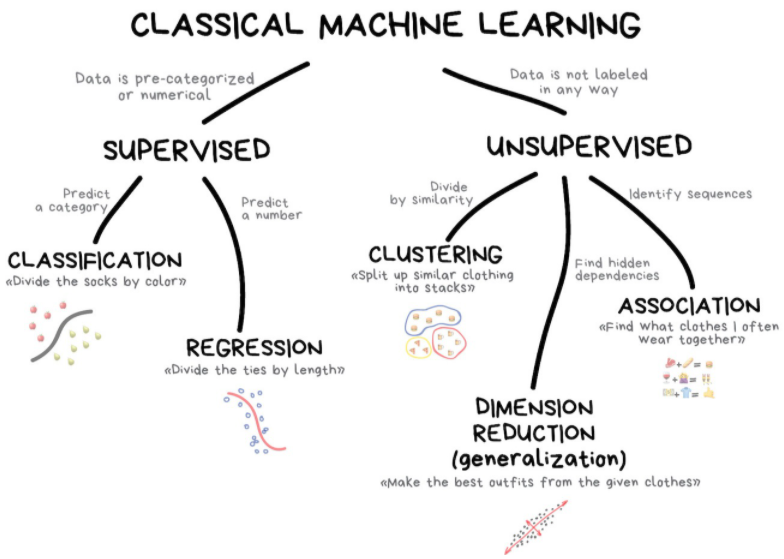
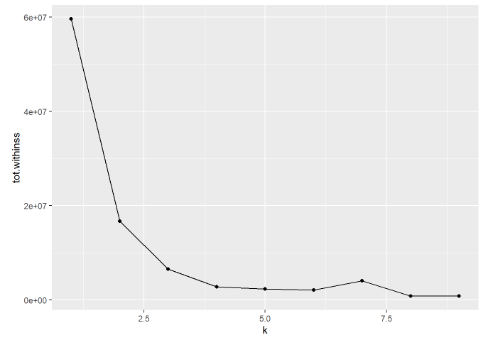
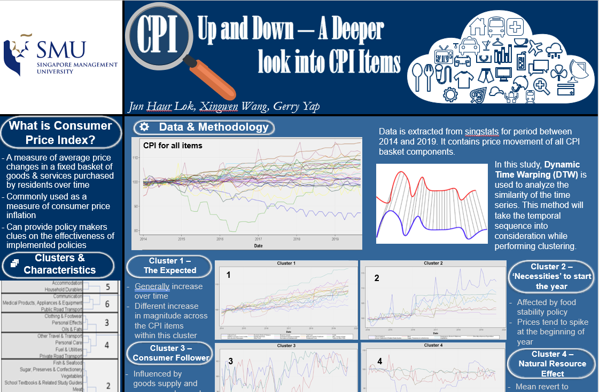

```{r setup, include=FALSE}
options(htmltools.dir.version = FALSE)

packages <- c("captioner", "knitr", "kableExtra")

for (p in packages){
  if(!require (p, character.only = T)){
    install.packages(p)
  }
  library(p, character.only = T)
}

knitr::opts_chunk$set(fig.retina = 3,                       
                      echo = TRUE,                       
                      eval = TRUE,                       
                      message = FALSE,                       
                      warning = FALSE,
                      out.width="90%")

library(captioner)

```


During the Q&A session in my last August sharing, there were some questions on different unsupervised learning methods. It has triggered my thought to do a sharing on unsupervised learning methods, in particular clustering. 


It is one of the basic topics one would learn when he/she learns data science.


Instead of having the explanations and demonstration in the same post, I have decided to split up the post into two so that each post is not too long to read. 


- In this post, I will focus on what one should know before perform clustering analysis. 


- The demonstration on clustering will be included in the next post.


Nevertheless, let's understand a bit more about clustering.


```{r, echo = FALSE}
knitr::include_graphics("image/categorize.jpg")

```

Photo by v2osk on Unsplash


## Unsupervised Learning

In general, the classical machine learning models can be further split into two broad categories, which are supervised and unsupervised learning methods.


Unsupervised learning is a machine learning method to discover hidden patterns or data groupings without human intervention [@IBM2020].


In other words, this method aims to model the underlying structure, affinities, or distribution in the data in order to learn more about its intrinsic characteristics [@Dinov2018].


The unsupervised learning method comprises clustering, association, and dimension reduction as shown in the graph below.


```{r, echo = FALSE}


```

*Extracted from vas3k blog*


Below are the descriptions of each unsupervised learning methods:


```{r, echo = FALSE}
unsupervised_df <- data.frame(Techniques = c("Clustering", 
                                  "Association",
                                  "Dimension Reduction"),
                         Descriptions = c("Clustering is one of the basic algorithms any beginners would learn when they started their data science journey. 
                         

The clustering algorithms include k-means, hierarchical clustering, latent class analysis, and so on. 
It is commonly used in many applications as shown following:


-	Find the different customer segments so that one could derive a more targeted strategy to boost the sales


-	Group the customers into different groups based on their behaviors",
                                  "Apriori is one of the common algorithms used to mine the association rules between the different items. In other words, this method allows one to discover how the items are “associated” with one another.

                                  
Following are some of the common examples of how the association rules are used: 


-	Product bundling by bundling products with higher profit margin and closely associated to boost the sales


-	Perform cross-selling and upselling products


-	Arranging the closely associated products together to increase the sales


The more advanced technique includes taking time into considerations while performing association algorithms. This would allow one to understand whether there is a change in the customer purchasing behaviors.",
                                  "As the data increases, often one would face the “curve of dimensionality”. This is an issue while building machine learning models as the data points in high-dimensional space are sparse, resulting in a less desirable machine learning model.

Therefore, the common way to resolve this is to perform principal component analysis (PCA). The key idea of PCA is the algorithm attempts to find a low-dimensional representation of a dataset that contains as much as possible of the variation [@James2021]. 

However, as the principal components derived from the algorithm are not directly observable from the dataset, hence it is often more challenging to explain or understand the results."))

#kable(unsupervised_df, col.names = c("", "Descriptions"))

unsupervised_df %>%
  kbl() %>%
  kable_paper("hover", full_width = F, html_font = "Cambria", font_size = 15)


```


In this series, I will focus on clustering and leave the other two unsupervised learning methods for future posts.


## Application of Clustering


[@Google2020] has listed a list of common applications for clustering, which includes:


- market segmentation


- social network analysis


- search result grouping


- medical imaging


- image segmentation


- anomaly detection


## Consideration when Performing Clustering


While clustering could be a useful tool to discover insights within the dataset, below are some of the important considerations when performing clustering:


### Purpose of Clustering Analysis

```{r, echo = FALSE}


```

Photo by Mark Fletcher-Brown on Unsplash


[@Logan2016] recommended the users to think about how the clustering results will be used. For example, what is the business problem we be solving through the clustering results? The required dataset could defer depending on the business problem we are solving.


Nevertheless, the answer to this question will guide users in selecting the appropriate variables for the clustering analysis, deciding the appropriate clustering algorithms, and so on.


### Appropriateness of Features in Separating Policies into Clusters


As the name unsupervised machine learning suggested, the clustering algorithm has no mechanism for differentiating relevant or irrelevant variables. Also, the clustering results can be very dependent on the variables included in the analysis [@Kam2019]. Therefore, to obtain meaningful clustering results, the selected variables should be able to reflect the inherent differences between the different clusters. 


For example, if we know there are the fundamental structural difference between the different types of customers/businesses, the relevant parameters should be used in clustering so that the clusters are less likely to overlap with one another.


```{r, echo = FALSE}


```

Photo by David Rotimi on Unsplash


Of course, the variables that could effectively separate the dataset may not be very apparent sometimes. Often, it requires some level of understanding of the underlying data or even the context of the data.


As the old saying goes, garbage in garbage out. Without thinking through and selecting the appropriate variables, the clustering results may not be meaningful.


Besides, the number of variables used in clustering is also quite important. The rule of thumb recommended by Goodman is to have at least three variables in the clustering analysis [@Goodman1974]. The clustering results may not be meaningful if insufficient variables are used in clustering. 


Meanwhile, having too many variables may introduce too much noise, resulting in less meaningful clustering results. Therefore, only the variables that could help us in separating the different characteristics of the model points should be included in the analysis. 


### Number of Data Points within Each Cluster

```{r, echo = FALSE}


```

Photo by Monstera from Pexels


The general rule of thumb is the number of data points within each cluster should not be less than 5. The idea is that the cluster is unlikely to be meaningful when the number of data points contained in the cluster is relatively low. 


For example, imagine the company is leveraging the clustering results to set up the different operations to serve different groups based on the values customers bring in. The company would be better off choosing a lower number of clusters that contain a decent number of data points within the clusters even though the higher number of clusters might be producing a better clustering result. The cost of having an additional headcount or separate process for a cluster without a decent size is likely to be hard to justify.


### Cluster Selection

```{r, echo = FALSE}


```

Photo by Edu Grande on Unsplash


For clustering, the number of clusters is a parameter that needs to be defined upfront before clustering analysis. However, this poses a challenge - how do we know what is the optimal number of clusters for the given dataset?


The common approach is to run the algorithm under a different number of clusters and use some measurements to compare the clustering results, providing us with a more objective method to determine the optimal number of clusters.


For example, the elbow curve is one of the common approaches to find the optimal number of clusters. This approach plots the within-cluster sum of the square against the number of clusters. Within-cluster sum of square measures the variability within the cluster. With the same dataset, as the number of clusters increases, the within-cluster sum of squares tends to decrease. 


Following is an example of how the elbow curve graph looks like, where the x-axis represents the number of clusters and the y-axis represents the total withinness between clusters.

```{r, echo = FALSE}


```

*Example of elbow curve graph*


However, having too many clusters could introduce noises into the clustering results, increasing the within-cluster sum of squares. The rule of thumb is to choose the point that the decrease in the within-cluster sum of squares would be insignificant when the number of clusters increases. This is because a simpler model is preferred if the simpler model can differentiate the segments well.


Also, note that one could compare the clustering results only if the clustering results are run based on the same set of data. This is because supervised learning methods have an explicit target, so different accuracy measurements can be used to measure the performance of the different methods. 


On the other hand, unlike the supervised learning method, the fundamental idea of the unsupervised learning method is to use the algorithms to find the various underlying patterns within the dataset. Hence, the unsupervised learning method does not have an explicit target for the algorithm to learn and measure on.


Hence, it is not meaningful to compare clustering results if the underlying dataset used in the clustering is different. However, we could compare the cluster results qualitatively to see which cluster models provide a more meaningful result. Following are some considerations in comparing the cluster results qualitatively:


-	Does each cluster have a reasonable amount of data points within each cluster (eg. not less than 5 data points within each cluster)?


-	Is there any overlapping between the clusters? A good cluster should be able to show the differences between the data points


### Limitation of Selected Clustering Algorithm

```{r, echo = FALSE, out.width = "60%"}


```

Photo by lucas souza from Pexels


Each clustering algorithm has its limitations, hence appropriate data transformation might require before the analysis. 


For example, the K-means clustering algorithm can only accept numeric variables. Hence the non-numeric variables will need to be transformed before they can be used for clustering purposes.


Also, the common clustering algorithm assumes the data is time-independent. This assumption is not appropriate when we are dealing with sequential data, such as time-series data, speech data, and so on. Hence, other clustering methods (eg. dynamic time warping) that take time into considerations when performing clustering would be more appropriate. Do check out my previous poster on how we could use dynamic time warping to analyze time-series data in [this post](https://jasperlok.netlify.app/past_proj/2019-12-up-and-down-cpi/).


```{r, echo = FALSE}


```

*Poster of my project on Dynamic Time Warping*


Hence, it is important to understand the limitations of the selected clustering algorithm before the analysis to ensure meaningful results.


## Conclusion

That's all for the day! 


Above are some of the important considerations while performing clustering analysis.


Thanks for reading the post until the end. 


Feel free to contact me through [email](mailto:jasper.jh.lok.@gmail.com) or [LinkedIn](https://www.linkedin.com/in/jasper-l-13426232/) if you have any suggestions on future topics to share.


Refer to this link for the [blog disclaimer](https://jasperlok.netlify.app/blog_disclaimer.html).


