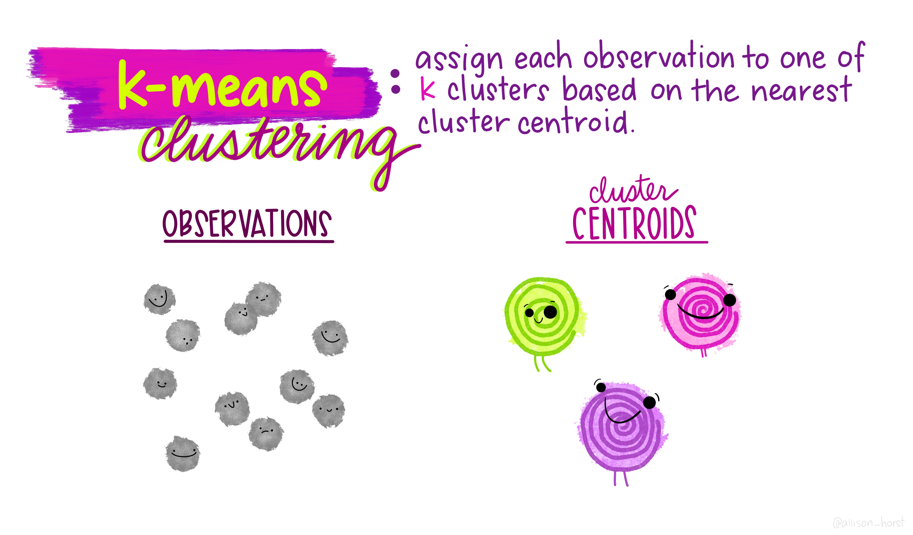
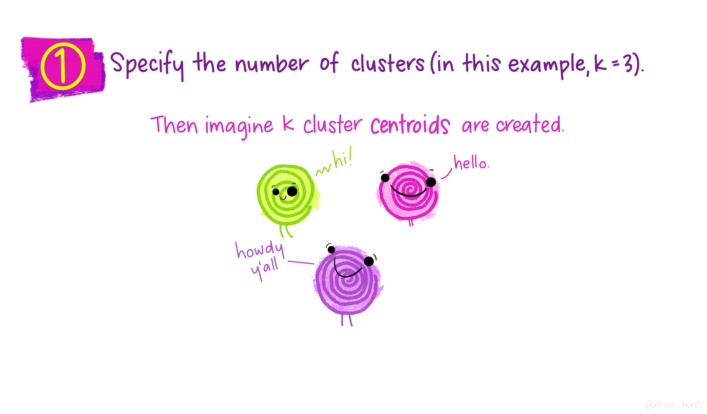
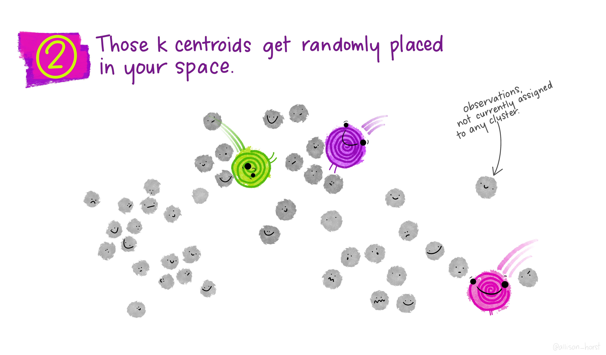
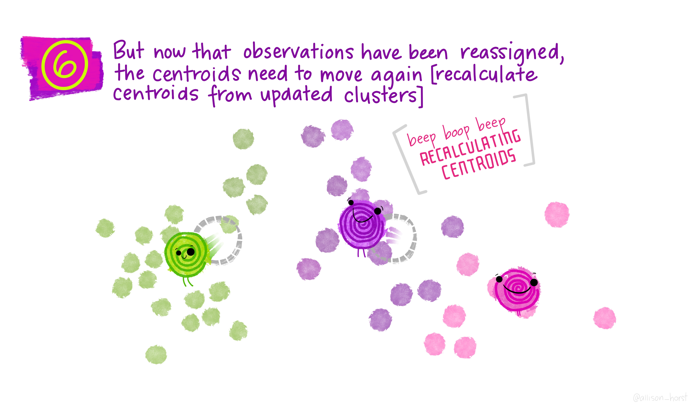
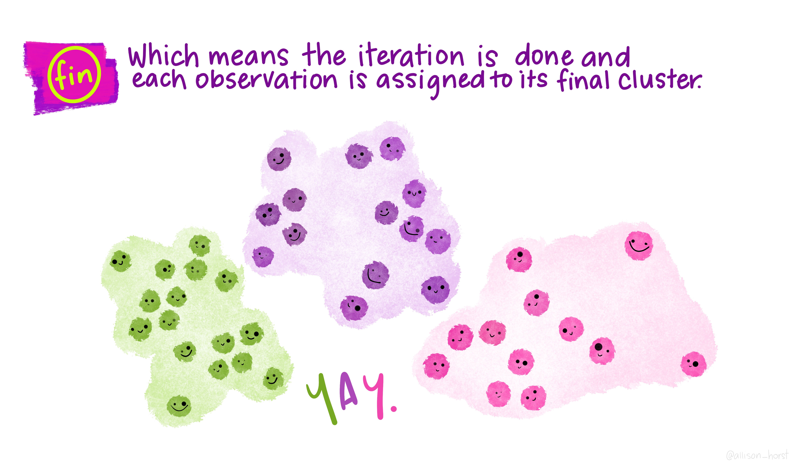

```{r setup, include=FALSE}
options(htmltools.dir.version = FALSE)

packages <- c("captioner", "knitr")

for (p in packages){
  if(!require (p, character.only = T)){
    install.packages(p)
  }
  library(p, character.only = T)
}

knitr::opts_chunk$set(fig.retina = 3,                       
                      echo = TRUE,                       
                      eval = TRUE,                       
                      message = FALSE,                       
                      warning = FALSE,
                      out.width="90%")

library(captioner)

```


In the previous post, I have discussed the basic concept of clustering and what are considerations when performing any clustering exercise.


Therefore, I will be using K-means to demonstrate how a clustering algorithm works and how to interpret the clustering results in this post.


## K-means clustering

```{r, echo = FALSE}


```


*Illustration by Allison Horst*


K-means clustering is one of the most common basic algorithms one would learn when they embark on their machine learning journey. 


In short, K-means clustering attempts to partition a dataset into K distinct, non-overlapping clusters [@James2021].


[Allison Horst](https://github.com/allisonhorst/stats-illustrations) has nice illustrations on how K-means clustering work in graphic format, making it super easy to understand. 


Following are the illustrations on how K-means clustering work:

```{r, echo = FALSE}


knitr::include_graphics("image/kmeans_4.jpg")
knitr::include_graphics("image/kmeans_5.jpg")
knitr::include_graphics("image/kmeans_6.jpg")
knitr::include_graphics("image/kmeans_7.jpg")

knitr::include_graphics("image/kmeans_9.jpg")
knitr::include_graphics("image/kmeans_10.jpg")
knitr::include_graphics("image/kmeans_11.jpg")


```

*Illustration by Allison Horst*


## Pros and Cons of K-means


[@Google2020] has listed a few pros and cons of the K-means clustering algorithm.


Below are the pros and cons extracted from the [website](https://developers.google.com/machine-learning/clustering/algorithm/advantages-disadvantages):


*Pros*


- Relatively simple to implement


- Scales to large data sets


- Guarantees convergence


- Can warm-start the positions of centroids


- Easily adapts to new examples


- Generalizes to clusters of different shapes and sizes, such as elliptical clusters


*Cons*


- Choosing k manually


- Being dependent on initial values


- Clustering data of varying sizes and density


- Clustering outliers


- Scaling with number of dimensions


## Demonstration

For this demonstration, I will be using [bank marketing data](http://archive.ics.uci.edu/ml/datasets/Bank+Marketing#) from UCI Machine Learning Repository. 


This dataset contains data points from past direct marketing campaigns of a Portuguese banking institution. 

```{r, echo = FALSE}
knitr::include_graphics("image/deposit.jpg")

```

*Photo by Monstera from Pexels*


### Setup the environment


First, I will set up the environment by calling all the packages I need for the analysis later.


```{r}
packages <- c('tidyverse', 'readr', 'skimr', 'tidymodels', 'plotly', 
              'corrplot', 'GGally')

for(p in packages){
  if(!require (p, character.only = T)){
    install.packages(p)
  }
  library(p, character.only = T)
}

```


### Import Data

Next, I will import the data into the environment and perform some data wrangling for the analysis later.


```{r}
set.seed(12345)

df <- read_delim("data/bank-full.csv", delim = ";") %>%
  mutate(across(where(is.character), as.factor)) %>%
  mutate(month = ordered(month, levels = c("jan",
                                          "feb",
                                          "mar",
                                          "apr",
                                          "may",
                                          "jun",
                                          "jul",
                                          "aug",
                                          "sep",
                                          "oct",
                                          "nov",
                                          "dec"))) %>%
  sample_frac(size = 0.5)
 

```

Note that I will perform clustering on a sample of the data points. This approach is commonly used when the dataset is too huge for us to perform data exploratory. 


Once we have finished the clustering analysis, we could re-run on the full dataset although the results are unlikely to change significantly when we change from subset of dataset to full dataset. If the results have changed significantly, this could indicate that the subset of data used for clustering is not representative of the full dataset.


### Data Checking & Wrangling


As part of the usual analysis, I will start by checking the data quality.


```{r}
skim(df)

```

#### Treatment on Magic Values


In the data dictionary, we are told that if the customer is not being contacted, the pdays will be recorded as -1. 


In [Google Machine Learning Course](https://developers.google.com/machine-learning/crash-course/representation/qualities-of-good-features), the author mentioned it is not ideal to mix "magic" values with actual data.


Therefore, I will separate the "magic" values from the actual data by including an indicator to indicate whether the pdays were captured in the dataset and changing the magic value to 0.


```{r}
df_1 <- df %>%
  mutate(pdays_supplied = case_when(pdays == -1 ~ "No",
                                    TRUE ~ "Yes"),
         pdays_supplied = as.factor(pdays_supplied),
         pdays_recoded = case_when(pdays == -1 ~ 0,
                                   TRUE ~ pdays)) %>%
  dplyr::select(-pdays)

```


#### Handling Outlier


As K-means clustering is finding the centroid within each cluster, hence the algorithm can sensitive to outliers. Hence, to overcome this, we can either take the following actions:


- Remove outliers before running the clustering algorithm


- Use other algorithms that are less sensitive to outliers (eg. k-medians clustering)


In this post, I will remove the outliers from the dataset before performing clustering analysis.


```{r}
df_1 <- df_1 %>%
 filter(previous < 100)

```


#### Standardization

In the data quality checking, we can see that the values are very skewed.


As K-means clustering is very sensitive to the range of the variable, hence standardization should be performed to avoid variables with larger variance to dominate the effect of clustering.


```{r}
df_1_scale <- df_1 %>%
  mutate(across(where(is.numeric), scale))

```


#### Filter out Non-numeric variables

There are non-numeric variables within the dataset. However, K-means clustering algorithm is unable to handle non-numeric variables. 


The common approach to get around with this issue is to convert the non-numeric variables into dummy variables through a one-hot encoding method. [@IBM2020] mentioned that the clustering results are unlikely to be satisfactory by using binary data. As the naming of the algorithm suggested, the algorithm attempts to find the clusters through finding the "mean" (a.k.a. the centroid), where finding the average is not meaningful for binary data.


As such, we can either perform clustering only on the numeric variables or use other algorithms (e.g. K-proto) that allow us to perform clustering on the mixed data type. I will explore this alternative clustering algorithm in my future post.


In this post, I will use the first method, which is to filter out all the non-numeric variables for clustering.


```{r}
df_1_scale_num <- df_1_scale %>%
  select_if(is.numeric)

```


#### Correlation Checking


I will also check the correlation before I proceed and run K-means clustering. This is because highly correlated variables may affect the clustering results, causing clustering results to overlap with one another.


```{r}
corrplot(cor(df_1_scale_num, use="pairwise.complete.obs"), 
         method = "number", 
         type = "upper", 
         tl.cex = 0.65, 
         number.cex = 0.65, 
         diag = FALSE)

```


From the correlation results, it does not seem like we have any highly correlated variables. This suggests that we could use all the variables for clustering purposes.


### Running clustering algorithm

Let's start our analysis in K-means clustering.

As mentioned earlier, we would need to upfront pre-define how many clusters we need for the K-means clustering exercise. However, we are unable to know what is the optimal number of clusters with the given dataset. Hence, the common approach is to run the algorithms over a pre-defined range number of clusters. 


Therefore, to do so, I have referenced the code from [Exploratory clustering](https://www.tidymodels.org/learn/statistics/k-means/) shared on Tidymodels documentation page. 


```{r}
kclusts_1_scale <- 
  tibble(k = 3:10) %>%
  mutate(
    kclust = map(k, ~kmeans(df_1_scale_num, algorithm="Lloyd", .x)),
    tidied = map(kclust, tidy),
    glanced = map(kclust, glance),
    augmented = map(kclust, augment, df_1_scale_num)
  )

```


Next, I would use `unnest` function to flatten the selected columns into regular columns.


```{r}
clusters_1_scale <- 
  kclusts_1_scale %>%
  unnest(cols = c(tidied))

assignments_1_scale <- 
  kclusts_1_scale %>% 
  unnest(cols = c(augmented))

clusterings_1_scale <- 
  kclusts_1_scale %>%
  unnest(cols = c(glanced))

```

The beauty of such approach above is the output from the codes follows tidy data concept, which allows us to join different functions together without needing many transformations.


### Elbow curve

Once the columns are flattened, I will plot the elbow curve to find the optimal number of clusters by using `ggplot` function.


In general, the total within-cluster variation (a.k.a. tot.withinss in the algorithm/graph) decreases when the number of clusters increases. This is expected since when the number of clusters increases, there would be more centroids within the dataset, which decreases the distance between each data point and the centroids. 


Alternatively, we can understand that when all the data points are individual clusters by themselves, the total within-cluster variation would be zero. Hence, the total within-cluster variation would decrease when we increase the number of clusters.


As such, below is the elbow curve for the given dataset:

```{r}
ggplot(clusterings_1_scale, aes(k, tot.withinss)) +
  geom_line() +
  geom_point()


```


Based on the elbow curve above, it seems like 8 clusters is a good cutoff.


Note that it is not ideal to choose the cluster that gives the lowest total within-cluster variation. Merely choosing the number of clusters that give us the lowest total within-cluster variation would not work as the data point is a cluster on its own would give us the lowest total within-cluster variation. This would defeat the purpose of the clustering exercise. 


Therefore, it would be beneficial to consider how should we select the clustering results. 


Do refer to my [previous post](https://jasperlok.netlify.app/posts/2021-10-17-clustering/) where I have discussed the different considerations while performing clustering analysis.


With that, I will pull out the clustering results by using `pull` function and `pluck` function.


```{r}
kclusts_result_1_scale <- kclusts_1_scale %>%
  pull(kclust) %>%
  pluck(6)

```


### Checking on clustering results


#### Check cluster size


As discussed in my [previous post](https://jasperlok.netlify.app/posts/2021-10-17-clustering/), it is also quite crucial to check the number of data points within each cluster to ensure there is a sizable count within each cluster. The usual rule of thumb used in practice is to have at least 5 data points within each cluster.


Let's pull out the number of data points in each cluster. 


```{r}
kclusts_result_1_scale$size

```

From the results shown above, there are at least 5 data points within each cluster.


#### Check average values for each cluster


Observing the average values of each cluster could give us a glimpse of the different characteristics of each cluster, allowing us to formulate different strategies for different groups of customers.


This is because "not all the customers are the same".


Note that we have previously performed standardization on the dataset before using it to run the clustering algorithm. Hence, instead of using the average values in the clustering results, I will compute the average values of each cluster by using the original dataset (i.e. the dataset before performing any standardization).


To do so, I will first insert back which cluster each data point belongs to back to the dataset.


```{r}
df_1_num <- df_1 %>%
  select_if(is.numeric)

df_1_num$cluster <- kclusts_result_1_scale$cluster

```


Then, I will extract out all the column names.


```{r}
var_list <- df_1_num %>%
  names()

```


Once that is done, I will use `loop` function to calculate the average values for each cluster.


```{r}
cluster <- c(1,2,3,4,5,6,7,8)
result <- as.data.frame(cluster)

for(i in var_list){
  temp_result <- df_1_num %>%
    group_by(cluster) %>%
    summarise({{i}} := mean(!!sym(i))) %>%
    dplyr::select(-cluster)

  result <- cbind(result, temp_result)

}

result

```


Following are some observations from the results above and possible actions we could take:


- All customers under Cluster 7 seems to be new customers since their average value of previous variable and pdays_recoded variable is 0
    - Their average balance is on the lower end
    - Since we have just recently contacted this group of customers (i.e. the lead is still warm), maybe we could extract more info on this group of customers to attempt to do any up-selling or cross-selling to increase the 'balance' amount


- Interestingly enough, Cluster 2 has the highest average last contact duration (i.e. the duration variable)
    - Although they have the highest average last contract duration, the average values of other features are not very different from other clusters
    - Perhaps we could check with the business team to understand why this group of customers has the highest average last contract duration


- The average balance for Cluster 6 is much higher than the rest of the group. It is about 12 times more than the average balance of the entire customer base
    - Customer under Cluster 2 seems to be quite similar to Cluster 6 as the average values for the features are quite similar (except for balance and duration)
    - Is there anything we can learn from Cluster 6 so that we could "shift" the customers in Cluster 2 to Cluster 6?


- The customers under Cluster 3 were contacted quite sometimes ago (about 8 months ago)
    - We could run campaigns to "warm-up" and recapture this group of customers


### Parallel Coordinate Plot


Alternatively, a good way to illustrate the clustering results is to use a parallel coordinate plot. This approach allows us to use the visualization effectively to compare the average value of the clusters.


To make the graph less clustered, I will plot out 1% of the clustering results so that it is easier for us to make comparisons across different clusters.


```{r}
df_1_num$cluster <- as.factor(kclusts_result_1_scale$cluster)

kclusts_result_1_scale_graph <- df_1_num %>%
  sample_frac(size = 0.01) %>%
  ggparcoord(columns = c(1:7), groupColumn = "cluster", scale = "center")

ggplotly(kclusts_result_1_scale_graph)

```


For example, if we filter the interactive graph by only focusing on Cluster 5 & 8, we can see the average age under Cluster 8 is younger than Cluster 5. 


Note that we can select and un-select the cluster in the graph by clicking the cluster number in the legend.


```{r, echo = FALSE}
rm_list <- c("df", "df_1", "df_1_num", "df_1_scale", "df_1_scale_num", "temp", "kclusts_result_1_graph")

rm(list = rm_list)

```


## Conclusion

That's all for the day!


Thanks for reading the post until the end. 


Feel free to contact me through [email](mailto:jasper.jh.lok@gmail.com) or [LinkedIn](https://www.linkedin.com/in/jasper-l-13426232/) if you have any suggestions on future topics to share.


Refer to this link for the [blog disclaimer](https://jasperlok.netlify.app/blog_disclaimer.html).


Till next time, happy learning!


```{r, echo = FALSE}


```


*Photo by Nareeta Martin on Unsplash*


