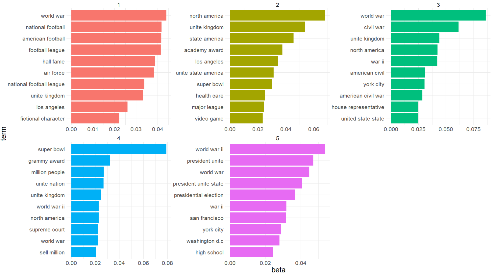

```{r setup, include=FALSE}
options(htmltools.dir.version = FALSE)

packages <- c("captioner", "knitr", "tidyverse", "kableExtra")

for (p in packages){
  if(!require (p, character.only = T)){
    install.packages(p)
  }
  library(p, character.only = T)
}

knitr::opts_chunk$set(fig.retina = 3,                       
                      echo = TRUE,                       
                      eval = TRUE,                       
                      message = FALSE,                       
                      warning = FALSE,
                      out.width="90%")

library(captioner)

```


I have discussed the basics of text analytics and the pre-processing for text data in the previous post.


Therefore, in this post, I will explore topic modeling, i.e. one of the techniques under text analytics.


```{r, echo = FALSE}
knitr::include_graphics("image/books.jpg")

```


Photo by <a href="https://unsplash.com/@prateekkatyal?utm_source=unsplash&utm_medium=referral&utm_content=creditCopyText">Prateek Katyal</a> on <a href="https://unsplash.com/s/photos/stack-of-books?utm_source=unsplash&utm_medium=referral&utm_content=creditCopyText">Unsplash</a>


# Categorizing documents


Categorizing documents is one of the commonly used techniques in text analytics.


[@Blumenau2021] summarizes the suitable technique to categorize the documents depending on the situation.


In general, the two considerations of which methods are appropriate to be used to categorize the documents are as follows:


-  Are the categories of the documents known?


- Do we know the rules of categorizing the documents?


```{r, echo = FALSE}


```


However, the categories within the documents may not be so straightforward some of the time. For example, how granular should we split the actuarial topics within the documents? Should I split by the broader topics within the documents? How do we define the broader topic?


This is where the topic modeling technique becomes very handy.


# What is topic modeling?


Topic modeling is a statistical method for identifying words in a corpus of documents that tend to co-occur together and as a result, share some sort of semantic relationship [@Jockers2020]. 


In other words, topic modeling can also be thought of as an exercise to perform clustering on the documents based on the keywords in the documents.


# Application of topic modeling

In a report by Milliman [@Pouget2021], the authors provided a use case on how topic modeling could help in claim management. In the use case, the author mentioned that the topic modeling technique can be used to categorize the emails into different topics. This could greatly reduce the number of variables for the classification tasks.


Apart from that, the following are the other possible applications of topic modeling [@Valput2020]:


- Text summarization


- Query expansion


- Sentiment analysis


- Recommender systems


Next, we will look at how to perform topic modeling.


# Methods to perform topic modeling


[@Sarkar2016] There are three methods in extracting the topics from the text data:


- Latent Semantic Indexing (LSA)


- Latent Dirichlet Allocation (LDA)


- Non-negative Matrix Factorization (NNMF)


Over here, I will be using the second method, where it is one of the popular methods to perform topic modeling. 


# Latent Dirichlet Allocation (LDA)


After reading through a few different materials, personally, I think is below explanation is easier to understand. 


[@Bansal2016] LDA assumes documents are produced from a mixture of topics. Those topics then generate words based on their probability distribution. Given a dataset of documents, LDA backtracks and tries to figure out what topics would create those documents in the first place.


```{r, echo = FALSE}
knitr::include_graphics("image/Notation of Topic Modeling.png")

```


This method is quite similar to LSA. The main difference between LSA and LDA is that LDA assumes that the distribution of topics in a document and the distribution of words in topics are Dirichlet distributions [@Pascuall2019].


## What is Dirichlet distribution?


The Dirichlet distribution Dir(α) is a family of continuous multivariate probability distributions parameterized by a vector α of positive reals [@Liu2019]. It is a multivariate generalization of the Beta distribution. Dirichlet distributions are commonly used as prior distributions in Bayesian statistics.


The author also provided the explanation of using Dirichlet distribution used as a prior distribution in Bayesian statistics, i.e. this distribution is the conjugate before the categorical distribution and multinomial distribution, and making it the prior would simplify the maths.


# R package


Just to recap how the different R packages work together with `tidytext` package [@Silge2021]:


```{r, echo = FALSE, out.width = "100%"}
knitr::include_graphics("image/textanalytics_with_r.png")

```

*Screenshot from Chapter 6 of Text Mining with R book*


I will be using `topicmodels` package and `tidytext` package to perform topic modeling.


# Demonstration

In this demonstration, I will be using the same dataset as the previous post. This is the link to download the [dataset](https://www.microsoft.com/en-us/download/details.aspx?id=52419).


The data consists of a publicly available set of question and sentence pairs from an open domain question.


```{r, echo = FALSE, out.width = "100%"}
knitr::include_graphics("image/question mark.jpg")

```

Photo by Olya Kobruseva from Pexels


## Setup the environment

First, I will set up the environment by calling all the packages I need for the analysis later.


```{r}
packages <- c('tidyverse', 'readr', 'skimr', 'tidytext', 'quanteda', 
              'ggwordcloud', 'lexicon', 'topicmodels')

for(p in packages){
  if(!require (p, character.only = T)){
    install.packages(p)
  }
  library(p, character.only = T)
}

```


I will also be using the pre-processing steps as [previous post](https://jasperlok.netlify.app/posts/2021-12-02-text-analytics/). I will be also using the output from lemmatization to perform topic modeling. 


Hence, I will skip the pre-processing steps in this post so that this post is not too lengthy.


```{r, include = FALSE}
df <- read_tsv("C:/Users/Jasper Lok/Documents/2_Data Science/my-blog/_posts/2021-12-02-text-analytics/data/WikiQA.tsv",
               quote = "\t")

```

```{r, include = FALSE}
text_df <- tokens(df$Sentence, 
                  remove_punct = TRUE,
                  remove_numbers = TRUE,
                  remove_symbols = TRUE,
                  remove_separators = TRUE,
                  split_hyphens = FALSE)

```

```{r,include = FALSE}
text_df <- text_df %>%
  tokens_tolower()

```

```{r, include = FALSE}
text_df <- text_df %>%
  tokens_remove(stopwords(language = "en", source = "smart"), padding = FALSE)

```

```{r, include = FALSE}
text_df <- text_df %>%
  tokens_replace(pattern = c("\\d\\w*"), replacement = c(""), valuetype = "regex")

```

```{r, include = FALSE}
text_df <- text_df %>%
  tokens_replace(pattern = c("\\-"), replacement = c(""), valuetype = "regex")

```

```{r, include = FALSE}
text_df <- text_df %>%
  tokens_replace(pattern = c("united st", "u.s"), 
                 replacement = c("united state", "united state"), 
                 valuetype = "fixed") %>%
  tokens()

```

```{r, include = FALSE}
text_df_lemma <- text_df %>%
  tokens_replace(pattern = lexicon::hash_lemmas$token, 
                 replacement = lexicon::hash_lemmas$lemma)

```


## Document-feature matrix

To perform topic modeling, first, we will need to convert the token into the document-feature matrix (dfm).


According to the `quanteda` [documentation page](https://cran.r-project.org/web/packages/quanteda/vignettes/quickstart.html#:~:text=%E2%80%9Cdfm%E2%80%9D%20is%20short%20for%20document,to%20each%20unit%20as%20columns.), `dfm` refers to documents in rows and "features" as columns, where we can understand the tokens as the "features" in this context.


```{r}
text_df_lemma_1 <- text_df_lemma %>%
  dfm()

```


I will also trim away the terms that appear 10 times or less across the document since it is unlikely the terms will carry much meaning to the analysis.


```{r}
text_df_lemma_1 <- text_df_lemma_1  %>%
  dfm_trim(min_termfreq = 10)

```


Then, `topfeatures` function is used to extract the top 20 features from the dfm object.

```{r}
topfeatures(text_df_lemma_1, 20)

```


### Word Cloud

Next, I will illustrate the result in word cloud format so that it's easier to visualize how frequently the words appear in the documents relative to one another.


To do so, first I will convert the dfm object to a tidy object by using `tidy` function.


```{r}
text_df_lemma_1_tidy <- tidy(text_df_lemma_1)

```


Next, I will perform `group_by` to sum up the total count of the different words in the documents.


```{r}
text_df_lemma_1_tidy_count <- text_df_lemma_1_tidy %>%
  group_by(term) %>%
  summarise(tot_count = sum(count))

```


Once that is done, I will use `ggplot` function to visualize the word cloud.


```{r}
text_df_lemma_1_tidy_count %>%
  filter(tot_count >= 500) %>%
  ggplot(aes(label = term, size = tot_count, color = tot_count)) +
  geom_text_wordcloud_area(shape  = "square") +
  scale_size_area(max_size = 500) +
  theme_minimal()

```

From the graph, it seems like some unigram tokens may not carry much meaning. The algorithm has treated each word as a token by itself. However, sometimes we need multiple words to convey the message.


For example, if we refer to the graph, we will note "unite", where "unite" could mean a lot of things. If we were to refer to the raw data, we will realize that "unite" is from the "united states".


## N-gram

To overcome this, instead of performing a uni-gram, I will specify 2:3 in the function so that both bi-gram and tri-gram will be generated. 


```{r}
text_df_lemma_3 <- text_df_lemma %>%
  tokens_ngrams(n = 2:3, concatenator = " ") %>%
  dfm()

```


`topfeatures` function is being used to extract the top features from the term frequency.


```{r}
topfeatures(text_df_lemma_3, 20)

```

Note that the term "unite state" appears much more frequent than the rest of the words. After some trial and error, it seems like the topic modeling result seems to be more satisfying after I drop the word "unite state".


Hence in the `dfm_trim` function, I have specified I would like to drop the term that has more than 1000 counts.


I will be dropping terms with a count of 30 or less, otherwise, the dfm will be too huge.


```{r}
text_df_lemma_3 <- text_df_lemma_3 %>%
  dfm_trim(min_termfreq = 30,
           max_termfreq = 1000, 
           termfreq_type = "count")

```


`dfm_trim` function also supports other trimming methods, eg. drop by proportion, rank and, quantile. Refer to this [documentation page](https://quanteda.io/reference/dfm_trim.html) for the different trimming methods.


### Word Cloud

Next, I will convert the dfm object into a tidy object so that I could use `ggplot` function to visualize the word cloud.


```{r}
text_df_lemma_3_tidy <- tidy(text_df_lemma_3)

text_df_lemma_3_tidy_count <- text_df_lemma_3_tidy %>%
  group_by(term) %>%
  summarise(tot_count = sum(count))

text_df_lemma_3_tidy_count %>%
  filter(tot_count >= 45) %>%
  ggplot(aes(label = term, size = tot_count, color = tot_count)) +
  geom_text_wordcloud_area(shape  = "square") +
  scale_size_area(max_size = 14) +
  theme_minimal()

```
 

## LDA

Once that is done, I will pass the dfm object into `LDA` function. I have specified that I would like to have 5 topics in the result. Also, I will stick with the default fitting method, which is "VEM".


Before that, I will perform a check to ensure there is no presence of all 0 rows within the dfm object. Otherwise, the algorithm would not work.

```{r}
rowTotals <- apply(text_df_lemma_3, 1, sum)

text_df_lemma_3_new <- text_df_lemma_3[rowTotals > 0, ]

```


Once the check is done, I will pass the updated dfm object into the `LDA` function.


```{r}
df_lda_lemma_3 <- LDA(text_df_lemma_3_new, 
              k = 5, 
              control = list(seed = 0,
                             nstart = 1))

```


If we were to call the LDA object, you could see that we have fitted a LDA model with VEM fitting method. There are 5 topics within the fitted model.


```{r}
df_lda_lemma_3

```

To visualize the result, I will use `tidy` function to convert the object into tidy data format so that `ggplot` function can be used.


This is where we can use the `tidy` function within `tidytext` package to help us to convert the dfm object into a tidy object. Note that I have not passed in another argument, so the default matrix would be "beta" as shown in the result below.


```{r}
df_lda_lemma_3_tidy <- tidy(df_lda_lemma_3)

df_lda_lemma_3_tidy

```


Recall beta is the parameter for per-topic word distribution. The way we could understand the beta is the probability of being generated from a necessary topic.


Once the results are being converted into tidy data format, I will find the top 10 terms under each topic. I will also sort the term based on their beta values in descending order.


```{r}
df_lda_lemma_3_tidy_terms <- df_lda_lemma_3_tidy %>%
  group_by(topic) %>%
  slice_max(beta, n = 10) %>% 
  ungroup() %>%
  arrange(topic, -beta)

```


Then, I will pass the result to `ggplot` function to visualize the result in the word cloud.


```{r, eval = FALSE}
df_lda_lemma_3_tidy_terms %>%
  mutate(term = reorder_within(term, beta, topic)) %>%
  ggplot(aes(beta, term, fill = factor(topic))) +
  geom_col(show.legend = FALSE) +
  facet_wrap(~topic, scales = "free") +
  scale_y_reordered() +
  theme_minimal() +
  theme(text = element_text(size = 20))


```

```{r, echo = FALSE, out.width = "120%"}
# As the topics are being randomized, hence screen shot the results


```


From the result, below are some of the interesting insights:


- Topic 1 has some words that are related to football


- There are few words related to countries or areas within topic 2, eg. united states, united kingdom and, so on


- Topic 4 seems to be related to the super bowl


- Topic 3 & 5 seems to be related to war since there are a few words related to wars


- Although both topic 3 & 5 seem to be related to wars, topic 3 seems to be related to civil war and topic 5 relates to world war


# Conclusion

That's all for the day!


Thanks for reading the post until the end. 


Feel free to contact me through [email](mailto:jasper.jh.lok@gmail.com) or [LinkedIn](https://www.linkedin.com/in/jasper-l-13426232/) if you have any suggestions on future topics to share.


Till next time, happy learning!


```{r, echo = FALSE}


```


Photo by <a href="https://unsplash.com/@all_who_wander?utm_source=unsplash&utm_medium=referral&utm_content=creditCopyText">Kinga Cichewicz</a> on <a href="https://unsplash.com/s/photos/read-book?utm_source=unsplash&utm_medium=referral&utm_content=creditCopyText">Unsplash</a>
  


