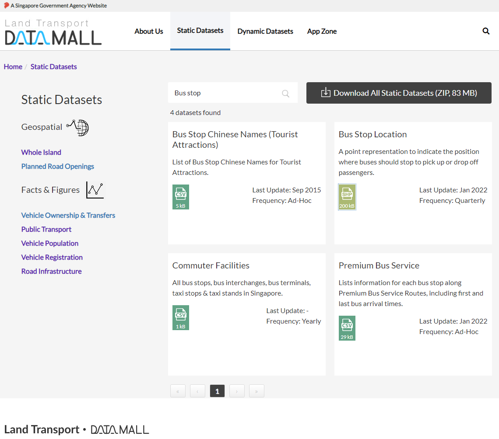
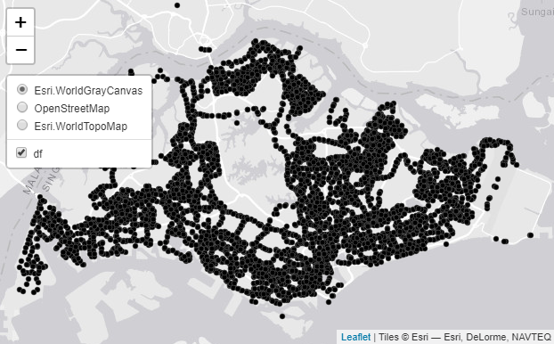
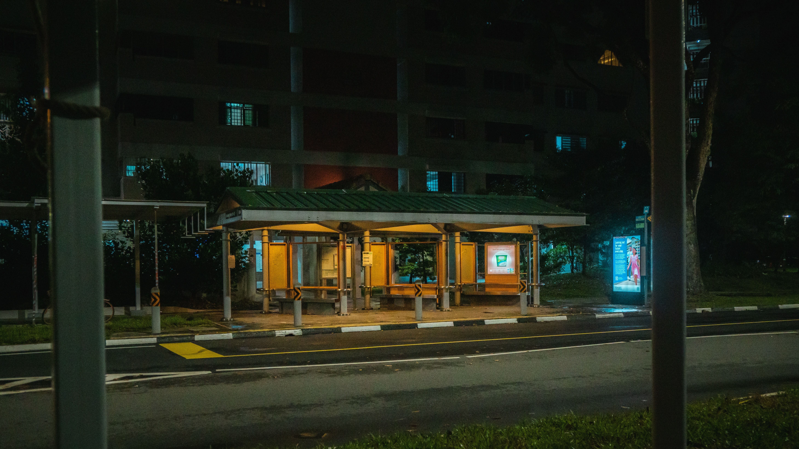

```{r setup, include=FALSE}
options(htmltools.dir.version = FALSE)

packages <- c("captioner", "knitr", "tidyverse", "kableExtra")

for (p in packages){
  if(!require (p, character.only = T)){
    install.packages(p)
  }
  library(p, character.only = T)
}

knitr::opts_chunk$set(fig.retina = 3,                       
                      echo = TRUE,                       
                      eval = TRUE,                       
                      message = FALSE,                       
                      warning = FALSE,
                      out.width="100%")

library(captioner)

```


In this sharing, I will be exploring point pattern analysis.


This is one of the spatial topics I didn't manage to find out more about when I was pursuing my master degree.


```{r, echo = FALSE}


```


Photo by <a href="https://unsplash.com/@timowielink?utm_source=unsplash&utm_medium=referral&utm_content=creditCopyText">Timo Wielink</a> on <a href="https://unsplash.com/s/photos/map?utm_source=unsplash&utm_medium=referral&utm_content=creditCopyText">Unsplash</a>
  

Before jumping right into the technique, let's take a look what is spatial analysis.


# Spatial Analysis

Spatial analysis is a type of geographical analysis which seeks to explain patterns of human behavior and its spatial expression in terms of mathematics and geometry, that is, locational analysis [@Dartmouth].


# Point Pattern Analysis


Point pattern analysis is one of the fundamental concepts for spatial analysis.


Spatial Point Pattern Analysis is the evaluation of the pattern, or distribution, of a set of points on a surface [@Kam].


In other words, this technique studies how the items are distributed within the study area.


# Applications of Point Pattern Analysis


Point pattern analysis can be used in many areas, including [@Bivand2013]:

- Ecology (eg. How are the different trees distributed? Are there are any competitions between the trees?)


- Epidemiology (eg. Is the disease clustered within the area?)


Of course, similar could be applied in the insurance context as well. 


For example, one could study whether there are any underlying geographical patterns within the location on where claims occur. 


# Complete Spatial Randomness


Complete spatial randomness (CSR) studies whether the events are distributed independently at random and uniformly over the study area [@Bivand2013].


## Types of distributions


In general, we can classify the distributions into three types [@NationalConservation]:


```{r, echo = FALSE}
distribution_df <- tibble('Types of Distributions' = c("Random",
                                           "Uniform",
                                           "Clustered"), 
                              Descriptions = c("Any point is equally likely to occur at any location and the position of any point is not affected by the position of any other point",
                                               "Every point is as far from all of its neighbors as possible",
                                               "Many points are concentrated close together, and large areas that contain very few, if any, points"))

distribution_df %>%
  kbl() %>%
  kable_paper("hover", full_width = F, html_font = "Cambria", font_size = 15)

```


Usually, clustered pattern happens when there is an attraction between the points, whilst the regular patterns occur when there is inhibition among the points [@Bivand2013].


# G function

There are other statistical tests (eg. F function, K function, L function, etc) that could help us to test whether the objects are randomly distributed.


To keep the post short and sweet, I will only explore the G function in this post.


G function measures the distribution of the distances from an arbitrary event to its nearest event [@Bivand2013]. 


G function is defined as following:


$\hat{G}(r) = \frac {\# \{ d_i : d_i\le r, \forall i \}}{n}$


where:

- the numerator is the number of elements in the set of distances that are lower than or equal to d 

- d is $min_j \{ d_{ij}^{*}, \forall j \ne i \}$

- n is the total number of points


# Demonstration

Before jumping straight into the geospatial technique, let's understand the common data files (i.e. shapefiles) used for the geospatial purposes.


# What is a shapefile?


A shapefile is a simple, nontopological format for storing the geometric location and attribute information of geographic features [@Shapefiles].


Usually the shapefiles will contain at least .shp, .shx, .dbf, and .prj [@ShapefilesOnline].


Instead of our usual import function (eg. `read_csv`, `read_excel` etc), we will use the function that is specially designed to handle shapefiles.

## Data Source

I will be using Singapore Bus Stop Location dataset for this demonstration.


```{r, echo = FALSE}


```


Photo by <a href="https://unsplash.com/@huchenme?utm_source=unsplash&utm_medium=referral&utm_content=creditCopyText">Hu Chen</a> on <a href="https://unsplash.com/s/photos/singapore?utm_source=unsplash&utm_medium=referral&utm_content=creditCopyText">Unsplash</a>


The dataset can be downloaded from [LIA Data Mall](https://datamall.lta.gov.sg/content/datamall/en.html).


To download the data files, below are the steps to download the data from the Data Mall:

- Go to the 'Static Datasets' section

- Then, choose 'Road Infrastructure'

- Filter the search by entering 'Bus Stop Location' in the search bar


```{r, echo = FALSE}


```


I will also download the Singapore planning zone map from [Data.gov.sg](https://data.gov.sg/dataset/master-plan-2014-subzone-boundary-web).


## Setup the environment

Okay, let's set up the environment for the demonstration later.


```{r}
packages = c('sf', 'maptools', 'spatstat', 'tmap')

for (p in packages){
  if(!require(p, character.only = T)){
    install.packages(p)
    }
  library(p,character.only = T)
}

```


These are the documentation pages for [sf](https://r-spatial.github.io/sf/index.html), [tmap](https://r-tmap.github.io/tmap/), [maptools](http://maptools.r-forge.r-project.org/index.html), and [spatstat](http://spatstat.org/).


## Import the Data

First, I will import the data into the environment. 


As the file is a shapefile, I will use `st_read` function to read in the shapefiles.


```{r}
df <- st_read(dsn = "data/BusStopLocation", layer = "BusStop")

```

Over here, I have indicated the folder name under `dsn` argument and file names under `layer` argument.


I will also import the planning zone info into the environment for later purposes.


```{r}
mpsz <- st_read(dsn = "data/SG Map", layer = "MP14_SUBZONE_WEB_PL")

```

One common check before the analysis is to ensure all the data is using the same projection system.


To check this, we can use `st_crs` function to extract the information of the geospatial data.


```{r}
st_crs(df)

```

The geodetic CRS from this geospatial data is SVY21 and ellipsoid is WGS 84. 


Similarly, I will check the information of the mpsz spatial objects to ensure they are projecting on the same projection system as the spatial objects of the bus stop.


```{r}
st_crs(mpsz)

```


## Plotting the Map


I use `tmap` package as this package allows us in creating interactive maps.


To use `tmap`, we will start with `tmap_mode` function. Since I want to plot an interactive graph, I will choose 'view' option.


Then I will indicate the shape object in the `tmap_shape` function. After that, we will need to indicate how we would like the plotting function to draw the symbols.


```{r}
tmap_mode('view')
tm_shape(df) + 
  tm_dots()

```


One cool thing about this package is that the API of this package is based on the grammar of graphics. Hence, the syntax is pretty similar to `ggplot` package.


Another fantastic part of this package is it also allows us to choose leaftlet layer to change the maps. 


To do so, we can hover over the "stacking" button below the "minus" button in the graph. The list will pop up as shown below.

```{r, echo = FALSE}


```


Alternatively, we can indicate the interested layer through `tm_basemap` function as shown below. This will provide users with an alternative method to choose from a wider range of layers.


```{r}
tmap_mode('view')
tm_basemap("Esri.DeLorme") +
tm_shape(df) + 
  tm_dots()

```

You can find other different layers in the following [link](https://leaflet-extras.github.io/leaflet-providers/preview/).


From the map, there are 5 bus stops outside of Singapore! These are valid points since there are buses going back and forth to Johor Bahru every day.


## Statistical Test on all the bus stops in the entire Singapore


Next, we will attempt to find out whether the bus stops are randomly distributed by running a hypothesis test.


$H_{0}:$ The bus stops in Singapore is randomly distributed

$H_{\alpha}:$ The bus stops in Singapore is not randomly distributed


To run the Monte Carlo test, we will first need to convert the spatial object into a point pattern object.


The simulation function, `envelope` function can only accept point pattern or a fitted point process model as stated in the [documentation page](https://www.rdocumentation.org/packages/spatstat/versions/1.64-1/topics/envelope).


First, I will convert the simple feature data frame into spatial points by using `as_Spatial` function.


```{r}
busstop_sp <- as_Spatial(df)

```


Then, I will convert the spatial points to spatial points in `spastat` package. This is to allow us to perform the necessary test later.


`maptools` package will provide some functions to convert between `ppp` objects representing two-dimensional points patterns between `spatstat` package and `SpatialPoints` classes


```{r}
busstop_ppp <- as(busstop_sp, "ppp")

```


Once the conversion is done, we can pass the spatial object into `envelope` function.


`envelope` function will randomly simulate many point patterns so that summary function is computed for all of them [@Bivand2013].


```{r, message = FALSE}
G_sg_csr <- envelope(busstop_ppp, 
                     Gest, 
                     nsim = 1000)

```


I will also indicate the nsim should be 1,000, so that the function will simulate over 1,000 times.


Following is how to interpret the graph:

- If the line for observations (i.e. the solid line) is outside and above the grey region, this indicates that the points are exhibiting a clustered pattern


- If the line is outside and below the grey region, this indicates the points are exhibiting a regular pattern (i.e. the reverse of clustered pattern)


- If the line falls within the grey region, there is statistical evidence that the points are randomly distributed


```{r}
plot(G_sg_csr)

```


As shown above, we can see the solid line lies above the grey area. Hence we reject the null hypothesis and conclude that the bus points exhibits clustered pattern.


## Statistical Test on all the bus stops in the selected area


Instead of performing a statistical test for the entire area, we could segment out the area we are interested in and perform the necessary statistical test.


First, I will list out the planning areas within the Singapore map.


```{r}
sort(unique(mpsz$PLN_AREA_N))

```


Next, I will segment out the area of interest. In this example, I will segment "DOWNTOWN CORE" out from the planning zone as shown following.


```{r}
downtown <- mpsz %>%
  filter(PLN_AREA_N == "DOWNTOWN CORE")

```


Similarly, we can pass the spatial object to tmap function to see the selected area on the map.


```{r}
tmap_mode("view")
tm_shape(downtown) +
  tm_polygons()

```


We will then convert the spatial object into spatial polygons as shown below.


Next, we need to convert the object into an owin object.

Owin is defined as the "observation window" of a point pattern [@RDocumentation].


```{r}
downtown_owin <- as(as_Spatial(downtown), "owin")

```


If we call the owin object, it will tell us the polygon boundary of the selected area.


```{r}
downtown_owin

```


Once that is done, we could "cut" the observation location as shown below.


```{r}
busstop_ppp_downtown <- busstop_ppp[downtown_owin]

```


Finally, we will pass the point pattern object into the G function to perform the necessary statistical test.


Below is the hypothesis test:

$H_{0}:$ The bus stops in Downtown core is randomly distributed

$H_{\alpha}:$ The bus stops in Downtown core is not randomly distributed


```{r}
G_downtown_csr <- envelope(busstop_ppp_downtown, 
                     Gest, 
                     correction = "best",
                     nsim = 1000)

```


Lastly, I will plot out the simulated result. 

```{r}
plot(G_downtown_csr)

```


Interesting!


The result is showing us a different outcome when we zoom into one of the planning areas. 


The bus stops in the selected area are neither clustered nor equally distributed.


This makes sense since it's very unlikely the location of bus stops are concentrated in one area or have equal distance away from each other.


However, when we look at the bus stop locations for the entire Singapore, the majority of the bus stops will be located at the residency areas or where there are more activities.


# Conclusion

That's all for the day!


Thanks for reading the post until the end. 


Feel free to contact me through [email](mailto:jasper.jh.lok@gmail.com) or [LinkedIn](https://www.linkedin.com/in/jasper-l-13426232/) if you have any suggestions on future topics to share.

Refer to this link for the [blog disclaimer](https://jasperlok.netlify.app/blog_disclaimer.html).
 
Till next time, happy learning!


```{r, echo = FALSE}


```


Photo by <a href="https://unsplash.com/@shawnanggg?utm_source=unsplash&utm_medium=referral&utm_content=creditCopyText">shawnanggg</a> on <a href="https://unsplash.com/s/photos/bus-stop-singapore?utm_source=unsplash&utm_medium=referral&utm_content=creditCopyText">Unsplash</a>


