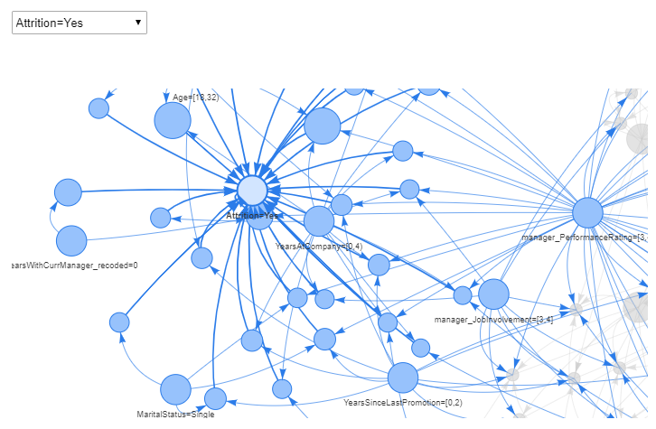

```{r setup, include=FALSE}
options(htmltools.dir.version = FALSE)

packages <- c("captioner", "knitr", "kableExtra")

for (p in packages){
  if(!require (p, character.only = T)){
    install.packages(p)
  }
  library(p, character.only = T)
}

knitr::opts_chunk$set(fig.retina = 3,                       
                      echo = TRUE,                       
                      eval = TRUE,                       
                      message = FALSE,                       
                      warning = FALSE,
                      out.width="100%")

library(captioner)

```


Recently while surfing the net, I happened to come across this employee attrition dataset from Kaggle. 


This has sparked my interest in understanding how we could perform rule mining to mine hidden relationships.


```{r, echo = FALSE}
knitr::include_graphics("image/rules.jpg")

```

Photo by Joshua Miranda from Pexels


# Market Basket Analysis

In my [previous post](https://jasperlok.netlify.app/posts/2021-10-17-clustering/) on clustering, I have briefly touched on the definition of association.


Market basket analysis is used in discovering how the different "items" in the dataset are related the one another.

This is commonly used in the retail sector to help companies to identify upsell and cross-sell opportunities.


For example, the common example used in illustrating this technique is how the sales of beer and the sales of diapers are correlated in the supermarket [@Swoyer2016]. This has sparked the discussion on why the sales of these two different products are correlated.


# Application for Market Basket Analysis in Insurance

Meanwhile, this technique can also be used in the insurance context as well.


For instance, we could apply this technique in detecting the common characteristics of high churners. It also can be used to understand the profiles of customers with the high claim amounts.


Apart from that, this would allow the insures to formulate different customer strategies to target different customer segments.


For example, insurers could think of ways to win back their profitable customers that have recently churned their policies or even strategies to reduce the churn rate for their profitable segments.


Similar to clustering, it is always good to think about how we will be using the results from the rule mining.


Before jumping into the analysis, let's take a look at the definition of some of the key metrics under market basket analysis.


## Support


Support refers to the fraction of transactions that contain both items A and B. 


Support tells us about the frequency of an item or a combination of items bought [@Ahamed2021].

$Support = \frac{freq(A, B)}{N}$


## Confidence

Confidence tells us how frequently items A and B are bought together [@Ahamed2021].

$Confidence = \frac{freq(A, B)}{freq(A)}$


In other words, confidence looks at the conditional probability of B being bought given that A is bought as well.


## Lift

Lift measures the strength of association rules over the random occurrence of A and B [@Ahamed2021].

$Lift = \frac{Support(A,B)}{Support(A)*Support(B)}$


In other words, lift measures the strength of the "rules". The higher the lift, the stronger the association rules.


Nevertheless, let's start with the demonstration of market basket analysis!


# Demonstration

In this demonstration, I will be using a [Kaggle dataset](https://www.kaggle.com/vjchoudhary7/hr-analytics-case-study) on the employee resignation dataset.


```{r, echo = FALSE}


```

Photo by Anna Shvets from Pexels


I will be using the following datasets to perform association rule mining:

- *General data*: the main dataset which contains the info on the employees, including whether the employees have resigned from the company


- *Employee survey data*


- *Manager survey data*


## Setup the environment

First, I will call the relevant packages for the analysis later.

```{r}
packages = c('tidyverse', 'arules', 'arulesViz', 'igraph', 'visNetwork')

for (p in packages){
  if(!require(p, character.only = T)){
    install.packages(p)
    }
  library(p,character.only = T)
}

```


I will be following R packages for the following purposes:

- [`arules`](https://cran.r-project.org/web/packages/arules/arules.pdf) package: Mine association rules in the data

- [`arulesViz`](https://cran.r-project.org/web/packages/arulesViz/arulesViz.pdf) package: Visualizing the aossication rules

- [`igraph`](https://igraph.org/r/pdf/latest/igraph.pdf) package: Visualize the network

- [`visNetwork`](http://datastorm-open.github.io/visNetwork/) package: Allow interactivity when visualizing the network 


## Import the data

Next, I will import the data into the environment.


```{r}
df_main <- read_csv("data/general_data.csv") %>%
  select(-c(EmployeeCount,
            Over18,
            StandardHours))

```

As EmployeeCount, Over18, and StandardHours only contain one single value, I will remove these variables before mining the rules.


As we are not told whether the employee ID shown in the survey belongs to the employees or managers, hence I will the employee ID shown in both survey data belong to the employees.


```{r}
df_employee <- read_csv("data/employee_survey_data.csv") %>%
  rename_with(~paste0("employee_", .x)) %>%
  rename("EmployeeID" = "employee_EmployeeID")

df_manager <- read_csv("data/manager_survey_data.csv") %>%
  rename_with(~paste0("manager_", .x)) %>%
  rename("EmployeeID" = "manager_EmployeeID")

```


Next, I will join the different datasets together through `left_join` junction.

```{r}
df <- df_main %>%
  left_join(df_employee, by = "EmployeeID") %>%
  left_join(df_manager, by = "EmployeeID") 

```


I will also group some categories with relatively low counts under YearsWithCurrManager and TotalWorkingYears as separate categories.


```{r}
df_1 <- df %>%
  mutate(YearsWithCurrManager_recoded = case_when(YearsWithCurrManager > 7 ~ "7+",
                                                  TRUE ~ as.character(YearsWithCurrManager)),
         TotalWorkingYears_recoded = case_when(TotalWorkingYears > 15 ~ "15+",
                                               TRUE ~ as.character(TotalWorkingYears))) %>%
  select(-c(YearsWithCurrManager,
            TotalWorkingYears))

```


```{r, echo = FALSE, include = FALSE}
rm(df_main)
rm(df_employee)
rm(df_manager)

```


## Find the association rules

Once the data is processed, we will proceed to mine the association rules within the dataset.


Over here, I will be using `apriori` function to perform the task.


```{r}
rules <- apriori(df_1,
                 parameter = list(supp = 0.055,
                                  confidence = 0.1,
                                  target = "rules"),
                 appearance = list(default = "lhs",
                                   rhs=c("Attrition=Yes","Attrition=No")),
                 control = list(verbose = F))

```


In the parameters, I have indicated the following:

- Min `support` should be 0.055

- Min `confidence` should be 0.1

- I would mine the rules from the data by indicating the target as `rules`


As I am also interested in how the different attributes of the employees affect their attrition, I will perform what is known as 'target rules mining' by specifying the rules I am interested in. 


Also, in general, we are interested in the rules that have the relatively stronger association. With that, I will filter out the rules with lift below a specified amount.


```{r}
rules_sub <- subset(rules, lift > 1.16)

```


Then I will sort the rules in a descending manner.

```{r}
rules_sub <- sort(rules_sub, by = "lift", decreasing = TRUE)

```


`arulesViz` package contains `inspectDT` function that allows the users to illustrate the rules in interactive data manner.


```{r}
inspectDT(rules_sub)

```


## Visualisation

To make it easier to understand the rules, we could plot out the rules in graphic format.


### Static Graph

`plot` function from `arulesViz` package could be used to illustrate the rules.


According to the [documentation page](https://cran.r-project.org/web/packages/arulesViz/arulesViz.pdf), the `plot` function supports different plotting engines, including `ggplot`, `base` and so on.


If we don't indicate the engine, the default plotting engine will be `ggplot`.

```{r}
static_graph_ggplot <- plot(rules_sub, 
                                method = "graph")

static_graph_ggplot

```


Over here, I will plot the rules by using `igraph` engine. This would allow us to visualize the rules in a static plot.


```{r}
static_graph_igraph <- plot(rules_sub, 
                                method = "graph", 
                                engine = "igraph")

```


### Interactive Graph

One issue with the static graph is that graph becomes very cluttered when there are too many rules.


To resolve this, we could either reduce the number of rules to be illustrated or plot an interactive graph that allows us to zoom, highlight or filter the graphs.


To plot the interactive graph, we could either use the `plot` function from `arulesViz` package or `visNetwork` function from `visNetwork` package.


#### Method 1: Use `plot` function

```{r}
static_graph_visNetwork <- plot(rules_sub, 
                                method = "graph", 
                                engine = "visNetwork",
                                control = list(degree_highlight = 2))

static_graph_visNetwork

```


#### Method 2: Use `visNetwork` function

The interesting thing about `visNetwork` is that it allows us to pass additional arguments to further define the nodes and edges (eg. the value of the mode, the color of the edge etc).


To do so, I will convert the static igraph object into a list by using `as_data_frame` function from `igraph` package as shown below.

```{r}
int_graph <- as_data_frame(static_graph_igraph, 
                           what = "both")

```

I have also specified 'both' under the what argument so that the object would contain both edges and vertices.


```{r}
class(int_graph)

```


Once that is done, we can pull the necessary info from the list and form a data frame by using `data.frame` function as shown below.


```{r}
nodes <- data.frame(id = int_graph$vertices$name,
                    value = int_graph$vertices$lift,
                    color.background = int_graph$vertices$support,
                    int_graph$vertices)

edges <- data.frame(int_graph$edges)

```


Then, the created data frame can be passed into `visNetwork` function.


```{r}
visNetwork(nodes, edges) %>%
  visEdges(arrows ="to") %>%
  visNodes(color = list(background = int_graph$vertices$support)) %>%
  visOptions(highlightNearest = list(enabled = TRUE, 
                                     degree = 2), 
             nodesIdSelection = TRUE)

```


The cool thing about such graphs is we could interact with the graph, which is something we couldn't do on the static graph.


If we were to highlight the nodes associated with attrition = yes, below are the characteristics of employees with relatively higher attrition:


- They tend to be younger, i.e. within the age of 18 - 32


- The year of service in the company tend to be shorter as well, i.e. within 0 - 4 years in the company


    - As a result, the years under their current manager and the year since the last promotion tends to be the shortest among all


- Strangely enough, this group of employees also have a rather good performance rating from their manager since their performance rating is between 3 and 4


    - According to the data dictionary, the performance ratings of 3 and 4 refer to excellent and outstanding
    

```{r, echo = FALSE, out.width = "130%"}


```


With the insights gathered, the HR staff could gather more insights on the reasons for the relatively higher attrition of the younger staff.


This would allow the company to have a more targeted approach to resolve the issues faced by different segments of employees, improving the overall workplace staff retention.


# Conclusion

That's all for the day!


Thanks for reading the post until the end. 


Feel free to contact me through [email](mailto:jasper.jh.lok@gmail.com) or [LinkedIn](https://www.linkedin.com/in/jasper-l-13426232/) if you have any suggestions on future topics to share.


Till next time, happy learning!


```{r, echo = FALSE}
knitr::include_graphics("image/teamwork.jpg")

```


Photo by <a href="https://unsplash.com/@krakenimages?utm_source=unsplash&utm_medium=referral&utm_content=creditCopyText">krakenimages</a> on <a href="https://unsplash.com/s/photos/happy-staff?utm_source=unsplash&utm_medium=referral&utm_content=creditCopyText">Unsplash</a>
  


