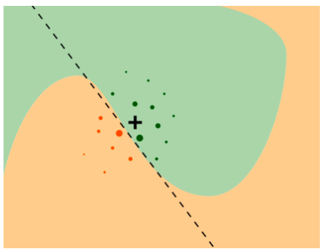

```{r setup, include=FALSE}
options(htmltools.dir.version = FALSE)

packages <- c("captioner", "knitr", "kableExtra")

for (p in packages){
  if(!require (p, character.only = T)){
    install.packages(p)
  }
  library(p, character.only = T)
}

knitr::opts_chunk$set(fig.retina = 3,                       
                      echo = TRUE,                       
                      eval = TRUE,                       
                      message = FALSE,                       
                      warning = FALSE,
                      out.width="100%")

library(captioner)

```

In this post, I will be exploring local interpretable model-agnostic explanations (LIME), i.e. one of the model explainability methods.


```{r, echo = FALSE}


```

Photo by <a href="https://unsplash.com/@vinomamba24?utm_source=unsplash&utm_medium=referral&utm_content=creditCopyText">Vino Li</a> on <a href="https://unsplash.com/s/photos/lime?utm_source=unsplash&utm_medium=referral&utm_content=creditCopyText">Unsplash</a>

This technique was first introduced back in 2016. The title of the paper is rather interesting, i.e. "Why should I trust you?" Explaining the predictions of any classifier.

You may refer to the paper under this [link](https://arxiv.org/pdf/1602.04938.pdf).

# LIME

One interesting point highlighted by the authors of LIME paper was "if the users do not trust a model or a prediction, they will not use it." [@Ribeiro2016].

Based on my practical experience, this is so true.

Most of the time the model metrics (eg. confusion matrix, accuracy, etc) alone are not sufficient to give comfort to the users, especially the non-technical users, comfort that they could trust the model results.

Below are some of the questions I have encountered so far:

-   How do I know the model predictions are reasonable?

-   Am I able to explain the model reach the predicted outcome to my stakeholders?

    -   If yes, how could I explain the results in a layman's manner?

If the models cannot be explained, it would be seen as a black box.

The authors of the LIME paper also outlined 4 criteria for explanations that must be satisfied [@purva2021]:

-   The explanations for the predictions should be understandable, i.e. interpretable by the target demographic.

-   We should be able to explain individual predictions. The authors call this local fidelity

-   The method of explanation should apply to all models. This is termed by the authors as the explanation being model-agnostic

-   Along with the individual predictions, the model should be explainable in its entirety, i.e. global perspective should be considered

But fear not! There is research in helping data scientists in explaining the model results.

In this post, I will be exploring LIME, i.e. one of the common methods used in explaining the model results.

```{r, echo = FALSE}


```

Photo by Govinda Valbuena from Pexels

Don't worry, you won't feel any sourness while using the method in explaining the predictions!

## What is LIME?

LIME is a local surrogate model that is used to explain the individual predictions of the black-box machine learning models [@Molnar2022].

One key assumption made in LIME method is that at the local scale, the model can be approximated by a simple linear model [@Molnar2022].

Below is the graph shown:

```{r, echo = FALSE}


```

In the graph, the black dotted line is the simple model that attempts to explain the predicted value of the selected model point (ie. the black cross) from the complex classification model (ie. the orange and green area).

## Pros and cons

Some of the advantages of LIME method are [@Biecek2021]:

-   LIME method is model agnostic, i.e. it does not imply any assumptions about the black-box structure

-   This method also offers an interpretable representation of the complex model

-   This method provides local fidelity, i.e. the explanations are locally well-fitted to the black-box model

-   Aside from tabular data, it also works for text and picture data.

Following are some of the flaws of LIME method [@Molnar2022]:

-   At the moment, there is no correct definition of the neighborhood when using LIME with tabular data

    -   The author suggests checking whether explanations make sense when we try the different kernel setting

-   The explanations of two close points could vary significantly, which could raise concern on how much we could trust the model explainability results

# Demonstration

In this demonstration, I will be using the [employee attrition dataset](https://www.kaggle.com/vjchoudhary7/hr-analytics-case-study) from Kaggle.

Nevertheless, let's begin the demonstration!

## Setup the environment

First, I will set up the environment by calling all the packages I need for the analysis later.

```{r}
packages <- c('tidyverse', 'readr', 'tidymodels', 'DALEXtra', 'themis', 
              'lime')

for(p in packages){
  if(!require (p, character.only = T)){
    install.packages(p)
  }
  library(p, character.only = T)
}

```

For this demonstration, we will be using a R package called `DALEXtra`.

This package provides an interface to different implementations of `LIME` method. Refer to the [documentation](https://cran.r-project.org/web/packages/DALEXtra/DALEXtra.pdf) page for the list of `LIME` package this function supports.

As this package is acting as a wrapper, so I will be importing the `LIME` package into the environment as well.

## Import the data

First I will import the data into the environment.

```{r}
df <- read_csv("https://raw.githubusercontent.com/jasperlok/my-blog/master/_posts/2022-03-12-marketbasket/data/general_data.csv")


```

I will set the random seed for reproducability.

```{r}
set.seed(1234)

```


## Build a model

For simplicity, I will build a random forest and attempt to explain the predicted results by using LIME method.

### Split data

Next, I will split the data into training and testing datasets.

```{r}
df_split <- initial_split(df, 
                          prop = 0.6, 
                          strata = Attrition)

df_train <- training(df_split)
df_test <- testing(df_split)

```

### Random Forest

First I will define the recipe for the machine learning models.

```{r}
ranger_recipe <- 
  recipe(formula = Attrition ~ ., 
         data = df_train) %>%
  step_impute_mean(NumCompaniesWorked,
                   TotalWorkingYears) %>%
  step_nzv(all_predictors()) %>%
  step_dummy(all_nominal_predictors()) %>%
  step_upsample(Attrition)

```

In the recipe above, I have done the following:

-   Impute the missing values with the mean of the relevant categories

-   Remove any predictors with near-zero variance

-   Convert all the nominal predictors to dummy variables

-   As the target variable is highly imbalanced, I have used upsampling to resolve the imbalanced issue in the target variable

Next, I will define the model specs for the machine learning I will be building.

```{r}
ranger_spec <- 
  rand_forest(trees = 1000) %>% 
  set_mode("classification") %>% 
  set_engine("ranger") 

```

Next, I will build the workflow for the model building.

```{r}
ranger_workflow <- 
  workflow() %>% 
  add_recipe(ranger_recipe) %>% 
  add_model(ranger_spec) 

```

Finally, I will start fitting the model.

```{r}
ranger_fit <- ranger_workflow %>%
  fit(data = df_train)

```

## Local Interpretable Model-agnostic Explanations (LIME)

Now, we will start using LIME to explain our model predictions!

### Create explainer objects

To use `DALEXtra` package to use `LIME` method to explain predictions, we will use `explain_tidymodels` function to create the explainer object.

```{r}
ranger_explainer <- explain_tidymodels(ranger_fit,
                   data = select(df_train, -Attrition),
                   y = df_train$Attrition,
                   verbose = FALSE)

```

According to the [documentation](https://cran.r-project.org/web/packages/DALEXtra/DALEXtra.pdf), this package also supports the models

Aside from that, we need the following codes to ensure the right explainers are being used [@Lendway].

```{r}
model_type.dalex_explainer <- DALEXtra::model_type.dalex_explainer
predict_model.dalex_explainer <- DALEXtra::predict_model.dalex_explainer

```

Otherwise, the subsequent codes will not be able to run.

### Explaining predictions

In this demonstration, I will attempt to explain the top 3 predicted attrition by using `lime` method.

To do so, I will use `predict` function to generate the predictions from testing dataset. I will also indicate the probability of attrition should be generated by indicating `prob` in the `type` argument.

Then, I will slice the data points with top 3 predicted attrition by using `slice_head` function.

```{r}
top_3_obs <- predict(ranger_fit, 
        df_test, 
        type = "prob") %>%
  bind_cols(df_test) %>%
  arrange(desc(.pred_Yes)) %>%
  slice_head(n = 3)

top_3_obs

```

As it seems like the new observation must be in the same data format and cannot contain additional columns, I will drop the two prediction fields.

```{r}
top_3_obs <- top_3_obs %>%
  select(-c(.pred_No, .pred_Yes))

```

Okay, let's start to explain the predictions!

For this, I will be using `predict_surrogate` function from `DALEXtra` package.

```{r}
lime_rf_top_3 <- predict_surrogate(explainer = ranger_explainer,
                  new_observation = top_3_obs %>% 
                    select(-Attrition),
                  n_features = 8,
                  type = "lime")

```

Note that we will need to remove the target variable from the data when running the `predict_surrogate` function, otherwise the code will return an error [@Lendway].

One cool thing to note is the output from the `plot` function above is an object is a ggplot object.

This would allow us to modify the graph by using the different ggplot related functions.

For example, I would like to change the color to grey and make the bar color a bit more transparent.

To do so, I will add on `scale_fill_manual` function to the plot object as shown below to modify the ggplot graph.

```{r}
plot(lime_rf_top_3 %>% filter(case == 2)) +
  labs(title = "Before Modification")

plot(lime_rf_top_3 %>% filter(case == 2)) +
  scale_fill_manual(values = alpha(c("grey", "black"), 0.6)) +
  labs(title = "After Modification")

```

Nevertheless, let's start analyzing the results!

As the graph can be very cluttered, so I will use the for loop to plot the different observations separately.

```{r}
for (i in 1:3){
  print(
    plot(lime_rf_top_3 %>% filter(case == i))
    )
}

```

The graphs above shows us the top variables that are important in the local model.

The graph also shows on each variable is "contributing" to the prediction. The higher the positive weight, the higher effect that the variable has on the prediction.

Aside from the "explanation" breakdown of three predictions, the graph also contains the predicted output and explanation fit.

The values under explanation fit indicate how well the LIME method explains the prediction of the relevant data point [@Adyatama2019].

From the graph, we can see that the explanation fit is rather poor since the values range between 35-55%.

This implies the LIME model is only able to explain about 35-55% of our fitted model, which is not very ideal.

To resolve this, we can pass in additional arguments to tune the parameters in `lime`.

Refer to the [`lime` documentation page](https://cran.r-project.org/web/packages/lime/lime.pdf) for the list of available arguments under `lime` package.

```{r, out.width = "80%"}
lime_rf_top_3 <- predict_surrogate(explainer = ranger_explainer,
                  new_observation = top_3_obs %>% 
                    select(-Attrition),
                  n_features = 8,
                  dist_fun = "manhattan",
                  kernel_width = 2,
                  type = "lime")

for (i in 1:3){
  print(
    plot(lime_rf_top_3 %>% filter(case == i))
    )
}

```

As shown above, the values on explanation fit increase after I have changed the `dist_fun` to "manhattan" and `kernel_width` to 2.

From the graph, it seems like the staffs with higher attrition have following common characteristics:

-   Single, i.e. not yet married

-   Have been working in the company less than 3 years

Alternatively, `lime` package offers an option to plot a condensed overview of all explanations. This would help identify the common features that influence the observations.

```{r}
plot_explanations(lime_rf_top_3)

```

Similarly to the graphs earlier, we can see that the top 3 employees are all single and works in the current company for less than 3 years.


# Conclusion

That's all for the day!

This post has demonstrated how we could use `lime` package in explaining the predictions.

Thanks for reading the post until the end.

Feel free to contact me through [email](mailto:jasper.jh.lok@gmail.com) or [LinkedIn](https://www.linkedin.com/in/jasper-l-13426232/) if you have any suggestions on future topics to share.

Refer to this link for the [blog disclaimer](https://jasperlok.netlify.app/blog_disclaimer.html).

Till next time, happy learning!

```{r, echo = FALSE}
knitr::include_graphics("image/lime_water.jpg")

```

Photo by Wagner Soares from Pexels
