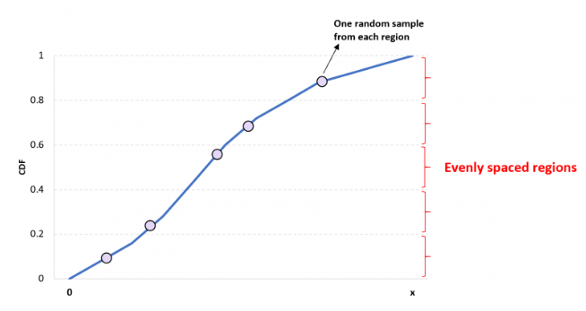

```{r setup, include=FALSE}
options(htmltools.dir.version = FALSE)

packages <- c("captioner", "knitr", "kableExtra")

for (p in packages){
  if(!require (p, character.only = T)){
    install.packages(p)
  }
  library(p, character.only = T)
}

knitr::opts_chunk$set(fig.retina = 3,                       
                      echo = TRUE,                       
                      eval = TRUE,                       
                      message = FALSE,                       
                      warning = FALSE,
                      out.width="100%")

library(captioner)

```

Recently, I was reading about hyperparameter tuning.

I found out there are other methods for creating the list of possible hyperparameter values for hyperparameter tuning.

```{r, echo = FALSE}
knitr::include_graphics("image/soundboard.jpg")

```

Photo by Denisse Leon on Unsplash

Before jumping into the discussion on hyperparameter tuning, let's look at the difference between parameters and hyperparameters.

# What is the difference between parameters and hyperparameters?

[@Brownlee2019] explained in one of his post that parameters are configuration variables that are internal to the model and the values can be estimated from the data.

On the other hand, hyperparameters are configuration that is external to the model and whose value cannot be estimated from data.

Hence, to find the set of hyperparameters that would give us the best model performance, we will perform hyperparameter tuning.

# Hyperparameters tuning

In general, the hyperparameters tuning task includes the following 4 parts [@Koehrsen2018]:

-   **Objective function:** a function that takes in hyperparameters and returns a score we are trying to minimize or maximize

-   **Domain:** the set of hyperparameter values over which we want to search

-   **Algorithm:** method for selecting the next set of hyperparameters to evaluate in the objective function

-   **Results history:** data structure containing each set of hyperparameters and the resulting score from the objective function

In this post, I will be focusing on how to create the hyperparameter domain.

# Different methods in creating grids

There are two methods for creating the hyperparameter grids for model tuning purposes, which are regular grid and non-regular grid.

## Regular grid

This is the typical approach to create the grids of tuning hyperparameters.

In this method, every combination of hyperparameters within the specified hyperparameter ranges is created for later model tuning.

Then, we will have to perform cross-validation on every set of hyperparameters defined in the grid to find the set of results that would give us the best model performance.

However, this is an extremely computationally expensive approach to searching for the best hyperparameter combinations.

## Non-regular grid

Currently, `tidymodels` package allows different methods to create non-regular grids, including:

-   Random grid

-   Latin hypercube sampling

-   Maximum entropy design

### Random grid

[@Koehrsen2018] explained that grid search spends too much time evaluating unpromising regions of the hyperparameter search space.

This is where a random grid comes in handy.

The random grid generates independent uniform random numbers across the parameter ranges [@Kuhn2022].

Also, the random grid can usually find a good combination of hyperparameters in fewer iterations.

In other words, with fewer iterations, the random grids can find "good enough" combinations of hyperparameters.

Hence, this approach is more efficient compared to grid search.

### Latin hypercube sampling

The idea of this sampling is interesting.

I felt [@Zach2020] did a great job in explaining the concept in an easier way to understand.

The author explained that the idea is divide a given CDF into n different regions and randomly choose one value from each region to obtain a sample of size n as shown below.

```{r, echo = FALSE}


```

*Latin Hypercube Sampling*

In short, this method allows us to obtain random samples that are more reflective of the underlying distribution of the dataset.

### Maximum entropy design

This approach aims to maximize the expected change in information, which maximizes the entropy of the observed responses at the point in the design [@Santner2018].

Later in this post, I will be showing the created grids under different methods.

# Demonstration

In this demonstration, I will be using the [employee attrition dataset](https://www.kaggle.com/vjchoudhary7/hr-analytics-case-study) from Kaggle.

Nevertheless, let's begin the demonstration!

## Setup the environment

First, I will set up the environment by calling all the packages I need for the analysis later.

```{r}
packages <- c('tidyverse', 'readr', 'tidymodels', 'themis', 'doParallel',
              'ggpubr')

for(p in packages){
  if(!require (p, character.only = T)){
    install.packages(p)
  }
  library(p, character.only = T)
}

```

For this demonstration, we will be using an R package called `dials` to create the list of hyperparameter combinations.

After that, we will use `tune` package in `tidymodels` to find the combinations of hyperparameters that would give us the best model performance.

## Import the data

First I will import the data into the environment.

```{r}
df <- read_csv("https://raw.githubusercontent.com/jasperlok/my-blog/master/_posts/2022-03-12-marketbasket/data/general_data.csv") %>%
  select(-c(EmployeeCount, StandardHours, EmployeeID))


```

I will set the random seed for reproducibility.

```{r}
set.seed(1234)

```

## Build a model

For simplicity, I will reuse the random forest model building code I wrote in my previous post.

You can refer to my previous [post](https://jasperlok.netlify.app/posts/2022-04-16-lime/) for the explanations of the model building.

```{r}
df_split <- initial_split(df, 
                          prop = 0.6, 
                          strata = Attrition)

df_train <- training(df_split)
df_test <- testing(df_split)

df_folds <- vfold_cv(df_train, strata = Attrition)

```

```{r}
ranger_recipe <- 
  recipe(formula = Attrition ~ ., 
         data = df_train) %>%
  step_impute_mean(NumCompaniesWorked,
                   TotalWorkingYears) %>%
  step_nzv(all_predictors()) %>%
  step_dummy(all_nominal_predictors()) %>%
  step_upsample(Attrition)

ranger_spec <- 
  rand_forest(trees = tune(),
              mtry = tune()) %>% 
  set_mode("classification") %>% 
  set_engine("ranger") 

ranger_workflow <- 
  workflow() %>% 
  add_recipe(ranger_recipe) %>% 
  add_model(ranger_spec) 


```

```{r, echo = FALSE}
# parallel processing
registerDoParallel(cores = 6)

```

## Create dials

Next, I will start creating the different grids by using different methods.

### Regular grid

I will use `grid_regular` function to create the regular grid of tuning parameters.

To do so, I have included the hyperparameters to be included in the grid.

```{r}
dials_regular <- grid_regular(trees(),
                              mtry(c(1, 10)),
                              levels = 7)

```

Note that the argument `size` is not an argument for `grid_regular` function. Hence, I have used the argument `level` instead.

### Non-regular grid

Next, I will create the non-regular grids before plotting them to see how the values of the selected hyperparameters are different compared with one another.

#### Random grid

To create a random grid, I will use `grid_random` function.

Note that I have indicated that I would like to have 49 randomly sampled points by indicating the size to be 49.

```{r}
dials_random <- grid_random(trees(),
                            mtry(c(1, 10)),
                            size = 49)


```

#### Latin hypercube sampling

Then, `grid_latin_hypercube` function is used to create the grid.

```{r}
dials_latin <- grid_latin_hypercube(trees(),
                                     mtry(c(1, 10)),
                                     size = 49)

```

#### Maximum entropy design

Lastly, I will use `grid_max_entropy` function to create the non-regular grid.

```{r}
dials_entropy <- grid_max_entropy(trees(),
                                     mtry(c(1, 10)),
                                     size = 49)

```

#### Random grid - with fewer combinations than regular grid

To illustrate how a random grid can obtain a combination of hyperparameters with model performance "close enough" compared to the model performance of a regular grid, I will create a smaller random grid with only contains 24 combinations.

```{r}
dials_random_less <- grid_random(trees(),
                            mtry(c(1, 10)),
                            size = 24)


```

### Visualize the points

Next, I will plot out the hyperparameter grids by using different approaches.

```{r}
ggarrange(
  ggplot(dials_regular, aes(x = trees, y = mtry)) +
    geom_point() +
    labs(title = "Regular Grid"),
  ggplot(dials_random, aes(x = trees, y = mtry)) +
    geom_point() +
    labs(title = "Random grid"),
  ggplot(dials_random_less, aes(x = trees, y = mtry)) +
    geom_point() +
    labs(title = "Random grid - Fewer Combinations"),
  ggplot(dials_latin, aes(x = trees, y = mtry)) +
    geom_point() +
    labs(title = "Latin Hypercube Sampling"),
  ggplot(dials_entropy, aes(x = trees, y = mtry)) +
    geom_point() +
    labs(title = "Maximum Entropy Design"),
  ncol = 2,
  nrow = 3
)

```

As what we can see in the graphs above,

-   Regular grid creates a grid of hyperparameters that are equally spaced out

-   The grids created under Latin hypercube sampling and maximum entropy are more spread out than random grid

## Tuning hyperparameters

Once the values of hyperparameters to be tuned are created, we can start tuning the hyperparameters.

In this post, I will be using the grid search method in searching for the best pairs of hyperparameters. As such, I will be using `tune_grid` function.

### Regular grid

To tune the parameters, I will pass the following objects into the function:

-   `Workflow` object

-   The cross-validation datasets

-   Selected model metrics

-   Grids of tuning parameters created in the earlier step

Nevertheless, let's start the hyperparameter tuning.

First, I will pass the created hyperparameter grids into the tuning function.

I will also indicate AUC should be used as the model metric during the hyperparameter tuning.

```{r}
ranger_tune_grid <- tune_grid(ranger_workflow, 
                              resample = df_folds,
                              metrics = metric_set(roc_auc),
                              grid = dials_regular)

```

Also, as stated on the [documentation page](https://tune.tidymodels.org/reference/tune_grid.html), if no metric set is provided, following will be computed:

```{r, echo = FALSE}
tune_df <- tibble(Models = c("Regression", "Classification"),
                      `Default Metrics`= c("RMSE & R squared", "ROC curve & accuracy"))


tune_df %>%
  kbl() %>%
  kable_paper("hover", full_width = F, html_font = "Cambria", font_size = 15)


```

We could extract the model performance by passing the `tune_results` object into `collect_metrics` function.

I have also arranged the model performance in descending manner.

```{r}
ranger_tune_grid %>%
  collect_metrics() %>%
  arrange(desc(mean))

```

To illustrate the model results under different grids, we can pass the object into `autoplot` function.

```{r}
autoplot(ranger_tune_grid)

```

As shown in the result above, the AUC results for all trees seem quite similar, except when tree = 1.

The AUC results also increase when the number of randomly selected predictors.

### Non-regular grid

#### Random grid

Next, I will perform hyperparameter tuning based on the random grid.

```{r}
ranger_tune_random <- tune_grid(ranger_workflow, 
                              resample = df_folds,
                              metrics = metric_set(roc_auc),
                              grid = dials_random)

```

#### Latin hypercube sampling

Similarly, I will pass the list of hyperparameter values generated by using the Latin hypercube sampling method into the tuning function.

```{r}
ranger_tune_latin <- tune_grid(ranger_workflow, 
                              resample = df_folds,
                              metrics = metric_set(roc_auc),
                              grid = dials_latin)

```

#### Maximum entropy design

Lastly, I will perform tuning by using the grid created by using maximum entropy design.

```{r}
ranger_tune_entropy <- tune_grid(ranger_workflow, 
                              resample = df_folds,
                              metrics = metric_set(roc_auc),
                              grid = dials_entropy)

```

#### Random grid - with fewer combinations than regular grid

I will also perform tuning on the smaller random search grids to check whether the model performance would be affected if we use a smaller grid.

```{r}
ranger_tune_random_less <- tune_grid(ranger_workflow, 
                              resample = df_folds,
                              metrics = metric_set(roc_auc),
                              grid = dials_random_less)

```

## Compare results

Next, I will compare the model performance under the different grids created under different methods.

To do so, I will first create an empty tibble, bind the model performances and sort the results in descending manner.

```{r}
tibble() %>%
  bind_rows(show_best(ranger_tune_grid, n = 1) %>%
              mutate(dials_method = "Regular Grid")) %>%
  bind_rows(show_best(ranger_tune_random, n = 1) %>%
              mutate(dials_method = "Random grid")) %>%
  bind_rows(show_best(ranger_tune_random_less, n = 1) %>%
              mutate(dials_method = "Smaller random grid")) %>%
  bind_rows(show_best(ranger_tune_latin, n = 1) %>%
              mutate(dials_method = "Latin Hypercube Sampling")) %>%
  bind_rows(show_best(ranger_tune_entropy, n = 1) %>%
              mutate(dials_method = "Maximum Entropy Design")) %>%
  arrange(desc(mean)) %>%
  select(-c(std_err, .config, .metric, .estimator))
  

```

From the result above, it seems like the model performances are more or less similar under the different methods of creating dials.

Also, despite I have reduced the number of hyperparameter combinations of the smaller random grid by half, the AUC results between this random grid and the regular grid are rather similar.

This illustrates the point that a random grid can find a "close enough" set of hyperparameters with fewer combinations to search. This makes this approach more computation efficient than regular grid search.

# Conclusion

That's all for the day!

Thanks for reading the post until the end.

Feel free to contact me through [email](mailto:jasper.jh.lok@gmail.com) or [LinkedIn](https://www.linkedin.com/in/jasper-l-13426232/) if you have any suggestions on future topics to share.

Refer to this link for the [blog disclaimer](https://jasperlok.netlify.app/blog_disclaimer.html).

Till next time, happy learning!

```{r, echo = FALSE}
knitr::include_graphics("image/music.jpg")

```

Photo by [Andrea Piacquadio](https://www.pexels.com/photo/cheerful-elderly-man-listening-to-music-in-headphones-3831187/)
