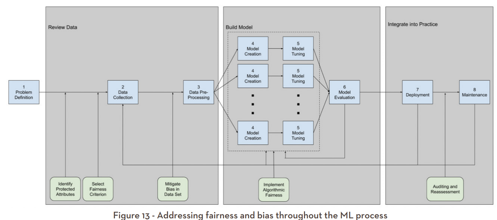

```{r setup, include=FALSE}
options(htmltools.dir.version = FALSE)

pacman::p_load(captioner, knitr, kableExtra, tidyverse)

knitr::opts_chunk$set(fig.retina = 3,                       
                      echo = TRUE,                       
                      eval = TRUE,                       
                      message = FALSE,                       
                      warning = FALSE,
                      out.width="100%")

library(captioner)

```

```{r, echo = FALSE}


```

Photo by [Thirdman](https://www.pexels.com/photo/text-5981542/)

Recently I was watching this YouTube video by CrashCourse on ["Algorithmic Bias and Fairness"](https://youtu.be/gV0_raKR2UQ), it has successfully piqued my curiosity on fairness in machine learning context.

This has led me to read more on fairness.

# What is fairness?

So, what is fairness?

```{r, echo = FALSE}


```

Photo by [Karolina Grabowska](https://www.pexels.com/photo/person-applying-cream-on-her-arm-7321556/)

Oh I am not talking about this type of "fairness"...

[@FATML] defines fairness as "ensure that algorithmic decisions do not create discriminatory or unjust impacts when comparing across different demographics (e.g. race, sex, etc)".

In short, fairness looks at how machine learning models have treated different groups. Typically the groups are defined by sensitive attributes, such as sex, race, nationality and so on.

According to MAS Feat principles, there are two aspects within the fairness principles [@FEAT].

-   Justifiability

-   Accuracy and bias

In short, individuals or groups should not be disadvantaged unless the decisions can be justified.

The algorithm and decisions should be regularly reviewed and minimize the unintentional bias.

You may refer to this [link](https://www.mas.gov.sg/~/media/MAS/News%20and%20Publications/Monographs%20and%20Information%20Papers/FEAT%20Principles%20Final.pdf) for more info.

# Why is fairness important?

As simple as there are repercussions when there is unitended bias or fairness issue we make decisions based on the predictions from the machine learning models.

One of the famous example is the algorithm that approves credit loan limit for Apple credit card.

There are reports that the algorithm Apple used in approving credit card limit might have fairness issue. This has resulted in complaints and regulators stepping in to investigate on this matter [@BBC].

# If fairness is important, would it solve the problem by excluding the sensitive attributes?

It would not be sufficient to just exclude sensitive attributes during the analysis.

The non-sensitive variables might have some correlations with the sensitive attributes.

For example, in some countries, zip codes can act as a proxy for race.

# Fairness Implementation

In a paper by MIT D lab, the authors suggested implementing several checks (i.e. the green boxes in the screen shot below) along the project cycle to consider "fairness" in the machine learning project [@MIT].

```{r, echo = FALSE}


```

Over here, I will focus on fairness check when building machine learning models.

To do so, I will be using `fairness_check` function in `fairness` package to assist me in checking the fairness in the machine learning model built.

Below are the fairness measurements produced by `fairness_check` function:

-   Accuracy equality ratio

-   Equal opportunity ratio

-   Predictive equality ratio

-   Predictive parity ratio

-   Statistical parity ratio

```{r, echo = FALSE}
fairness_df <- tibble(`Fairness Measurement` = c("Accuracy equality ratio",
                                                     "Equal opportunity ratio",
                                                     "Predictive equality ratio",
                                                     "Predictive parity ratio",
                                                     "Statistical parity ratio"),
                          Measures = c("Both protected and unprotected groups have equal prediction accuracy", 
                                       "The protected and unprotected groups have same false negative rate",
                                       "Both protected and unprotected groups have same false positive rate",
                                       "Both protected and unprotected groups have the same precisions",
                                       "Both protected and unprotected groups have the same probabilities to be assigned to positive predicted class"),
                          Remarks = c("",
                                      "A.k.a. 'false negative error rate balance'",
                                      "A.k.a. 'false positive error rate balance'",
                                      "A.k.a. 'outcome test'",
                                      "A.k.a. 'demographic parity, acceptance rate parity and benchmarking'"))

fairness_df %>%
  kbl() %>%
  kable_paper("hover", full_width = F, html_font = "Cambria", font_size = 15)

```

# Demonstration

In this demonstration, I will be using [Spaceship Titanic dataset](https://www.kaggle.com/competitions/spaceship-titanic) from Kaggle.

Nevertheless, let's begin the demonstration!

## Setup the environment

First, I will set up the environment by calling all the packages I need for the analysis later.

```{r}
pacman::p_load(tidyverse, readr, tidymodels, janitor, DALEXtra, fairmodels)

```

I will be using `fairmodels` package to calculate the different fairness metrics discussed earlier.

The beauty of this package is it could "work" directly with `explainer` from `DALEXtra` package and `tidymodels` without requiring much transformation.

So, following are the steps to check the fairness of the models:

-   First, build the model(s)

-   Second, create the explainer(s) by using `DALEX` or `DALEXtra` package

-   Third, pass the explainer(s) into `fairness_check` function from `fairmodels` package

## Import the data

First I will import the data into the environment.

```{r}
df_org <- read_csv("data/train.csv")

```

I will set the random seed for reproducibility.

```{r}
set.seed(1234)

```

```{r, echo = FALSE}
# point to the right explainer
model_type.dalex_explainer <- DALEXtra::model_type.dalex_explainer
predict_model.dalex_explainer <- DALEXtra::predict_model.dalex_explainer

```

## Build a model

Next, I will start building the models.

As the purpose of this post is to explore how to implement the fairness measurements, hence I won't be focusing on how to make the models more accurate.

### Data cleaning

I will perform some basic cleaning before building the different machine learning models.

```{r}
df <- df_org %>%
  clean_names() %>%
  mutate(transported = as_factor(transported),
         cryo_sleep = as_factor(cryo_sleep), 
         vip = as_factor(vip)) %>%
  drop_na() %>%
  mutate(cabin_deck = str_sub(cabin, 1, 1),
         cabin_num = str_sub(cabin, 3, 3),
         cabin_side = str_sub(cabin, -1, -1)) %>%
  select(-c(passenger_id, name, cabin))

```

Following are the data wrangling and cleaning I have performed above:

-   Clean the column names by using `clean_names` from `janitor` so that all of column names are in small letters

-   Mutate all the logical columns to factor columns

-   Drop all the rows with missing values

-   Split the cabin columns into cabin_deck, cabin_num & cabin_side based on the descriptions stated in the Kaggle website

-   Drop passenger ID, name and cabin columns

Okay, now the data is ready, let's start the demonstration!

### First model - Random forest

The first model I will be building is a random forest model.

```{r}
# model recipe
ranger_recipe <- recipe(formula = transported ~ .,
                        data = df) %>%
  step_dummy(all_nominal_predictors())

# model specification
ranger_spec <- 
  rand_forest(trees = 1000) %>% 
  set_mode("classification") %>% 
  set_engine("ranger")

# model workflow 
ranger_workflow <- 
  workflow() %>% 
  add_recipe(ranger_recipe) %>% 
  add_model(ranger_spec)

# fitting the model
ranger_fit <- ranger_workflow %>%
  fit(data = df)

```

Once the model is built, I will proceed and create the explainer object.

Before that, as explainer requires the target variable be in numeric form, so I will convert the target variable into numeric form.

```{r}
y_numeric <- df %>%
  mutate(transported_numeric = case_when(transported == TRUE ~ 1,
                                       TRUE ~ 0)) %>%
  select(transported_numeric)

```

Once that is done, I will create the explainer object.

```{r}
ranger_explainer <- explain_tidymodels(ranger_fit,
                                       data = select(df, -transported),
                                       y = y_numeric,
                                       label = "randomForest", 
                                       verbose = FALSE)

```

Next, I will pass the explainer object into the `fairness_check` function.

I will first define the protected variable (or the sensitive attribute). Over here, I will use the `home_planet` as the sensitive attribute for this demonstration.

`Earth` within the `home_planet` will be taken as the privileged group.

```{r}
protected_var <- df$home_planet
privileged_subgrp <- "Earth"

```

According to the descriptions on the [documentation page](https://modeloriented.github.io/fairmodels/reference/fairness_check.html), the subgroup parity loss will be calculated with regards to the privileged subgroup.

```{r}
ranger_fair <- fairness_check(ranger_explainer,
                              protected = protected_var,
                              privileged = privileged_subgrp,
                              colorize = TRUE) 

```

Once the `fairness_object` is created, there will be a result log.

From the result log, we can see how many explainer objects were passed into `fairness_check` function.

The result log will also inform the users whether all the different metric calculations are being computed successfully.

To extract the values of the computed metrics, we can call the `parity_loss_metric_data` from the `fairness_object` created as shown below.

```{r}
ranger_fair$parity_loss_metric_data

```

According to the [this post](https://github.com/ModelOriented/fairmodels/issues/45), if the metric is zero, NaN will be shown for the metrics so that false information will not be shown.

**"A picture is worth a thousand words."**

To help us in better understanding the results, we can pass the `fairness_object` into the `plot` function to visualize it.

```{r}
plot(ranger_fair)

```

According to the [documentation page](https://modeloriented.github.io/fairmodels/articles/Basic_tutorial.html), the red color areas show whether the selected metrics have exceeded the fairness thresholds.

If the bars reach the red area on the left, this implies there is bias towards the unprivileged subgroups.

On the other hand, if the bars reach the red area on the right, this implies there is bias towards the privileged groups.

Hmmm, it seems Mars and Europa have lower predictive equality ratio.

This implies they have a lower false positive rate (i.e. less chance that a data point that doesn't transported incorrectly classify as "will be transporting").

To further check on this, we could also pass the `fairness_object` into `metric_scores` function and extract out the calculated false positive rate under each subgroup.

After that, I have passed the results into `ggplot` function as shown below.

```{r}
metric_scores(ranger_fair, fairness_metrics = c("FPR"))$metric_scores_data %>%
  ggplot(aes(x = subgroup, y = score)) +
  geom_col() +
  theme_minimal() +
  labs(title = "False Positive Rate under Each Subgroup of Home Planet")

```

In this post, I won't be exploring how we could potentially fix the observed fairness issues in the dataset.


Also, according to the [documentation page](https://modeloriented.github.io/fairmodels/reference/fairness_check.html), the default acceptable ratio of metrics between unprivileged and privileged subgroups is set at 0.8.

We can change this acceptable ratio value by passing the value into `epsilon` argument.

```{r}
ranger_fair_0.6 <- fairness_check(ranger_explainer,
                              protected = protected_var,
                              privileged = privileged_subgrp,
                              epsilon = 0.6,
                              colorize = FALSE) 

plot(ranger_fair_0.6)

```

As shown in the graph above, with the updated acceptable ratio, the statistical parity ratio for Europa is within the acceptable range now.

### Second & third model - XGBoost & Logistic regression

One cool thing about `fairness_check` function is it allows the users to include multiple explainers into the function to compare the results.


Once that is done, I will build the second and third model for the fairness comparison later.

**Second model**

```{r}
# model recipe
xgboost_recipe <- 
  recipe(formula = transported ~ ., 
         data = df) %>%
  step_dummy(all_nominal_predictors())

# model specification
xgboost_spec <- 
  boost_tree() %>% 
  set_mode("classification") %>% 
  set_engine("xgboost")

# model workflow 
xgboost_workflow <- 
  workflow() %>% 
  add_recipe(xgboost_recipe) %>% 
  add_model(xgboost_spec) 

# fitting the model
xgboost_fit <- xgboost_workflow %>%
  fit(data = df)

# create explainer
xgboost_explainer <- explain_tidymodels(xgboost_fit,
                   data = select(df, -transported),
                   y = y_numeric,
                   label = "xgboost",
                   verbose = FALSE)

```

**Third model**

```{r}
# model recipe
logit_recipe <- 
  recipe(formula = transported ~ ., 
         data = df) %>%
  step_dummy(all_nominal_predictors())

# model specification
logit_spec <- 
  logistic_reg(penalty = 0.1) %>% 
  set_mode("classification") %>% 
  set_engine("glmnet")

# model workflow 
logit_workflow <- 
  workflow() %>% 
  add_recipe(logit_recipe) %>% 
  add_model(logit_spec) 

# fitting the model
logit_fit <- logit_workflow %>%
  fit(data = df)

# create explainer
logit_explainer <- explain_tidymodels(logit_fit,
                   data = select(df, -transported),
                   y = y_numeric,
                   label = "logistic",
                   verbose = FALSE)

```

## Combine all of them together

Once the models are built, I will pass the different `explainers` into `fairness_check` function as shown below.

```{r}
all_fair <- fairness_check(ranger_explainer,
                           xgboost_explainer,
                           logit_explainer,
                           protected = protected_var,
                           privileged = privileged_subgrp,
                           colorize = FALSE) 

```

As shown in the results, we can see the value under `checking explainers` is shown as 3 now.

Then, I will pass the created `fairness_object` to the `plot` function.

```{r}
plot(all_fair)

```

The results of the different models will be plotted together so that its easier to compare.

Or alternatively, we can plot the results in a radar graph format as shown below.

```{r}
plot(fairness_radar(all_fair))

```


Another useful function in `fairmodels` package is `performance_and_fairness`.

This function allows users to compare the different models under the selected performance and metrics.

The best model is located in the top right corner.

Taking accuracy and statistical parity ratio as an example, 

```{r}
plot(performance_and_fairness(all_fair, fairness_metric = "STP"))

```


Nevertheless, these are just some of the functions supported by `fairmodels` package. Do check out their [documentation page](https://modeloriented.github.io/fairmodels/index.html) for more details on the different functions.

# Conclusion

That's all for the day!

Thanks for reading the post until the end.

While reading through the materials for fairness, it reminded me on how I debated with my colleagues and bosses on one of the work I did in the past, i.e. equitable in participating fund management.

I will leave what causes the biases and how we could fix these biases in my future post.

Feel free to contact me through [email](mailto:jasper.jh.lok@gmail.com) or [LinkedIn](https://www.linkedin.com/in/jasper-l-13426232/) if you have any suggestions on future topics to share.

Till next time, happy learning!

```{r, echo = FALSE}


```

Photo by [destiawan nur agustra](https://www.pexels.com/photo/woman-holding-tiny-flower-in-raised-arms-4315214/)
