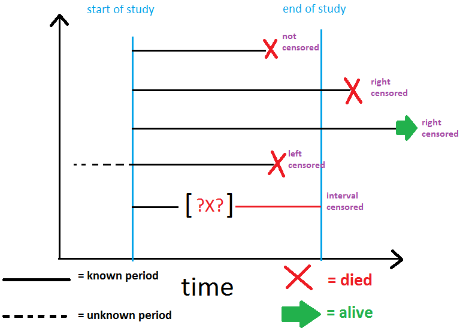

```{r setup, include=FALSE}
options(htmltools.dir.version = FALSE)

pacman::p_load(captioner, knitr, kableExtra, tidyverse, ggfortify)

knitr::opts_chunk$set(fig.retina = 3,                       
                      echo = TRUE,                       
                      eval = TRUE,                       
                      message = FALSE,                       
                      warning = FALSE,
                      out.width="100%")

```

```{r, echo = FALSE}


```

Photo by <a href="https://unsplash.com/@iankeefe?utm_source=unsplash&utm_medium=referral&utm_content=creditCopyText">Ian Keefe</a> on <a href="https://unsplash.com/s/photos/survival?utm_source=unsplash&utm_medium=referral&utm_content=creditCopyText">Unsplash</a>

Recently, I was reading my notes on survival analysis. 

Although this was one of the topics I learned during my undergraduate, I forgot most of the details so I thought it would be beneficial to read more about survival analysis.

In this post, I will be summarizing what is survival analysis and some important concepts of survival analysis.


I will be using one of the popular methods, Kaplan-Meier to estimate the survival curve.


# What is survival analysis?

Survival analysis corresponds to a set of statistical approaches used to investigate the time it takes for an event of interest to occur [@sthda].

Survival analysis is also commonly known as 'time to event' analysis.

Let's look at some important concepts of survival models.

# Survival function

Survival function is defined as the probability of surviving up to a point t.

It can be written as follows:

$$S(t) = Pr(T > t)$$

# Hazard function

The hazard function is defined as the instantaneous rate at which subject’s experience the event of interest, given that they have survived up to time t [@bartlett].

The function is also known as intensity function, instantaneous failure rate or force of mortality.

$$h(t)=\lim_{\delta\to0}\frac{Pr(t<T<t+\delta|T>t)}{\delta}$$


# Censoring

Censoring occurs when we have some information about individual survival time, but we don't know the time exactly [@sestelo].

The author also summarized the reasons on why censoring may occur as follows:

- a person does not experience the event before the study ends

- a person is lost to follow-up during the study period

- a person withdraws from the study because of death (if death is not the event of interest) or some other reason


In general, there are three types of censoring:

```{r, echo = FALSE}
censor_df <- tibble(`Type` = c("Right", "Left", "Interval"),
                    `Description` = c("Occur when the true unobserved event is on the right of the censoring time",
                                      "Event has already occurred before the observed time", "The event of interest happen within a specific interval of time"))

censor_df %>%
  kable("html", escape = FALSE) %>%
  kable_paper("hover", full_width = F, html_font = "Cambria", font_size = 15)

```


I find the illustration by Professor Pesta making it easier to understand the different types of censoring.

```{r, echo = FALSE}


```

Illustration by [Michal Pesta](https://www2.karlin.mff.cuni.cz/~pesta/NMFM404/survival.html#References)


# Survival analysis vs logistic regression

At the first glance, it looks like both survival analysis and logistic regression are performing the same analysis.

However, there is a difference between survival analysis and logistic regression.

Survival analysis accounts of censored data in the analysis, where logistic regression treats all the individuals didn't experience the event as 'survived' [@zablotski2021survival].

This would overestimate the survival probability.


In this post, I will be exploring Kaplan-Meier (KM) method to estimate the survival curve.

# Kaplan-Meier Survival Curve

KM is a non-parametric method in estimating the survival curve.

KM survival curve is defined as the probability of surviving in a given length of time while considering time in many small intervals [@Goel].


The formula can be written as following:

$$\hat{S}(t) = \prod_{t_i \leq j}(1- \frac{d_i}{n_i})$$

where 

- $\hat{S}(t)$ is the conditional survival probability at time t

- $d_i$ is the number of failure events at time $t_i$

- $n_i$ is the number of people at risk at time $t_i$


In short, the function estimates the survival probability of a particular individual, provided this individual has survived in all the previous period.


# Advantages and disadvantages of using Kaplan-Meier

Below are some of the advantages of using KM model [@zablotski2021survival; @sestelo]:

- Commonly used to describe survival

- Commonly used to compare two study populations

- Intuitive graphical presentation

- Does not require many assumptions for using such method

Following are the disadvantages of using KM model:

- Unable to model numeric variables

- Unable to include many explanatory variables

- Does not control for covariates

- Cannot accommodate time-dependent variables


# Demonstration

In this demonstration, I will be using this [bank dataset](https://www.kaggle.com/datasets/shrutimechlearn/churn-modelling) from Kaggle.


```{r, echo = FALSE}


```

Photo by <a href="https://unsplash.com/@alexmotoc?utm_source=unsplash&utm_medium=referral&utm_content=creditCopyText">Alex Motoc</a> on <a href="https://unsplash.com/s/photos/bank?utm_source=unsplash&utm_medium=referral&utm_content=creditCopyText">Unsplash</a>

## Setup the environment

First, I will load the necessary packages into the environment.

```{r}
pacman::p_load(tidyverse, lubridate, tidymodels, rsample, survival, 
               censored, janitor, survminer)

```

With this, I will be using `survival` package to perform the survival analysis.


```{r, echo = FALSE, out.width = "20%"}
knitr::include_graphics("image/survival_logo.png")

```

*Taken from [survival Github](https://github.com/therneau/survival)*

## Import Data

First I will import the dataset into the environment. 

I will also clean the column names, drop the columns I don't need and transform the columns to be the right format.

```{r}
df <- read_csv("data/Churn_Modelling.csv") %>%
  clean_names() %>%
  select(-c(row_number, customer_id)) %>%
  mutate(has_cr_card = factor(has_cr_card),
         is_active_member = factor(is_active_member),
         age_group = case_when(age < 30 ~ "20s",
                               age < 40 ~ "30s",
                               age < 50 ~ "40s",
                               age < 60 ~ "50s",
                               TRUE ~ "60s+"))

```


## Survival curve

According to the [documentation page](https://cran.r-project.org/web/packages/survival/survival.pdf), if the `event` variable (i.e. `exited` column in this dataset) is a factor, the survival type will be assumed to multi-state.

The `Surv` object would look slightly different from the usual single state survival analysis as shown below.

```{r}
df_1_factor <- df %>%
  mutate(exited = as.factor(exited))

# only show the first 10 records
Surv(df_1_factor$tenure, df_1_factor$exited)[1:10]

```

However, for this dataset, there are only two possible outcomes under `exited` variable, i.e. whether the customer has left the bank or remains as a customer.

So, I will convert the `exited` variable to numeric variable instead.

```{r}
df_1 <- df %>%
  mutate(exited = as.numeric(exited))

```

Now, if I were to call the `Surv` object, we will note that it looks slightly different from the multi-state `Surv` object.

```{r}
Surv(df_1$tenure, df_1$exited)[1:10]

```

Note that the tenure with a plus sign indicates the data point is being right censored.

Also note that event = 1 indicates that the event has been observed and event = 0 indicates that the event is being censored.

### Overall survival curve

Now, I will start building the survival curve.

With that, I will be using the `survfit` function to fit the survival curve.

Note that the argument is very similar to how we usually fit a machine learning model, except the dependent variable is now a `surv` object.

```{r}
surv_fit <- survfit(Surv(tenure, exited) ~ 1, data = df_1)

```

In order to show the overall survival curve, I will pass "1" as the independent variable into the `survfit` function.


```{r}
surv_fit

```


We can also extract the fitted survival curve by passing the created `survfit` object into `summary` function.

```{r}
summary(surv_fit)

```

Apart of the cumulative survival curve, the result contains the following:

- how many people at risk at the beginning of each time point (i.e. n.risk)

- how many event has occurred during the time point (i.e. n.event)

- standard error and confidence interval of the survival value

#### Visualize Survival Curve

There are a few way to visualise the survival curve.

In this sub-section, I will be exploring the different approaches to visualize the survival curve.

*Method 1: Use `ggsurplot` function from `survminer` pacakage*

To visualize the survival curve, we could use the `ggsurvplot` function from `survminer` package.


```{r}
ggsurvplot(surv_fit)

```


Meanwhile, the package also offers the users a list of additional arguments to modify the graph.

For example, we can draw the median survival time in the graph.

```{r}
ggsurvplot(surv_fit, surv.median.line = "hv")

```

One of the interesting argument is that the `ggsurvplot` function enables the users to risk tables by "turning on" `risk.table` argument.


```{r}
graph <- ggsurvplot(surv_fit,
                    risk.table = TRUE)

# remove the formating on the risk tables
graph$table <- graph$table + theme_cleantable()

graph

```

To add the title, we could pass the title name into the title argument as shown below.

```{r}
ggsurvplot(surv_fit,
           title = "Overall Survival Curve")

```

Alternatively, we could use the usual ggplot approach to include the modifications we would like to make on the graph.

```{r}
ggsurvplot(surv_fit) +
  labs(title = "Overall Survival Curve")

```

Note that the graph object from `ggsurvplot` function is not ggplot object. Hence, some of the usual way of modifying the graph (eg. layering the different layers to modify the graph) may not work.

As such, we will need to use the list of allowed arguments to modify the graph.

For more details, please refer to [documentation page](https://www.rdocumentation.org/packages/survminer/versions/0.4.9/topics/ggsurvplot).

*Method 2: Use `autoplot` function from `ggfortify` package*

Next, I will use `autoplot` function from `ggfortify` function to create the graph.

```{r}
autoplot(surv_fit)

```

The advantage of this method is the created graph is a ggplot object.

This would allow us to make changes to the graph through different ggplot layers.

```{r}
autoplot(surv_fit) +
  scale_x_continuous(breaks = c(0, 2, 4, 6, 8, 10)) +
  scale_y_continuous(breaks = c(0, 0.25, 0.5, 0.75, 1),
                     labels = c("0%", "25%", "50%", "75%", "100%"),
                     limits = c(0, 1)) +
  xlab("Time") +
  ylab("Survival Probability") +
  theme_minimal()

```

Note that the censor objects appeared at the each step of survival curve. This is because in the dataset, the tenure captured for each customer is an integer, i.e. doesn't have any decimals.


*Method 3: Use functions from `ggplot2` package*


Lastly, I will use the good old `ggplot2` package to create the survival curve from scratch.

To do so, I will first pass the `survfit` object into `tidy` function to make the fitted object into a tibble data.

```{r}
surv_fit_tb <- surv_fit %>%
  tidy()

surv_fit_tb

```

Alternatively, the `surv_summary` function from `survminer` package could be used to "tidy" the results into a data frame.

```{r}
surv_summary(surv_fit)

```

The output from `surv_summary` function is same as the output from `tidy` function, with some differences on the column naming.


Then, I will pass the tibble into `ggplot` function.

Voilà!

```{r}
surv_fit_tb %>%
  ggplot() +
  # survival curve
  geom_step(aes(x = time, y = estimate)) +
  # shaded area of confidence interval
  geom_rect(aes(xmin = time, 
                xmax = lead(time),
                ymin = conf.low, 
                ymax = conf.high),
            fill = "blue",
            alpha = 0.2) +
  scale_y_continuous(labels = scales::percent, 
                     limits = c(0, 1)) +
  labs(title = "Overall Survival Curve") +
  xlab("Time") +
  ylab("Survival Probability") +
  theme_minimal()

```


### Survival curve by groups

Next, I will fit the survival curve by different groups.

```{r}
surv_fit_age_group <- survfit(Surv(tenure, exited) ~ age_group, data = df_1)

ggsurvplot(surv_fit_age_group)

```

From the graph above, somehow the younger customers are more "sticky".

They have higher median survival time than the older customers.


If we input more than 1 variable, the function will create the different survival curves through permutating over the different categories of selected variables.

For example, if we were to pass both `age_group` and `gender` into the function, below is how the graph would look like:

```{r}
surv_fit_age_gender <- survfit(Surv(tenure, exited) ~ age_group + gender, data = df_1)

ggsurvplot(surv_fit_age_gender)

```


# Conclusion

That's all for the day!

Thanks for reading the post until the end.

Feel free to contact me through [email](mailto:jasper.jh.lok@gmail.com) or [LinkedIn](https://www.linkedin.com/in/jasper-l-13426232/) if you have any suggestions on future topics to share.

Till next time, happy learning!

```{r, echo = FALSE}


```

Photo by <a href="https://unsplash.com/@tak_tag?utm_source=unsplash&utm_medium=referral&utm_content=creditCopyText">takahiro taguchi</a> on <a href="https://unsplash.com/s/photos/survival?utm_source=unsplash&utm_medium=referral&utm_content=creditCopyText">Unsplash</a>
