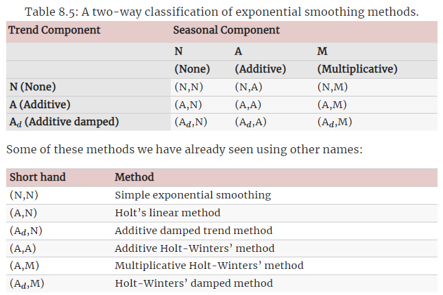

```{r setup, include=FALSE}
options(htmltools.dir.version = FALSE)

pacman::p_load(captioner, knitr, kableExtra, tidyverse)

knitr::opts_chunk$set(fig.retina = 3,                       
                      echo = TRUE,                       
                      eval = TRUE,                       
                      message = FALSE,                       
                      warning = FALSE,
                      out.width="100%")

```

Previously I have attended a [time series workshop](https://r4dsa-tsaf.netlify.app/) conducted by my professor.

It has got my interest to re-study on my notes on time series.

It was one of the topic I have learnt when I was learning the different analytics techniques pertaining to operation analytics.

Hence, in this post, I will be summarize what I have learnt about exponential smoothing and more importantly how to implement this method in R.

```{r, echo = FALSE}


```

Photo by [cottonbro](https://www.pexels.com/photo/a-person-holding-a-sand-paper-polishing-a-wooden-strip-6654749/)

# What is exponential smoothing?

[@Hyndman2021_chap8] explained that exponential smoothing produces forecasts that are weighted averages of past observations, with the weights decaying exponentially as the observations get older.

For example, single exponential smoothing has following formula:

$$\hat{y}_{t+1} = \alpha y_{t} + (1 - \alpha)\hat{y}_{t}$$

where

$\hat{y}_{t}$ refers to the forecasted value at time t

$y_{t}$ refers to the actual value at time t

$\alpha$ is the weight

From the formula, we can note that the forecasted value at time t+1 is a weighted average between actual value and forecasted value at time t.

Now you might be asking why this method is called 'exponential'?

If we go back to the formula above, we could replace the forecasted value with the same formula as follows:

$$\hat{y}_{t+1} = \alpha y_{t} + \alpha (1 - \alpha){y}_{t-1} + \alpha (1 - \alpha)^{2} y_{t-2}+...$$

As shown above, the current forecasted value is sum of past actual values, where the weights decreases exponentially when we go back in time.

Nevertheless, the author also mentioned that this method generates reliable forecasts quickly and for a wide range of time series, which is a great advantage and of major importance to applications in industry.

In general, below are the three different types of exponential smoothing models:

-   Simple exponential smoothing

-   Double exponential smoothing

-   Triple exponential smoothing

```{r, echo = FALSE}
ets_df <- data_frame(`Smoothing Method` = c("Simple exponential smoothing",
                                            "Double exponential smoothing",
                                            "Triple exponential smoothing"),
                     Description = c("- Suitable when there is no clear trend or seasonal pattern within the data",
                                     "- Include trend",
                                     "- Include both trend and seasonal factor"),
                     Remarks = c("",
                                 "A.k.a. Holt-winters' two parameter or Holt's linear trend method",
                                 "A.k.a. Holt-winters' three parameter"))
ets_df %>%
  kable("html", escape = FALSE) %>%
  kable_paper("hover", full_width = F, html_font = "Cambria", font_size = 15)


```

Not to bore the readers the formula under these models, I shall exclude them from the post. Otherwise this post will be full of formula.


*Taken from giphy*

# Trend

For the trend components, it can be either damped version or non-damped version.

Damped as in the trend will be flatted in the future.

# Seasonal factor

For the seasonal factor, it can be either additive or multiplicative.

Note that following is the definitions of seasonal and cyclical:

```{r, echo = FALSE}
season_cycle_df <- data_frame(Types = c("Seasonal",
                                        "Cyclical"),
                     Description = c("When the components repeat the pattern with a fixed and known duration",
                                     "When the components seem to have some regular and repeated fluctuation around the trend but we don’t know the duration of the fluctuations"))

season_cycle_df %>%
  kable("html", escape = FALSE) %>%
  kable_paper("hover", full_width = F, html_font = "Cambria", font_size = 15)


```

## Additive Components

This would be more appropriate when the magnitude of the seasonal fluctuations, or the variations around the trend-cycle, does not vary with the level of the time series [@Hyndman2021_chap3.2].

The additive components can be written as follows:

$$y_t = S_t + T_t + R_t$$

Where

$y_t$ is the data

$S_t$ is the seasonal component

$T_t$ is the trend-cycle component

$R_t$ is the remainder component

## Multiplicative Components

When the variation in the seasonal pattern, or the variation around the trend-cycle, appears to be proportional to the level of time series, then a multiplicative decomposition is more appropriate.

The multiplicative components can be written as follows:

$$y_t = S_t \times T_t \times R_t$$

Where

$y_t$ is the data

$S_t$ is the seasonal component

$T_t$ is the trend-cycle component

$R_t$ is the remainder component

That's all for the discussion on exponential smoothing.

Following are the summary of the discussion above:

```{r, echo = FALSE}


```

*Taken from Chapter 8.4 of [Forecasting: Principles and Practice](https://otexts.com/fpp3/taxonomy.html)*

# Demonstration

In this demonstration, I will use the comsumer price index dataset from [SingStat](https://www.singstat.gov.sg/).

```{r, echo = FALSE}


```

Photo by <a href="https://unsplash.com/@coleenr?utm_source=unsplash&utm_medium=referral&utm_content=creditCopyText">Coleen Rivas</a> on <a href="https://unsplash.com/s/photos/singapore?utm_source=unsplash&utm_medium=referral&utm_content=creditCopyText">Unsplash</a>

## Setup the environment

First, I will load the necessary packages into the environment.

```{r}
pacman::p_load(tidyverse, lubridate, timetk, tsibble, janitor, 
               feasts, fable, rsample)

```

## Import Data

Next, I will import in the dataset and perform some pre-processing to clean up the data.

Refer to my [previous blog post](https://jasperlok.netlify.app/posts/2022-10-23-timesseries/) for the pre-processing discussion.

```{r}
df <- read_csv("https://raw.githubusercontent.com/jasperlok/my-blog/master/_posts/2022-10-23-timesseries/data/M212881.csv", 
               skip = 10) %>%
  slice(1:148) %>%
  filter(`Data Series` != "Hawker Centres" &
           `Data Series` != "Food Courts & Coffee Shops")

# convert columns into numeric
cols_num <- c(2:ncol(df))
df[cols_num] <- sapply(df[cols_num], as.numeric)

```


```{r}
# pivot longer the columns
df_1 <- df %>%
  pivot_longer(!`Data Series`, 
               names_to = "Month Year", 
               values_to = "CPI") %>%
  clean_names() %>%
  mutate(month_year_recoded = ym(month_year)) %>%
  select(-month_year) %>%
  filter(month_year_recoded >= "2014-01-01" & month_year_recoded <= "2020-12-01") %>%
  filter(data_series == "All Items")

```


```{r}
# convert into tsibble data frame
df_1_ts <- df_1 %>%
  mutate(month_year_recoded = yearmonth(month_year_recoded)) %>%
  as_tsibble(index = month_year_recoded,
             key = data_series)

```

## Split into Training and Testing Dataset

`rsample` package provides users the function (i.e. `initial_time_split`) to split the time series data into training and testing dataset.

```{r}
ts_split <- df_1_ts %>%
  initial_time_split(prop = 0.8)

```

Similar to the usual train test split for machine learning, I will use `training` and `testing` function to split the dataset.

```{r}
ts_train <- training(ts_split)
ts_test <- testing(ts_split)

```

## Model Building

Now that is done, I will pass the training dataset into the `model` function. I will also specify I would like to build an ETS model by using `ETS` function.

```{r}
ts_ets <- ts_train %>%
  select(-data_series) %>%
  model(ETS(cpi))

```

Note that I have not specified the following in the `ETS` function:

-   Whether there is a trend or seasonality

-   Should the trend or seasonality be additive or multiplicative

-   Should the trend or season be damped

```{r}
ts_ets

```

On surface, it seems like there is no info for the fitted model. The info of fitted model is actually within the object.

So, we can "unpack" the info by using `augment` function.

```{r}
augment(ts_ets)

```

As shown, we can see that fitted model contains the original values, the fitted values and residuals.

Alternatively, we could pass the fitted model into the `report` function to summarize the model info (eg. model parameters, model performance etc).

```{r}
ts_ets %>% 
  report()

```

According to the [documentation page](https://fable.tidyverts.org/reference/ETS.html), following are the meaning of the different smoothing parameters:

-   alpha - value of smoothing parameter for the level

    -   Larger alpha value means the model will give more weights to the more recent observations

-   beta - value of smoothing parameter for the slope

    -   Larger beta value means the model will give more weights to the more recent trend

-   phi - value of dampening parameter for the slope

-   gamma - value of the smoothing parameter for the seasonal pattern

    -   Larger gamma value means the model will give more weights to the more recent seasonality

To help us to visually inspect the fitted model, we could use `gg_tsresiduals` function.

The graph would contain the following:

-   Innovation residuals

-   ACF chart

-   Distribution of the residuals

```{r}
gg_tsresiduals(ts_ets)

```

Note that innovation residuals is the residuals on the transformed scale if there is transformation used in the model [@Hyndman2021_chap5.3].

I can only say the name "innovation residual" is so fancy.


*Taken from giphy*

Nevertheless, the graphs from `gg_tsresiduals` function show us the following:

-   The innovation residuals hover around 0, except for a couple of data points

-   The residual distribution chart also shows a left skewed, resulted by outliers

    -   By the excluding the outliers, the residual distribution would look closer to a normal distribution with mean = 0

-   None of the bars in ACF graph exceeds the blue lines, suggesting that the autocorrelations are not statistically different from zero.

Earlier I have used auto method to find the combination of error, trend and season that gives the best model since I have not defined the error, trend and season in the function.

If we want to self define the model, we could pass in additional arguments into ETS function as following:

```{r}
ts_train %>%
  select(-data_series) %>%
  model(ETS(cpi ~ error("A") + trend("Ad") + season("M"))) %>%
  report()

```

Refer to the [documentation page](https://fable.tidyverts.org/reference/ETS.html) for the forms allowed under `error`, `trend` and `season` arguments.

## Forecast

To forecast the future values, I will use `forecast` function.

I will also indicate the forecast time period should be 17 months so that I can compare with the testing dataset.

```{r}
ts_ets_forecast <- ts_ets %>%
  forecast(h = "17 months")

```

After that, I will plot the actual CPI, fitted CPI and forecast CPI.

```{r}
ts_train %>%
  ggplot(aes(x = month_year_recoded, 
             y = cpi,
             color = "Actual - Training")) +
  autolayer(ts_ets_forecast, alpha = 0.3) +
  geom_line(size = 1) +
  geom_line(aes(y = .fitted,
                color = "Fitted"),
            size = 1,
            data = augment(ts_ets)) +
  geom_line(aes(y = .mean,
                color = "Forecast"),
            size = 1,
            data = ts_ets_forecast) +
  geom_line(aes(y = cpi,
                color = "Actual - Testing"),
            size = 1,
            data = ts_test) +
  labs(title = "CPI") +
  theme_minimal() +
  theme(axis.title.x = element_blank(),
        axis.title.y = element_blank(),
        legend.position = "bottom",
        legend.title = element_blank())

```

Over here, I have used `autolayer` function to plot out the forecast values in a ggplot layer. This function will plot out the forecast values in a line form and shade the 80 and 95 confidence intervals as default confidence intervals to show on the graph.

The forecasted values are rather flat, compared to the actual training values. This is consistent with the model info, i.e. the fitted model have beta value of 0.

Also, we can observe that the fitted value tends to lag behind the actual value. The spike or drop in the values tend to happen one period after the actual value.

# Conclusion

That's all for the day!

Thanks for reading the post until the end.

Feel free to contact me through [email](mailto:jasper.jh.lok@gmail.com) or [LinkedIn](https://www.linkedin.com/in/jasper-l-13426232/) if you have any suggestions on future topics to share.

Refer to this link for the [blog disclaimer](https://jasperlok.netlify.app/blog_disclaimer.html).

Till next time, happy learning!

```{r, echo = FALSE}
knitr::include_graphics("image/time.jpg")

```

Photo by <a href="https://unsplash.com/@akramhuseyn?utm_source=unsplash&utm_medium=referral&utm_content=creditCopyText">Akram Huseyn</a> on <a href="https://unsplash.com/s/photos/time?utm_source=unsplash&utm_medium=referral&utm_content=creditCopyText">Unsplash</a>
