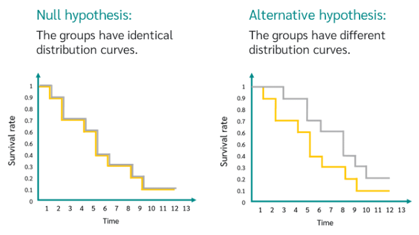
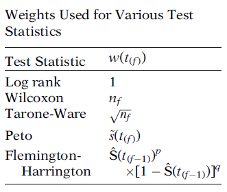

```{r setup, include=FALSE}
options(htmltools.dir.version = FALSE)

pacman::p_load(captioner, knitr, kableExtra, tidyverse)

knitr::opts_chunk$set(fig.retina = 3,                       
                      echo = TRUE,                       
                      eval = TRUE,                       
                      message = FALSE,                       
                      warning = FALSE,
                      out.width="100%")

```

```{r, echo = FALSE}


```

Photo by [Daniel Reche](https://www.pexels.com/photo/eggs-in-tray-on-white-surface-1556707/)

In my previous post, I shared about how to build the survival curve.

Often, one of the questions raised while building the survival curve is whether the survival curves observed under the different groups are statistically different from one another.


# Log-rank test

Log-rank test is a chi-square test. 

It compares the observed and expected counts to see whether the survival curves are statistically different.

Below is the null and alternative hypothesis of the log-rank test:

```{r, echo = FALSE}
hypothesis_test_df <- tibble(Hypothesis = c("Null", "Alternative"),
                          Remarks = c("All survival curves are the same",
                                      "At least one of the survival curves is different from the rest"))

hypothesis_test_df %>%
  kable("html", escape = FALSE) %>%
  kable_paper("hover", full_width = F, html_font = "Cambria", font_size = 15)

```


```{r, echo = FALSE}


```

*Taken from [DATAtab](https://datatab.net/tutorial/log-rank-test)*

## Different variations of log-rank tests

There are different variations to the log-rank test [@Kleinbaum2012].

They allow the users to apply different weights at the f-th failure time.

```{r, echo = FALSE, out.width = "80%"}


```

*Taken from Survival Analysis - A Self Learning Text book*


One of the arguments in the test is rho. Below is the difference when different rho is assumed in the test [@Sestelo2017]:

- The default for rho is 0, which is the log-rank test. 

    - This test gives the same weighting to both early and late failure.


- When rho = 1, it would be the peto peto modification of the gehan-wilcoxon test. 

    - Under this approach, the test will be sensitive to early differences.


According to the author, the weighting method to be used in the log-rank test should be an priori decision, instead of trial and error to get the desirable results. 

This is to avoid bias in the results [@Kleinbaum2012].


Nevertheless, let's start the demonstration!

# Demonstration

In this demonstration, I will be using this [bank dataset](https://www.kaggle.com/datasets/shrutimechlearn/churn-modelling) from Kaggle.


## Setup the environment

First, I will load the necessary packages into the environment.

```{r}
pacman::p_load(tidyverse, survival, janitor, survminer)

```

With this, I will be using `survival` package to perform the log-rank test.


## Import Data

First I will import the data into the environment.

```{r}
df <- read_csv("https://raw.githubusercontent.com/jasperlok/my-blog/master/_posts/2022-09-10-kaplan-meier/data/Churn_Modelling.csv")

```


Next, I will perform similar data wrangling.

Refer to my [previous post](https://jasperlok.netlify.app/posts/2022-09-10-kaplan-meier/) for the details.

```{r, echo = FALSE}
df <- df %>%
  clean_names() %>%
  select(-c(row_number, customer_id)) %>%
  mutate(has_cr_card = factor(has_cr_card),
         is_active_member = factor(is_active_member))

```


## Log-rank Test

### Comparing two survival curve

In this demonstration, I will compare the survival curve under different genders.

Recall that to visualize the survival curve, I will first create the `survfit` object and the created object into `ggsurvplot` function to visualize the survival curves.

```{r}
surv_fit <- survfit(Surv(tenure, exited) ~ gender, data = df)

ggsurvplot(surv_fit)

```

From the graph, it looks like the survival curves are visually different under different genders.

To confirm this, I will perform a chi-square test on this to check whether the survival curves are indeed different.

As such, I will use `survdiff` function to perform the relevant task.

```{r}
survdiff(Surv(tenure, exited) ~ gender, data = df)

```

As the p-value is greater than 0.05, we will reject the null hypothesis. There is statistical evidence that the two survival curves are different from one another.


### Comparing more than two survival curves

Similarly, `survdiff` function also can be used when there are more than two survival curves.

For example, I would like to find out that the survival curves are indeed different when the number of products held by the customers differs.

```{r}
survdiff(Surv(tenure, exited) ~ num_of_products, data = df)

```

As shown in the result above, we reject the null hypothesis and conclude that all the survival curves are not the same.

However, this test does not tell us whether the survival curves are similar for some of the groups.

For example, if we plot out the survival curve for customers that held a different number of products, it seems like the survival curves for customers who held 3 products and customers who held 4 products are rather similar.


```{r}
surv_fit <- survfit(Surv(tenure, exited) ~ num_of_products, data = df)

ggsurvplot(surv_fit)

```

### Pairwise survival curves 

To verify the hypothesis above, I will use `pairwise_survdiff` function to generate the pairwise results.

```{r}
pairwise_survdiff(Surv(tenure, exited) ~ num_of_products, data = df)

```

From the results above, we fail to reject the null hypothesis when comparing the survival curves for customers who held 3 and 4 products. There is no statistical evidence that the survival curves for customers with 3 and 4 products are different.

By default, the function will perform log-rank test (i.e. rho = 0). 

To perform peto-peto test, we will just need to set the rho to 1 as shown below.

```{r}
pairwise_survdiff(Surv(tenure, exited) ~ num_of_products, data = df, rho = 1)

```


# Conclusion

That's all for the day!

Thanks for reading the post until the end.

Feel free to contact me through [email](mailto:jasper.jh.lok@gmail.com) or [LinkedIn](https://www.linkedin.com/in/jasper-l-13426232/) if you have any suggestions on future topics to share.

Refer to this link for the [blog disclaimer](https://jasperlok.netlify.app/blog_disclaimer.html).

Till next time, happy learning!

```{r, echo = FALSE}
knitr::include_graphics("image/books.jpg")

```

Photo by [George Milton](https://www.pexels.com/photo/stack-of-books-on-textile-7034102/)
