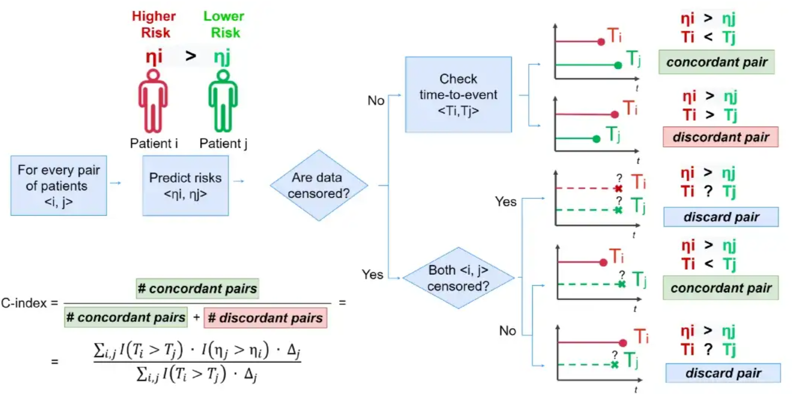

```{r setup, include=FALSE}
options(htmltools.dir.version = FALSE)

pacman::p_load(captioner, knitr, kableExtra, tidyverse)

knitr::opts_chunk$set(fig.retina = 3,                       
                      echo = TRUE,                       
                      eval = TRUE,                       
                      message = FALSE,                       
                      warning = FALSE,
                      out.width="100%")

```

In this post, I will be exploring one of the popular methods for survival analysis, Cox proportional hazard.

```{r, echo = FALSE}


```

Photo by <a href="https://unsplash.com/@alex_andrews?utm_source=unsplash&utm_medium=referral&utm_content=creditCopyText">Alexander Andrews</a> on <a href="https://unsplash.com/photos/X62F1WQhuLI?utm_source=unsplash&utm_medium=referral&utm_content=creditCopyText">Unsplash</a>

Before jumping into cox proportional hazard, let's take a look what are the differences between parametric, semi-parametric, and non-parametric models.

# Differences Between parametric, semi-parametric, and non-parametric models

According to the post by Ravi Charan [@charan2020], below are the summary of the differences:

- **Non-parametric model**: Make no assumptions about the functional form of $\lambda$ (i.e. hazard function)

- **Parametric model**: Assume the precise functional form of $\lambda$ in modeling

- **Semi-parametric model**: Cox proportional hazard does not make any functional assumptions on the shape of the hazard function

    - Functional form assumptions are made about the effects of the covariates alone


# Cox Proportional Hazard

## What is Cox proportional hazard?

So, what is cox proportional hazard?

Cox proportional hazard is a semi-parametric survival model.


The Cox proportional hazard formula can be written as follows [@sthda]:

$$h(t) = h_0(t) \times exp(b_1x_1 + b_2x_2 + ... + b_px_p) $$

where

- t is the survival time

- h(t) is the hazard function determined by a set of covariates ($x_1, x_2, ..., x_p$)

- the coefficients ($b_1, b_2, ...., b_p$) measure the impact of covariates

- $h_0$ is the baseline hazard

As shown in the formula, Cox proportional hazard model allows the users to assess the effects of multiple risk factors on survival time at the same time.

## How to interpret Cox Proportional Hazard?

One of the key outputs from Cox proportional hazard model is the hazard ratio.

Below is how one could interpret the hazard ratio:

### Categorical variable

- Hazard ratio = 1 —> no effect

- Hazard ratio > 1 increase relative risk compared to the reference group

- Hazard ratio < 1 decrease in relative risk compared to the reference group

### Numerical variable

The hazard ratio represents the increase/decrease in risk for every unit change

Examples will be provided in the demonstration so that it's easier to understand the concepts.

## Difference between Cox Proportional Hazard and Kaplan-Meier Survival Curve


One of the disadvantages of the Kaplan-Meier survival curve is unable to model numeric variables. Each unique numeric figure will be treated as a separate group when fitting the survival curve under the Kaplan-Meier model.

Another disadvantage of the Kaplan-Meier model is that model is unable to include many explanatory variables. 

These issues could be overcome if Cox proportional hazard model is used.

# Concordance Index

Before we move on, it's important to discuss one of the important performance metrics in the survival model.

Concordance index (a.k.a. C-index) is one of the commonly used performance measures for survival models.

This index can be interpreted as the fraction of all pairs of subjects whose predicted survival times are correctly ordered among all subjects that can actually be ordered [@raykar].

Below is a chart on how the concordance index is being calculated:

```{r, echo = FALSE}


```

*Taken from ["How to Evaluate Survival Analysis Models" post](https://towardsdatascience.com/how-to-evaluate-survival-analysis-models-dd67bc10caae) by Nicolo Cosimo Albanese*

In the post, the author also summarised the interpretation of the concordance index as follows:

- C = 1: perfect concordance between risks and event times.

- C = 0: perfect anti-concordance between risks and event times.

- C = 0.5: random assignment. The model predicts the relationship between risk and survival time as well as a coin toss.


# Demonstration

In this demonstration, I will be using this [bank dataset](https://www.kaggle.com/datasets/shrutimechlearn/churn-modelling) from Kaggle.

## Setup the environment

In this demonstration, I will be using Cox proportional hazard function from `survival` package.

I will be using functions from `survminer` package to visualize the results.

First, I will load the necessary packages into the environment.

```{r}
pacman::p_load(tidyverse, lubridate, janitor, survival, survminer, scales)

```

## Import Data

Next, I will import the dataset into the environment. 

I will also clean the column names, drop the columns I don't need, and transform the columns to the right format.

```{r}
df <- read_csv("https://raw.githubusercontent.com/jasperlok/my-blog/master/_posts/2022-09-10-kaplan-meier/data/Churn_Modelling.csv") %>%
  clean_names() %>%
  select(-c(row_number, customer_id, surname)) %>%
  mutate(has_cr_card = factor(has_cr_card),
         is_active_member = factor(is_active_member),
         credit_score = credit_score/100,
         balance = balance/10000,
         estimated_salary = estimated_salary/10000) %>%
  filter(tenure > 0)

```

Note that I have also scaled `credit_score`, `balance`, and `estimated_salary` in respective units.

## Building Cox model

To build a cox model, I will use `coxph` function from `survival` package to build a cox proportional hazard model.

```{r}
cox_model <- coxph(Surv(tenure, exited) ~ ., 
                   data = df,
                   x = TRUE,
                   y = TRUE)

```

We could call the fitted model to see the model result.

```{r}
cox_model

```

It seems like the `summary` function would provide more info about the fitted model if we pass the fitted model into the function.

```{r}
summary(cox_model)

```

Note that the hazard ratio would be `exp(coef)` in the above.

The three tests at the bottom of the results are the statistical tests for the overall significance of the model, where the null hypothesis of the statistical tests is as follows:

$H_0:\beta = 0$

As the p-values for all the statistical tests are smaller than 0.05, we reject the null hypothesis.

For more info on how we could interpret the result, I find this [post](http://www.sthda.com/english/wiki/cox-proportional-hazards-model) very helpful.


Alternatively, chapter 5 of the book **Applied Survival Analysis Using R** by Dirk F. Moore has a quite clear explanation of cox proportional hazards as well.

## Extract the results

The concordance results can be extracted by using the following method:

```{r}
cox_model$concordance["concordance"]

```

Alternatively, we could extract the concordance index by passing the fitted model into the `concordance` function from `survival` package.

```{r}
concordance(cox_model)

```


# Visualize the survival curve

Having fit a Cox model to the data, it’s possible to visualize the predicted survival proportion at any given point in time for a particular risk group. The function survfit() estimates the survival proportion, by default at the mean values of covariates.

```{r}
ggsurvplot(survfit(cox_model), 
           data = df)

```

To plot the graph, it seems like we need to pass the `fit` object into `survfit` function


`ggsurvplot` also supports multiple datasets.

To do so, we need to combine the different `survfit` objects into a list.

For demonstration, I will first split the dataset by gender.

```{r}
df_male <-
  df %>% 
  filter(gender == "Male") %>%
  select(-gender)

df_female <-
  df %>% 
  filter(gender == "Female") %>%
  select(-gender)

```

Then, I will fit two cox proportional hazard models based on each dataset.

```{r}
survfit_male <-
  coxph(Surv(tenure, exited) ~ .,
        data = df_male)

survfit_female <-
  coxph(Surv(tenure, exited) ~ .,
        data = df_female)

```

Then, I will create the "list" before passing the list into `ggsurvplot` function.

```{r}
surv_fit_list <- 
  list("male" = survfit(survfit_male),
       "female" = survfit(survfit_female))

ggsurvplot(surv_fit_list, 
           combine = TRUE,
           conf.int = TRUE,
           ylim = c(0.35, 1))

```


## Visualize the cox proportional hazard results

Next, I will visualize the fitted model results by using `ggforest` function.

```{r}
ggforest(cox_model)

```

This graph contains the different variables used in fitting Cox model and the different categories within the categorical variables.

On the right side of the graph, we have the hazard ratio, the confidence interval for the different hazard ratios, and p-value for each variable.

As discussed earlier, the higher the hazard ratio, the riskier the customer is, compared to the reference group.

For example, on average a male customer is 32% less risky than a female customer.

Meanwhile, for the numerical variable, we could interpret the hazard ratio as the change in relative risk for every unit change.

For example, for every increase in 1 for age, the risk would increase approximately by 5%.

Nevertheless, below are what we could observe from the cox model result:

- Interestingly enough that in general, the churn increases when the age increases

```{r}
ggplot(df, aes(x = age, fill = as.factor(exited), alpha = 0.5)) +
  geom_histogram()

```

- The likelihood of churning also depends on whether the customer is being tagged as an active member

    - The company could run some campaigns to engage the non-active customers to reduce the churn rate
    
- The customers from Germany are more likely to churn, compared to France and Spain

    - This is consistent with what we observe in the dataset
    
    - It is probably worthwhile to understand further whether there are any reasons why customers from Germany are more likely to churn.
    
    For example, it could be the customers from Germany are mostly from a certain industry, resulting in a higher churn rate.
    
    This is to help us to spot whether any customer characteristics that are not captured in the dataset.

```{r}
ggplot(df, aes(x = geography, fill = as.factor(exited))) +
  geom_bar(position = "fill")

```


I find that visualizing the results as follows makes it easier to understand.


## Feature Selection

We could take one step further to perform feature selection on the variables to be used in cox proportional hazard modeling.

Over here, I will be using `step` function from `stats` package in performing stepwise feature selection.

Note that this method uses AIC in selecting the model.

I will also indicate that the direction should be "both", i.e. the model could include or exclude variables at each step.

```{r}
stats::step(
  cox_model,
  scope = list(upper = ~.,
               lower = ~is_active_member),
  direction = "both"
)

```

From the result, we see that the following variables are being dropped in the feature selection:

- num_of_products

- has_cr_card

- estimated_salary


With this, I will rebuild the cox proportional hazard model with lesser variables.

```{r}
cox_model_sub <- 
  coxph(Surv(tenure, exited) ~ credit_score + geography + gender + age + balance + is_active_member, 
        data = df, 
        x = TRUE, 
        y = TRUE)

ggforest(cox_model_sub)

```

Next, I will extract the concordance index of the new model.

```{r}
cox_model_sub$concordance["concordance"]

```

The new model requires fewer variables in predicting the outcome although there is a slight drop in the concordance index in the new model.

The concordance index dropped by `r label_percent(accuracy = 0.01)(cox_model$concordance["concordance"]/cox_model_sub$concordance["concordance"] - 1)`.


# Conclusion

That's all for the day!

Thanks for reading the post until the end.

Feel free to contact me through [email](mailto:jasper.jh.lok@gmail.com) or [LinkedIn](https://www.linkedin.com/in/jasper-l-13426232/) if you have any suggestions on future topics to share.

Refer to this link for the [blog disclaimer](https://jasperlok.netlify.app/blog_disclaimer.html).

Till next time, happy learning!

```{r, echo = FALSE}
knitr::include_graphics("image/friendship.jpg")

```

Photo by [Helena Lopes](https://www.pexels.com/photo/anonymous-friends-standing-together-at-sunset-in-mountains-4453153/)
