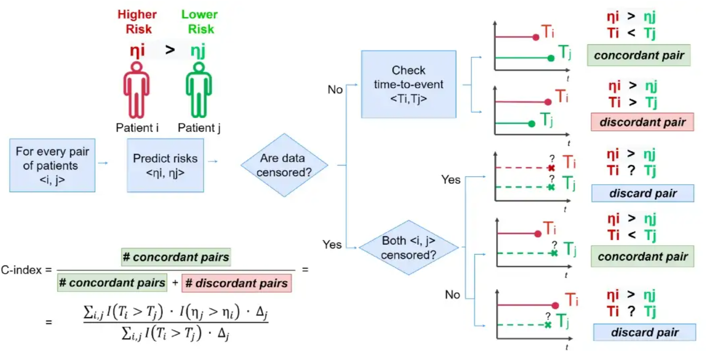

```{r setup, include=FALSE}
options(htmltools.dir.version = FALSE)

pacman::p_load(captioner, knitr, kableExtra, tidyverse)

knitr::opts_chunk$set(fig.retina = 3,                       
                      echo = TRUE,                       
                      eval = TRUE,                       
                      message = FALSE,                       
                      warning = FALSE,
                      out.width="100%")

```

In this post, I will walk through one of the most widely used methods in survival analysis: the Cox proportional hazards model.

```{r, echo = FALSE}


```

Photo by <a href="https://unsplash.com/@alex_andrews?utm_source=unsplash&utm_medium=referral&utm_content=creditCopyText">Alexander Andrews</a> on <a href="https://unsplash.com/photos/X62F1WQhuLI?utm_source=unsplash&utm_medium=referral&utm_content=creditCopyText">Unsplash</a>

Before jumping into the Cox model, it is helpful to clarify how parametric, semi-parametric, and non-parametric survival models differ.

# Parametric, Semi-Parametric, and Non-Parametric Models

According to Ravi Charan [@charan2020], the models can be summarised as follows:

- **Non-parametric models** make no assumption about the functional form of the hazard function, $\lambda(t)$. A common example is the Kaplan-Meier estimator.

- **Parametric models** assume a specific distribution for survival time, such as exponential, Weibull, log-normal, or log-logistic. This implies a specific shape for the hazard function.

- **Semi-parametric models** sit between these two approaches. The Cox proportional hazards model does not require us to specify the shape of the baseline hazard function.

    - Instead, the model focuses on estimating how covariates change the hazard relative to the baseline hazard.


# Cox Proportional Hazards Model

## What is the Cox proportional hazards model?

The Cox proportional hazards model is a semi-parametric survival model that estimates the relationship between covariates and the hazard of an event occurring.

The model can be written as follows [@sthda]:

$$h(t) = h_0(t) \times exp(b_1x_1 + b_2x_2 + ... + b_px_p) $$

where

- $t$ is the survival time

- $h(t)$ is the hazard function for an individual with covariates ($x_1, x_2, ..., x_p$)

- ($b_1, b_2, ...., b_p$) are coefficients that measure the effect of the covariates

- $h_0(t)$ is the baseline hazard, which represents the hazard when all covariates are at zero or at their reference levels

The key idea is that covariates multiply the baseline hazard. This allows us to estimate how several risk factors are associated with the event rate at the same time, without having to specify the exact shape of the baseline hazard over time.

## How to interpret a Cox model

One of the key outputs from a Cox model is the **hazard ratio**, which is calculated as $exp(coef)$.

The hazard ratio is a relative measure. It compares the hazard between two groups, or between two values of a numeric variable, while holding the other variables in the model constant.

### Categorical variable

- Hazard ratio = 1: no difference in hazard compared with the reference group

- Hazard ratio > 1: higher hazard compared with the reference group

- Hazard ratio < 1: lower hazard compared with the reference group

### Numerical variable

For a numeric variable, the hazard ratio represents the multiplicative change in the hazard for a one-unit increase in that variable, holding the other variables constant.

For example, if the hazard ratio for age is 1.05, then a one-year increase in age is associated with a 5% higher hazard, all else being equal. This does not mean the probability of the event increases by exactly 5%; it means the instantaneous event rate is 5% higher at a given point in time.

## Cox proportional hazards model vs. Kaplan-Meier survival curve


The Kaplan-Meier curve is useful for estimating and visualising survival probabilities over time, especially for a small number of groups. However, it has some practical limitations:

- It does not directly model several explanatory variables at once.

- Numeric variables often need to be grouped before plotting, otherwise each unique value may effectively behave like a separate group.

- It is mainly descriptive, whereas the Cox model allows us to estimate the association between covariates and the hazard of the event.

These issues can be addressed with the Cox proportional hazards model. However, the Cox model also has its own assumptions, especially the proportional hazards assumption, which we should check before relying on the results.

# Concordance Index

Before moving to the demonstration, it is useful to introduce one common performance metric for survival models: the concordance index, or C-index.

The C-index measures how well the model ranks subjects by risk. More specifically, it can be interpreted as the fraction of comparable pairs whose predicted risks are correctly ordered with respect to their observed event times [@raykar].

Below is a chart showing how the concordance index is calculated:

```{r, echo = FALSE}


```

*Taken from ["How to Evaluate Survival Analysis Models" post](https://towardsdatascience.com/how-to-evaluate-survival-analysis-models-dd67bc10caae) by Nicolo Cosimo Albanese*

The interpretation can be summarised as follows:

- C = 1: perfect concordance between predicted risk and event time.

- C = 0.5: no better than random ranking.

- C = 0: perfect anti-concordance between predicted risk and event time.

In practice, the C-index should not be the only metric used to assess a survival model. It measures ranking performance, but it does not tell us whether the model is well calibrated, whether the proportional hazards assumption is reasonable, or whether the model generalises to new data.

# Demonstration

In this demonstration, I will use this [bank churn dataset](https://www.kaggle.com/datasets/shrutimechlearn/churn-modelling) from Kaggle.

One important caveat: this dataset is not a perfect survival dataset. The variable `tenure` is used as the time variable and `exited` is used as the event indicator. Customers who have not exited are treated as right-censored at their current tenure. This is a useful way to demonstrate the Cox model mechanics, but in a real churn analysis we would want a proper customer history with start dates, event dates, observation windows, and censoring rules.

## Setup the environment

In this demonstration, I will use the `coxph` function from the `survival` package to build the Cox proportional hazards model.

I will use functions from the `survminer` package to visualise the results.

First, I will load the necessary packages into the environment.

```{r}
pacman::p_load(tidyverse, lubridate, janitor, survival, survminer, scales)

```

## Import data

Next, I will import the dataset into the environment.

I will also clean the column names, drop columns that are not useful for modelling, and transform selected columns to the right format.

```{r}
df <- read_csv("https://raw.githubusercontent.com/jasperlok/my-blog/master/_posts/2022-09-10-kaplan-meier/data/Churn_Modelling.csv") %>%
  clean_names() %>%
  select(-c(row_number, customer_id, surname)) %>%
  mutate(has_cr_card = factor(has_cr_card),
         is_active_member = factor(is_active_member),
         credit_score = credit_score/100,
         balance = balance/10000,
         estimated_salary = estimated_salary/10000) %>%
  filter(tenure > 0)

```

Note that I have scaled `credit_score`, `balance`, and `estimated_salary`. This makes the model output easier to interpret because the hazard ratios are no longer based on very small unit changes.

## Build the Cox model

To build the Cox model, I will use the `coxph` function from the `survival` package.

```{r}
cox_model <- coxph(Surv(tenure, exited) ~ ., 
                   data = df,
                   x = TRUE,
                   y = TRUE)

```

We can call the fitted model to see the model result.

```{r}
cox_model

```

The `summary` function provides more detailed information about the fitted model.

```{r}
summary(cox_model)

```

The hazard ratio is shown as `exp(coef)` in the output.

The three tests at the bottom of the results are overall significance tests for the model. The null hypothesis is:

$H_0:\beta = 0$

In other words, the null hypothesis is that the covariates have no association with the hazard. Since the p-values for all three tests are smaller than 0.05, we reject the null hypothesis and conclude that the model contains at least some useful predictors.

This does not mean every individual variable is important, nor does it prove causality. It means the model as a whole provides evidence of association between the covariates and churn hazard.

For more information on how to interpret the result, I find this [post](http://www.sthda.com/english/wiki/cox-proportional-hazards-model) very helpful.

Alternatively, chapter 5 of the book **Applied Survival Analysis Using R** by Dirk F. Moore has a clear explanation of Cox proportional hazards as well.

## Extract the results

The concordance result can be extracted using the following method:

```{r}
cox_model$concordance["concordance"]

```

Alternatively, we can extract the concordance index by passing the fitted model into the `concordance` function from the `survival` package.

```{r}
concordance(cox_model)

```

The full model has a C-index of approximately 0.72 in the rendered output, which suggests a reasonable ability to rank customers by relative churn risk. However, this is still an in-sample result. For a stronger analysis, we should evaluate the model on a validation or test set.

## Check the proportional hazards assumption

Because the Cox model assumes proportional hazards, we should check whether the effect of each covariate is reasonably constant over time.

The `cox.zph` function tests the proportional hazards assumption using Schoenfeld residuals.

```{r}
ph_test <- cox.zph(cox_model)

ph_test

```

```{r}
ggcoxzph(ph_test)

```

If the test suggests that a variable violates the proportional hazards assumption, we should not ignore it. Possible next steps include adding time-varying effects, stratifying by that variable, transforming variables, or using a different modelling approach.

# Visualise the survival curve

After fitting a Cox model, it is possible to visualise the predicted survival proportion at each time point for a given covariate profile. The `survfit()` function estimates the survival curve from the fitted model. By default, it uses a typical covariate profile based on the covariate values in the data.

```{r}
ggsurvplot(survfit(cox_model), 
           data = df)

```

To plot the graph, we pass the fitted Cox model into the `survfit` function.

`ggsurvplot` also supports multiple survival curves.

To demonstrate this, I will split the dataset by gender.

```{r}
df_male <-
  df %>% 
  filter(gender == "Male") %>%
  select(-gender)

df_female <-
  df %>% 
  filter(gender == "Female") %>%
  select(-gender)

```

Then, I will fit two Cox proportional hazards models based on each dataset.

```{r}
survfit_male <-
  coxph(Surv(tenure, exited) ~ .,
        data = df_male)

survfit_female <-
  coxph(Surv(tenure, exited) ~ .,
        data = df_female)

```

Then, I will create a list before passing it into the `ggsurvplot` function.

```{r}
surv_fit_list <- 
  list("male" = survfit(survfit_male),
       "female" = survfit(survfit_female))

ggsurvplot(surv_fit_list, 
           combine = TRUE,
           conf.int = TRUE,
           ylim = c(0.35, 1))

```

This comparison is useful for demonstration, but it should be interpreted carefully. Since the male and female models are fitted separately, the curves are not simply showing the isolated effect of gender from a single model. Another approach would be to create specific covariate profiles and use `survfit(cox_model, newdata = ...)` to compare predicted survival curves while holding other variables fixed.

## Visualise the Cox proportional hazards results

Next, I will visualise the fitted model results with a forest plot of the hazard ratios.

```{r}
plot_hazard_ratios <- function(model) {
  model_summary <- summary(model)
  
  hazard_ratios <-
    as_tibble(model_summary$conf.int, rownames = "term") %>%
    select(term,
           hazard_ratio = `exp(coef)`,
           lower_ci = `lower .95`,
           upper_ci = `upper .95`) %>%
    left_join(
      as_tibble(model_summary$coefficients, rownames = "term") %>%
        transmute(term, p_value = `Pr(>|z|)`),
      by = "term"
    ) %>%
    mutate(term = fct_reorder(term, hazard_ratio))
  
  ggplot(hazard_ratios,
         aes(x = hazard_ratio,
             y = term,
             xmin = lower_ci,
             xmax = upper_ci,
             color = p_value < 0.05)) +
    geom_vline(xintercept = 1, linetype = "dashed", color = "grey50") +
    geom_pointrange() +
    scale_x_log10() +
    scale_color_manual(values = c("grey50", "#0072B2"), guide = "none") +
    labs(x = "Hazard ratio (log scale)",
         y = NULL)
}

plot_hazard_ratios(cox_model)

```

This graph contains the variables used in the Cox model and the categories within categorical variables.

On the right side of the graph, we have the hazard ratio, the confidence interval, and the p-value for each variable.

As discussed earlier, a higher hazard ratio indicates a higher hazard of churn, while a lower hazard ratio indicates a lower hazard of churn, conditional on the other variables in the model.

For example, the rendered model output shows that `genderMale` has a hazard ratio of approximately 0.68. This suggests that, holding the other variables constant, male customers have about 32% lower churn hazard than the reference group, which is female customers.

For a numerical variable, the hazard ratio can be interpreted as the change in hazard for every one-unit increase in that variable. For example, the rendered model output shows an age hazard ratio of approximately 1.05. This means a one-year increase in age is associated with about a 5% higher churn hazard, holding the other variables constant.

Based on the Cox model result, several patterns stand out:

- Churn hazard appears to increase with age.

```{r}
ggplot(df, aes(x = age, fill = as.factor(exited), alpha = 0.5)) +
  geom_histogram()

```

- Churn hazard differs by active membership status. Customers tagged as inactive have a higher churn risk, so the company may want to design campaigns to re-engage inactive customers.

- Customers from Germany are more likely to churn compared with customers from France, while Spain does not appear materially different from France in the fitted model.

    - This is consistent with what we observe in the dataset.
    
    - It is worth investigating why Germany has a higher churn rate.
    
    For example, German customers may differ by product mix, acquisition channel, pricing, service experience, or another characteristic not captured in the dataset.
    
    This additional analysis would help determine whether geography itself is important, or whether it is acting as a proxy for another customer characteristic.

```{r}
ggplot(df, aes(x = geography, fill = as.factor(exited))) +
  geom_bar(position = "fill")

```


## Feature selection

We can take one step further by performing feature selection on the variables used in the Cox proportional hazards model.

Here, I will use the `step` function from the `stats` package to perform stepwise feature selection.

Note that this method uses AIC to select the model.

I will also indicate that the direction should be `"both"`, meaning the model can include or exclude variables at each step.

```{r}
stats::step(
  cox_model,
  scope = list(upper = ~.,
               lower = ~is_active_member),
  direction = "both"
)

```

From the result, the following variables are dropped during feature selection:

- num_of_products

- has_cr_card

- estimated_salary

With this, I will rebuild the Cox proportional hazards model with fewer variables.

```{r}
cox_model_sub <- 
  coxph(Surv(tenure, exited) ~ credit_score + geography + gender + age + balance + is_active_member, 
        data = df, 
        x = TRUE, 
        y = TRUE)

plot_hazard_ratios(cox_model_sub)

```

Next, I will extract the concordance index of the new model.

```{r}
cox_model_sub$concordance["concordance"]

```

The new model requires fewer variables, while the concordance index only drops slightly.

The concordance index dropped by `r label_percent(accuracy = 0.01)(cox_model$concordance["concordance"]/cox_model_sub$concordance["concordance"] - 1)`.

That said, stepwise selection should be used carefully. It can produce unstable variable selections, especially when predictors are correlated. A more complete modelling workflow would also consider:

- domain knowledge and whether each variable is available at prediction time

- train/test or cross-validation performance

- proportional hazards diagnostics

- non-linear effects, such as using splines for age or balance

- interactions, such as whether age behaves differently by geography or active membership status

- calibration, not only ranking performance

- business usefulness, such as whether the model can support targeted churn-prevention actions


# Conclusion

The Cox proportional hazards model is a useful tool when we want to understand how different variables are associated with the timing of an event. Its main strength is that it can model multiple covariates while leaving the baseline hazard unspecified.

In this example, the model suggests that churn hazard is associated with age, geography, gender, balance, and active membership status. The model also achieves an in-sample C-index of around 0.72, suggesting reasonable ranking ability.

However, a complete survival analysis should go beyond fitting the model. We should check the proportional hazards assumption, validate performance on unseen data, consider calibration, and confirm that the time and censoring definitions are appropriate for the business problem.

Thanks for reading the post until the end.

Feel free to contact me through [email](mailto:jasper.jh.lok@gmail.com) or [LinkedIn](https://www.linkedin.com/in/jasper-l-13426232/) if you have any suggestions on future topics to share.

Refer to this link for the [blog disclaimer](https://jasperlok.netlify.app/blog_disclaimer.html).

Till next time, happy learning!

```{r, echo = FALSE}
knitr::include_graphics("image/friendship.jpg")

```

Photo by [Helena Lopes](https://www.pexels.com/photo/anonymous-friends-standing-together-at-sunset-in-mountains-4453153/)
