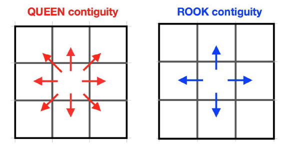

```{r setup, include=FALSE}
options(htmltools.dir.version = FALSE)

pacman::p_load(captioner, knitr, kableExtra, tidyverse)

knitr::opts_chunk$set(fig.retina = 3,                       
                      echo = TRUE,                       
                      eval = TRUE,                       
                      message = FALSE,                       
                      warning = FALSE,
                      out.width="100%")

```


```{r, echo = FALSE}


```

Photo by <a href="https://unsplash.com/@mateovrb?utm_source=unsplash&utm_medium=referral&utm_content=creditCopyText">Mateo</a> on <a href="https://unsplash.com/photos/bq53S9hEYx4?utm_source=unsplash&utm_medium=referral&utm_content=creditCopyText">Unsplash</a>
  


# Spatial weights

One of the analyses in geospatial is to find out how strong is the spatial relationship between different interest objects.


This is an important step before we could perform spatial autocorrelation.

But how do we know who are the "neighbours"?

Sometimes it can be not very obvious from the map.

```{r, echo = FALSE}

```

*Generated from Imgflip*


This is where we will use spatial weighting method to find the list of neighbours.


In this post, we will focus on one of the spatial weighting methods, which is **contiguity-based spatial weights**.


# What is contiguity-based spatial weight?

Contiguity means that two spatial units share a common border of non-zero length [@Anselin2020].

In other words, we are interested in finding whether the two areas "touch" each other.


# Types of contiguity-based spatial weights

There are two types of contiguity-based spatial weights.

They are `queen` contiguity and `rook` contiguity.

As the names suggested, the definition of "neighbours" under each method matches the respective movements on the chess board.

Below is the illustration of the definition of "neighbours" under each method:

```{r, echo = FALSE}


```

*Taken from [@Bellefon2018]*


# Best practice on how to select the appropriate spatial weighting method

There are different spatial weighting techniques. 

Then how would we know which one is more appropriate since different spatial weighting might give us different results?

[@Kam2020] discussed the considerations in one of his lectures.

In summary, below are different spatial weighting methods and when they are more appropriate:

- Polygon contiguity

    - When the polygons are similar in size and distribution, and when spatial relationships are a function of polygon proximity

- Fixed distance method

    - Work well for point data
    
    - Alternative for polygon data when there is a large variation in polygon size

- Inverse distance method

    - Appropriate with continuous data or to model processes where the closer two features are in space, the more likely they are to interact/influence each other

- k-nearest neighbours method

    - When want to ensure we have a minimum number of neighbours

I will cover the other weighting methods in my future post.


# Demonstration

I will download Malaysia shape files from [this link](https://earthworks.stanford.edu/catalog/stanford-nv753sn0493).

For more explanations on shape files, please refer to my [previous post](https://jasperlok.netlify.app/posts/2022-02-12-point-pattern-analysis/).


## Setup the environment

First, I will set up the environment by calling the necessary packages.

```{r}
pacman::p_load(tidyverse, sf, spdep, tmap, janitor)

```

I will also set the `tmap_mode` to `view` so that I can interact with the graphs.

```{r}
tmap_mode('view')

```

## Import the data

### Import shp files

Next, I will import the dataset into the environment.

```{r}
msia_map <- st_read(dsn = "data", layer = "MYS_adm2")

```

Next, I will visualize the Malaysia map.

```{r}
tm_shape(msia_map) +
  tm_polygons()

```

Good! Now, we can proceed and find the "neighbours".


## Contiguity-based spatial weight

In this sub-section, I will derive the contiguity-based spatial weights.

To better visualize the spatial weights results later, I will find the centroids of different administrative districts.

```{r}
longitude <- map_dbl(msia_map$geometry, ~st_centroid(.x)[[1]])
latitude <- map_dbl(msia_map$geometry, ~st_centroid(.x)[[2]])

```

Once the latitude and longitude are derived, I will use `cbind` function to bind the columns together.

```{r}
coords <- cbind(longitude, latitude)

```

### Queen Contiguity-based Neighbours

I will use `poly2nb` function and pass `TRUE` to queen argument to derive the queen contiguity based neighbours.

Note that the queen argument is `TRUE` by default.

```{r}
msia_map_queen <-
  poly2nb(msia_map, queen = TRUE)

```

To visualize the results, I will do the following:

- Plot an empty Malaysia map

- Then, plot the graphs on queen contiguity based neighbours

```{r}
plot(msia_map$geometry, 
     border="lightgrey",
     main="Queen Contiguity-based Neighbours")

plot(msia_map_queen, 
     coords, 
     pch = 20, 
     cex = 0.5, 
     add = TRUE,
     col= "blue")

```

Remember to indicate the add argument should be `TRUE`, otherwise the code will return the neighbours map without the underlying Malaysia map.

### Rook Contiguity-based Neighbours

To derive Rook contiguity-based neighbours, I will still use `ploy2nb` function and specify `FALSE` for the queen argument.

```{r}
msia_map_rook <-
  poly2nb(msia_map, queen = FALSE)

```

Similarly, to visualize the result, I will follow the same steps taken when visualizing the results for Queen contiguity-based neighbours.

```{r}
plot(msia_map$geometry, border="lightgrey")
plot(msia_map_rook, 
     coords, 
     pch = 20, 
     cex = 0.5, 
     add = TRUE, 
     col= "blue")

```

At the first glance, it looks like the list of neighbours derived based on both Queen and Rook approaches look the same.

To find the different neighbours, I will use `diffnb` function to compare.

```{r}
diff_nb <- diffnb(msia_map_queen, msia_map_rook)

```

Then, I will use similar approach to visualize the differences.

I will also color the differences in red colors.

```{r}
plot(msia_map$geometry, border="lightgrey")
plot(diff_nb, 
     coords, 
     pch = 20, 
     cex = 0.5, 
     add = TRUE, 
     col= "red")

```

Based on the result, it seems like most of the neighbours derived are rather similar between Queen and Rook approaches.


# Conclusion

That's all for the day!

Thanks for reading the post until the end.

Feel free to contact me through [email](mailto:jasper.jh.lok@gmail.com) or [LinkedIn](https://www.linkedin.com/in/jasper-l-13426232/) if you have any suggestions on future topics to share.

Refer to this link for the [blog disclaimer](https://jasperlok.netlify.app/blog_disclaimer.html).

Till next time, happy learning!

```{r, echo = FALSE}
knitr::include_graphics("image/plates.jpg")

```

Photo by <a href="https://unsplash.com/@victorfreitas?utm_source=unsplash&utm_medium=referral&utm_content=creditCopyText">Victor Freitas</a> on <a href="https://unsplash.com/photos/Yuv-iwByVRQ?utm_source=unsplash&utm_medium=referral&utm_content=creditCopyText">Unsplash</a>
  

