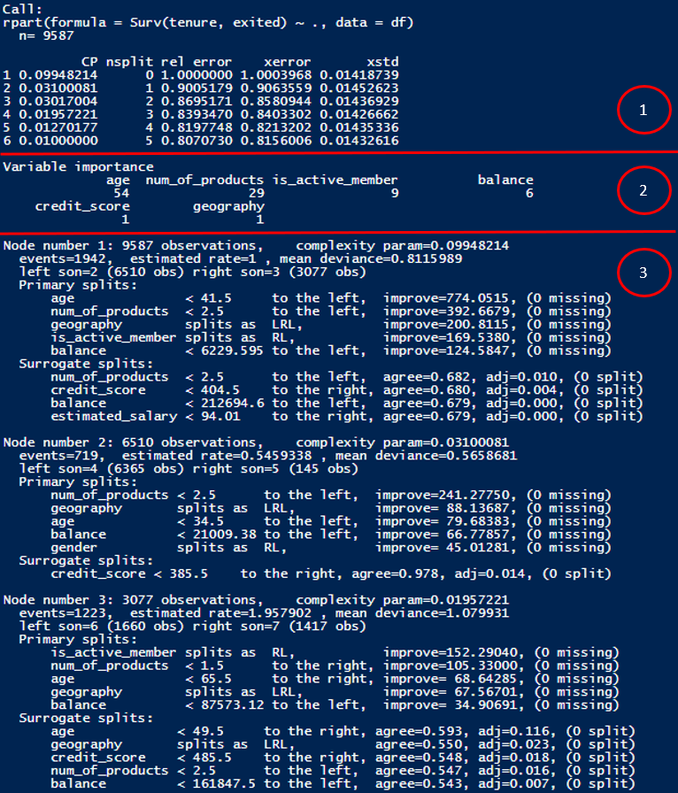

```{r setup, include=FALSE}
options(htmltools.dir.version = FALSE)

pacman::p_load(captioner, knitr, kableExtra, tidyverse)

knitr::opts_chunk$set(fig.retina = 3,                       
                      echo = TRUE,                       
                      eval = TRUE,                       
                      message = FALSE,                       
                      warning = FALSE,
                      out.width="100%")

```

In previous posts, I have explored using cox proportional hazards model to perform survival analysis. 

[@Gepp2015] found out decision trees could have a better classification accuracy than other techniques (eg. cox proportional hazards model).


```{r, echo = FALSE}
knitr::include_graphics("image/tree.jpg")

```

Photo by <a href="https://unsplash.com/@annoand?utm_source=unsplash&utm_medium=referral&utm_content=creditCopyText">Anders Nord</a> on <a href="https://unsplash.com/images/nature/tree?utm_source=unsplash&utm_medium=referral&utm_content=creditCopyText">Unsplash</a>

This makes me curious on how to build a decision tree to perform survival analysis.

I have read through different examples, posts and articles to satisfy my own curiousity, otherwise I will not be able to sleep at night.


*Taken from giphy*


For the explanations on survival analysis, you may refer to my [previous post](https://jasperlok.netlify.app/posts/2022-09-10-kaplan-meier/).

Also, in this post, I will assume the readers have some basic understanding on how decision trees work.


## Survival analysis with decision tree

The different decision tree R packages support survival analysis.


# Demonstration

In this demonstration, I will be using this [bank dataset](https://www.kaggle.com/datasets/shrutimechlearn/churn-modelling) from Kaggle.

Also, there are many ways we could build a survival decision tree.

Therefore, I will be using 3 different methods to build survival decision trees.

## Setup the environment

First, I will load the necessary packages into the environment.

```{r}
pacman::p_load(tidyverse, lubridate, janitor, survival, survminer, partykit, rpart, censored)

```


## Import Data

First I will import the dataset into the environment. 

I will also clean the column names, drop the columns I don't need and transform the columns to be the right format.

```{r}
df <- read_csv("https://raw.githubusercontent.com/jasperlok/my-blog/master/_posts/2022-09-10-kaplan-meier/data/Churn_Modelling.csv") %>%
  clean_names() %>%
  select(-c(row_number, customer_id, surname)) %>%
  mutate(has_cr_card = factor(has_cr_card),
         is_active_member = factor(is_active_member)) %>%
  filter(tenure > 0)

```


## Build decision trees

Now, let's build the decision tree!

### Method 1 - Use `rpart` package

In this first method, I will use `rpart` package to build the tree.

As usual, the target variable will be our `surv` object, which contains the duration and status.

```{r}
rpart_fit <-
  rpart(Surv(tenure, exited) ~ ., data = df)

```

We could call the fitted object to output the results.

```{r}
rpart_fit

```

From the result, we can observe the following:

- The split condition at each node

- Number of data points fall under each node

- Deviance at each node

- Fitted value of the response at the node

    - Note the root node value is always fixed to 1
    
    - The `yval` of the subsequent nodes represent the relative riskness compared to the overall
    
    - Eg. The exited rate at node 3 is about 1.96 times the overall rate


Alternatively, we could pass the model into `summary` function, which gives us more info on the model.

```{r}
summary(rpart_fit)

```


Woh, there are a lot of info within the summary function.

The results can be split into different parts.

```{r, echo = FALSE}


```

**Summary**

- First part: Results under different complexity parameters

- Second part: Variable importance

    - Note that according to the [documentation](https://cran.r-project.org/web/packages/rpart/rpart.pdf), the variable importance is being scaled so that they will add up to 100

- Third part: Tree results under each split


### Prune the tree

To prune the tree, `plotcp` function can be very handy.

It plots the cross validation results based on the rpart object.

Form this [post](https://stackoverflow.com/questions/29197213/what-is-the-difference-between-rel-error-and-x-error-in-a-rpart-decision-tree), it seems like there are different methods in choosing where to prune the tree.


Based on the explanation in the post, below are the three common methods in selecting the optimal levels for pruning:

- Method 1: Choose minimum xerror

- Method 2: Choose the xerror < minimum(xerror) + xstd

    - This method accounts for the variability of xerror from cross-validation

- Method 3: Choose xerror +/- xstd overlaps with minimum(xerror) +/- xstd


Since the author mentioned the third method is rarely used, I will focus on method 1 and 2 over here.


#### Method 1: Choose minimum xerror

First, I will print out the cp by using `printcp` function.

```{r}
printcp(rpart_fit)

```

From the result above, we will choose nsplit = 5 as it has the lowest xerror.


#### Method 2: Choose the xerror < minimum(xerror) + xstd

`rpart` package has a nice function (i.e. `plotcp` function) to help us to decide which cp we should use in pruning the tree.

```{r}
plotcp(rpart_fit)

```

Based on the [documentation](https://cran.r-project.org/web/packages/rpart/rpart.pdf), the horizontal line in the graph is drawn on 1 standard error above the minimum xerror.

Alternatively, we could illustrate by using `ggplot`.


```{r}
rpart_fit_cp <- 
  printcp(rpart_fit) %>%
  as_tibble() %>%
  mutate(xerror_plus_std = xerror + xstd)

ggplot(rpart_fit_cp, 
       aes(x = as.character(nsplit), y = xerror)) +
  geom_point() +
  geom_hline(yintercept = min(rpart_fit_cp$xerror_plus_std),
             linetype = 2,
             size = 1) +
  xlab("nsplit")

```

Based on the result above, we could choose cp = 0.016 (or nsplit = 4).

To prune the tree, we will use `prune` function.

```{r}
prune(rpart_fit, cp = 0.016)

```

The result of the pruned tree will be shown after pruning the tree.


#### Visualize the tree

We could use the plotting functions from `rpart` package in visualizing the tree.

This would be easier to visualize how the tree looks like, instead of reading a list of splitting rules from the results.

To do so, we need to use `plot` and `text` functions to visualize the tree.

```{r}
plot(rpart_fit, 
     margin = 0.05)
text(rpart_fit)

```

The split condition is written on top of the branch. The data points will "go" to left branch if they met the condition.


Note the values at the end of the node are the y-val, which can be found in the fitted object as well.


We could also trace the paths a node took by using `path.rpart` function.

```{r}
path.rpart(rpart_fit, nodes = 14)

```

This is a good way to summarize the characteristics of the data points under different nodes.

For example, we can see the data points fall under node 14 are age between 41.5 and 47.5 and they are not active members.


Alternatively, we could pipe the fitted tree from `rpart` package to a party object before passing into `plot` function to visualize the tree.

```{r}
rpart_fit %>%
  as.party()

```

The fitted model result will look similar to the result produced from `ctree` package.

```{r}
rpart_fit %>%
  as.party() %>%
  plot()

```

The cool thing is the result will show us the survival curves under the different groups of customers.

#### Visualize survival curve

Alternatively, we could visualize the survival curves of the different groups by using `ggplot` function.

First, I will pull the group info from the fitted object. It is stored under `where` in the fitted object.

Then, I will convert into a tibble data before joining back to the original dataset.

```{r}
df_grp <-
  rpart_fit$where %>%
  as_tibble() %>%
  rename(group = value) %>%
  bind_cols(df)

```

Once that is done, I will visualize the surival curve by using `survfit` and `ggsurvplot` functions as shown below.

```{r}
survfit(Surv(tenure, exited) ~ group,
        data = df_grp) %>%
  ggsurvplot(data = df_grp)

```


### Method 2 - Use `ctree` package

Next, I will use `ctree` package to build survival decision tree.

As `ctree` package is unable to accept characters, so I will convert the characters columns into factors.

```{r}
df_factor <- df %>%
  mutate(geography = factor(geography),
         gender = factor(gender))

```

Let's build the tree!

```{r}
ctree_fit <-
  ctree(Surv(tenure, exited) ~ ., data = df_factor)

```

Similarly, we could call the fitted object to see the result.

```{r}
ctree_fit

```

Note as `rpart` and `partykit` packages are using different methods in splitting the tree, hence the trees might look different between both packages.

As the fitted object is a party object, so we could pass the fitted object into `plot` function to visualize the tree.

```{r}
ctree_fit_sub <-
  ctree(Surv(tenure, exited) ~ age + geography, data = df_factor)

plot(ctree_fit_sub)

```

Voila!


### Method 3 - Use `tidymodels` packages to build the trees

Next, I will be exploring how to build a survival decision tree by using my all times favourite R package, `tidymodel`.

I will also need to load another additional R package, `censored` in order to perform survival analysis.


*Taken from giphy*

To do so, I will first indicate what type of model I am building, which R package I am wrapping and what type of problem are we solving here.

```{r}
tdmodel_specs <- 
  decision_tree() %>%
  set_engine("rpart") %>%
  set_mode("censored regression")

```

Then I will fit the model by calling `fit` function.

```{r}
tdmodel_fit <- 
  tdmodel_specs %>%
  fit(Surv(tenure, exited) ~ .,
      data = df)

```


We can access the `rpart` object by calling the object as follow:

```{r}
tdmodel_fit$fit$rpart

```

Similarly, we could convert the object into `party` object and visualize the tree.

And here you go!

```{r}
tdmodel_fit$fit$rpart %>%
  as.party() %>%
  plot()

```


# Conclusion

That's all for the day!

Thanks for reading the post until the end.

Feel free to contact me through [email](mailto:jasper.jh.lok@gmail.com) or [LinkedIn](https://www.linkedin.com/in/jasper-l-13426232/) if you have any suggestions on future topics to share.


Refer to this link for the [blog disclaimer](https://jasperlok.netlify.app/blog_disclaimer.html).


Till next time, happy learning!

```{r, echo = FALSE}


```

Photo by <a href="https://unsplash.com/@sugarbee?utm_source=unsplash&utm_medium=referral&utm_content=creditCopyText">Sugar Bee</a> on <a href="https://unsplash.com/images/nature/tree?utm_source=unsplash&utm_medium=referral&utm_content=creditCopyText">Unsplash</a>
  
