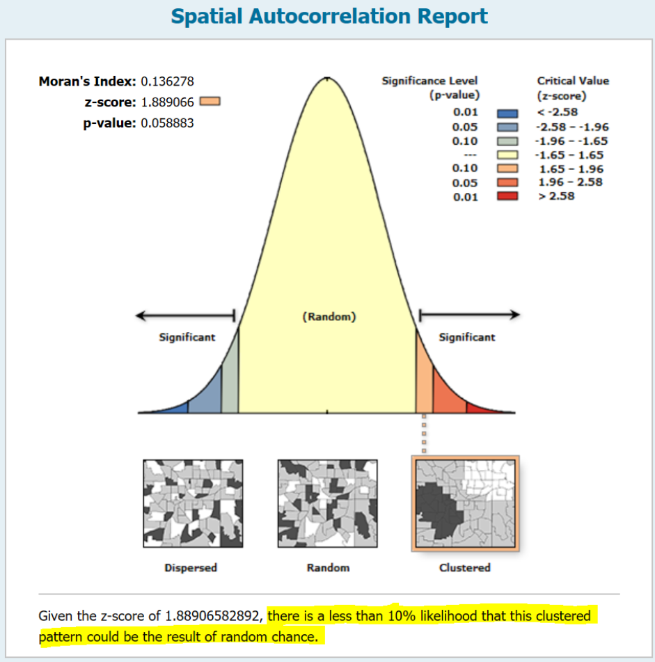

```{r setup, include=FALSE}
options(htmltools.dir.version = FALSE)

pacman::p_load(captioner, knitr, kableExtra, tidyverse)

knitr::opts_chunk$set(fig.retina = 3,                       
                      echo = TRUE,                       
                      eval = TRUE,                       
                      message = FALSE,                       
                      warning = FALSE,
                      out.width="100%")

```


```{r, echo = FALSE}


```

Photo by <a href="https://unsplash.com/@ralphkayden?utm_source=unsplash&utm_medium=referral&utm_content=creditCopyText">Ralph (Ravi) Kayden</a> on <a href="https://unsplash.com/photos/Km_K1U2isPg?utm_source=unsplash&utm_medium=referral&utm_content=creditCopyText">Unsplash</a>
  

# What is spatial autocorrelation?

Spatial autocorrelation is the degree of spatial dependency, association or
correlation between the value of an observation of a spatial entity and the
values of neighboring observations of the same variable [@Grekousis2020].

In this post, I will be exploring the different approaches to measure global spatial autocorrelation.


## Moran's I test

Moran’s I index computes global spatial autocorrelation by taking into account
feature locations and attribute values (of a single attribute) simultaneously.

The formula can be written as:

$$I = \frac{n}{\sum^{n}_{i}\sum^{n}_{j}w_{ij}}\frac{\sum^{n}_{i}\sum^{n}_{j}w_{ij}(x_i-\bar{x})(x_j-\bar{x})}{\sum^{n}_{i}(x_i-\bar{x})^2}$$

where

n is the number of spatial features

$x_i$ is the attribute value of feature i

$x_j$ is the attribute value of feature j

$\bar{x}$ is the mean of this attribute

$w_{ij}$ is the spatial weight between feature i and j

$\sum^{n}_{i}\sum^{n}_{j}w_{ij}$ is the aggregation of all spatial weights


## How to interpret the result

[@Grekousis2020] has a very good explanation of how to interpret the results from the different tests and what to look out for when doing the spatial analysis.

We will reject the null hypothesis of zero spatial autocorrelation when the p-value is less than 0.05.

- Positive z value indicates there is positive spatial autocorrelation, i.e. clustering of high or low values

- Negative z value indicates there is negative spatial autocorrelation, i.e. a dispersed pattern of values


```{r, echo = FALSE}


```

*Taken from [this github](https://mgimond.github.io/simple_moransI_example/)*


Another important note when using this statistical test is even if the statistical test shows that there is no autocorrelation on the global level, it doesn't imply there are no clusters on the local level [@Grekousis2020].


The authors also mentioned that global statistics are more effective when there is a consistent trend across the study area.


The following are other practical guidelines recommended by the authors:

- Results are reliable if we have at least 30 spatial objects

- Row standardization should be applied if necessary. Row standardization
is common when we have polygons


## Geary's C test

This is another method to measure global spatial autocorrelation.

Note that this approach is more sensitive to the differences in small neighborhoods.

Hence when we are searching for global spatial autocorrelation, Moran's I is usually preferred.

The formula can be written as follows:

$$C=\frac{(n-1)}{2\sum^{n}_{i}\sum^{n}_{j}w_{ij}}\frac{\sum^{n}_{i}\sum^{n}_{j}w_{ij}(x_i-x_j)^2}{\sum^{n}_{i}(x_i-\bar{x})^2}$$

where

n is the total number of spatial objects

$x_i$ is the attribute value of feature i

$x_j$ is the attribute value of feature j

$\bar{x}$ is the mean of this attribute

$w_{ij}$ is the spatial weight between feature i and j

$\sum^{n}_{i}\sum^{n}_{j}w_{ij}$ is the aggregation of all spatial weights


## General G statistics

In this demonstration, I will focus on Moran's I and Geary's C test.

But for completeness, I will just put a brief description of general G statistics below.

Similar to Moran's I, we will reject the null hypothesis when the p-value is less than 0.05.

- Positive z value indicates a clustering of high values

- Negative z value suggests there are cluster of low values

Note that if the clusters of low values coexist with the clusters with high values in the study area, they tend to counterbalance each other. 

Hence, Moran's I is more suitable to trace this association on a global scale.

The author suggests the following while using this statistics test:

- This statistic works only with positive values

- A binary weights matrix (e.g. fixed distance band, polygon contiguity, k-nearest
neighbors or Delaunay triangulation) is more appropriate for this statistic

- When we use binary weighting and fixed distance, the size of the polygons
might matter

- More common to use the local version of the General G-Statistic
index, as it provides the exact locations of the clusters


# Demonstration

I will download Malaysia shape files from [this link](https://earthworks.stanford.edu/catalog/stanford-nv753sn0493).

For more explanations on shape files, please refer to my [previous post](https://jasperlok.netlify.app/posts/2022-02-12-point-pattern-analysis/).

To make the demonstration, I will also use the [total number of newborn babies data](https://www.data.gov.my/data/en_US/dataset/live-births-by-state-administrative-district-and-sex/resource/4d65fb23-3c35-448f-b2c9-49ee57e6fac8) between 2015 and 2021.


```{r, echo = FALSE}
knitr::include_graphics("image/baby.jpg")

```


## Setup the environment

First, I will setup the environment by calling the necessary packages.

```{r}
pacman::p_load(tidyverse, sf, spdep, tmap, janitor)

```

I will also set the `tmap_mode` to `view` so that I can interact with the graphs.

```{r}
tmap_mode('view')

```

```{r, echo = FALSE}
set.seed(1234)

```

## Import the data

### Import shp files

Next, I will import the dataset into the environment.

For simplicity, I will focus on spatial analysis of West Malaysia.

```{r}
msia_map <- 
  st_read(dsn = "data", layer = "MYS_adm2") %>% 
  filter(!NAME_1 %in% c("Sabah", "Sarawak", "Labuan"))

```

### Import Malaysia 2015 - 2021 birth rate dataset

I will also import the dataset on 2015 - 2021 birth rate by administrative district into the environment.

```{r}
msia_birth <- 
  read_csv("data/live-births-by-state-administrative-district-and-sex-2015-2021.csv") %>%
  clean_names() 

```

As there are some districts that only have a total number of births for 2021 and I am unable to find online whether these districts have split out from other existing districts, I will focus on the demonstration of the number of birth between 2015 and 2020.

I will also reshape the dataset for analysis later.

```{r}
msia_birth <-
  msia_birth %>%
  filter(year != 2021) %>%
  group_by(year, state, administrative_district) %>%
  summarize(total = sum(value)) %>%
  ungroup() %>%
  pivot_wider(names_from = year,
              names_prefix = "total_birth_",
              values_from = total,
              values_fill = 0)

```

As some of the namings of the administrative districts are different between the map data frame and the dataset on the number of birth, hence I will perform some data cleaning before joining the datasets.

```{r}
msia_birth <-
  msia_birth %>%
  # change the first letter of each word to capital letter
  mutate(administrative_district = str_to_title(administrative_district)) %>%
  # recode the districts
  mutate(administrative_district_recoded = 
           case_when(administrative_district == "Mualim" ~ "Batang Padang",
                     administrative_district == "Kuala Nerus" ~ "Kuala Terengganu",
                     administrative_district == "Bagan Datuk" ~ "Hilir Perak",
                     administrative_district == "Kecil Lojing" ~ "Gua Musang",
                     administrative_district == "Selama" ~ "Larut and Matang",
                     administrative_district == "Larut & Matang" ~ "Larut and Matang",
                     administrative_district == "Johor Bahru" ~ "Johor Baharu",
                     administrative_district == "Kluang" ~ "Keluang",
                     administrative_district == "Kulai" ~ "Kulaijaya",
                     administrative_district == "Tangkak" ~ "Ledang",
                     administrative_district == "Pasir Puteh" ~ "Pasir Putih",
                     is.na(administrative_district) == TRUE ~ state,
                     TRUE ~ administrative_district)) %>%
  # remove the string so that it can be matched with the naming stated in the map data frame
  mutate(administrative_district_recoded = 
           str_replace(administrative_district_recoded, "W.P. ", "")) %>%
  # sum the total number of birth by the recoded administrative districts
  group_by(state, administrative_district_recoded) %>%
  summarise_at(c("total_birth_2015",
                 "total_birth_2016",
                 "total_birth_2017",
                 "total_birth_2018",
                 "total_birth_2019",
                 "total_birth_2020"),
               function(x) sum(x)) %>%
  ungroup()

```

I will also calculate the change in a number of birth over 6 years period.

```{r}
msia_birth <-
  msia_birth %>%
  mutate(change_in_birth_2015_2020 = total_birth_2020/total_birth_2015 - 1)

```

## Join the datasets together

As the map is imported as simple features (i.e. one of the data types), this allows us to use `left_join` function to 

```{r}
msia_map_birth <-
  msia_map %>%
  left_join(msia_birth,
            by = c("NAME_2" = "administrative_district_recoded"))

```


Next, I will visualize the results by using functions from `tmap` package.

```{r}
change <- tmap_mode('view') + 
  tm_shape(msia_map_birth) +
  tm_polygons("change_in_birth_2015_2020",
              id = "NAME_2",
              popup.vars = c("District: " = "NAME_2",
                            "Total Birth in 2015: " = "total_birth_2015",
                            "Total Birth in 2020: " = "total_birth_2020",
                            "Change in Birth from 2015 to 2020: " = "change_in_birth_2015_2020"), 
             breaks = c(-0.75, -0.5, -0.25, 0, 0.25, 0.5, 0.75))

birth <- tmap_mode('view') + 
  tm_shape(msia_map_birth) +
  tm_polygons("total_birth_2020", 
              id = "NAME_2",
              popup.vars = c("District: " = "NAME_2",
                            "Total Birth in 2015: " = "total_birth_2015",
                            "Total Birth in 2020: " = "total_birth_2020",
                            "Change in Birth from 2015 to 2020: " = "change_in_birth_2015_2020"))

tmap_arrange(change, 
             birth,
             ncol = 2,
             nrow = 1,
             sync = TRUE)

```

Interesting.

Most of the administrative districts have experienced a drop in total newborn babies from 2015 to 2020.

The decrease in total newborn babies seems to be quite uniform across different administrative districts.


## Global Spatial Autocorrelation

### Derive the longitude and latitude of each polygon

I will first derive the longitude and latitude of each districts from the data.

```{r}
longitude <- map_dbl(msia_map$geometry, ~st_centroid(.x)[[1]])
latitude <- map_dbl(msia_map$geometry, ~st_centroid(.x)[[2]])
coords <- cbind(longitude, latitude)

```

### Derive spatial weights

Over here, I have used k nearest neighbors to derive the spatial weights.

```{r}
kneigh <- knearneigh(coords, k = 3)
knn <- knn2nb(kneigh)

```

Refer to my [previous post](https://jasperlok.netlify.app/posts/2023-02-12-distance-spatial-weights/) on how to derive distance-based neighbors.

Then, I will use `nb2listw` function to find the neighbor lists.

Note that I have indicated the style to be "W" so that the output is row standardized.

```{r}
weight_list_knn <- nb2listw(knn, 
                   style = "W", 
                   zero.policy = TRUE)

```

### Moran's I

Great!

Once we derived all the necessary info, I will perform the global Moran's I test.

```{r}
moran.test(msia_map_birth$change_in_birth_2015_2020,
           listw = weight_list_knn,
           zero.policy = TRUE,
           na.action = na.omit)

```

We fail to reject the null hypothesis as the p-value is more than 0.05.

We could take one step further by running the random permutations of the global Moran I test by using `moran.mc` function.


```{r}
moran_sim <- 
  moran.mc(msia_map_birth$change_in_birth_2015_2020, 
           listw = weight_list_knn, 
           nsim = 999,
           zero.policy = TRUE,
           na.action = na.omit)

moran_sim

```

Again, we saw the p-value is more than 0.05, i.e. fail to reject the null hypothesis.

Below is the simulated Moran's I result:

```{r}
moran_sim_value <- 
  moran_sim$res %>%
  as_tibble()


ggplot(moran_sim_value, aes(value)) +
  geom_histogram() +
  geom_vline(xintercept = moran_sim$statistic, color = "red", size = 1.5, linetype = 2) +
  xlab("") +
  ylab("Frequency") +
  labs(title = "Histogram of Simulated Moran's I") +
  theme_minimal()

```


As mentioned earlier, even if the statistical test for global spatial autocorrelation fails, it does not mean that there is any spatial autocorrelation on the local level.


### Geary's C test

Next, I will perform Geary's C test by using `geary.mc` function as shown below.

```{r}
geary.mc(msia_map_birth$change_in_birth_2015_2020, 
           listw = weight_list_knn, 
           nsim = 999,
           zero.policy = TRUE)

```

Similarly, we fail to reject the null hypothesis as the p-value is more than 0.05.


# Conclusion

That's all for the day!

Thanks for reading the post until the end.

Feel free to contact me through [email](mailto:jasper.jh.lok@gmail.com) or [LinkedIn](https://www.linkedin.com/in/jasper-l-13426232/) if you have any suggestions on future topics to share.

Refer to this link for the [blog disclaimer](https://jasperlok.netlify.app/blog_disclaimer.html).

Till next time, happy learning!

```{r, echo = FALSE}


```

Photo by <a href="https://unsplash.com/es/@ruddycorporanx?utm_source=unsplash&utm_medium=referral&utm_content=creditCopyText">Ruddy Corporan</a> on <a href="https://unsplash.com/photos/a-ywZE_amos?utm_source=unsplash&utm_medium=referral&utm_content=creditCopyText">Unsplash</a>
  
  

