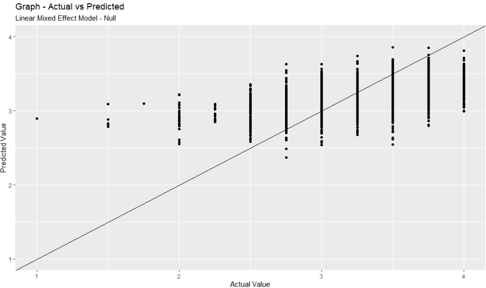

```{r setup, include=FALSE}
options(htmltools.dir.version = FALSE)

pacman::p_load(captioner, knitr, kableExtra, performance, parameters, see, effectsize, report, jtools)

```


```{r, echo = FALSE}
knitr::include_graphics("image/mixed_colors.jpg")

```

Photo by <a href="https://unsplash.com/@rhondak?utm_source=unsplash&utm_medium=referral&utm_content=creditCopyText">RhondaK Native Florida Folk Artist</a> on <a href="https://unsplash.com/photos/_Yc7OtfFn-0?utm_source=unsplash&utm_medium=referral&utm_content=creditCopyText">Unsplash</a>

In this post, I will be exploring the linear mixed effect model.

# What is a mixed effect model?

In real life, data is often messy. The data might have some "grouping", "clustering" or "hierarchical" within the dataset. 

This is where we could use mixed effect model to take into account the "grouping", "clustering" or "hierarchical" within the dataset while fitting the model.


It seems like the mixed effect model has different names under different disciplines [@Clark]:

- Variance components

- Random intercepts and slopes

- Random effects

- Random coefficients

- Varying coefficients

- Intercepts- and/or slopes-as-outcomes

- Hierarchical linear models

- Multilevel models (implies multiple levels of hierarchically clustered data)

- Growth curve models (possibly Latent GCM)

- Mixed effects models


# Fixed effect vs random effect

Below is the difference between fixed and random effect [@Shrikanth]:

- **Fixed effect** - the predictor variable, i.e. the effect we are trying to measure after accounting for random variability

- **Random effect** - best defined as a noise in the data. It arises from uncontrollable variability within the sample


# Intraclass Correlation Coefficient (ICC)

Another important concept for mixed effect models is the intraclass correlation coefficient.

As suggested by the author[@Kumar], it is recommended to calculate the ICC before fitting a random effect model.

The ICC formula can be written as follows:

$$\rho=\frac{group\  variance}{group\  variance + residual\ variance}$$


Effectively, ICC tells us how "strongly" clustered the data is.

According to the [documentation page](https://easystats.github.io/effectsize/reference/interpret_icc.html) of the ICC function, The ICC is a value between 0 and 1, where values below 0.5 indicate poor reliability, between 0.5 and 0.75 moderate reliability, between 0.75 and 0.9 good reliability, and any value above 0.9 indicates excellent reliability.


The author also suggested that the ICC should be calculated on an "empty" or "null" model.


# Model Building Strategy

To build the model, the author suggested building some simple, preliminary models so that they can be used to evaluate the larger models [@Roback2021].


With that, we will start by performing extensive exploratory data analysis at each level.


# Demonstration

In this demonstration, I will be using `lmer` function from `lme4` package to explain the model.

I will be using `multilevelmod` package to assist me in building the models by using functions from `tidymodels` package.

## Setup the environment

First, I will call the relevant packages to set up the environment.

```{r}
pacman::p_load(tidyverse, tidymodels, ingredients, multilevelmod, lme4, janitor, broom.mixed, tidyr)

```


## Import the data

I will use this chocolate rating data from [tidytuesday](https://github.com/rfordatascience/tidytuesday) for this demonstration.


```{r, echo = FALSE}
knitr::include_graphics("image/chocolate.jpg")

```

Photo by <a href="https://unsplash.com/@pushpak88?utm_source=unsplash&utm_medium=referral&utm_content=creditCopyText">Pushpak Dsilva</a> on <a href="https://unsplash.com/photos/r-hQw_obFd0?utm_source=unsplash&utm_medium=referral&utm_content=creditCopyText">Unsplash</a>
  


```{r}
df <- 
  read_csv("https://raw.githubusercontent.com/rfordatascience/tidytuesday/master/data/2022/2022-01-18/chocolate.csv") %>% 
  clean_names()

```


As there are too many company locations, I will group the locations with lesser count as "others".

```{r}
recode_company_location <- 
  tabyl(df$company_location) %>% 
  as_tibble() %>% 
  arrange(desc(percent)) %>% 
  rename(company_location = `df$company_location`) %>% 
  mutate(cumsum = cumsum(percent),
         company_location_recode = case_when(cumsum >= 0.8 ~ "others",
                                      TRUE ~ company_location)) %>% 
  select(c(company_location, company_location_recode))

```


Once that is done, I will wrangle & clean up the data before building the model.

```{r}
df_1 <-
  df %>% 
  # for simplicity, drop the missing value
  drop_na() %>% 
  # mutate the cocoa percent column so that the info is in numeric format
  mutate(cocoa_percent = str_replace(cocoa_percent, "%", ""),
         cocoa_percent = as.numeric(cocoa_percent)) %>%
  # join with the recode data and rename the recoded column
  left_join(recode_company_location) %>% 
  select(-company_location) %>% 
  rename(company_location = company_location_recode) %>% 
  # split the ingredient columns
  separate_wider_delim(ingredients,
                       delim = "-",
                       names = c("num_ingredients", "components")) %>%
  # create dummy variables to capture the ingredients in the chocolate
  mutate(contain_salt = if_else(str_detect(components, "\\Sa"),1,0),
         contain_lecithin = if_else(str_detect(components, "\\L"),1,0),
         contain_vanilla = if_else(str_detect(components, "\\V"),1,0),
         contain_cocoa = if_else(str_detect(components, "\\C"),1,0),
         contain_other_sweet = if_else(str_detect(components, "\\S*"),1,0),
         contain_bean = if_else(str_detect(components, "\\B"),1,0)) %>%
  # create dummy variables to capture tastes
  mutate(taste_fruity = if_else(
    str_detect(most_memorable_characteristics, 
               paste(c("orange","lemon","fruit","banana","strawberry","melon","berry","cherry"),
                     collapse = "|")),
               1,0),
    taste_sweet = if_else(str_detect(most_memorable_characteristics, "sweet"),1,0),
    taste_earthy = if_else(str_detect(most_memorable_characteristics, "earthy"),1,0),
    taste_cocoa = if_else(str_detect(most_memorable_characteristics, "cocoa"),1,0),
    taste_nutty = 
      if_else(str_detect(most_memorable_characteristics,
                         paste(c("nutty","nut","nuts"),
                               collapse = "|")),
              1,0),
    taste_sour = if_else(str_detect(most_memorable_characteristics, "sour"),1,0),
    taste_intense = if_else(str_detect(most_memorable_characteristics, "intense"),1,0),
    taste_rich = if_else(str_detect(most_memorable_characteristics, "rich"),1,0),
    taste_mild = if_else(str_detect(most_memorable_characteristics, "mild"),1,0),
    taste_fatty = if_else(str_detect(most_memorable_characteristics, "fatty"),1,0),
    taste_creamy = if_else(str_detect(most_memorable_characteristics, "creamy"),1,0),
    taste_roast = if_else(str_detect(most_memorable_characteristics, "roasty"),1,0),
    taste_bitter = if_else(str_detect(most_memorable_characteristics, "bitter"),1,0),
    taste_burnt = if_else(str_detect(most_memorable_characteristics, "burnt"),1,0),
    taste_spicy = if_else(
    str_detect(most_memorable_characteristics, 
               paste(c("spicy","pepper","spice"),
                     collapse = "|")),
    1,0),
    taste_sandy = if_else(str_detect(most_memorable_characteristics, "sandy"),1,0)
         )

```


# Model Building

## Null Model

First, I will first fit a random intercept model.

I will first define the model I want to build.

```{r}
lmer_specs <- 
  linear_reg() %>% 
  set_engine("lmer")

```

Then, I will fit the model by indicating the formula and dataset.

```{r}
lmer_fit <- 
  lmer_specs %>% 
  fit(rating ~ 1 + (1|company_manufacturer), data = df_1)

```

We could call the fitted model results by indicating `fit` object.

```{r}
lmer_fit$fit

```

Alternatively, we could pass the fit object to the `summary` function.

```{r}
summary(lmer_fit$fit)

```

Based on the results above, we noted the following:

- On average, the chocolate rating is 3.14

- Group variance is 0.047

- Residual variance is 0.136


We could calculate the ICC by using the info above:

$\rho=\frac{0.047}{0.047 + 0.136}$ 
= `r 0.04751/(0.04751 + 0.13602)`


Another method is to use `icc` function from `performance` package to calculate the necessary figure.

```{r}
icc(lmer_fit$fit)

```

According to the [documentation page](https://easystats.github.io/performance/reference/icc.html), following are the explanations:

- Adjusted ICC: Only looks at the random effects

- Unadjusted ICC: Also takes the fixed effects variances into account


```{r}
icc(lmer_fit$fit, by_group = TRUE)

```

### Model Performance

Next, I will check the model performance.

```{r}
performance::model_performance(lmer_fit$fit)

```

From the results above, we noted that there are R2 (cond.) and R2 (marg.).

Below is the explanation on both R2 extracted from this [article](https://besjournals.onlinelibrary.wiley.com/doi/10.1111/j.2041-210x.2012.00261.x#:~:text=Marginal%20R2%20is%20concerned,both%20fixed%20and%20random%20factors):

- Marginal R2 is concerned with variance explained by fixed factors

- Conditional R2 is concerned with variance explained by both fixed and random factors.

One important note is the definitions of the R2 above are slightly different from the traditional R2. 

This [article](https://besjournals.onlinelibrary.wiley.com/doi/10.1111/j.2041-210x.2012.00261.x) discussed the difference in R2 definitions.


Nevertheless, we could call the model performance by using `glance` function, `summ` function or `report` function as shown below.

```{r}
lmer_fit %>% 
  glance()

```


This method I found online is also pretty cool. I love how it "tidies" the results so that it is easier to read.

```{r}
summ(lmer_fit$fit)

```

Or use `report` function to show the summarised model results.

```{r}
report(lmer_fit$fit) %>% 
  as.data.frame()

```

## Prediction

We could extract the prediction by using `augment` function from `tidymodels` package.

```{r}
prediction_df <-
  lmer_fit %>% 
  augment(df_1)

prediction_df

```

```{r, eval = FALSE}
ggplot(prediction_df, 
       aes(x = rating, y = .pred)) +
  geom_point() +
  geom_abline(slope = 1, intercept = 0) +
  xlab("Actual Value") +
  ylab("Predicted Value") +
  labs(title = "Graph - Actual vs Predicted",
       subtitle = "Linear Mixed Effect Model - Null")

```

```{r, echo = FALSE}


```


## Bigger model

Next, I will build a bigger model.

```{r}
lmer_fit_bigger <- 
  linear_reg() %>%
  set_engine("lmer") %>% 
  fit(rating ~ 
        ref 
      + company_location
      + cocoa_percent 
      + review_date 
      + num_ingredients
      + contain_salt 
      + contain_lecithin 
      + contain_cocoa 
      + taste_fruity 
      + taste_sweet
      + taste_earthy
      + taste_cocoa
      + taste_nutty
      + taste_sour
      + taste_intense
      + taste_rich
      + taste_mild
      + taste_fatty
      + taste_creamy
      + taste_roast
      + taste_bitter
      + taste_burnt
      + taste_spicy
      + taste_sandy
      + (1|company_manufacturer), 
      data = df_1)

```

Next, I will use `summ` function to summarise the model result.

```{r}
summ(lmer_fit_bigger$fit)

```


We could also use `anova` function to check whether there is an improvement in model fit.

```{r}
anova(lmer_fit$fit, lmer_fit_bigger$fit)

```

As the p-value is less than 0.05, we reject the null hypothesis and conclude that the additional variables improve the model fit.


## Other considerations

If the model fails to converge, this [post](https://glennwilliams.me/r4psych/mixed-effects-models.html#failure-to-converge-what-should-i-do) offers some suggestions on how we can fix the issue.


Alternatively, [this author](https://bookdown.org/anshul302/HE902-MGHIHP-Spring2020/Random.html#lmerErrors) offers suggestions on how we could fix singularity and convergence issues.


# Conclusion

That's all for the day!

Thanks for reading the post until the end.

Feel free to contact me through [email](mailto:jasper.jh.lok@gmail.com) or [LinkedIn](https://www.linkedin.com/in/jasper-l-13426232/) if you have any suggestions on future topics to share.

Refer to this link for the [blog disclaimer](https://jasperlok.netlify.app/blog_disclaimer.html).

Till next time, happy learning!

```{r, echo = FALSE}
knitr::include_graphics("image/purple.jpg")

```

Photo by <a href="https://unsplash.com/@dannylines?utm_source=unsplash&utm_medium=referral&utm_content=creditCopyText">Danny Lines</a> on <a href="https://unsplash.com/photos/XctPt-Tky-o?utm_source=unsplash&utm_medium=referral&utm_content=creditCopyText">Unsplash</a>
  
