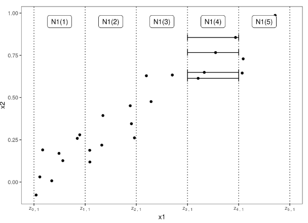
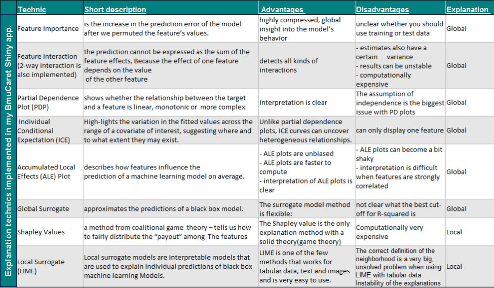

```{r setup, include=FALSE}
options(htmltools.dir.version = FALSE)

pacman::p_load(captioner, knitr, kableExtra)

```

In this post, I will be exploring another model explainability method, i.e. accumulated local effect.


```{r, echo = FALSE}


```

Photo by <a href="https://unsplash.com/@tcwillmott?utm_source=unsplash&utm_medium=referral&utm_content=creditCopyText">Thomas Willmott</a> on <a href="https://unsplash.com/photos/o4HzEnjXG8M?utm_source=unsplash&utm_medium=referral&utm_content=creditCopyText">Unsplash</a>
  

# Accumulated local effect

The general idea of why ACE is preferred over partial dependence plot is partial dependence plot cannot be trusted when the features of the machine learning model are correlated [@molnar2022].

The author further explained the correlation could greatly bias the estimated feature effect.


```{r, echo = FALSE, out.width = "120%"}


```

In short, what ALE is trying to do:

- Divide the features into intervals

- Calculate the difference in the prediction in the prediction when the feature is replaced with the upper & lower limit of the interval

- The differences are accumulated and centered

Voilà! That is how we obtained the ALE curve.


# Pros and cons

Below are the pros and cons of using ALE curve:

Pros

- ALE plots are unbiased

- ALE plots are faster to compute

- Interpretation of ALE plots is clear

- ALE plots are centered at zero

- Prediction function can be decomposed


Cons

- Interpretation of the effect across intervals is not permissible

- ALE effects may differ from the coefficients specified in a linear regression model when the features interact and are correlated

- The plots can become a bit shaky

- No perfect solution for setting the number of intervals

- Not accompanied by ICE curves

## Bonus


I happened to come across this comparison table on different model explainability methods.

```{r, echo = FALSE, out.width = "110%"}


```

*Taken from [this website](https://datascienceplus.com/model-explanation-with-bmucaret-shiny-application-using-the-iml-and-dalex-packages/)*


I feel the summary is quite well done and easy to understand.


# Demonstration

In this demonstration, I will be using the `accumulated_dependence` function from `ingredients` package to explain the model.

## Setup the environment

First, I will call the relevant packages to set up the environment.

```{r}
pacman::p_load(tidyverse, DALEX, DALEXtra, tidymodels, ingredients, themis, iml, ranger)

```


## Import the data

I will re-use one of the Kaggle datasets I previously used for model explainability.

```{r}
df <- read_csv("https://raw.githubusercontent.com/jasperlok/my-blog/master/_posts/2022-03-12-marketbasket/data/general_data.csv") %>%
  # drop the columns we don't need
  dplyr::select(-c(EmployeeCount, StandardHours, EmployeeID)) %>%
  # impute the missing values with the mean values
  mutate(
    NumCompaniesWorked = case_when(
      is.na(NumCompaniesWorked) ~ mean(NumCompaniesWorked, na.rm = TRUE),
      TRUE ~ NumCompaniesWorked),
    TotalWorkingYears = case_when(
      is.na(TotalWorkingYears) ~ mean(TotalWorkingYears, na.rm = TRUE),
      TRUE ~ TotalWorkingYears)
    ) %>%
  droplevels()

```


## Build a model

For simplicity, I will reuse the random forest model building code I wrote in my previous post so that we can focus this post on how we apply PDP to interpret the machine learning model results.

You can refer to my previous [post](https://jasperlok.netlify.app/posts/2022-04-16-lime/) on the explanations of the model building.

The only difference I made in this model building is instead of imputing the missing values during recipe stage, I imputed the missing values before building the model.

This is because the `accumulated_dependence` function I will be using later is unable to handle missing values.

```{r}
ranger_recipe <- 
  recipe(formula = Attrition ~ ., 
         data = df) %>%
  step_nzv(all_predictors()) %>%
  step_dummy(all_nominal_predictors()) %>%
  step_upsample(Attrition) %>%
  prep()

ranger_spec <- 
  rand_forest(trees = 1000) %>% 
  set_mode("classification") %>% 
  set_engine("ranger") 

ranger_workflow <- 
  workflow() %>% 
  add_recipe(ranger_recipe) %>% 
  add_model(ranger_spec) 

ranger_fit <- ranger_workflow %>%
  fit(data = df)

```


## Accumulated Local Effects

### Create explainer plot

Similarly to the last post, I will first create the explainer object by using the `explain_tidymodels` function.

```{r}
ranger_explainer <- explain_tidymodels(ranger_fit,
                   data = dplyr::select(df, -Attrition),
                   y = df$Attrition,
                   verbose = FALSE)

```

### Use `accumulated_dependence` function

Next, I will use `accumulated_dependence` function to derive ALE.

```{r}
ranger_ale_dept <- 
  accumulated_dependence(ranger_explainer,
                         N = 100,
                         variables = "Department")

```

Then, I will pass the object into `plot` function to visualize the results.

```{r}
plot(ranger_ale_dept)

```


The ALE will be a curve if the selected variable is in numeric form. 

```{r}
ranger_ale_yearCo <- 
  accumulated_dependency(ranger_explainer,
                         N = 1000,
                         variables = "YearsAtCompany")

plot(ranger_ale_yearCo)

```


Similarly, we could plot out the ALE curves for all the numeric variables.

```{r}
ranger_ale_num <- 
  accumulated_dependence(ranger_explainer,
                         N = 1000,
                         variable_type = "numerical")

plot(ranger_ale_num)

```

To satisfy my curiosity, I will also generate the partial dependence plot for the numeric variables for this model.

This will allow me to compare the results side by side.

```{r}
ranger_part_num <- 
  partial_dependence(ranger_explainer,
                         N = 1000,
                         variable_type = "numerical")

plot(ranger_part_num)

```

By comparing the ALE curve and PDP curve, it doesn't seem like the shape of the curves have changed drastically when we move from ALE to PDP.

But the effect of each variable does seem to be different under ALE and PDP methods.


## Use `model_profile` function

Alternatively, we could use the `model_profile` function from `DALEX` package to show the accumulated local effect plot.

I will also pass `accumulated` to the type argument to derive ALE result before plotting the result.

```{r}
ranger_company_ale <- model_profile(ranger_explainer, 
                                    variables = "YearsAtCompany", 
                                    type = "accumulated")

plot(ranger_company_ale)

```


# Conclusion

That's all for the day!

Thanks for reading the post until the end.

Feel free to contact me through [email](mailto:jasper.jh.lok@gmail.com) or [LinkedIn](https://www.linkedin.com/in/jasper-l-13426232/) if you have any suggestions on future topics to share.

Refer to this link for the [blog disclaimer](https://jasperlok.netlify.app/blog_disclaimer.html).

Till next time, happy learning!

```{r, echo = FALSE}
knitr::include_graphics("image/light.jpg")

```

Photo by <a href="https://unsplash.com/@jxb511?utm_source=unsplash&utm_medium=referral&utm_content=creditCopyText">John Bakator</a> on <a href="https://unsplash.com/photos/vtzuJbsaFSY?utm_source=unsplash&utm_medium=referral&utm_content=creditCopyText">Unsplash</a>
  

