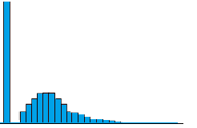
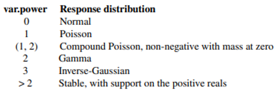

```{r setup, include=FALSE}
options(htmltools.dir.version = FALSE)

pacman::p_load(captioner, knitr, kableExtra, tidyverse)

knitr::opts_chunk$set(fig.retina = 3,                       
                      echo = TRUE,                       
                      eval = TRUE,                       
                      message = FALSE,                       
                      warning = FALSE,
                      out.width="100%")

```

In this post, I will be exploring Tweedie distribution.

```{r, echo = FALSE}


```

Photo by <a href="https://unsplash.com/@dancristianpaduret?utm_source=unsplash&utm_medium=referral&utm_content=creditCopyText">Dan Cristian Pădureț</a> on <a href="https://unsplash.com/photos/zm1oNbYS7DY?utm_source=unsplash&utm_medium=referral&utm_content=creditCopyText">Unsplash</a>


When I first encountered this distribution many years ago, I have to say the name of the distribution reminds me of a cartoon I used to watch when I was younger...


*Taken from giphy*


Tweedie distribution is a special case of an exponential distribution [@Glen]. 

It could generate a distribution with a cluster of data with zero value as shown below.

```{r, echo = FALSE}


```

*Taken from [this website](https://www.statisticshowto.com/tweedie-distribution/)*

This can be very handy when we want to model insurance claims.


# Parameters

In R `statmod` package, the Tweedie distribution has two arguments:

- var.power

- link.power


```{r, echo = FALSE}


```

*Taken from [R documentation](https://cran.r-project.org/web/packages/statmod/statmod.pdf)*


At the point of writing, I can't seem to find any materials to explain the `link.power` argument in the function, except link.power = 1 means we are using a log link.

# Demonstration

## Setup the environment

I will be using the Tweedie distribution in `statmod` package.

```{r}
pacman::p_load(tidyverse, CASdatasets, tidymodels, statmod, ghibli)

```


## Import the data

For this demonstration, I will be using the car insurance dataset from `CASdatasets` package.

```{r, echo = FALSE}
knitr::include_graphics("image/insurance.jpg")

```

Photo by <a href="https://unsplash.com/pt-br/@vladdeep?utm_source=unsplash&utm_medium=referral&utm_content=creditCopyText">Vlad Deep</a> on <a href="https://unsplash.com/photos/mCqi3MljC4E?utm_source=unsplash&utm_medium=referral&utm_content=creditCopyText">Unsplash</a>
  


```{r}
data(pg17trainpol)
data(pg17trainclaim)

pol_df <- pg17trainpol
rm(pg17trainpol)

clm_df <- pg17trainclaim
rm(pg17trainclaim)

```

I will rename the datasets so that the name of the datasets are shorter.

In this demonstration, I will perform predictions on the claim counts.

To do so, I will count how many times the insureds have made claims under each policy.

```{r}
clm_cnt <-
  clm_df %>% 
  group_by(id_client, id_vehicle) %>% 
  summarise(tot_clm_cnt = sum(claim_nb))

```

Then, I will join the claim count with the main dataset before performing any predictions.

For simplicity, I will also remove any rows with missing values.

```{r}
pol_clm_df <-
  pol_df %>% 
  left_join(clm_cnt
            ,by = c("id_client", "id_vehicle")) %>% 
  mutate_at(c("tot_clm_cnt")
            ,function(x) replace_na(x, 0)) %>% 
  drop_na()

```


## Model Building

Now I will build the GLM model with Tweedie distribution.

```{r}
clm_cnt_glm <-
  glm(tot_clm_cnt ~ 
        drv_age1 
      + drv_drv2
      + vh_age
      + pol_bonus
      + pol_coverage
      + pol_usage
      + pol_duration
      + pol_sit_duration
      + pol_pay_freq
      + vh_type
      + vh_speed
      + vh_value
      + vh_weight
      ,family = tweedie(var.power = 1.8
                        ,link.power = 0.8)
      ,data = pol_clm_df
      )

```

I will also run the chi-square test to check the significance of the predictors.

```{r}
anova(clm_cnt_glm, test = "Chisq")

```

From the result above, it seems like having the vehicle type doesn't improve the model since the p-value is less than 0.05.


## Smaller Model

Next, I will build a smaller model and perform a statistical test to determine which model to use.

As suggested by [@Rodriguez2023], we will be using F-test to decide which model we should be using.

In general, to perform an F-test, we will do the following steps [@PennState]:

- Build a full model

- Then, build a smaller model

- Use F-statistics to guide us on whether we should be accepting the smaller model


$H_0$: Use The Smaller Model

$H_\alpha$: Use Full Model


With that, I build a smaller model without the following variables:

- drv_drv2

- pol_pay_freq

- vh_type


```{r}
clm_cnt_glm_smaller <-
  glm(tot_clm_cnt ~ 
        drv_age1 
      + vh_age
      + pol_bonus
      + pol_coverage
      + pol_usage
      + pol_duration
      + pol_sit_duration
      + vh_speed
      + vh_value
      + vh_weight
      ,family = tweedie(var.power = 1.8,link.power = 0.8)
      ,data = pol_clm_df
      )

```

Next, I will pass the models into the `anova` function and indicate I would like to perform a likelihood ratio test.

```{r}
anova(clm_cnt_glm_smaller
      ,clm_cnt_glm
      ,test = 'F')

```

The p-value is less than 0.05 and we will reject the null hypothesis. There is a statistical signification linear association between claim count and additional parameters.


## Model Performance

In this next section, I will check the model performance.

Before that, I will use `augment` function to generate the prediction.

The beauty of this function is that it could help us to append the predictions to the dataset we pass into the function.

```{r}
clm_cnt_glm_pred <-
  clm_cnt_glm %>% 
  augment(pol_clm_df
          ,type.predict = "response")

```

Note that the default prediction type is `link`. To get the same scale as the target variable, I will indicate the `type.predict` would be "response".


To double-check, I have also run predictions by using the `predict` function from base R.

```{r}
predict(clm_cnt_glm
        ,newdata = pol_clm_df
        ,type = "response"
        ) %>% 
  as_tibble()

```


Lastly, I will pass the target variable and fitted values to `rmse` function to compute the RMSE.

```{r}
rmse(clm_cnt_glm_pred,
     truth = tot_clm_cnt,
     estimate = .fitted)

```

It seems like on average, our model is predicting 0.4 more or less than claims than actual.

To further improve the model, we could consider modeling the different coverage types separately.


Following is the proportion of different claim counts within each policy converage:

```{r}
pol_clm_df %>% 
  mutate(tot_clm_cnt = as.factor(tot_clm_cnt)) %>% 
  ggplot(aes(pol_coverage, fill = tot_clm_cnt)) +
  geom_bar(position = "fill") +
  scale_fill_manual(values = ghibli_palette(name = "PonyoLight"
                                             ,n = 7
                                             ,type = "discrete")) +  
  scale_y_continuous(labels = scales::percent) +
  xlab("") +
  ylab("") +
  labs(title = "Proportion of Claim Counts by Different Policy Coverage") +
  coord_flip() +
  theme_minimal() +
  theme(legend.position = "bottom") +
  guides(fill = guide_legend(nrow = 1, byrow = TRUE))


```

From the results, we could observe Maxi has the highest proportion of policies making at least one claim.

We could improve the overall model performance by making predictions on each policy coverage separately.


# Conclusion

That's all for the day!

Thanks for reading the post until the end.

Feel free to contact me through [email](mailto:jasper.jh.lok@gmail.com) or [LinkedIn](https://www.linkedin.com/in/jasper-l-13426232/) if you have any suggestions on future topics to share.

Refer to this link for the [blog disclaimer](https://jasperlok.netlify.app/blog_disclaimer.html).

Till next time, happy learning!

```{r, echo = FALSE}


```

Photo by [Karolina Grabowska](https://www.pexels.com/photo/green-calculator-on-yellow-background-5412432/)

