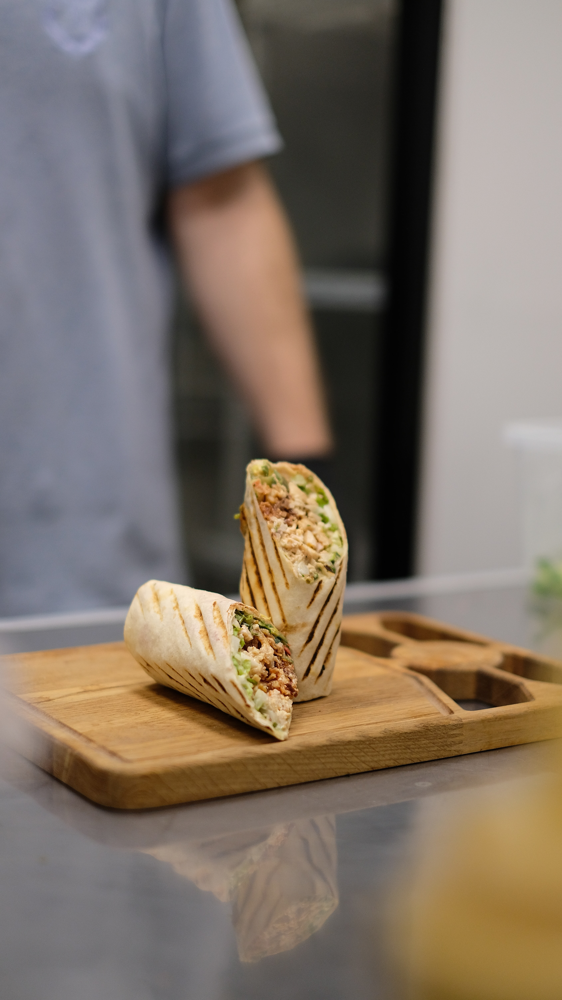
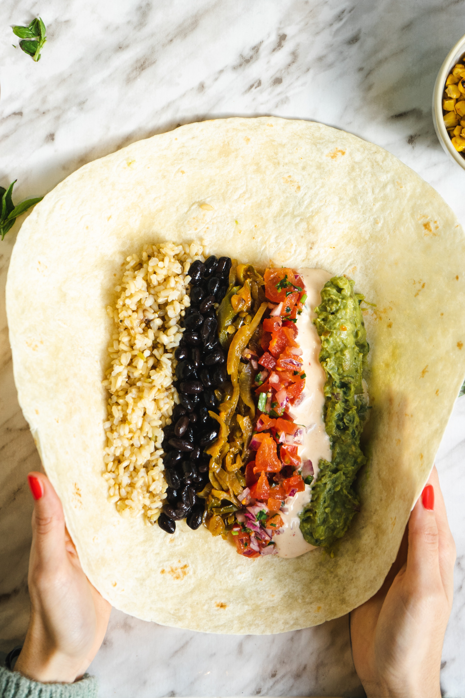

```{r, set.seed(123), include=FALSE}
options(htmltools.dir.version = FALSE)

pacman::p_load(captioner, knitr, kableExtra, tidyverse)

knitr::opts_chunk$set(fig.retina = 3,                       
                      echo = TRUE,                       
                      eval = TRUE,                       
                      message = FALSE,                       
                      warning = FALSE,
                      out.width="100%")

```

In this post, I will be exploring how to use Boruta to perform feature selection.

```{r, echo = FALSE}


```

Photo by [Kamila Bairam](https://www.pexels.com/photo/wrap-cut-in-half-on-a-cutting-board-12123661/)

# What is feature selection?

[@Brownlee2020] explained that feature selection is the process of reducing the the number of input variables when developing a predictive model.

The author further explained the benefits of feature selections, which includes:

- Reduce the computational cost of modeling

- This could improve the performance of the model


# All Relevant Method vs Minimal Optimal Class

Before jumping into how Boruta works, let's look at the different all relevant method and minimal optimal class.


All relevant method (eg. Boruta) aims to find all features connected with the decision, where minimal optimal class (eg. XGBoost) aims to provide a possibly compact set of features which carry enough information for a possibly optiomal classification on the reduced set [@Kursa2022].

The author also mentioned minimal optimal methods are generally cherry-picking features usable for classification, regardless if this usability is significant or not, which is an easy way to overfitting. Boruta is much more robust in this manner.

# So, how does Boruta work?


Below is my simple explanation on how it works after referencing to different materials:

- Create permutated features from existing features (a.k.a. shadow features)

- Calculate the Z-score and the max Z score from the shadow features will be taken as the cutoff

- Any existing features with Z score lower than the cutoff will be deemed as "redundant" and vice versa

- Repeat this process X times

- Then, a two sided test is performed to classify the features into "Confirmed", "Tentative" and "Rejected"

For more information, you refer to the page 3 of [original paper](https://core.ac.uk/download/pdf/6340269.pdf?repositoryId=153).


Alternatively, I happened to come across this Youtube video on the explanation on how [Boruta](https://youtu.be/hCwTDTdYirg?si=gd1f8lMNDRp27W4T) works and I find it helpful.


# Demonstration

In this demonstration, I will be using the Seoul bike sharing dataset from [UCL website](https://archive.ics.uci.edu/dataset/560/seoul+bike+sharing+demand) for the exploration.

## Setup the environment

First, I will load the necessary packages into the environment.

```{r}
pacman::p_load(tidyverse, janitor, lubridate, Boruta, ranger)

```

## Import Data

Next, I will import the data into the environment.

I will also perform some basic data wrangling before using Boruta.

```{r}
df <- 
  read_csv("data/SeoulBikeData.csv", locale = locale(encoding = "latin1")) %>% 
  clean_names() %>% 
  mutate(date = dmy(date)
         ,year = year(date)
         ,month = month(date),
         ,weekday = wday(date, label = TRUE)) %>% 
  mutate_at(c("hour", "year", "month")
            ,function(x) as.factor(x))

```

I have also included a "random noise" in the dataset to see whether the algorithm will pick up this column is unimportant.

```{r}
df <-
  df %>% 
  mutate(random_noise = rnorm(nrow(df), 0, 1))

```

## Boruta

To perform Boruta, I will be using `Boruta` function from `Boruta` package.

For reproducibility, I will specify the random seed before running Boruta.

```{r}
boruta_randForest <- Boruta(rented_bike_count ~ . -date
                            ,data = df
                            ,doTrace = 2)

boruta_randForest

```

By default, `Boruta` function uses Random Forest to perform feature selection. At the point of writing, the function is using random forest from `ranger` package.

### Importance under Different Runs

We could plot out the importance of the features over the different runs.

```{r}
plotImpHistory(boruta_randForest)

```

According to the [documentation](https://cran.r-project.org/web/packages/Boruta/Boruta.pdf), below are the meaning for the different colors in `Boruta` plots:

```{r, echo = FALSE}
boruta_df <- 
  tibble(
    color = c("Green", "Yellow", "Red", "Blue")
    ,Reference = c("Confirmed", "Tentative", "Rejected", "Shadow")
)

boruta_df %>% 
  kbl() %>%
  kable_paper("hover", full_width = F, html_font = "Cambria", font_size = 15)

```


### Visualizing the Importance

#### `plot` function

To visualise the importance of the features, we could pass the object to `plot` function.

```{r}
plot(boruta_randForest)

```


#### `ggplot` function

Personally, I prefer to visualize the results in `ggplot` function so that I have more flexibility to control the graph parameters.


```{r}
attStats(boruta_randForest)

```

While the result is in data frame format, however the feature names are in the row index.

```{r}
class(attStats(boruta_randForest))

```

To extract out the feature names, I will use `rownames_to_column` function as shown below.

```{r}
rownames_to_column(attStats(boruta_randForest), var = "variables")

```


Once the features names are extracted, we could pass the info into `ggplot` function to visualize the results.

```{r}
rownames_to_column(attStats(boruta_randForest), var = "variables") %>% 
  ggplot(aes(fct_reorder(variables, medianImp), medianImp, color = decision)) +
  geom_point() +
  geom_errorbar(aes(ymin = minImp, ymax = maxImp, variables)) +
  coord_flip()

```

Next, I will visual the relationship between target variable and two variables.

First, I will look at how does the hour affect the rental bike count. It seems there are more bikes rental in the evening.

```{r}
ggplot(df, aes(hour, rented_bike_count)) +
  geom_boxplot() +
  labs(title = "Rental Bike Count vs Hour") +
  theme_minimal()

```


If we were plot the rental bike count by the weather temperature, we noted that the rental bike count increases when the temperature increases. The count peaks at around 23 degree and starts to drop when the temperature continues to increase.

I guess people wouldn't want to cycle when the weather is too cold or too hot.

```{r}
ggplot(df, aes(temperature_c, rented_bike_count)) +
  geom_point(alpha = 0.2) +
  geom_smooth() +
  labs(title = "Rental Bike Count vs Temperature")

```


## Model Fitting

We could extract the selected features as the model formula.

```{r}
formula_final <- getConfirmedFormula(boruta_randForest)

```

Another function is `getNonRejectedFormula`, which includes the variables fall under "Tentative" category.

The extracted formula can be passed to model for fitting the model.


```{r}
ranger_fit <-
  ranger(formula_final
         ,data = df
         ,importance = "permutation")

```

Next, I will extract the variable importance from the fitted model.

```{r}
rownames_to_column(as.data.frame(importance(ranger_fit)), var = "variables") %>%
  rename(importance = `importance(ranger_fit)`) %>% 
  ggplot(aes(importance, fct_reorder(variables, importance))) +
  geom_col() +
  ylab("Features") +
  labs(title = "Variable Importance") +
  theme_minimal()

```

There are some differences in the importance between Boruta and ranger. This is likely due to the differences in how the importance are being calculated.

Also, note that the rejected variables are not used in fitting the model.


# Conclusion

That's all for the day!

Thanks for reading the post until the end.

Feel free to contact me through [email](mailto:jasper.jh.lok@gmail.com) or [LinkedIn](https://www.linkedin.com/in/jasper-l-13426232/) if you have any suggestions on future topics to share.


Refer to this link for the [blog disclaimer](https://jasperlok.netlify.app/blog_disclaimer.html).


Till next time, happy learning!

```{r, echo = FALSE}


```

Photo by [Gonzalo Mendiola](https://www.pexels.com/photo/person-holding-unwrapped-burrito-9258728/)
  
  
