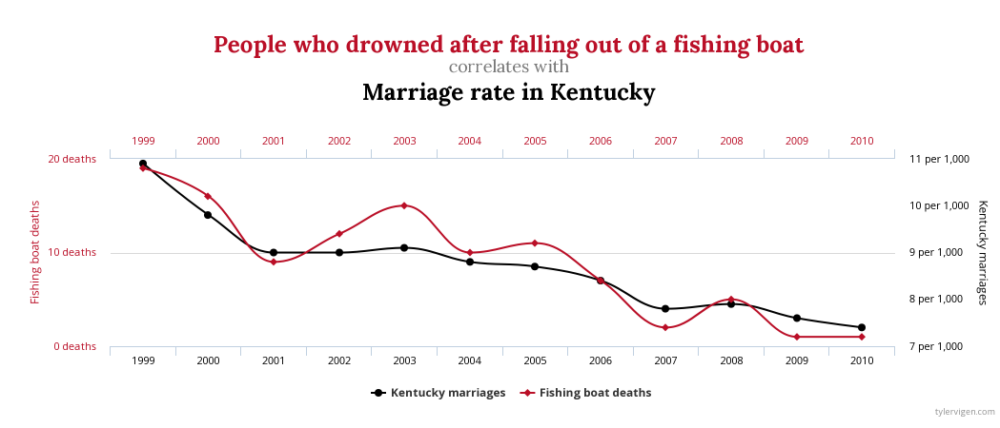
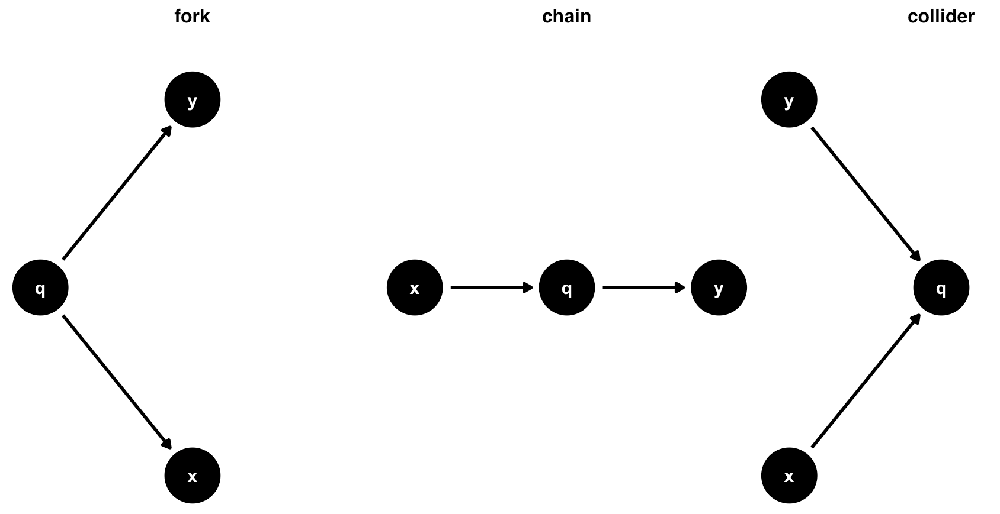

```{r setup, include=FALSE}
options(htmltools.dir.version = FALSE)

pacman::p_load(captioner, knitr, kableExtra, tidyverse)

knitr::opts_chunk$set(fig.retina = 3,                       
                      echo = TRUE,                       
                      eval = TRUE,                       
                      message = FALSE,                       
                      warning = FALSE,
                      out.width="100%")

```

Recently I was reading about causal inference, it made me want to find out more about why we do causal inference and how to do the modelling.

```{r, echo = FALSE}


```

Photo by [Image Hunter](https://www.pexels.com/photo/concept-image-with-a-question-on-a-sticky-note-against-green-hedge-13092792/)


## What is causal inference?

Causal inference is the term used for the process of determining whether an observed association truly reflects a cause-and-effect relationship [@ScienceDirect].


## Why do we use causal inference?

When I was doing my undergraduate study, my statistics professor always told us in class, "Association does not imply causation". 

For example, by taking the chart below, does that mean that people drowned after falling out of a fishing boat caused a drop in the marriage rate in Kentucky?

```{r, echo = FALSE}


```

*Taken from this [website](https://rpubs.com/cuborican/causal)*

Hence, blindly accepting the results without any understanding might lead us to the wrong conclusion.

According to the authors, following are the steps when performing causal analysis [@Barrett02]:

- Specify a causal question

- Draw our assumptions using a causal diagram

- Model our assumptions

- Diagnose our models

- Estimate the causal effect

- Conduct sensitivity analysis on the effect estimate


In this post, we will be focusing on how to draw a causal diagram.


## What is a directed acyclic graph (DAG)?

Below are a few properties of a directed acyclic graph:

- Edges are directed, i.e. single arrowhead

- No feedback loop


I like this [online resource](https://www.youtube.com/watch?v=1Yh5S-S6wsI&t=259s) as I felt the way how the author explained the DAG was rather easy to follow and understand.


Following are different ways the nodes can be connected within DAG [@Barrett05]:

```{r, echo = FALSE}


```

The authors also mentioned that in practice, we will first specify our causal question and use the relevant domain knowledge to draw out the causal graphs.


## Back-door paths

Backdoor paths are the paths between factors that could potentially lead us to drawing spurious conclusions about the relationship between our exposure and outcome [@Barrett05].

The authors also have an example of the differences in the results when we close and do not close the backdoor paths.

We will leave other causal terminology for future exploration.


## Confounders

Another important concept to introduce is "confounders".

Confounder is a common cause of exposure and outcome [@Barrett07].

A propensity score is the probability of being in the exposure group, conditioned on observed covariates [@Barrett07].

Assumptions for unbiased results

- There are no unmeasured confounders

- Every subject has a nonzero probability of receiving either exposure

# Demonstration

In this post, I will be using `ggdag` package to draw the graph.

```{r}
pacman::p_load(tidyverse, janitor, ggdag)

```


## Import Data

In this demonstration, I will be using a [Kaggle dataset](https://www.kaggle.com/datasets/vjchoudhary7/hr-analytics-case-study) on the employee resignation dataset.

First, I will import the data into the environment.

```{r}
df <- read_csv("https://raw.githubusercontent.com/jasperlok/my-blog/master/_posts/2022-03-12-marketbasket/data/general_data.csv") %>%
  # drop the columns we don't need
  dplyr::select(-c(EmployeeCount, StandardHours, EmployeeID)) %>%
  clean_names() %>% 
  # impute the missing values with the mean values
  mutate(
    num_companies_worked = case_when(
      is.na(num_companies_worked) ~ mean(num_companies_worked, na.rm = TRUE),
      TRUE ~ num_companies_worked),
    total_working_years = case_when(
      is.na(total_working_years) ~ mean(total_working_years, na.rm = TRUE),
      TRUE ~ total_working_years),
    ind_promoted_in_last1Yr = if_else(years_since_last_promotion <= 1, "yes", "no"),
    ind_promoted_in_last1Yr = as.factor(ind_promoted_in_last1Yr),
    attrition = as.factor(attrition),
    job_level = as.factor(job_level)
    ) %>%
  droplevels()

```

Note that there are missing values in the dataset. Hence I have imputed the missing values by using the mean for simplicity.

I also would like to find out whether the attrition rate would be lower if the person has been promoted in the past year.


If we were to calculate the attrition rate by whether the person was promoted in the last year, we would see somehow the attrition rate is higher for those who were promoted in the last year.

```{r}
df %>% 
  group_by(ind_promoted_in_last1Yr, attrition) %>% 
  tally() %>% 
  group_by(ind_promoted_in_last1Yr) %>%
  mutate(perc = n/sum(n))

```

If we were to fit a very simple logistic regression, it seems like being promoted last year does increase the attrition rate.

```{r}
non_causal_fit <-
  glm(attrition ~ ind_promoted_in_last1Yr
      ,data = df
      ,family = binomial())

summary(non_causal_fit)

```


Nevertheless, let's set up our assumptions on the causal relationship.

## Graph

First, we will specify our assumptions within `dagify` function. Then, I will pass the `dagitty` object to `ggdag` function to visualize the graph.

To keep things simple, below is the proposed assumption:

- Attrition rate is causally impacted by whether the individuals were being promoted in the last year, their age, gender, and the departments they belong to

- Whether the individuals are being promoted is causally impacted by their age, gender and the departments they are from

```{r}
dagify(
  attrition ~ age + ind_promoted_in_last1Yr + gender + department,
  ind_promoted_in_last1Yr ~ age + department + gender,
  outcome = "attrition",
  exposure = "ind_promoted_in_last1Yr",
  labels = c(
    ind_promoted_in_last1Yr = "Promoted in last year",
    age = "age",
    attrition = "attrition",
    gender = "gender",
    department = "department"
  )
) %>% 
  ggdag(use_labels = "label", text = FALSE) +
  theme_dag()

```


We could use `ggdag_paths` function to find the open paths between the exposure and outcome. This function will return all the possible open paths in separate charts.

```{r}
dagify(
  attrition ~ age + ind_promoted_in_last1Yr + gender + department,
  ind_promoted_in_last1Yr ~ age + department + gender,
  outcome = "attrition",
  exposure = "ind_promoted_in_last1Yr",
  labels = c(
    ind_promoted_in_last1Yr = "Promoted last year",
    age = "age",
    attrition = "attrition",
    gender = "gender",
    department = "department"
  )
) %>% 
  ggdag_paths(use_labels = "label", text = FALSE, shadow = TRUE) +
  theme_dag()

```

The purpose of doing so is to identify the backdoor paths.


As mentioned in the earlier post, these backdoor paths could potentially lead us to draw spurious conclusions about the relationship between exposure and outcome.

We could use `ggdag_paths_fan` function to combine all the open paths into one single chart.

```{r}
dagify(
  attrition ~ age + ind_promoted_in_last1Yr + gender + department,
  ind_promoted_in_last1Yr ~ age + department + gender,
  outcome = "attrition",
  exposure = "ind_promoted_in_last1Yr",
  labels = c(
    ind_promoted_in_last1Yr = "Promoted last year",
    age = "age",
    attrition = "attrition",
    gender = "gender",
    department = "department"
  )
) %>% 
  ggdag_paths_fan(use_labels = "label", text = FALSE, shadow = TRUE) +
  theme_dag()

```

`ggdag_adjustment_set` function will list down the factors we should be adjusted to close the backdoor paths.

```{r}
dagify(
  attrition ~ age + ind_promoted_in_last1Yr + gender + department,
  ind_promoted_in_last1Yr ~ age + department + gender,
  outcome = "attrition",
  exposure = "ind_promoted_in_last1Yr",
  labels = c(
    ind_promoted_in_last1Yr = "Promoted last year",
    age = "age",
    attrition = "attrition",
    gender = "gender",
    department = "department"
  )
) %>% 
  ggdag_adjustment_set(use_labels = "label", text = FALSE) +
  theme_dag()

```


# Conclusion

That's all for the day!

Thanks for reading the post until the end.

Feel free to contact me through [email](mailto:jasper.jh.lok@gmail.com) or [LinkedIn](https://www.linkedin.com/in/jasper-l-13426232/) if you have any suggestions on future topics to share.

Refer to this link for the [blog disclaimer](https://jasperlok.netlify.app/blog_disclaimer.html).

Till next time, happy learning!

```{r, echo = FALSE}


```

Photo by <a href="https://unsplash.com/@delanodzr?utm_content=creditCopyText&utm_medium=referral&utm_source=unsplash">Delano Ramdas</a> on <a href="https://unsplash.com/photos/a1t-eB2xHXM?utm_content=creditCopyText&utm_medium=referral&utm_source=unsplash">Unsplash</a>
  
  


