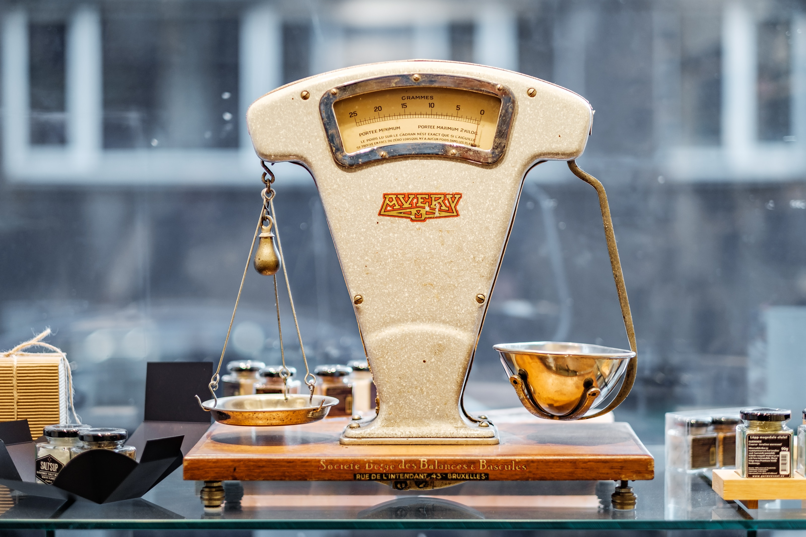

```{r setup, include=FALSE}
options(htmltools.dir.version = FALSE)

pacman::p_load(captioner, knitr, kableExtra, tidyverse)

knitr::opts_chunk$set(fig.retina = 3,                       
                      echo = TRUE,                       
                      eval = TRUE,                       
                      message = FALSE,                       
                      warning = FALSE,
                      out.width="100%")

```


```{r, echo = FALSE}


```


Photo by <a href="https://unsplash.com/@miracleday?utm_content=creditCopyText&utm_medium=referral&utm_source=unsplash">Elena Mozhvilo</a> on <a href="https://unsplash.com/photos/gold-and-silver-round-frame-magnifying-glass-j06gLuKK0GM?utm_content=creditCopyText&utm_medium=referral&utm_source=unsplash">Unsplash</a>
  
  
In this post, I will be continuing my journey in exploring causal inference.

Previously, I looked at how to draw directed acyclic graph in my [previous post](https://jasperlok.netlify.app/posts/2023-11-05-causal-dag/#graph).


# Steps to perform causal inference

Once the assumptions are made, following are the basic steps in performing a causal analysis using data preprocessing [@Greifer2023]:

1. Decide on covariates for which balance must be achieved
2. Estimate the distance measure (e.g., propensity score)
3. Condition on the distance measure (e.g., using matching, weighting, or subclassification)
4. Assess balance on the covariates of interest; if poor, repeat steps 2-4
5. Estimate the treatment effect in the conditioned sample


# Different balancing techniques

Below are different balancing techniques:

- Stratification

- Matching

- Weighting

- Direct covariate adjustment

# Different estimands

As part of the causal inference, we will need to choose the estimands depending on what question we are trying to answer.

I find this summary table from this book is rather helpful in guiding one in choosing the appropriate estimands [@Barrett2023-11].

For simplicity, I will be using average treatment effect in this analysis.

## What is 'Average Treament Effect' (ATE)?

ATE is the difference in means of the treated and control groups [@nguyen2020guide].

The author mentioned in the section that with random assignment, the observed means difference between the two groups is an unbiased estimator of the average treatment effect.


# Demonstration

In this demonstration, I will be using a [Kaggle dataset](https://www.kaggle.com/datasets/vjchoudhary7/hr-analytics-case-study) on the employee resignation dataset.


```{r}
pacman::p_load(tidyverse, janitor, WeightIt, cobalt)

```


## Import Data

First, I will import the data into the environment.

For the explanations on the data wrangling, they can be found in [this post](https://jasperlok.netlify.app/posts/2023-11-05-causal-dag/).

```{r}
df <- read_csv("https://raw.githubusercontent.com/jasperlok/my-blog/master/_posts/2022-03-12-marketbasket/data/general_data.csv") %>%
  # drop the columns we don't need
  dplyr::select(-c(EmployeeCount, StandardHours, EmployeeID)) %>%
  clean_names() %>% 
  # impute the missing values with the mean values
  mutate(
    num_companies_worked = case_when(
      is.na(num_companies_worked) ~ mean(num_companies_worked, na.rm = TRUE),
      TRUE ~ num_companies_worked),
    total_working_years = case_when(
      is.na(total_working_years) ~ mean(total_working_years, na.rm = TRUE),
      TRUE ~ total_working_years),
    ind_promoted_in_last1Yr = if_else(years_since_last_promotion <= 1, "yes", "no"),
    ind_promoted_in_last1Yr = as.factor(ind_promoted_in_last1Yr),
    attrition = as.factor(attrition),
    job_level = as.factor(job_level)
    ) %>%
  droplevels()

```


### Balance statistics

First, I will use `bal.tab` function from `cobalt` package to check whether any of the variables are imbalance.

This is corresponding to the first step mentioned in the earlier section.

```{r}
# unadjusted
bal.tab(ind_promoted_in_last1Yr ~ age + gender + department 
        ,data = df
        ,estimand = "ATE"
        ,stats = c("m", "v")
        ,thresholds = c(m = 0.05))

```

We could set the threshold of the mean by passing the threshold to the `threshold` argument as shown above. Similar logic applies to variance as well.

Based on the result shown above, we could see that age is not balanced in this dataset as the unadjusted difference exceeds the threshold. 


The function also allows one to include interactions and polynomial function through `int` and `poly` argument respectively.

```{r}
bal.tab(ind_promoted_in_last1Yr ~ age + gender + department
        ,data = df
        ,int = TRUE
        ,poly = 2
        ,estimand = "ATE"
        ,stats = c("m", "v")
        ,thresholds = c(m = 0.05))

```


But, for simplicity, I will not include any interaction and polynomial terms in the formula.

`cobalt` package also offers the users to visualize the density plot, allowing users to access the independence between treatment and selected covariate.

For example, below is the density plot for age. As shown below, the average age of individual being promoted in last 1 year is lower than those who are not.

```{r}
bal.plot(ind_promoted_in_last1Yr ~ age + gender + department
         ,data = df
         ,"age")

```

Another cool thing about this function is the plot will be changed to bar plot when the covariate is categorical variable.

```{r}
bal.plot(ind_promoted_in_last1Yr ~ age + gender + department
         ,data = df
         ,"department")

```


Next, `love.plot` function is used to check the absolute mean differences for unadjusted and adjusted variables.

The usual recommended threshold is 0.1 and 0.05.

Before adjustment, we could see the absolute mean differences for age and gender are more than 0.05.

```{r}
love.plot(ind_promoted_in_last1Yr ~ age + gender + department
          ,data = df
          ,drop.distance = TRUE
          ,abs = TRUE
          ,threshold = c(m = 0.05)
          ,line = TRUE)

```

According to the documentation, `love.plot` function also allows different balance statistics.


### Weight

In this post, I will be exploring how to perform matching.

One way to think about matching is as a crude “weight” where everyone who was matched gets a weight of 1 and everyone who was not matched gets a weight of 0 in the final sample. Another option is to allow this weight to be smooth, applying a weight to allow, on average, the covariates of interest to be balanced in the weighted population [@Barrett2023-08].

```{r}
w_outcome <- 
  weightit(ind_promoted_in_last1Yr ~ age + gender + department
           ,data = df
           ,estimand = "ATE")

w_outcome

```

Based on the output, we noted the following:

- The algorithm is using `glm` in performing the weighting

    - According to the documentation, the function supports different formula for weighting purpose

- We are using `ATE` as the estimand


Considerations when building propensity model [@Barrett2023-07]:

- Goal is not predict the outcome as much as possible

- But these metrics may help us in identifying the best functional form

    - Misspecifying this relationship can lead to residual confounding, leaving some bias in the estimate


Next, I will pass the `weightit` object into the `summary` function.

```{r}
summary(w_outcome)

```

If we want to see the distribution of the weights, we could pass the `summary` object into `plot` function.

```{r}
plot(summary(w_outcome))

```


```{r}
# propensity model
bal.tab(w_outcome
        ,stats = c("m", "v")
        ,thresholds = c(m = 0.05))

```

```{r}
bal.plot(w_outcome, "age", which = "both")
bal.plot(w_outcome, "department", which = "both")

```

Now, if we were to call the `love.plot` function on `weightit` object, we could see the all the covariates are below the threshold.

```{r}
love.plot(w_outcome
          ,data = df
          ,drop.distance = TRUE
          ,abs = TRUE
          ,threshold = c(m = 0.05)
          ,line = TRUE)

```


# Conclusion

That's all for the day!

Thanks for reading the post until the end.

Feel free to contact me through [email](mailto:jasper.jh.lok@gmail.com) or [LinkedIn](https://www.linkedin.com/in/jasper-l-13426232/) if you have any suggestions on future topics to share.

Refer to this link for the [blog disclaimer](https://jasperlok.netlify.app/blog_disclaimer.html).

Till next time, happy learning!

```{r, echo = FALSE}


```

Photo by <a href="https://unsplash.com/@saltsup?utm_content=creditCopyText&utm_medium=referral&utm_source=unsplash">Piret Ilver</a> on <a href="https://unsplash.com/photos/brown-and-beige-weighing-scale-98MbUldcDJY?utm_content=creditCopyText&utm_medium=referral&utm_source=unsplash">Unsplash</a>
  
  
  


