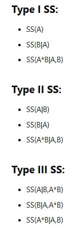

```{r setup, include=FALSE}
options(htmltools.dir.version = FALSE)

pacman::p_load(knitr, kableExtra, tidyverse)

knitr::opts_chunk$set(fig.retina = 3,                       
                      echo = TRUE,                       
                      eval = TRUE,                       
                      message = FALSE,                       
                      warning = FALSE,
                      out.width="100%")

```

```{r, echo = FALSE}


```

Photo by <a href="https://unsplash.com/@anna_tukhfatullina?utm_content=creditCopyText&utm_medium=referral&utm_source=unsplash">Anna Tukhfatullina Food Photographer/Stylist</a> on <a href="https://unsplash.com/photos/a-bunch-of-star-shaped-cookies-sitting-on-top-of-a-table-P559qKtbcno?utm_content=creditCopyText&utm_medium=referral&utm_source=unsplash">Unsplash</a>
  

Recently when I was doing analysis, I happened to find out there are different types of ANOVA (ANalysis Of VAriance) tests and it made me very curious what are the differences in various types of ANOVA tests.

In this post, I will be exploring the different types of ANOVA.

# Different types of ANOVA

## Type I ANOVA

This is also known as the "sequential" sum of squares.

This is the ANOVA we will learn during our simple regression class.

## Type II ANOVA

Type II measures the marginal effect of the variable.

This method also follows the principle of marginality.

### What is the principle of marginality?

Under the principle of marginality, the lower levels of variable need to exist in the model for the higher orders to be included.

For example, if the interaction term is tested to be significant, then both main effects need to be included in the model even if the main effect is tested to be insignificant.

Another example is if the higher order terms are tested to be significant and we would like to keep the relevant term in the fitted model, all the lower order terms should be included even if any of the lower order terms are tested to be insignificant.


## Type III ANOVA


In theory, the result from Type III ANOVA should be the same as Type II when there is no interaction term.

Type III ANOVA violates the principle of marginality. 

The author of the package also discouraged users from using Type III ANOVA if one does not understand the issue of Type III ANOVA. Refer to the [documentation](https://cran.r-project.org/web/packages/car/car.pdf) for more info.

Nevertheless, below is the comparison of different types of ANOVA [@CrossVal2016]:

```{r, echo = FALSE, out.width = "25%"}


```


All three types of ANOVA tests would produce the same results if the data is balanced and factors are orthogonal (i.e., the independent variables are uncorrelated) [@nzcoops2011].


# Demonstration

In this demonstration, I will be using several methods to fit an ordinal logistic regression.

```{r}
pacman::p_load(tidyverse, janitor, car)

```

## Import Data

I will be using this [travel insurance dataset](https://www.kaggle.com/datasets/mhdzahier/travel-insurance) I found on Kaggle for this demonstration.

```{r}
df <- read_csv("https://raw.githubusercontent.com/jasperlok/my-blog/master/_posts/2021-08-31-naive-bayes/data/travel%20insurance.csv") %>%
  clean_names() %>%  # clean up the column naming
  select(-c(gender, product_name, destination)) %>%
  filter(net_sales > 0
         ,duration > 0
         ,age < 100) %>% 
  mutate(claim = factor(claim)
         ,rand_noise = rnorm(nrow(.), 0, 2))
  
```

I will also add a random noise as one of the columns.

## Model Building

First, I build a simple model without any interaction term.

```{r}
logit_fit <-
  glm(claim ~ 
        agency_type
      + distribution_channel
      + net_sales
      + age
      + rand_noise
      ,data = df
      ,family = "binomial")

logit_fit

```

### Type I ANOVA

First, we will perform Type I ANOVA test, which is also known as the sequential sum of squares.

In this ANOVA test, the effect is measured in sequence.

In other words, the function will first measure the model with only `agency_type` as the explanatory variable, then re-compute the effect by adding `distribution_channel` and so on.

```{r}
anova(logit_fit, test = "Chisq")

```

If we were to re-arrange the variables, we would notice that the effects of variables would have changed.


```{r}
logit_fit_different_order <-
  glm(claim ~
        rand_noise
      + distribution_channel
      + net_sales
      + age
      + agency_type
      ,data = df
      ,family = "binomial")

anova(logit_fit_different_order, test = "Chisq")

```

This is because the ANOVA result under Type I is being computed sequentially. Hence, the result will change once the order of the variables changes.


### Type II ANOVA

Unfortunately, the `anova` function from base R does not support Type II ANOVA.

To perform Type II ANOVA, we will use `Anova` function from `car` package.

```{r}
Anova(logit_fit, type = 2)

```

As shown in the result, we can see that the ANOVA results are different between Type I and Type II.

This is because under Type II ANOVA, the marginal effect of each variable is being computed, whereas the Type I ANOVA will compute the effect in sequential order.


### Type III ANOVA

Lastly, I will run the Type III ANOVA test.

```{r}
Anova(logit_fit, type = 3)

```

The ANOVA results under Type II and Type III are the same as shown above.

## What if there is an interaction term?

Next, I will build a model with an interaction term and compare the results under different ANOVA tests.


```{r}
logit_fit_interact <-
  glm(claim ~ 
        rand_noise
      + agency_type
      + distribution_channel
      + net_sales
      + age
      + age * distribution_channel
      ,data = df
      ,family = "binomial")

logit_fit_interact

```

Next, I will perform different types of ANOVA tests on the fitted model.

```{r}
# type I
anova(logit_fit_interact, test = "Chisq")

# type II
Anova(logit_fit_interact, type = 2)

# type III
Anova(logit_fit_interact, type = 3)

```


From the results above, we can see that all three ANOVA tests produce different results.

The interaction term seems to have the same effect under Type II and III. However, the effect for their main effect seems to be adjusted under Type III.


# Conclusion

That's all for the day!

Thanks for reading the post until the end.

Feel free to contact me through [email](mailto:jasper.jh.lok@gmail.com) or [LinkedIn](https://www.linkedin.com/in/jasper-l-13426232/) if you have any suggestions on future topics to share.

Refer to this link for the [blog disclaimer](https://jasperlok.netlify.app/blog_disclaimer.html).

Till next time, happy learning!

```{r, echo = FALSE}


```

Photo by <a href="https://unsplash.com/@dhelentjaris?utm_content=creditCopyText&utm_medium=referral&utm_source=unsplash">Diane Helentjaris</a> on <a href="https://unsplash.com/photos/four-star-shaped-cookies-on-a-cooling-rack-fwUt5B1vylA?utm_content=creditCopyText&utm_medium=referral&utm_source=unsplash">Unsplash</a>
  
