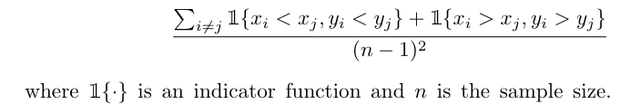
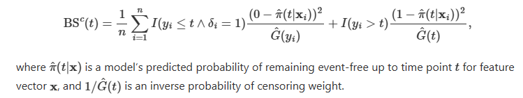
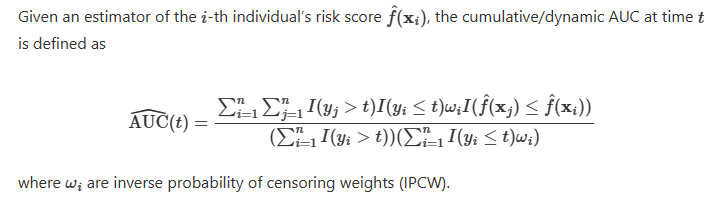

```{r setup, include=FALSE}
options(htmltools.dir.version = FALSE)

pacman::p_load(knitr, kableExtra, tidyverse)

knitr::opts_chunk$set(fig.retina = 3,                       
                      echo = TRUE,                       
                      eval = TRUE,                       
                      message = FALSE,                       
                      warning = FALSE,
                      out.width="100%")

```


In this post, I will be looking at how to perform model performance on survival models.


```{r, echo = FALSE}
knitr::include_graphics("image/campfire.jpg")

```

Photo by <a href="https://unsplash.com/@bastienrv?utm_content=creditCopyText&utm_medium=referral&utm_source=unsplash">Bastien Hervé</a> on <a href="https://unsplash.com/photos/bornfire-near-tree-FzAXZSGlftI?utm_content=creditCopyText&utm_medium=referral&utm_source=unsplash">Unsplash</a>
  

# Common performance metrics

Below are some of the common performance metrics we will use:

- Concordance Index

- Brier Score

- ROC AUC Curve

- Cumulative Dynamic UAC

## Concordance Index (C-Index)

One of the common performance metrics used in evaluating survival models is the concordance index.

```{r, echo = FALSE}


```

*Taken from this [website](https://www.mayo.edu/research/documents/bsi-techreport-85/doc-20433003)*

[@Hvitfeldt] explained that the two observations are comparable if:

- Both of the observations experienced an event (at different times), or

- The observation with the shorter observed survival time experienced an event, in which case the event-free subject “outlived” the other.

A pair is not comparable if they experienced events at the same time.


Following are the interpretations of the model result:

1: The model can differentiate the risks perfectly

0.5: The model with random orderings of risk scores


Some of the issues of the Concordance Index [@Hartman2023]:

- Concordance Index is insensitive to the addition of new predictors in a model, even if the new predictors are statistically and clinically significant

    - Hence, this metric is not generally not useful in evaluating new risk factors or in model-building

- Model with inaccurate predictions can have C-indices that are much larger than those from a competing model with more accurate predictions

- If the populations with mostly low risk subjects, the C-index computation involves many comparisons of two low-risk patients with similar risk probabilities, which may not be the interest of the user

- Unable to show sensitivity and specificity

## Brier Score

Brier score is one of the performance metrics for classification problems.

It can be extended to the right censored data:

```{r, echo = FALSE}


```

*Taken from this [website](https://scikit-survival.readthedocs.io/en/stable/user_guide/evaluating-survival-models.html#Time-dependent-Brier-Score)*

Note that this performance metric does not work on models that cannot produce survival functions (e.g., survival support vector machine).

For this score, a perfect model has a score of zero, while an uninformative model would have a score of around 1/4.


## ROC AUC Curve

This performance metric calculates the predicted survival probabilities that correspond to different time points.

## Cumulative Dynamic AUC

In short, this is the same as AUC, except we are measuring the cumulative events under Cumulative Dynamic AUC.


```{r, echo = FALSE}


```

*Taken from this [website](https://scikit-survival.readthedocs.io/en/stable/api/generated/sksurv.metrics.cumulative_dynamic_auc.html)*

# Demonstration

In this demonstration, I will be using this [bank dataset](https://www.kaggle.com/datasets/shrutimechlearn/churn-modelling) from Kaggle.


## Setup the environment

First, I will load the necessary packages into the environment.

```{r}
pacman::p_load(tidyverse, tidymodels, censored, lubridate, janitor, survival, survminer, survex, yardstick)

```

We will use `survex` package to measure model performance on the Cox proportional hazard model.

We also set the time points to be used in the calculations later.

```{r}
time_points <- seq(0, 10, by = 1)

```


## Import Data

First I will import the dataset into the environment. 

```{r}
df <- read_csv("https://raw.githubusercontent.com/jasperlok/my-blog/master/_posts/2022-09-10-kaplan-meier/data/Churn_Modelling.csv") %>%
  clean_names() %>%
  select(-c(row_number, customer_id, surname)) %>%
  mutate(has_cr_card = factor(has_cr_card),
         is_active_member = factor(is_active_member),
         credit_score = credit_score/100,
         balance = balance/10000,
         estimated_salary = estimated_salary/10000) %>%
  filter(tenure > 0) %>% 
  mutate(age_square = age ^ 2
         ,age_cube = age ^ 3
         ,age_gender = age * if_else(gender == "Male", 1, 0)
         ,age_square_gender = age_square * if_else(gender == "Male", 1, 0)
         ,age_cube_gender = age_cube * if_else(gender == "Male", 1, 0)
         ,target = Surv(tenure, exited)) %>% 
  select(-c(tenure, exited))

```


## Method 1: Use the formula from `yardstick` package

First I will build a Cox proportional hazard model.

```{r}
df_splits <- initial_validation_split(df)

cox_recipe <- recipe(
  target ~ ., 
  data = training(df_splits))

cox_specs <-
  proportional_hazards() %>% 
  set_engine("survival") %>% 
  set_mode("censored regression")

cox_wf <-
  workflow() %>% 
  add_recipe(cox_recipe) %>% 
  add_model(cox_specs)

```

Once the information is defined, we can proceed and fit the model.

```{r}
cox_fit <-
  cox_wf %>% 
  fit(data = training(df_splits))

```

Then we can generate the predictions from the model.

```{r}
cox_pred <-
  cox_fit %>% 
  augment(validation(df_splits), eval_time = time_points)

```

Then we can use the model performance functions from `yardstick` package.

```{r}
cox_pred %>% 
  brier_survival(truth = target, .pred)

```

We can pass the result to `ggplot` function to visualize the result.

```{r}
cox_pred %>% 
  brier_survival(truth = target, .pred) %>% 
  ggplot(aes(.eval_time, .estimate)) +
  geom_line()

```

We could calculate the Concordance Index by using `concordance_survival` function.

```{r}
cox_pred %>% 
  concordance_survival(truth = target
                      ,estimate = .pred_time)

```


Based on the result, the model performance deteriorates over time and peaks between time points 7 and 8 before starting to improve again.

Alternatively, if we want to compute a few performance metrics, we could use `metric_set` and `fit_resamples` functions to do so.

```{r}
# define all the performance metrics to be computed
survival_metrics <- metric_set(brier_survival_integrated, brier_survival,
                               roc_auc_survival, concordance_survival)

# fit the model
cox_res <- fit_resamples(
  cox_wf,
  resamples = validation_set(df_splits),
  metrics = survival_metrics,
  eval_time = time_points, 
  control = control_resamples(save_pred = TRUE)
)
```

To collect the model performance, we need to pass the fitted object into `collect_metrics` function.

```{r}
collect_metrics(cox_res)

```

We could even pass the model performance to `ggplot` function to visualize the results.

```{r}
collect_metrics(cox_res) %>% 
  filter(.metric == "roc_auc_survival") %>% 
  ggplot(aes(.eval_time, mean)) +
  geom_line()

```


## Method 2 - Use functions from `survex` package

Alternatively, we could use `survex` package to measure the model performance.

At the point of writing, `survex` package only supports models from the following packages:

- `mlr3proba`

- `censored`

- `ranger`

- `randomForestSRC`

- `survival`

In this demonstration, I will first build a Cox Proportional Hazard model by using `cox` function.

```{r}
cox_model <- coxph(target ~ ., 
                   data = training(df_splits),
                   model=TRUE,
                   x = TRUE)

summary(cox_model)

```


Then, we will pass the fitted model into `explain` function.

```{r}
cox_explain <- 
  explain(cox_model)

```

After that, we will compute the model performance.

```{r}
cox_perform <- model_performance(cox_explain)

```

We could visualize the result by plotting the results.

```{r}
plot(cox_perform)

```

In general, both performance metrics show the same picture, i.e., the model deteriorates across the time points.


If we want to extract the calculated model performance, we can use the following formula:

```{r}
# Brier Score
brier_score(cox_explain$y
            ,cox_explain$times
            ,cox_explain$predict_survival_function(cox_model
                                                   ,cox_explain$data
                                                   ,cox_explain$times))
# CD AUC Curve
cd_auc(y = cox_explain$y
       ,times = cox_explain$times
       ,surv = cox_explain$predict_survival_function(cox_model
                                                     ,cox_explain$data
                                                     ,cox_explain$times))

```


As mentioned above, the functions also work for fitted models from `censored` package. Below is the demonstration:

```{r}
# create explainer object
cox_explain_tidym <- 
  explain(cox_fit$fit$fit
          ,data = training(df_splits)
          ,y = training(df_splits)$target)

# compute model performance
cox_perform_tidym <- model_performance(cox_explain_tidym)

# plot the results
plot(cox_perform_tidym)

```


I also noted `survex` package also offers functions to show the relative importance of the variable.

```{r}
cox_parts <- 
  model_parts(cox_explain)

```

To visualize the result, we just need to pass the info into `plot` function.

```{r}
plot(cox_parts)

```

As shown above, age square is the most important variable.


# Conclusion

That's all for the day!

Thanks for reading the post until the end.

Feel free to contact me through [email](mailto:jasper.jh.lok@gmail.com) or [LinkedIn](https://www.linkedin.com/in/jasper-l-13426232/) if you have any suggestions on future topics to share.


Refer to this link for the [blog disclaimer](https://jasperlok.netlify.app/blog_disclaimer.html).


Till next time, happy learning!

```{r, echo = FALSE}


```

Photo by <a href="https://unsplash.com/@miracleday?utm_content=creditCopyText&utm_medium=referral&utm_source=unsplash">Elena Mozhvilo</a> on <a href="https://unsplash.com/photos/green-and-white-plant-on-white-ceramic-bowl-NJM-r6hv6TQ?utm_content=creditCopyText&utm_medium=referral&utm_source=unsplash">Unsplash</a>
  
  
