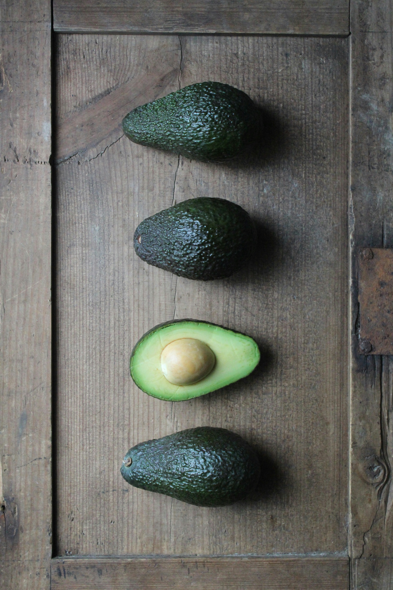

```{r setup, include=FALSE}
options(htmltools.dir.version = FALSE)

pacman::p_load(knitr, kableExtra, tidyverse)

knitr::opts_chunk$set(fig.retina = 3,                       
                      echo = TRUE,                       
                      eval = TRUE,                       
                      message = FALSE,                       
                      warning = FALSE,
                      out.width="100%")

```

```{r, echo = FALSE}


```

Photo by <a href="https://unsplash.com/@polarmermaid?utm_content=creditCopyText&utm_medium=referral&utm_source=unsplash">Anne Nygård</a> on <a href="https://unsplash.com/photos/green-heart-shaped-fruit-on-brown-wooden-surface-OJzEnupZWGM?utm_content=creditCopyText&utm_medium=referral&utm_source=unsplash">Unsplash</a>

In this post, I will be exploring discriminant analysis.

# What is discriminant analysis?

Discriminant analysis is a statistical technique used in research that aims to classify or predict a categorical dependent variable based on one or more continuous or binary independent variables. It is often used when the dependent variable is non-metric (categorical) and the independent variables are metric (continuous or binary) [@Hassan2024].

# Pros and cons of using discriminant analysis

[@Hassan2024] listed the pros and cons of discriminant analysis.

## Pros

-   Multiclass Classification: Discriminant analysis can handle situations where there are more than two classes in the dependent variable, which is a limitation for some other methods such as logistic regression.

-   Understanding Group Differences: Discriminant analysis does not just predict group membership; it also provides information on which variables are important discriminators between groups. This makes it a useful tool for exploratory research to understand the differences between groups.

-   Efficient with Large Variables: Discriminant analysis can handle a large number of predictor variables efficiently. It becomes useful when the number of variables is very large, potentially exceeding the number of observations.

-   Dimensionality Reduction: Linear Discriminant Analysis (LDA) can be used for dimensionality reduction – it can reduce the number of variables in a dataset while preserving as much information as possible.

-   Prior Probabilities: Discriminant analysis allows for the inclusion of prior probabilities, meaning that researchers can incorporate prior knowledge about the proportions of observations in each group.

-   Model Interpretability: The model produced by discriminant analysis is relatively interpretable compared to some other machine learning models, such as neural networks. The weights of the features in the model can provide an indication of their relative importance.

## Cons

-   Assumption of Normality: Discriminant analysis assumes that the predictors are normally distributed. If this assumption is violated, the performance of the model may be affected.

-   Assumption of Equal Covariance Matrices: Discriminant analysis, particularly Linear Discriminant Analysis (LDA), assumes that the groups being compared have equal covariance matrices. If this assumption is not met, it may lead to inaccuracies in classification.

-   Multicollinearity: Discriminant analysis may not work well if there is high multicollinearity among the predictor variables. This situation can lead to unstable estimates of the coefficients and difficulties in interpreting the results.

-   Outliers: Discriminant analysis is sensitive to outliers, which can have a large influence on the classification function.

-   Overfitting: Like many statistical techniques, discriminant analysis can result in overfitting if the model is too complex. Overfitting happens when the model fits the training data very well but performs poorly on new, unseen data.

-   Limited to Linear Relationships: Linear Discriminant Analysis (LDA) assumes a linear relationship between predictor variables and the log-odds of the dependent variable. This limits its utility in scenarios where relationships are complex or nonlinear. In such cases, Quadratic Discriminant Analysis (QDA) or other non-linear methods might be more appropriate.

# Why use discriminant analysis when we have logistic regression?

When I found out this technique, I was rather curious why we need another method when we have logistic regression. Below are the explanations from one of the textbooks I was reading [@James2021]:

-   When there is substantial separation between the two classes, the parameter estimates for the logistic regression model are unstable

-   This method may be more accurate than logistic regression if the distribution of the predictors X is approximately normal in each of the classes and the sample size is small

-   The methods in this section can be naturally extended to the case of more than two response classes

# Different discriminant analysis

Apart from the linear discriminant analysis, below are the different types of discriminant models [@Brownlee2020]:

```{r, echo = FALSE}
discrim_df <-
  tibble("Model" = c("Quadratic Discriminant Analysis"
                     ,"Flexible Discriminant Analysis"
                     ,"Regularized Discriminant Analysis")
         ,"Remarks" = c("Each class uses its own estimate of variance (or covariance when there are multiple input variables)"
                        ,"Where non-linear combinations of inputs is used such as splines"
                        ,"Introduces regularization into the estimate of the variance (actually covariance), moderating the influence of different variables on LDA"))

discrim_df %>% 
  kbl() %>%
  kable_paper("hover", full_width = F, html_font = "Cambria", font_size = 15)

```

# Important things to take note of before performing discriminant analysis

Below are some of the important considerations before performing discriminant analysis [@Bobbitt2020]:

-   The response variable is categorical

-   The predictor variables follow a normal distribution

-   Each predictor variable has the same variance

-   Account for extreme outliers

# Demonstration

In this demonstration, I will be using several methods to fit a discriminant analysis.

```{r}
pacman::p_load(tidyverse, tidymodels, janitor, MASS, discrim)
select <- dplyr::select

```

## Import Data

I will be using [travel insurance claim dataset](https://www.kaggle.com/datasets/mhdzahier/travel-insurance) in this demonstration.

```{r}
df <- 
  read_csv("https://raw.githubusercontent.com/jasperlok/my-blog/master/_posts/2021-08-31-naive-bayes/data/travel%20insurance.csv") %>% 
  clean_names() %>% 
  select(-c(agency, product_name, gender, destination))

```

## Model Building

## Method 1: Use `lda` function from `MASS` package

First, I will build a discriminant model by using `lda` function.

```{r}
lda_fit <- 
  lda(claim ~ .
      ,data = df)

lda_fit

```

According to this [article](https://www.statology.org/linear-discriminant-analysis-in-r/), this is how to interpret the model output:

-   Prior probabilities of group: These represent the proportions of each Species in the training set

-   Group means: These display the mean values for each predictor variable for each species

-   Coefficients of linear discriminants: These display the linear combination of predictor variables that are used to form the decision rule of the LDA model

If we pass the data into the fitted model to generate the predictions, below is the output:

```{r}
prediction_lda <-
  predict(lda_fit) %>% 
  as.data.frame()

head(prediction_lda)

```

Note:

-   Class is the predicted class

-   The output will contain the posterior probability that the observation belongs to the selected class

To evaluate the model, we just need to merge the predictions with the dataset and pass them to the necessary model evaluation function as shown below.

```{r}
prediction_lda %>% 
  bind_cols(df) %>% 
  mutate(claim = as.factor(claim)) %>% 
  roc_auc(truth = claim
          ,posterior.No)

```

# Method 2: Fit by using `tidymodels` approach

Nest, I will be exploring how to use `tidymodels` packages to build discriminant analysis models.

First, we will split the dataset into training and testing datasets.

```{r}
df_splits <- initial_split(df, prop = 0.6, strata = claim)
df_train <- training(df_splits)
df_test <- testing(df_splits)
df_fold <- vfold_cv(df_train)

```

I will define the recipe for the model building later.

```{r}
gen_recipe <-
  recipe(claim ~ .
         ,data = df_train) %>% 
  step_dummy(all_nominal_predictors()) %>% 
  step_corr(all_numeric_predictors(), threshold = .5) %>% 
  step_zv(all_predictors())

```

In the recipe, I will use the pre-processing steps suggested in `tidymodeling` book.

I will also define all the model specifications.

```{r}
# linear discriminant analysis
lda_specs <-
  discrim_linear() %>% 
  set_engine("MASS")

# quadratic discriminant analysis
qda_specs <-
  discrim_quad() %>% 
  set_engine("MASS")

# flexible discriminant analysis
fda_specs <- 
  discrim_flexible() %>% 
  set_engine("earth")

# regularized discriminant analysis
rda_specs <-
  discrim_regularized() %>% 
  set_engine("klaR")

```

After that, I will combine the recipe and model specifications into a workflow.

Instead of building different workflows for different models, I will use the functions from `workflowsets` package.

```{r}
all_wf <-
  workflow_set(
    preproc = list(gen_recipe)
    ,models = list(linear = lda_specs
                   ,quad = qda_specs
                   ,flexible = fda_specs
                   ,regularized = rda_specs)
  )

all_wf

```

I will perform cross validation.

```{r}
all_fold <- 
  all_wf %>% 
  option_add(control = control_grid(save_workflow = TRUE)) %>% 
  workflow_map(seed = 1234
               ,resamples = df_fold
               ,grid = 5)

```

To find which fitted model has the best model performance, we can do so by looking at ROC AUC curve.

```{r}
all_fold %>% 
  rank_results() %>% 
  filter(.metric == "roc_auc")

```

As shown in the results above, linear discriminant model has the best model result among the fitted model.

```{r}
all_fold %>% 
  extract_workflow_set_result("recipe_linear")

```

After that, I will select the fitted model with the best model result and measure the model performance by using the testing dataset.

```{r}
all_test <-
  all_fold %>% 
  extract_workflow("recipe_linear") %>%
  finalize_workflow(
    all_fold %>% 
      extract_workflow_set_result("recipe_linear") %>% 
      select_best(metric = "roc_auc")
  ) %>%
  last_fit(split = df_splits)

all_test %>% 
  collect_predictions() %>% 
  roc_auc(`.pred_No`, truth = claim)
  
```

# Conclusion

That's all for the day!

Thanks for reading the post until the end.

Feel free to contact me through [email](mailto:jasper.jh.lok@gmail.com) or [LinkedIn](https://www.linkedin.com/in/jasper-l-13426232/) if you have any suggestions on future topics to share.

Refer to this link for the [blog disclaimer](https://jasperlok.netlify.app/blog_disclaimer.html).

Till next time, happy learning!

```{r, echo = FALSE}
knitr::include_graphics("image/randy-fath-G1yhU1Ej-9A-unsplash.jpg")

```

Photo by <a href="https://unsplash.com/@randyfath?utm_content=creditCopyText&utm_medium=referral&utm_source=unsplash">Randy Fath</a> on <a href="https://unsplash.com/photos/selective-focus-photography-of-chess-pieces-G1yhU1Ej-9A?utm_content=creditCopyText&utm_medium=referral&utm_source=unsplash">Unsplash</a>
