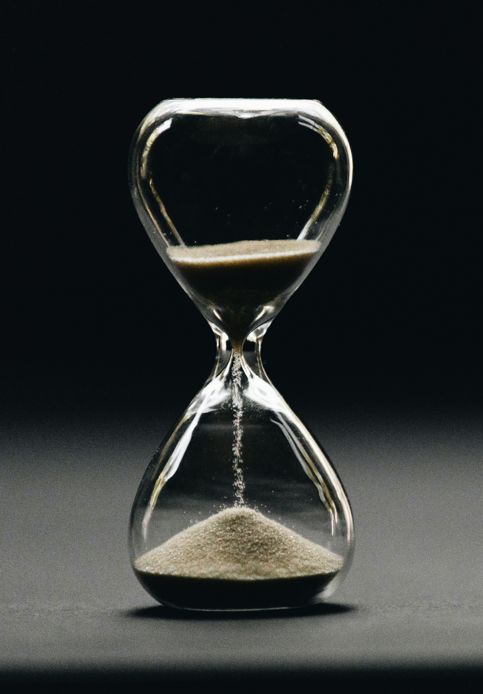

```{r setup, include=FALSE}
options(htmltools.dir.version = FALSE)

pacman::p_load(knitr, kableExtra, tidyverse)

knitr::opts_chunk$set(fig.retina = 3,                       
                      echo = TRUE,                       
                      eval = TRUE,                       
                      message = FALSE,                       
                      warning = FALSE,
                      out.width="100%")

```


Previously, I happened to come across these time series packages and thought of trying them out to see how they work.

Hence, I will jump straight into the demonstration.

```{r, echo = FALSE}


```

Photo by <a href="https://unsplash.com/@nate_dumlao?utm_content=creditCopyText&utm_medium=referral&utm_source=unsplash">Nathan Dumlao</a> on <a href="https://unsplash.com/photos/clear-hour-glass-5Hl5reICevY?utm_content=creditCopyText&utm_medium=referral&utm_source=unsplash">Unsplash</a>
  


# Demonstration

## Setup the environment

First, I will set up the environment by calling all the relevant packages.

```{r}
pacman::p_load(tidyverse, tidymodels, statmod, modeltime, janitor, tsibble, timetk, workflowsets)

```


## Import the data

In this demonstration, I will be using the Seoul bike-sharing dataset.

The relevant data can be downloaded from [UCL website](https://archive.ics.uci.edu/dataset/560/seoul+bike+sharing+demand).

```{r, echo = FALSE}
knitr::include_graphics("image/josh-nuttall-5UQoVk8_d-4-unsplash.jpg")

```

Photo by <a href="https://unsplash.com/@jjnuttall?utm_content=creditCopyText&utm_medium=referral&utm_source=unsplash">Josh Nuttall</a> on <a href="https://unsplash.com/photos/gray-flat-bar-road-bike-5UQoVk8_d-4?utm_content=creditCopyText&utm_medium=referral&utm_source=unsplash">Unsplash</a>
  


```{r}
df <-
  read_csv("https://raw.githubusercontent.com/jasperlok/my-blog/master/_posts/2023-09-23-boruta/data/SeoulBikeData.csv"
           ,locale = locale(encoding = "latin1")) %>% 
  clean_names() %>% 
  mutate(date = dmy(date)) %>% 
  group_by(date) %>%
  summarise(rented_bike_count_tot = sum(rented_bike_count)
            ,temperature_c_avg = mean(temperature_c)
            ,humidity_percent_avg = mean(humidity_percent)
            ,wind_speed_m_s_avg = mean(wind_speed_m_s)
            ,visibility_10m_avg = mean(visibility_10m)
            ,dew_point_temperature_c_avg = mean(dew_point_temperature_c)
            ,solar_radiation_mj_m2_avg = mean(solar_radiation_mj_m2)
            ,rainfall_mm_avg = mean(rainfall_mm)
            ,snowfall_cm_avg = mean(snowfall_cm)
            ,holiday_first = first(holiday))

```

We could visualize the time series by using `plot_time_series` function. This function will produce an interactive chart.

```{r}
df %>% 
  plot_time_series(date, rented_bike_count_tot)

```


## Model building

First, I will split the dataset into training and testing datasets.

Note that as this is a time series dataset, hence we cannot use the usual random splitting. We split by the time instead.

```{r}
df_splits <-
  initial_time_split(df, prop = 0.6)

```


## Fitting single model


Next, I will build an ARIMA model by using the functions from `modeltime` package.


```{r}
arima_fit <-
  arima_reg() %>% 
  set_engine(engine = "auto_arima") %>% 
  fit(rented_bike_count_tot ~ 
        date 
      + temperature_c_avg
      + temperature_c_avg
      + humidity_percent_avg
      + wind_speed_m_s_avg
      + visibility_10m_avg
      + dew_point_temperature_c_avg
      + solar_radiation_mj_m2_avg
      + rainfall_mm_avg
      + snowfall_cm_avg
      + holiday_first
      ,data = training(df_splits))

```

The cool thing about this package is its syntax follows the same pattern as `tidymodels` package.

Then, I will pass the testing data into the function to evaluate how well this model is performing.

```{r}
calibration_df <-
  arima_fit %>% 
  modeltime_calibrate(new_data = testing(df_splits))

```


```{r}
calibration_df %>%
    modeltime_accuracy()

```

Oof, the model doesn't seem to perform very well.


## Calibrate multiple models

Instead of fitting models one by one, we could fit several models at one time.

First, I will create the general formula for all the models I will be building later.

```{r}
gen_formula <- 
   as.formula("rented_bike_count_tot ~ date + temperature_c_avg + temperature_c_avg + humidity_percent_avg + wind_speed_m_s_avg + visibility_10m_avg + dew_point_temperature_c_avg + solar_radiation_mj_m2_avg + rainfall_mm_avg + snowfall_cm_avg + holiday_first")

```

Next, I will define the models to be built.

```{r}
# ARIMA
arima_fit <-
  arima_reg() %>% 
  set_engine(engine = "auto_arima") %>% 
  fit(gen_formula
      ,data = training(df_splits))

# prophet
prophet_fit <- 
  prophet_reg() %>%
    set_engine(engine = "prophet") %>%
    fit(gen_formula
        ,data = training(df_splits))

# prophet - boost
prophet_boost_fit <- 
  boost_tree("regression") %>%
    set_engine(engine = "xgboost") %>%
    fit(gen_formula
        ,data = training(df_splits))

# seasonal
seasonal_fit <- 
  seasonal_reg() %>%
    set_engine(engine = "stlm_ets") %>%
    fit(gen_formula
        ,data = training(df_splits))

```


Then, I will combine the models by using `modeltime_table` function. The function will provide an ID and description for each model.

```{r}
model_tbl <-
  modeltime_table(
    arima_fit
    ,prophet_fit
    ,prophet_boost_fit
    ,seasonal_fit
  )

model_tbl

```


I will measure the performance of each model.

```{r}
model_calibrate <-
  model_tbl %>% 
  modeltime_calibrate(new_data = testing(df_splits))

model_calibrate %>% 
  modeltime_accuracy()

```


We can even pass the model performance to `table_modeltime_accuracy` function to show them in a table format.

```{r}
model_calibrate %>% 
  modeltime_accuracy() %>% 
  table_modeltime_accuracy(
    .interactive = TRUE
    )

```


Next, I will extract the predictions from each model and compare them to the actual data.

```{r}
model_calibrate %>%
    modeltime_forecast(
        new_data    = testing(df_splits),
        actual_data = df
    )

```


I will visualize the results as well.

```{r}
model_calibrate %>%
    modeltime_forecast(
        new_data    = testing(df_splits),
        actual_data = df
    )  %>%
    plot_modeltime_forecast()

```

As shown in the chart, we can see that the seasonal decomposition model performs worse than other models.


## Another method of fitting multiple models - `workflowsets` package

First, I will define the recipe to be used in fitting the model.

```{r}
gen_recipe <-
  recipe(rented_bike_count_tot ~ date + temperature_c_avg + temperature_c_avg + humidity_percent_avg + wind_speed_m_s_avg + visibility_10m_avg + dew_point_temperature_c_avg + solar_radiation_mj_m2_avg + rainfall_mm_avg + snowfall_cm_avg + holiday_first
         ,data = training(df_splits))

```

Then, I will define the models to be fitted.

```{r}
wf_arima <-
  arima_reg() %>%
  set_engine(engine = "auto_arima")

wf_prophet <-
  prophet_reg() %>%
  set_engine(engine = "prophet")

```

I will pass all this info into the `workflow_set` function.

```{r}
wfsets <-
  workflow_set(
  preproc = list(gen_recipe = gen_recipe)
  ,models = list(arima_fit = wf_arima
                 ,prophet_fit = wf_prophet)
  ,cross = TRUE
  )

```

Lastly, I will use `modeltime_fit_workflowset` function to fit all the models within the workflow.

```{r}
wfsets_fit <-
  wfsets %>% 
  modeltime_fit_workflowset(training(df_splits))

wfsets_fit

```

The steps to evaluate the fitted models are the same as how we did it in the previous sub-section.

```{r}
wfsets_calibrate <-
  wfsets_fit %>% 
  modeltime_calibrate(new_data = testing(df_splits))

wfsets_calibrate %>% 
  modeltime_accuracy()

```


# Conclusion

That's all for the day!

Thanks for reading the post until the end.

Feel free to contact me through [email](mailto:jasper.jh.lok@gmail.com) or [LinkedIn](https://www.linkedin.com/in/jasper-l-13426232/) if you have any suggestions on future topics to share.

Refer to this link for the [blog disclaimer](https://jasperlok.netlify.app/blog_disclaimer.html).

Till next time, happy learning!

```{r, echo = FALSE}
knitr::include_graphics("image/murray-campbell-B_TdfGFuGwA-unsplash.jpg")

```

Photo by <a href="https://unsplash.com/@murrayc?utm_content=creditCopyText&utm_medium=referral&utm_source=unsplash">Murray Campbell</a> on <a href="https://unsplash.com/photos/brown-tower-clock-B_TdfGFuGwA?utm_content=creditCopyText&utm_medium=referral&utm_source=unsplash">Unsplash</a>
  
  
