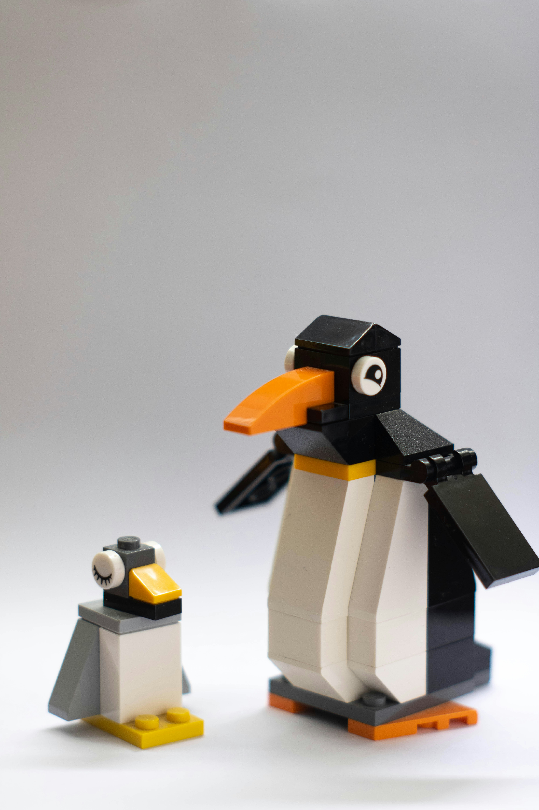

```{r setup, include=FALSE}
options(htmltools.dir.version = FALSE)

pacman::p_load(knitr, kableExtra, tidyverse)

knitr::opts_chunk$set(fig.retina = 3,                       
                      echo = TRUE,                       
                      eval = TRUE,                       
                      message = FALSE,                       
                      warning = FALSE,
                      out.width="100%")

```

```{r, echo = FALSE}


```

Photo by <a href="https://unsplash.com/@grianghraf?utm_content=creditCopyText&utm_medium=referral&utm_source=unsplash">Grianghraf</a> on <a href="https://unsplash.com/photos/white-and-black-robot-toy-geYJdXCLSvM?utm_content=creditCopyText&utm_medium=referral&utm_source=unsplash">Unsplash</a>
  
  
  

# What is MANOVA?

MANOVA stands for Multivariate ANOVA or Multivariate Analysis Of Variance. It’s an extension of regular ANOVA. The general idea is the same, but the MANOVA test has to include at least two dependent variables to analyze differences between multiple groups (factors) of the independent variable [@Dario2022].


I personally find [this website](https://www.mathworks.com/discovery/manova.html) explains the concept quite well.


# Why can't we just use ANOVA to analyze?

Multivariate ANOVA could take into account the correlations between the dependent variables.

The method also provides us the following benefits [@Frost]:

- **Greater statistical power:** When the dependent variables are correlated, MANOVA can identify effects that are smaller than those that regular ANOVA can find.


- **Assess patterns between multiple dependent variables:** The factors in the model can affect the relationship between dependent variables instead of influencing a single dependent variable. As the example in this post shows, ANOVA tests with a single dependent variable can fail completely to detect these patterns.


- **Limits the joint error rate:** When you perform a series of ANOVA tests because you have multiple dependent variables, the joint probability of rejecting a true null hypothesis increases with each additional test. Instead, if you perform one MANOVA test, the error rate equals the significance level.


# Other helpful materials

Below are some of the materials I refer to while exploring MANOVA:

https://statisticseasily.com/manova-assumptions/

https://statisticsbyjim.com/anova/multivariate-anova-manova-benefits-use/

https://online.stat.psu.edu/stat505/lesson/8

# Demonstration

In this demosntration, I will be using several methods to fit an ordinal logistic regression.

```{r}
pacman::p_load(tidyverse, tidymodels, car, palmerpenguins, rstatix, micompr, MASS)

```

## Import Data

I will be using the [penguins dataset](https://allisonhorst.github.io/palmerpenguins/) for this demonstration.

```{r}
gen_recipe <- 
  recipe(species ~ .
         ,data = penguins) %>% 
  step_impute_bag(all_predictors()) %>% 
  step_normalize(all_numeric_predictors()) %>% 
  prep()

df_imputed <- bake(gen_recipe, penguins)

```


## Check assumptions

Before conducting the MANOVA test, I will first check the assumptions.

### Check sample size

```{r}
df_imputed %>% 
  group_by(species) %>% 
  tally()

```


### Identify outliers

We could use the `identify_outliers` function to find the potential outliers in the dataset.

In `rstatix` package, the outlier is defined as any values above third quantile + 1.5 times of interquartile range or below first quantile - 1.5 times of interquartile range.


```{r}
# bill length
df_imputed %>% 
  group_by(species) %>% 
  identify_outliers(bill_length_mm)

# bill depth
df_imputed %>% 
  group_by(species) %>% 
  identify_outliers(bill_depth_mm)

# flipper
df_imputed %>% 
  group_by(species) %>% 
  identify_outliers(flipper_length_mm)

```

From the results shown above, we could see that there are some outliers, but none of these points are extreme points.


### Detect multivariate outliers with mahalnobis distance

To find the multivariate outliers, we could use `mahalanobis_distance` function from `rstatix` package to compute.

```{r}
df_imputed %>% 
  group_by(species) %>% 
  mahalanobis_distance(c(bill_length_mm, bill_depth_mm, flipper_length_mm)) %>% 
  filter(is.outlier == TRUE)

```

### Univariate normality assumption with shapiro-wilks test

[@Bonarota] For sample sizer larger than 50, QQ-plots are recommended over Shapiro-Wilks, which becomes more sensitive to larger sample sizes.

```{r}
df_imputed %>% 
  group_by(species) %>%
  shapiro_test(bill_length_mm, bill_depth_mm, flipper_length_mm) %>% 
  arrange(variable)

```

From the results above, if we were to take p-value cutoff of 0.05, we could see that the data is normally distributed, except for following:

- Gentoo's bill_depth_mm

- Gentoo's bull_length_mm

- Gentoo's flipper_length_mm


```{r}
var_list <- c("bill_length_mm", "bill_depth_mm", "flipper_length_mm")

for(i in var_list){
  print(
    df_imputed %>% 
      ggplot(aes(sample = get(i))) +
      stat_qq() +
      stat_qq_line() +
      labs(title = i)
  )
}

```


### Test multivariate normality assumption

We will use `mshapiro_test` function to check for the overall multivariate normality assumption.

```{r}
mshapiro_test(df_imputed %>% 
                dplyr::select(c(bill_length_mm, bill_depth_mm, flipper_length_mm)))

```

The p-value is less than 0.05, suggesting that there is no statistical evidence that the multivariate normality assumptions hold.

### Check multicolinearity between the variables

In this test, we want to ensure the correlations between dependent variables are not too high to one another.

The rule of thumb is to use 0.9 as the cutoff.

```{r}
df_imputed %>% 
  cor_test(bill_length_mm, bill_depth_mm, flipper_length_mm) %>% 
  filter(var1 != var2)

```

Based on the results, none of the correlations exceed 0.9. All the p-values are also lower than 0.05 (i.e., reject null hypothesis). There is statistical evidence that multicolinearity does not exist in the dataset.


### Check linearity Assumption

MANOVAs are best conducted when the dependent variables used in the analysis are highly negatively correlated and are also acceptable if the dependent variables are found to be correlated around .60, either positive or negative [@Bonarota].

```{r}
for(i in var_list){
  for(j in var_list){
    if(i != j){
      print(
        ggplot(df_imputed
               ,aes(x = get(i)
                    ,y = get(j)
                    ,color = species))+
          geom_point(size = 4)+
          geom_smooth(method = lm, se = FALSE) +
          xlab(i) +
          ylab(j)
      )
    }
  }
}


```


### Check homogeneity of covariances with Box’s M-test in rstatix package

In this test, we will check whether the assumption on multivariate homogenity of variance hold in this dataset.

This test is highly sensitive and significance for this test is determined at alpha = 0.001 [@Bonarota].

```{r}
box_m(df_imputed[, c("bill_length_mm", "bill_depth_mm", "flipper_length_mm")], df_imputed$species)

```

According to the author, with a balanced design of groups with similar n, violating homogeneity of variances-covariances matrices is not a problem and we could continue the analysis.

However, an unbalanced design will present problems.


### Check homogeneity of variance assumption with Levene’s test

In this test, we would check the equality of variances between different groups.

```{r}
df_imputed %>% 
  pivot_longer(c(bill_length_mm, bill_depth_mm, flipper_length_mm), names_to = "variable", values_to = "value") %>% 
  group_by(variable) %>% 
  levene_test(value ~ species)

```

The p-value is greater than 0.05, so we fail to reject null hypothesis. There is statistical evidence that the variance between different groups are not equal.


## MANOVA

### Approach 1: Use `manova` function from base R 

The null hypothesis is the mean is equal for each group.

First, we will create a MANOVA object.

```{r}
manova_fit <- 
  manova(cbind(bill_length_mm, bill_depth_mm, flipper_length_mm) ~ species
         ,data = df_imputed)

```
Then, we will pass the MANOVA object into `summary` function.

Pillai test is more robust against violations of assumptions and recommended for unbalanced design [@Bonarota].

```{r}
summary(manova_fit, test = "Pillai")

```

Based on the result above, we can conclude that there is statistical evidence that at least one species is different from the rest.

To see which groups differ from each other, we could use `summary.aov` function.

```{r}
summary.aov(manova_fit)

```

From the result above, we could see that the species differ from each other under the different measurements.

We could even visualize the results by using `boxplot` to see how the different species differ from one another.

```{r}
df_imputed %>% 
  pivot_longer(c(bill_length_mm, bill_depth_mm, flipper_length_mm), names_to = "variable", values_to = "value") %>% 
  ggplot(aes(species, value)) +
  geom_boxplot() +
  facet_wrap(~variable)

```


### Approach 2: Use `Manova` function from `car` package 

It seems like the `Manova` function from `car` package is unable to accept formula. Hence we will need to create a fitted model first.

```{r}
lm_fit <- 
  lm(cbind(bill_length_mm, bill_depth_mm, flipper_length_mm) ~ species
     ,data = df_imputed)
```

Then, we will pass into `Manova` function as shown below.

```{r}
Manova(lm_fit)

```
To extract the results, I will pass the Manova object into `summary` function.

```{r}
summary(Manova(lm_fit))

```

As shown in the results above, the p-value is less than 0.05, so we will reject null hypothesis.

In the other word, there is statistical evidence that there are differences between the species across the different measurements.


We could extract a particular test statistics by passing the necessary info into `test.statistic` argument.

```{r}
Manova(lm_fit, test.statistic = "Wilks")

```

# Perform LDA on the dataset

We could perform a further analysis on the dataset to understand how does the different groups are similar to one another.

I have made reference to [this website](https://rpubs.com/KyleRuaya/1038546) on how to conduct such analysis.


```{r}
dependent_var <- cbind(df_imputed$bill_length_mm, df_imputed$bill_depth_mm, df_imputed$flipper_length_mm)

independent_var <- df_imputed$species


lda_fit <- lda(independent_var ~ dependent_var)
lda_fit

```

Once we have fitted the LDA model, I will use the model to generate the LDA factors for each model point.

```{r}
lda_pred <- 
  as.data.frame(predict(lda_fit, newdata = df_imputed))

```

Then, I will plot it to see how the different species are different from one another.

```{r}
ggplot(lda_pred) +
  geom_point(aes(x = x.LD1, y = x.LD2, color = class))

```

As shown in the chart above, Adelie and Chinstrap are more similar to one another, as compared to Gentoo.

This is consistent with what we observed in the statistical tests earlier.


# Conclusion

That's all for the day!

Thanks for reading the post until the end.

Feel free to contact me through [email](mailto:jasper.jh.lok@gmail.com) or [LinkedIn](https://www.linkedin.com/in/jasper-l-13426232/) if you have any suggestions on future topics to share.

Refer to this link for the [blog disclaimer](https://jasperlok.netlify.app/blog_disclaimer.html).

Till next time, happy learning!

```{r, echo = FALSE}
knitr::include_graphics("image/cornelius-ventures-Ak81Vc-kCf4-unsplash.jpg")

```

Photo by <a href="https://unsplash.com/@corneliusventures?utm_content=creditCopyText&utm_medium=referral&utm_source=unsplash">Cornelius Ventures</a> on <a href="https://unsplash.com/photos/white-and-black-penguin-on-snow-covered-ground-during-daytime-Ak81Vc-kCf4?utm_content=creditCopyText&utm_medium=referral&utm_source=unsplash">Unsplash</a>
  
  
