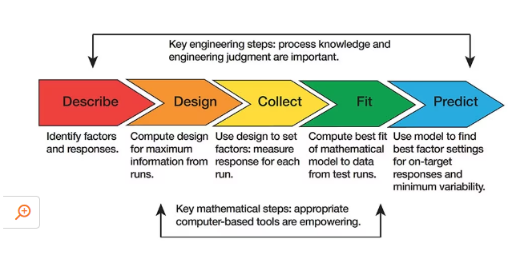

```{r setup, include=FALSE}
options(htmltools.dir.version = FALSE)

pacman::p_load(knitr, kableExtra, tidyverse)

knitr::opts_chunk$set(fig.retina = 3,                       
                      echo = TRUE,                       
                      eval = TRUE,                       
                      message = FALSE,                       
                      warning = FALSE,
                      out.width = "100%")

```


```{r, echo = FALSE}


```

Photo by [Chokniti Khongchum](https://www.pexels.com/photo/shallow-focus-photography-of-microscope-2280547/)

While I was exploring causal inference, I realised that my knowledge of experimental design was still quite patchy. I knew the basic idea: run an experiment, compare outcomes, and try to say something about cause and effect. However, once I started reading more, I noticed that the quality of an experiment depends heavily on small design choices made before any data is collected.

So this post is my attempt to organise the important concepts in one place.

This is meant to be a living document. I will come back to update it as I read more material on experimental design.


# What is experimental design?

Experimental design is the process of planning an experiment so that we can answer a research question as clearly and fairly as possible.

The general idea is simple:

- We deliberately change one or more inputs.
- We observe what happens to one or more outcomes.
- We try to separate the effect of the input from noise, bias, and other explanations.

In experimental design language, the inputs we change are usually called **factors** or **treatments**, and the outcomes we measure are called **response variables**.

For example, suppose we want to know whether a new email subject line improves the open rate of a newsletter. The treatment could be the subject line version, the response variable could be whether the email was opened, and the experimental units could be the recipients who receive the email.

The main reason experimental design is so useful is that a well-designed experiment can support causal conclusions. This is different from simply observing historical data, where many things are usually changing at the same time.


# Experiment vs observational study

It is useful to separate experiments from observational studies.

In an **observational study**, we observe what naturally happened. For example, we may compare customers who used a discount code with customers who did not. The problem is that these two groups may already be different in ways that affect the outcome. Discount-code users may be more price sensitive, more engaged, or from a different marketing channel.

In an **experiment**, we deliberately assign or manipulate something. For example, we randomly decide which customers receive a discount code. That deliberate assignment is what gives experiments their causal strength.

This does not mean observational studies are bad. In many cases, they are the only realistic option. However, the causal claim is usually stronger when the treatment assignment is controlled by the researcher rather than chosen naturally by people, markets, or systems.


# A running example

To make the ideas less abstract, I will use a simple example throughout this post.

Suppose an education app wants to test whether a study reminder improves quiz scores.

- **Research question:** Does sending a study reminder improve quiz scores?
- **Treatment:** A study reminder message.
- **Control:** No reminder message.
- **Experimental unit:** Student.
- **Response variable:** Quiz score.
- **Possible blocking variable:** Previous grade band.

The weak version of this study would be to compare students who voluntarily turned on reminders with students who did not. The problem is that students who turn on reminders may already be more motivated.

The stronger version is to randomly assign students to receive a reminder or not receive one. If previous academic performance is important, we could randomise within previous grade bands so that each group has a similar mix of stronger and weaker students.

Below is what the process of experimental design looks like:

```{r, echo = FALSE}


```

Source: [JMP](https://www.jmp.com/en_sg/articles/what-is-experimental-design.html)

Based on resources such as [STAT 503 Design of Experiments](https://online.stat.psu.edu/stat503/) and [Emi Tanaka's Experimental Design textbook](https://emitanaka.org/edibble-book/), the practical steps usually look something like this:

- Recognition and statement of the problem
- Choice of factors, levels, and ranges
- Selection of the response variable(s)
- Choice of experimental design
- Conducting the experiment
- Statistical analysis
- Drawing conclusions and making recommendations

This sounds neat on paper, but in practice there is usually a fair amount of iteration. Sometimes the first version of the research question is too vague, the response variable is hard to measure, or the treatment is not something we can control properly.


# Some basic terms

Before going deeper, it helps to define a few commonly used terms.

```{r, echo = FALSE}
tibble::tribble(
  ~Concept, ~Meaning, ~Example,
  "Experimental unit", "The smallest unit that receives a treatment independently.", "A person, plant, machine, classroom, customer, or website visitor.",
  "Treatment", "The condition or intervention applied to an experimental unit.", "New landing page vs existing landing page.",
  "Factor", "A variable controlled by the experimenter.", "Fertiliser type, temperature, price, email subject line.",
  "Level", "A specific value or category of a factor.", "Low / medium / high price.",
  "Response variable", "The outcome we measure after applying the treatment.", "Conversion rate, yield, test score, time taken.",
  "Control group", "A baseline group used for comparison.", "Users who continue seeing the current page.",
  "Replication", "Repeating each treatment on multiple experimental units.", "Showing each page variant to many users.",
  "Randomisation", "Using randomness to assign treatments or run order.", "Randomly assigning users to A or B.",
  "Blocking", "Grouping similar units before randomisation to reduce unwanted variation.", "Randomising within age groups or regions."
) |>
  kableExtra::kbl() |>
  kableExtra::kable_styling(full_width = FALSE)
```

One easy mistake is to confuse the **experimental unit** with the **measurement unit**. For example, if a school-level teaching method is assigned to entire classrooms, the classroom may be the experimental unit even if the test scores are measured for individual students. This distinction matters during analysis because observations within the same classroom are probably not independent.


# Treatment effects and counterfactuals

The key causal idea behind an experiment is the **treatment effect**.

A treatment effect is the difference in outcome caused by receiving one treatment instead of another. In the study reminder example, the treatment effect is the difference between:

- a student's quiz score if they receive the reminder; and
- the same student's quiz score if they do not receive the reminder.

The challenge is that we cannot observe both outcomes for the same student at the same time. A student either receives the reminder or does not. The unobserved outcome is called the **counterfactual**.

This is why experimental design matters. A good experiment creates comparison groups that are similar enough for the control group to act as a reasonable stand-in for the missing counterfactual of the treatment group.

Randomisation helps with this because it decides treatment assignment using chance rather than student motivation, teacher preference, income level, or some other factor that may also affect quiz scores.


# Interference and spillover effects

Many simple explanations of experiments assume that one person's treatment does not affect another person's outcome. This assumption is often called **no interference**.

In practice, this assumption can fail.

For example, suppose students who receive the study reminder tell their friends in the control group to revise. The control group is no longer a clean comparison because some control students are indirectly affected by the treatment. This is known as a **spillover effect**.

Spillovers can happen in many settings:

- People share discount codes with friends.
- Students discuss exam preparation with classmates.
- Employees in different treatment groups work together.
- Users see other users' behaviour on a platform.

If interference is likely, we may need a different design. For example, instead of randomising individual students, we may randomise by classroom or school. This changes the experimental unit and usually affects the sample size needed.


# Why not just compare averages?

At first glance, an experiment may look like a simple comparison:

> Group A has an average outcome of 10. Group B has an average outcome of 12. Therefore, treatment B is better.

Possibly, but not necessarily.

The difference could be due to the treatment, but it could also be caused by:

- Random noise
- Pre-existing differences between the groups
- Measurement problems
- Time effects
- Confounding variables
- Selection bias
- A small sample size

Experimental design is about reducing these alternative explanations before they become a problem. Good analysis cannot fully rescue a poorly designed experiment. If the data collection process is biased, the model may simply give a polished answer to the wrong question.


# Core principles of experimental design

There are many types of experimental designs, but most of them are built from a few core principles.

A common way to remember the classical principles is:

- **Randomisation:** protects against systematic bias in treatment assignment.
- **Replication:** gives us enough repeated evidence to estimate variation and uncertainty.
- **Blocking or local control:** reduces unwanted variation by comparing similar units with similar units.

If I had to simplify experimental design into one sentence, it would be this: create a comparison that is fair, repeated, and controlled enough to support the decision we want to make.


## Randomisation

Randomisation means using a random process to assign treatments to experimental units or to decide the order in which runs are conducted.

The purpose of randomisation is not to magically make every group identical. In any one experiment, the groups may still differ slightly. The purpose is to remove systematic assignment bias so that, on average, the treatment groups are comparable.

For example, if we test two website designs and deliberately show Design A in the morning and Design B at night, any difference in conversion rate may be mixed up with time-of-day behaviour. Randomising visitors between A and B helps avoid this.

Systematic designs are prone to bias and confounding. Randomisation is one of the main reasons experiments are powerful for causal inference.

However, randomisation may not always be possible. For example, it would be unethical to randomly assign people to start smoking just to study health outcomes. In these situations, researchers may use **quasi-experiments**, **natural experiments**, or observational causal inference methods instead.


## Replication

Replication means applying each treatment to more than one experimental unit.

This helps us estimate natural variation. If we only test a treatment once, we have no good way to know whether the result is typical or just a lucky/unlucky outcome.

Replication is also what allows us to estimate uncertainty. In practice, this is where confidence intervals, standard errors, p-values, and Bayesian credible intervals start to become meaningful.

There is a subtle but important point here: **replication is not the same as repeated measurement**.

If we measure the same plant ten times after applying one fertiliser treatment, we have more measurements, but not necessarily ten independent experimental units. True replication usually requires multiple independently treated units.


## Blocking

Blocking is used when we know that some source of variation may affect the response, but that source of variation is not the main focus of the experiment.

The idea is to group similar experimental units together, then randomise treatments within each group.

For example:

- In an agricultural experiment, we may block by field location because soil quality varies across the field.
- In a medical experiment, we may block by age group or sex.
- In an online experiment, we may block by country, platform, or acquisition channel.

Blocking helps make treatment comparisons cleaner because we compare units that are more alike. It is a way of controlling for known nuisance variation.


## Control

A control group gives us a baseline.

Without a control group, it can be hard to know whether an observed change is due to the treatment or to something else happening at the same time.

For example, suppose an education app introduces a new learning feature and test scores improve after two months. Did the feature help? Possibly. However, students may already have been improving because exams were approaching, teachers changed their lesson plans, or weaker students stopped using the app.

A control group helps answer the question: *Compared to what?*


## Placebos and blinding

In some experiments, especially medical and behavioural experiments, people may behave differently simply because they know they are receiving a treatment. This is one reason researchers sometimes use a **placebo**.

A placebo is an inactive treatment that looks like the real treatment. The goal is to separate the effect of the actual treatment from the effect of expectation, attention, or being observed.

**Blinding** means hiding treatment assignment from people involved in the experiment.

- In a **single-blind** experiment, participants do not know which treatment they received.
- In a **double-blind** experiment, both participants and researchers interacting with them do not know the assignment.

Blinding is useful because expectations can influence behaviour, measurement, and interpretation. For example, if a teacher knows which students received a new learning intervention, they may unintentionally give those students more encouragement.

Blinding is not always possible. In an online A/B test, users may clearly see which website version they receive. However, the general idea is still useful: avoid letting knowledge of the treatment assignment influence the outcome or its measurement.


## Balance

A design is balanced when each treatment has the same number of experimental units, or at least when the allocation is deliberately controlled.

Balanced designs are usually easier to analyse and interpret. They also tend to give more stable estimates when treatment comparisons are the main goal.

That said, perfect balance is not always required. Sometimes we intentionally allocate more units to a treatment that is cheaper, safer, or more important to estimate precisely. The key is that the allocation should be intentional, not accidental.


# Confounding

A confounder is a variable that is related to both the treatment and the response. It creates an alternative explanation for the observed treatment effect.

For example, suppose we compare the performance of students who attend an optional revision class with those who do not. If the students who attend the class are also more motivated, then motivation is a potential confounder. Better test scores may be due to the class, motivation, or both.

Refer to my [previous post](https://jasperlok.netlify.app/posts/2023-11-05-causal-dag/) for an explanation of confounders using causal DAGs.

In experimental design, randomisation helps deal with confounding because it breaks the link between treatment assignment and pre-existing characteristics. Blocking and careful measurement can also help.

The important point is to think about confounding **before** collecting data. Once the experiment is over, we may not have measured the variables needed to diagnose or adjust for the problem.


# Factors, levels, and interactions

Many experiments involve more than one factor.

For example, suppose a cafe wants to improve sales of a drink. It may test:

- Price: low vs regular
- Cup design: plain vs colourful
- Promotion: no promotion vs loyalty points

If we test one factor at a time, we may miss how the factors work together. This is where **factorial designs** become useful.

A factorial design tests combinations of factor levels. In the cafe example, a full factorial design would test all combinations of price, cup design, and promotion.

This lets us estimate:

- The main effect of price
- The main effect of cup design
- The main effect of promotion
- Interactions between factors

An **interaction** happens when the effect of one factor depends on the level of another factor.

For example, the colourful cup may increase sales only when paired with loyalty points. If we test factors one at a time, this pattern may be invisible.


# Choosing the response variable

The response variable should match the question we care about.

This sounds obvious, but it is a common source of weak experiments.

For example, if the business question is whether a new onboarding flow improves long-term customer retention, measuring only first-day clicks may be misleading. Clicks are easier to collect, but they may not represent the outcome that matters.

Some practical questions:

- Is the response variable directly related to the research question?
- Can it be measured consistently?
- Is it sensitive enough to detect meaningful changes?
- Could the measurement process itself change behaviour?
- Are there short-term and long-term outcomes that may point in different directions?

It is also worth defining the primary response variable before the experiment starts. Otherwise, we may end up trying many outcomes and reporting only the one that looks interesting.


# Sample size and power

Sample size planning is about asking: *How much data do we need before the experiment has a fair chance of detecting the effect we care about?*

A small experiment can still be useful for learning about logistics or checking whether the treatment can be delivered. However, if the goal is statistical evidence, sample size matters.

The required sample size depends on several things:

- The size of the effect we care about
- The natural variability of the response
- The desired level of uncertainty
- The number of treatment groups
- The design structure, such as blocking or clustering

The phrase **statistical power** refers to the probability that an experiment will detect an effect if that effect truly exists. Low-powered experiments can be frustrating because a non-significant result may simply mean that the study was too small.

Another useful concept is the **minimum detectable effect**. This is the smallest effect size that the experiment is realistically able to detect, given the sample size and variability.

This matters because not every detectable effect is useful. With a very large sample size, we may detect a tiny difference that is statistically significant but practically unimportant. For example, a website change that improves conversion by 0.001 percentage points may be real, but it may not be worth implementing.

So there are two questions:

- **Statistical significance:** Is the observed effect unlikely to be due to random variation alone?
- **Practical significance:** Is the effect large enough to matter in the real world?

In practice, sample size planning is partly statistical and partly practical. Budget, time, ethics, and operational constraints all matter.


# Internal and external validity

Two useful questions to ask about any experiment are:

- **Internal validity:** Can we trust the causal conclusion within this experiment?
- **External validity:** Does the conclusion generalise beyond this experiment?

An experiment can have strong internal validity but weak external validity. For example, a tightly controlled lab experiment may provide a clean causal estimate, but the result may not transfer neatly to real-world settings.

Likewise, a field experiment may feel realistic, but it can be messier and harder to control.

There is no perfect design. The goal is to understand the trade-offs and be honest about what the experiment can and cannot tell us.


# Common threats to validity

Even when an experiment is well intentioned, several issues can weaken the conclusion.

```{r, echo = FALSE}
tibble::tribble(
  ~Threat, ~What_it_means, ~Example,
  "Selection bias", "The treatment and control groups differ before treatment.", "Motivated students are more likely to opt into reminders.",
  "Attrition", "Participants drop out unevenly across groups.", "Weaker students stop using the app before the final quiz.",
  "Non-compliance", "Participants do not follow their assigned treatment.", "Some students assigned reminders turn notifications off.",
  "Spillover", "One unit's treatment affects another unit's outcome.", "Treated students remind control students to study.",
  "Measurement error", "The response variable is measured noisily or inconsistently.", "Quiz difficulty differs across groups.",
  "Hawthorne effect", "People change behaviour because they know they are being studied.", "Students study harder because the app announces a trial.",
  "Multiple testing", "Many outcomes or subgroups are tested until something looks significant.", "Trying ten metrics and only reporting the one that improved."
) |>
  kableExtra::kbl() |>
  kableExtra::kable_styling(full_width = FALSE)
```

These issues do not automatically invalidate an experiment, but they should be considered during design and analysis.


# Non-compliance and intention-to-treat

In a clean textbook experiment, everyone follows their assigned treatment. In practice, this often does not happen.

For example, some students assigned to receive reminders may turn off notifications. Some students assigned to the control group may create their own reminders. This is **non-compliance**.

One common analysis approach is **intention-to-treat** analysis. This means analysing people based on the group they were originally assigned to, regardless of whether they fully followed the treatment.

This may sound strange at first, but it preserves the benefit of randomisation. If we compare only people who actually used the reminder with people who did not, we may reintroduce selection bias because reminder users may be more motivated.

There is also **per-protocol** analysis, where we compare people based on what they actually did. This can be useful, but it is usually more vulnerable to bias. In practice, it is helpful to be clear about which analysis answers which question.


# Putting the example together

Using the study reminder example, the design could be summarised like this:

```{r, echo = FALSE}
tibble::tribble(
  ~Design_decision, ~Example_choice,
  "Research question", "Does sending a study reminder improve quiz scores?",
  "Experimental unit", "Student",
  "Treatment", "Reminder message",
  "Control", "No reminder",
  "Response variable", "Quiz score",
  "Randomisation", "Randomly assign students to reminder or no reminder",
  "Blocking", "Randomise within previous grade bands",
  "Replication", "Many students in each group",
  "Analysis", "Compare average quiz scores, adjusting for block if used"
) |>
  kableExtra::kbl() |>
  kableExtra::kable_styling(full_width = FALSE)
```

This is intentionally simple, but it shows the basic structure. The experiment is not just "send some reminders and see what happens". We need to decide who receives the treatment, what comparison is fair, how the outcome is measured, how much variation we expect, and what could weaken the conclusion.


# Weak design vs stronger design

Here is a simple comparison using the same study reminder example.

```{r, echo = FALSE}
tibble::tribble(
  ~Version, ~Design, ~Main_problem_or_strength,
  "Weak design", "Compare students who voluntarily turned on reminders with students who did not.", "The groups may differ in motivation before the reminder is even considered.",
  "Better design", "Randomly assign students to reminder or no reminder.", "Randomisation makes the groups more comparable.",
  "Even better design", "Randomly assign students within previous grade bands.", "Blocking improves comparability on an important source of variation.",
  "Clearer analysis", "Define quiz score as the primary outcome before running the experiment.", "This reduces the risk of cherry-picking outcomes after seeing the data."
) |>
  kableExtra::kbl() |>
  kableExtra::kable_styling(full_width = FALSE)
```

This is the main mindset shift for me: experimental design is not just about choosing a statistical test later. It is about creating the conditions for a fair comparison from the start.


# Common experimental designs

Here are a few designs that show up often.

```{r, echo = FALSE}
tibble::tribble(
  ~Design, ~When_it_is_useful, ~Simple_description,
  "Completely randomised design", "When experimental units are fairly similar.", "Randomly assign units to treatments.",
  "Randomised block design", "When there is a known source of variation.", "Group similar units into blocks, then randomise within each block.",
  "Factorial design", "When studying multiple factors and possible interactions.", "Test combinations of factor levels.",
  "Split-plot design", "When some factors are harder to randomise than others.", "Randomise hard-to-change factors at a larger unit level.",
  "Crossover design", "When each unit can receive multiple treatments over time.", "Each unit acts partly as its own control, with careful attention to carryover effects.",
  "Quasi-experiment", "When randomisation is not feasible.", "Use a design that approximates experimental comparison, such as difference-in-differences or regression discontinuity."
) |>
  kableExtra::kbl() |>
  kableExtra::kable_styling(full_width = FALSE)
```

Different designs answer different questions. The right design depends on the research question, constraints, ethical considerations, and how the experiment will be run.


# Analysis should follow the design

One lesson that keeps appearing in experimental design material is this:

> Analyse the experiment according to how it was designed.

If the experiment used blocking, the analysis should usually account for blocks. If the data is clustered, the analysis should recognise that observations within a cluster may be correlated. If the design is factorial, the analysis should consider interactions where they are relevant.

This is why it is helpful to write an analysis plan before running the experiment. The plan does not need to be overly formal for every project, but it should answer questions such as:

- What is the primary response variable?
- What is the main treatment comparison?
- What model or test will be used?
- How will missing data be handled?
- Which subgroup or interaction analyses are planned?
- What result would be considered practically meaningful?

This reduces the temptation to keep trying different analyses until something interesting appears.


# Pre-analysis plans and multiple comparisons

If an experiment has many outcomes, subgroup analyses, or modelling choices, it is easy to wander into **p-hacking** territory. This happens when we try many analyses and focus only on the results that look interesting.

A **pre-analysis plan** helps reduce this risk. It records the main analysis decisions before looking at the results.

For a simple blog-style or business experiment, the plan does not need to be a long formal document. It can be a short note that states:

- the primary outcome;
- the main treatment comparison;
- the sample inclusion and exclusion rules;
- the intended model or statistical test;
- the key subgroup analyses, if any; and
- the decision rule or practical threshold.

This is especially important when there are many possible metrics. For example, an app experiment may track clicks, sessions, retention, revenue, satisfaction, and complaints. If we test everything and report only the most favourable result, the conclusion may be too optimistic.


# Pilot experiments

A pilot experiment is a small trial run before the main experiment.

The goal is usually not to prove the main hypothesis. Instead, the goal is to check whether the experiment can run properly.

A pilot can help answer questions such as:

- Can the treatment be delivered correctly?
- Are participants confused by the instructions?
- Is the response variable captured properly?
- Are there unexpected operational issues?
- Is the observed variability roughly what we expected?

This is especially useful when the experiment is expensive, complex, or involves real users.


# Ethical considerations

Experiments involve intervention, so ethics matter.

Some useful questions:

- Is it acceptable to withhold the treatment from the control group?
- Could the treatment harm participants?
- Do participants need to provide informed consent?
- Are vulnerable groups involved?
- Is personal data being collected or used responsibly?
- Would the experiment still feel reasonable if it were explained publicly?

For low-risk product experiments, ethics may seem less dramatic than in medical trials, but the same broad principle applies: we should not treat people merely as data points.


# Practical checklist

Before running an experiment, I find it useful to ask:

- What decision will this experiment inform?
- What is the treatment?
- What is the control or baseline?
- What is the experimental unit?
- What is the response variable?
- What treatment effect do we care about?
- Is randomisation possible?
- Do we need blocking?
- How much replication do we need?
- What are the main risks of confounding?
- Could there be spillover or interference?
- Is blinding or a placebo needed?
- What sample size or minimum detectable effect is reasonable?
- What is practically significant, not just statistically significant?
- How will we handle attrition or non-compliance?
- Are there ethical or operational constraints?
- How will we analyse the result?
- Should we run a pilot first?
- What would change our mind?

The last question is especially important. If no possible result would affect our decision, we may not need an experiment. We may simply need to make the decision using existing information.


# Helpful materials

These are the resources I found helpful while preparing this writeup:

- [Experimental Design Textbook by Dr Emi Tanaka](https://emitanaka.org/edibble-book/)
- [STAT 503 Design of Experiments](https://online.stat.psu.edu/stat503/)
- [JMP: What is experimental design?](https://www.jmp.com/en_sg/articles/what-is-experimental-design.html)
- [Researcher.Life: Experimental research design](https://researcher.life/blog/article/what-is-experimental-research-design-definition-examples-types/)


# Conclusion

Experimental design is about disciplined comparison.

A good experiment does not just collect data. It creates a fair setting where the effect of a treatment can be separated from noise, bias, and other explanations. Concepts such as randomisation, replication, blocking, control groups, and confounding may sound technical, but they all serve the same basic purpose: helping us make a more trustworthy comparison.

That is all for the day!

Thanks for reading the post until the end.

Feel free to contact me through [email](mailto:jasper.jh.lok@gmail.com) or [LinkedIn](https://www.linkedin.com/in/jasper-l-13426232/) if you have any suggestions on future topics to share.

Refer to this link for the [blog disclaimer](https://jasperlok.netlify.app/blog_disclaimer.html).

Till next time, happy learning!

```{r, echo = FALSE}


```

Photo by [Tara Winstead](https://www.pexels.com/photo/clear-glass-bottle-on-table-7722670/)
