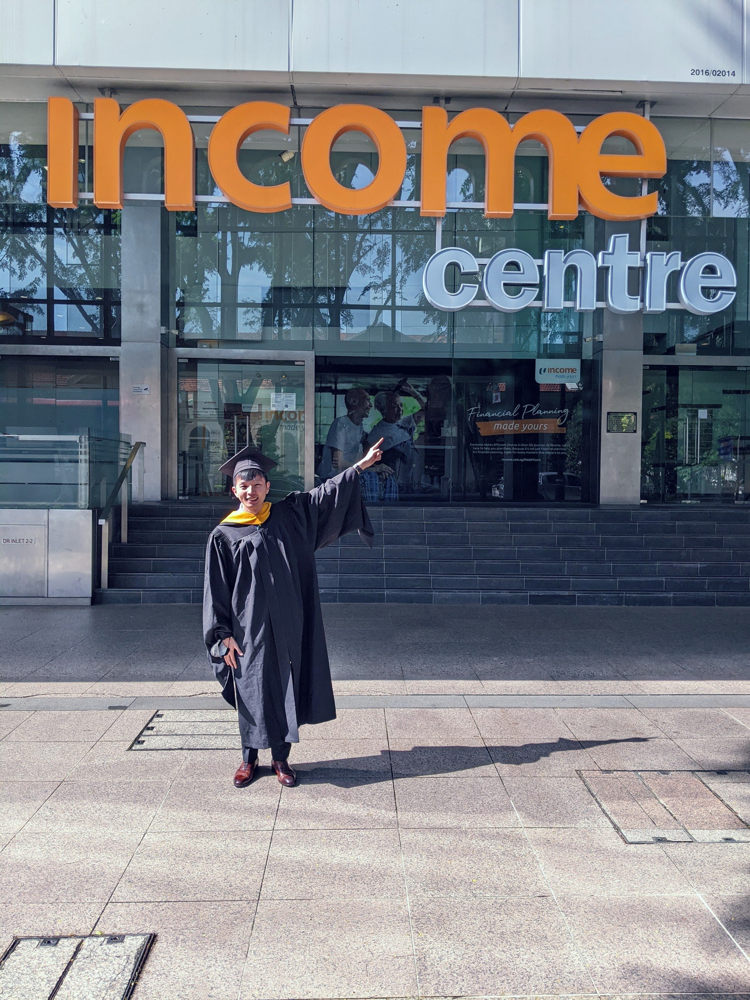

### About The Author

```{r, echo = FALSE, fig.width = 2}
knitr::include_graphics("image/jasper_2.jpg")

```

Hi there, welcome to my blog! I am currently working as a data scientist. I am passionate about transforming business through my actuarial and data science knowledge.


### Academic Background
I did my actuarial science undergraduate degree in The Australian National University back in 2009. Ironically I had no clue what actuarial science or statistics is about when I entered into university. It was one of my final year GLM project sparked my interest in statistics and data science.

In 2018, I have enrolled myself into Master of IT in Business (Analytics) in Singapore Management University.

```{r, echo = FALSE, out.width = "80%"}
knitr::include_graphics("image/data_idea.jpg")

```
*Photo by Franki Chamaki on Unsplash*


Throughout my study in SMU, I studied various types of analytics, including customer analytics, social analytics, visual analytics, and operation analytics, to gain a broad understanding of various analytics techniques. 


I also specialized in digital transformation strategy in my master course. During the middle of the pandemic, I also did a consulting job for a local SME that is in the oil & gas industry under the guidance of my SMU professors. The task involved preparing a business proposal on how the SME could leverage its current strength to pivot the current business to venture into a new business market. This would help the SME to ensure its revised business model is more resilient to external market forces.


I have also written a paper on how modern data science techniques can be used to complement conventional actuarial analysis together with my professor Kam Tin Seong. I am honored to share my paper & learning at Singapore Actuarial Society and useR conference 2021.


### Work Experience
I have worked as an actuary in both life insurance and general insurance for the first 10 years of my career before I decided to do a mid career switch into data science. 

```{r, echo = FALSE, out.width = "75%"}


```
*My last day at Income + commencement date for my master degree. They happened to be on the same day!*


Throughout my career, I have worked on the following: <br   />
- Product pricing on various life, general and group insurance products <br   />
- Experience analysis <br   />
- Participating fund management <br   />
- Distribution compensation <br   />
- End to end machine learning related project <br   />
- New business model <br   />


In conclusion, my background & experience can be summarized as following:

```{r, echo = FALSE}
library(cronologia)

jasper_df <- data.frame(
  event = c("Data Scientist",
            "Master of IT in Business",
            "Various Actuarial Functions & Roles",
            "Actuarial Pricing Senior Executive",
            "Actuarial Pricing Senior Executive",
            "Bachelor of Actuarial Studies"),
  desc = c("Partner Re",
           "Singapore Management University",
           "NTUC Income Insurance Co-operative Limited",
           "Great Eastern Life Assurance Co Ltd",
           "Prudential Assurance Company Singapore",
           "The Australian National University"),
  desc_2 = c("Aug 2022 - Present",
             "Jul 2022",
             "Aug 2015 - Jul 2022",
             "Oct 2014 - Jun 2015",
             "Mar 2012 - Oct 2014",
             "Dec 2019"))

create_tml_2(df = jasper_df, 
           smr = "event",  
           dsc = "desc",
           dsc_size = "16px",
           dsc2 = "desc_2",
           open = TRUE)
```


Do visit my [LinkedIn page](https://www.linkedin.com/in/jasper-l-13426232/) or contact me if you are interested to find out more on my work experience!


### Contact

Feel free to contact me on [email](mailto:jasper.jh.lok@gmail.com) or [LinkedIn](https://www.linkedin.com/in/jasper-l-13426232/).

